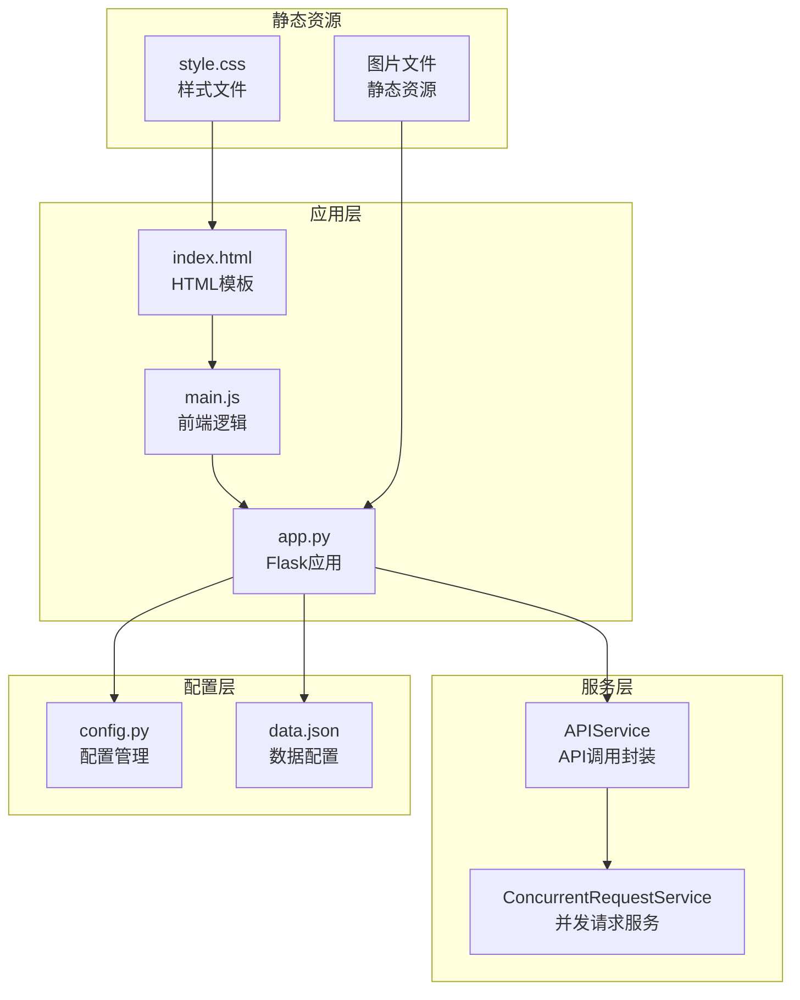
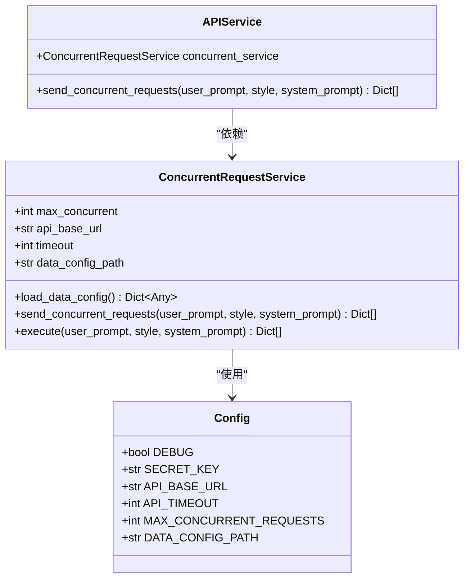
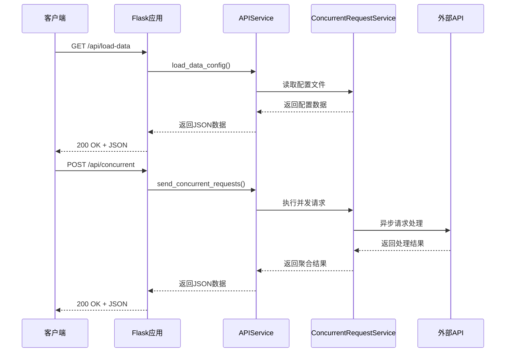
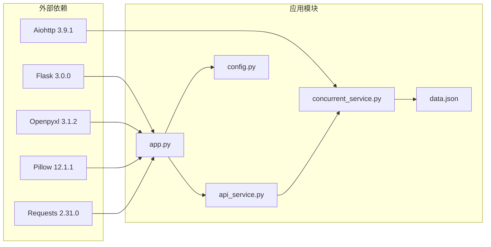

# API接口参考

<cite>
**本文档引用的文件**
- [app.py](file://app.py)
- [services/api_service.py](file://services/api_service.py)
- [services/concurrent_service.py](file://services/concurrent_service.py)
- [config.py](file://config.py)
- [config/data.json](file://config/data.json)
- [README.md](file://README.md)
- [requirements.txt](file://requirements.txt)
- [templates/index.html](file://templates/index.html)
- [static/js/main.js](file://static/js/main.js)
</cite>

## 目录
1. [简介](#简介)
2. [项目结构](#项目结构)
3. [核心组件](#核心组件)
4. [架构概览](#架构概览)
5. [详细接口规范](#详细接口规范)
6. [依赖关系分析](#依赖关系分析)
7. [性能考虑](#性能考虑)
8. [故障排除指南](#故障排除指南)
9. [结论](#结论)

## 简介

AI文案评测对比系统是一个基于Flask的Web应用，用于批量处理图片文案，支持并发调用外部API生成文案，并可将结果导出为Excel文件。该系统提供了完整的RESTful API接口，支持图片预览、并发请求处理和Excel导出功能。

## 项目结构



**图表来源**
- [app.py:1-139](file://app.py#L1-L139)
- [services/api_service.py:1-14](file://services/api_service.py#L1-L14)
- [services/concurrent_service.py:1-162](file://services/concurrent_service.py#L1-L162)
- [config.py:1-12](file://config.py#L1-L12)

**章节来源**
- [app.py:1-139](file://app.py#L1-L139)
- [README.md:24-44](file://README.md#L24-L44)

## 核心组件

### Flask应用架构

系统采用Flask框架构建，包含以下核心组件：

- **路由层**: 处理HTTP请求和响应
- **服务层**: 封装业务逻辑和API调用
- **配置层**: 管理应用配置和环境变量
- **数据层**: 处理JSON配置文件和Excel文件

### 服务组件



**图表来源**
- [services/api_service.py:4-14](file://services/api_service.py#L4-L14)
- [services/concurrent_service.py:8-20](file://services/concurrent_service.py#L8-L20)
- [config.py:3-12](file://config.py#L3-L12)

**章节来源**
- [services/api_service.py:1-14](file://services/api_service.py#L1-L14)
- [services/concurrent_service.py:1-162](file://services/concurrent_service.py#L1-L162)
- [config.py:1-12](file://config.py#L1-L12)

## 架构概览



**图表来源**
- [app.py:29-61](file://app.py#L29-L61)
- [services/api_service.py:8-13](file://services/api_service.py#L8-L13)
- [services/concurrent_service.py:118-158](file://services/concurrent_service.py#L118-L158)

## 详细接口规范

### GET /api/load-data

**接口说明**: 从本地JSON配置文件加载数据，用于页面初始化展示

**请求参数**: 无

**请求头**:
- Content-Type: application/json

**响应格式**:
```json
{
  "success": true,
  "data": [
    {
      "id": 1,
      "text": "默认文案内容",
      "photos": [
        {
          "id": 1,
          "url": "/path/to/photo1.jpg"
        }
      ]
    }
  ],
  "styles": ["文艺", "网红", "叙事", "自定义"],
  "default_style": "文艺",
  "system_prompt": "系统提示词内容"
}
```

**使用场景**:
- 页面首次加载时获取基础配置
- 初始化文风选择下拉框
- 加载图片预览数据

**错误码**:
- 200: 成功
- 500: 服务器内部错误

**章节来源**
- [app.py:29-41](file://app.py#L29-L41)
- [services/concurrent_service.py:21-28](file://services/concurrent_service.py#L21-L28)

### POST /api/concurrent

**接口说明**: 并发发送多个API请求，从配置文件读取数据项

**请求参数**:
```json
{
  "userPrompt": "用户自定义提示词",
  "style": "文艺",
  "systemPrompt": "系统提示词内容"
}
```

**请求头**:
- Content-Type: application/json

**响应格式**:
```json
{
  "success": true,
  "total": 5,
  "results": [
    {
      "data_id": 1,
      "success": true,
      "status": 200,
      "result": {
        "text": "原始文案",
        "photos": [],
        "generated_text": "生成的文案"
      },
      "request_time": 2.5
    }
  ]
}
```

**并发控制**:
- 最大并发数由 `MAX_CONCURRENT_REQUESTS` 配置
- 使用信号量控制并发请求数量
- 实时进度跟踪和统计信息

**使用场景**:
- 批量处理多个数据项
- 并发调用外部API生成文案
- 实时监控处理进度

**错误码**:
- 200: 成功
- 500: 服务器内部错误

**章节来源**
- [app.py:43-61](file://app.py#L43-L61)
- [services/api_service.py:8-13](file://services/api_service.py#L8-L13)
- [services/concurrent_service.py:118-158](file://services/concurrent_service.py#L118-L158)

### POST /api/export-excel

**接口说明**: 生成包含图片的Excel文件

**请求参数**:
```json
{
  "results": [
    {
      "data_id": 1,
      "success": true,
      "result": {
        "text": "原始文案",
        "photos": [
          {
            "url": "/path/to/photo.jpg"
          }
        ],
        "generated_text": "生成的文案"
      }
    }
  ]
}
```

**请求头**:
- Content-Type: application/json

**响应格式**: Excel文件流（application/vnd.openxmlformats-officedocument.spreadsheetml.sheet）

**Excel文件特性**:
- 包含8列数据：数据项ID、状态、图片1-5、原始文案、返回文案
- 图片直接嵌入到Excel单元格中（80x80像素）
- 最多支持5张图片
- 自动设置行高和列宽优化显示效果

**使用场景**:
- 导出批量处理结果
- 生成可分享的报告文件
- 存档处理历史记录

**错误码**:
- 200: 成功
- 500: 服务器内部错误

**章节来源**
- [app.py:63-135](file://app.py#L63-L135)

### GET /api/photo/{filename}

**接口说明**: 代理本地图片文件，解决浏览器本地文件访问限制

**路径参数**:
- filename: 图片文件的完整路径

**响应格式**: 图片文件流

**使用场景**:
- 解决浏览器跨域和本地文件访问限制
- 提供安全的图片访问方式
- 支持各种图片格式（PNG、JPEG、BMP、GIF、TIFF）

**错误码**:
- 200: 成功
- 404: 文件不存在

**章节来源**
- [app.py:19-27](file://app.py#L19-L27)

## 依赖关系分析



**图表来源**
- [requirements.txt:1-6](file://requirements.txt#L1-L6)
- [app.py:1-10](file://app.py#L1-L10)
- [services/concurrent_service.py:1-6](file://services/concurrent_service.py#L1-L6)

**章节来源**
- [requirements.txt:1-6](file://requirements.txt#L1-L6)
- [README.md:15-23](file://README.md#L15-L23)

## 性能考虑

### 并发处理优化

系统采用异步并发处理机制，通过信号量控制最大并发数：

- **并发控制**: 使用 `asyncio.Semaphore` 限制同时进行的请求数量
- **超时处理**: 支持自定义请求超时时间，默认30秒
- **进度跟踪**: 实时显示处理进度和统计信息
- **内存管理**: 异步处理避免阻塞，提高资源利用率

### 配置优化建议

| 配置项 | 默认值 | 优化建议 | 影响范围 |
|--------|--------|----------|----------|
| MAX_CONCURRENT_REQUESTS | 5 | 根据网络带宽和目标API能力调整 | 并发性能 |
| API_TIMEOUT | 30秒 | 根据网络延迟和API响应时间调整 | 请求稳定性 |
| API_BASE_URL | http://example.com/api | 指向实际API服务地址 | 功能可用性 |

### Excel导出性能

- **图片处理**: 使用Pillow库优化图片加载和缩放
- **内存管理**: 流式写入避免大文件内存溢出
- **文件大小**: 合理控制图片尺寸平衡质量与体积

## 故障排除指南

### 常见问题及解决方案

**问题1: 图片无法在网页上显示**
- **原因**: 浏览器安全限制不允许直接访问本地文件
- **解决方案**: 系统已实现图片代理功能，确保图片路径配置正确

**问题2: 导出的Excel中看不到图片**
- **原因**: 缺少Pillow库或图片格式不支持
- **解决方案**: 安装Pillow库并确保图片格式支持

**问题3: 并发请求超时**
- **原因**: 网络延迟或目标API响应慢
- **解决方案**: 调整API_TIMEOUT和MAX_CONCURRENT_REQUESTS配置

**问题4: 端口被占用**
- **解决方案**: 修改app.py中的端口号配置

### 错误处理机制

系统实现了完善的错误处理机制：

- **异常捕获**: 所有API端点都包含try-catch异常处理
- **状态码返回**: 标准化HTTP状态码返回
- **错误信息**: 详细的错误信息便于调试
- **降级处理**: 配置文件加载失败时提供默认值

**章节来源**
- [README.md:314-348](file://README.md#L314-L348)
- [app.py:40-41](file://app.py#L40-L41)
- [app.py:60-61](file://app.py#L60-L61)
- [app.py:134-135](file://app.py#L134-L135)

## 结论

本API接口参考文档详细介绍了AI文案评测对比系统的RESTful API规范，包括四个核心接口的设计和使用方法。系统采用Flask框架构建，支持异步并发处理和Excel文件导出，具有良好的扩展性和实用性。

### 主要特点

1. **完整的API覆盖**: 涵盖数据加载、并发处理、Excel导出和图片代理四大功能模块
2. **异步并发处理**: 高效的异步请求处理机制，支持可配置的并发数量
3. **丰富的响应格式**: 标准化的JSON响应格式，便于前端集成
4. **完善的错误处理**: 全面的异常处理和错误码返回机制
5. **灵活的配置管理**: 基于环境变量的配置管理，支持运行时调整

### 最佳实践建议

1. **合理配置并发数**: 根据网络环境和目标API能力调整MAX_CONCURRENT_REQUESTS
2. **监控请求超时**: 设置合理的API_TIMEOUT避免长时间阻塞
3. **优化Excel导出**: 控制图片尺寸平衡文件大小和显示质量
4. **错误日志记录**: 在生产环境中添加详细的错误日志记录
5. **安全考虑**: 在生产环境中启用HTTPS和适当的访问控制

该系统为批量文案处理提供了完整的解决方案，适合需要高效处理大量图片和文案数据的应用场景。