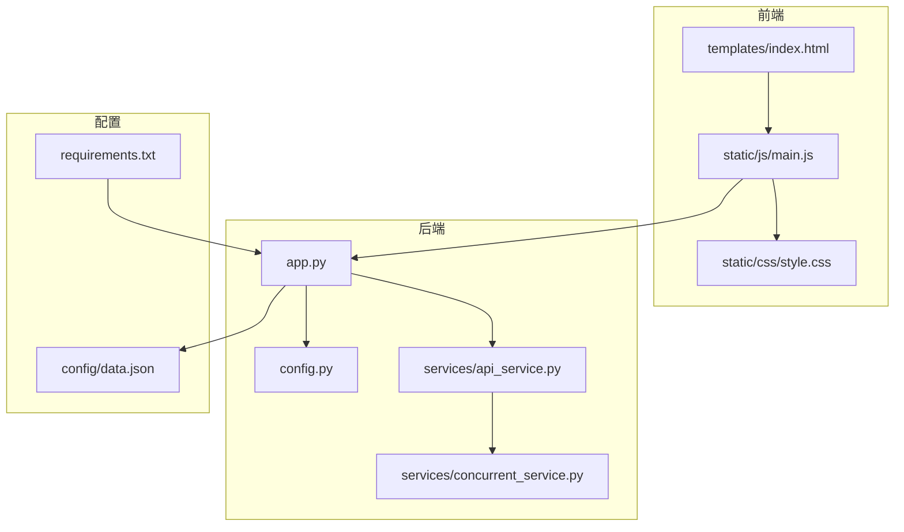
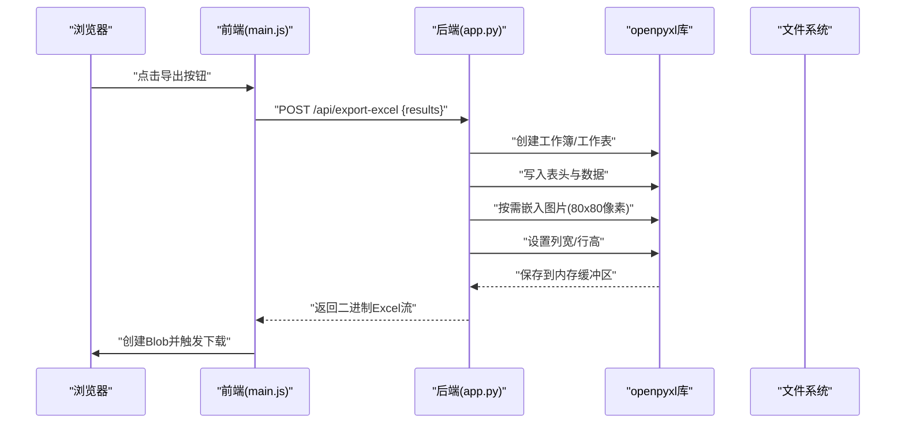
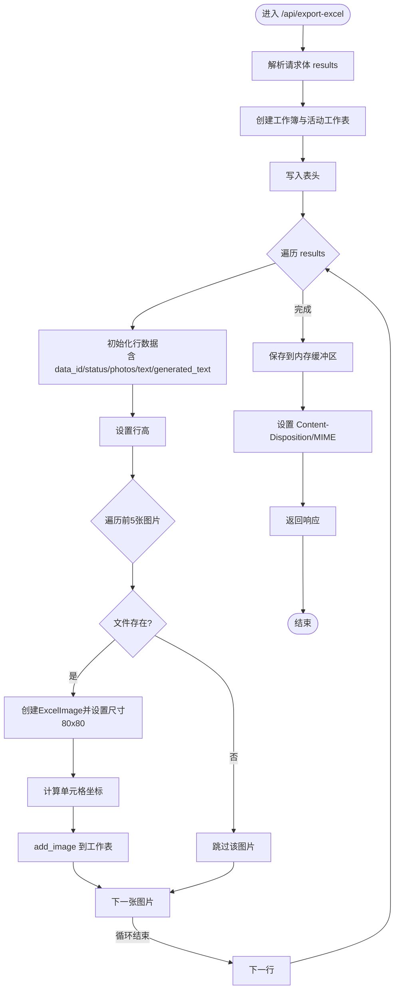
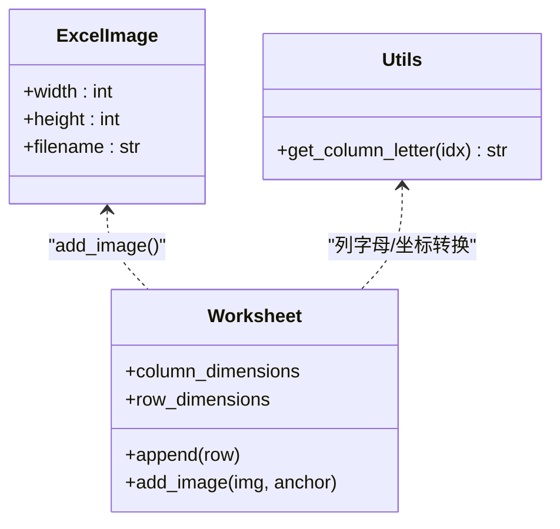
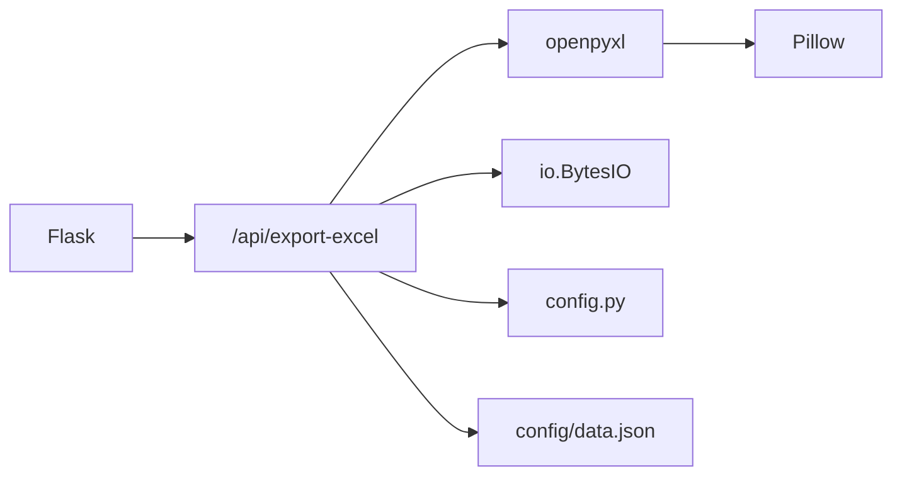

# Excel导出功能

<cite>
**本文引用的文件**
- [app.py](file://app.py)
- [config.py](file://config.py)
- [requirements.txt](file://requirements.txt)
- [README.md](file://README.md)
- [config/data.json](file://config/data.json)
- [services/api_service.py](file://services/api_service.py)
- [services/concurrent_service.py](file://services/concurrent_service.py)
- [templates/index.html](file://templates/index.html)
- [static/js/main.js](file://static/js/main.js)
- [static/css/style.css](file://static/css/style.css)
</cite>

## 目录
1. [简介](#简介)
2. [项目结构](#项目结构)
3. [核心组件](#核心组件)
4. [架构总览](#架构总览)
5. [详细组件分析](#详细组件分析)
6. [依赖分析](#依赖分析)
7. [性能考虑](#性能考虑)
8. [故障排查指南](#故障排查指南)
9. [结论](#结论)
10. [附录](#附录)

## 简介
本文件聚焦于Excel导出功能的技术实现，围绕后端Flask路由与openpyxl库的使用，系统阐述Excel文件生成流程、图片嵌入技术（尺寸控制、格式支持、单元格定位）、列结构设计（数据项ID、状态、图片列、原始文案、返回文案）、文件命名规则与自动下载机制，并提供性能优化策略、常见问题解决方案以及扩展开发指南。该功能位于后端路由“/api/export-excel”，由前端通过POST请求触发，返回二进制Excel文件流，浏览器自动下载。

## 项目结构
项目采用Flask单文件应用与分层服务的组织方式，导出功能涉及后端路由、服务层、配置与静态资源。关键文件如下：
- 后端入口与路由：app.py
- 配置管理：config.py
- 依赖声明：requirements.txt
- 数据配置：config/data.json
- 服务层：services/api_service.py、services/concurrent_service.py
- 前端模板与脚本：templates/index.html、static/js/main.js、static/css/style.css

图表来源
- [app.py:1-139](file://app.py#L1-L139)
- [services/api_service.py:1-14](file://services/api_service.py#L1-L14)
- [services/concurrent_service.py:1-162](file://services/concurrent_service.py#L1-L162)
- [config.py:1-12](file://config.py#L1-L12)
- [config/data.json:1-32](file://config/data.json#L1-L32)
- [requirements.txt:1-6](file://requirements.txt#L1-L6)

章节来源
- [README.md:24-44](file://README.md#L24-L44)
- [app.py:1-139](file://app.py#L1-L139)
- [config.py:1-12](file://config.py#L1-L12)
- [requirements.txt:1-6](file://requirements.txt#L1-L6)
- [config/data.json:1-32](file://config/data.json#L1-L32)

## 核心组件
- 导出路由与流程控制：后端“/api/export-excel”接收前端传入的结果数组，构建工作簿、写入表头与数据、嵌入图片、设置行列属性、保存至内存缓冲区并返回二进制流。
- openpyxl集成：使用Workbook创建工作簿，Worksheet写入数据，openpyxl.drawing.image.Image嵌入图片，openpyxl.utils进行列字母与坐标转换。
- 前端交互：前端main.js在处理完成后调用导出接口，接收Blob并触发浏览器自动下载。
- 配置与依赖：requirements.txt声明openpyxl与Pillow；config.py提供环境变量与路径配置。

章节来源
- [app.py:63-135](file://app.py#L63-L135)
- [static/js/main.js:220-260](file://static/js/main.js#L220-L260)
- [requirements.txt:1-6](file://requirements.txt#L1-L6)
- [config.py:1-12](file://config.py#L1-L12)

## 架构总览
下图展示了从浏览器到后端Excel导出的端到端流程，包括前端发起请求、后端路由处理、openpyxl生成Excel、自动下载返回。

图表来源
- [static/js/main.js:220-260](file://static/js/main.js#L220-L260)
- [app.py:63-135](file://app.py#L63-L135)
- [app.py:102-116](file://app.py#L102-L116)

## 详细组件分析

### 导出路由与Excel生成流程
- 路由定义与请求处理：后端“/api/export-excel”接收JSON请求体，解析results数组，创建工作簿与活动工作表，设置工作表标题。
- 表头与列宽：定义包含“数据项ID、状态、图片1-5、原始文案、返回文案”的表头；对图片列设置固定宽度以保证显示效果。
- 数据行写入：遍历results，提取data_id、success、photos、text、generated_text等字段，构造行数据并追加到工作表。
- 图片嵌入与单元格定位：对每行的前五张图片，若存在且文件存在，则创建ExcelImage对象，设置尺寸为80x80像素，计算目标单元格坐标并add_image。
- 行高设置：为每行设置统一高度以适配图片显示。
- 内存保存与下载：将工作簿保存到BytesIO缓冲区，seek到开头，设置Content-Disposition为附件下载，MIME类型为Excel。

图表来源
- [app.py:63-135](file://app.py#L63-L135)
- [app.py:73-116](file://app.py#L73-L116)

章节来源
- [app.py:63-135](file://app.py#L63-L135)

### 图片嵌入技术详解
- 尺寸控制：每张图片设置为80x80像素，确保单元格内紧凑显示且避免过大影响表格布局。
- 格式支持：依赖Pillow库支持常见图片格式（PNG、JPEG、BMP、GIF、TIFF），确保openpyxl能正确读取并嵌入。
- 单元格定位：通过openpyxl.utils.get_column_letter将列索引转为字母，结合行号拼接坐标，add_image写入指定单元格。
- 错误处理：当图片文件不存在或读取异常时，记录错误并跳过该图片，不影响整体导出流程。
- 性能注意：图片数量较多时，建议控制并发与图片大小，避免内存峰值过高。

图表来源
- [app.py:3-7](file://app.py#L3-L7)
- [app.py:102-116](file://app.py#L102-L116)

章节来源
- [app.py:102-116](file://app.py#L102-L116)
- [requirements.txt:4-5](file://requirements.txt#L4-L5)

### Excel列结构设计
- 列布局：数据项ID、状态、图片1-5、原始文案、返回文案。
- 字段映射：
  - 数据项ID：来自item.data_id或序号。
  - 状态：根据success布尔值映射为“成功/失败”。
  - 图片列：最多5列，不足时补空字符串，确保表格对齐。
  - 原始文案：来自item.result.text。
  - 返回文案：成功时为generated_text，失败时为“错误：+错误信息”。
- 列宽与行高：图片列设置固定宽度，行高统一设置为100像素，提升图片显示质量。

章节来源
- [app.py:73-100](file://app.py#L73-L100)

### 文件命名规则与自动下载机制
- 文件命名：基于当前日期生成文件名，格式为“copywriting_result_YYYY-MM-DD.xlsx”。
- 下载触发：后端设置Content-Disposition为“attachment”并返回二进制流；前端main.js将响应转换为Blob并创建临时链接触发下载。
- MIME类型：application/vnd.openxmlformats-officedocument.spreadsheetml.sheet，确保浏览器识别为Excel文件。

章节来源
- [app.py:125-133](file://app.py#L125-L133)
- [static/js/main.js:241-250](file://static/js/main.js#L241-L250)

### 前后端交互与并发处理
- 前端：main.js在处理完成后启用导出按钮，调用导出接口并将结果数组作为请求体发送。
- 后端：APIService与ConcurrentRequestService负责并发请求与进度输出，导出接口直接消费这些结果数据。
- 数据一致性：导出接口接收的数据结构与并发处理阶段一致，确保导出字段齐全。

章节来源
- [static/js/main.js:104-135](file://static/js/main.js#L104-L135)
- [services/api_service.py:1-14](file://services/api_service.py#L1-L14)
- [services/concurrent_service.py:118-158](file://services/concurrent_service.py#L118-L158)

## 依赖分析
- openpyxl：用于创建工作簿、写入数据、嵌入图片与设置行列属性。
- Pillow：作为openpyxl的图像解码依赖，支持多种图片格式。
- aiohttp/requests：用于并发请求外部API（与导出功能同属服务层）。
- Flask：提供Web路由与响应返回。

图表来源
- [app.py:1-139](file://app.py#L1-L139)
- [requirements.txt:1-6](file://requirements.txt#L1-L6)
- [config.py:1-12](file://config.py#L1-L12)
- [config/data.json:1-32](file://config/data.json#L1-L32)

章节来源
- [requirements.txt:1-6](file://requirements.txt#L1-L6)
- [app.py:1-139](file://app.py#L1-L139)

## 性能考虑
- 内存管理
  - 使用BytesIO作为内存缓冲区，避免磁盘I/O，减少文件系统压力。
  - 图片嵌入时逐行处理，避免一次性加载过多图片导致内存峰值过高。
- 大文件处理
  - 控制图片数量与尺寸（80x80像素），降低文件体积。
  - 对于大量数据，建议分批导出或增加服务器内存与并发限制。
- 并发与I/O
  - 导出接口本身为同步处理，若需要更高吞吐，可在上游并发处理阶段优化并发数与超时设置。
- 图片格式与体积
  - 优先使用压缩率较高的格式（如JPEG/PNG），避免超大图片文件。
  - 前端预览与后端导出使用同一图片源，减少重复解码。

[本节为通用性能建议，无需特定文件引用]

## 故障排查指南
- 图片未显示
  - 确认已安装Pillow库，确保openpyxl能正确读取图片。
  - 检查图片路径是否真实存在且可访问。
  - 使用Excel或WPS打开文件，部分在线编辑器可能不支持嵌入图片。
- 文件格式兼容性
  - 确保浏览器识别为Excel文件（MIME类型正确），并使用支持XLSX的软件打开。
- 下载失败
  - 检查后端响应状态与Content-Disposition设置。
  - 前端需正确接收Blob并触发下载，确认浏览器未拦截下载。
- 导出结果为空
  - 确认前端已处理完成并传入results数组。
  - 检查后端日志是否有异常并返回错误信息。

章节来源
- [README.md:314-348](file://README.md#L314-L348)
- [app.py:134-135](file://app.py#L134-L135)
- [static/js/main.js:241-250](file://static/js/main.js#L241-L250)

## 结论
本导出功能通过Flask路由与openpyxl实现，具备清晰的列结构、稳定的图片嵌入与自动下载机制。通过合理控制图片尺寸与数量、优化内存使用与并发策略，可在保证用户体验的同时满足大体量数据的导出需求。建议在生产环境中结合监控与日志，持续评估性能瓶颈并迭代优化。

[本节为总结性内容，无需特定文件引用]

## 附录

### API定义（导出接口）
- 路径：/api/export-excel
- 方法：POST
- 请求体：
  - results: 数组，元素包含data_id、success、result（含text、photos、generated_text）等字段
- 响应：
  - 二进制Excel文件流，Content-Disposition为附件下载，MIME类型为application/vnd.openxmlformats-officedocument.spreadsheetml.sheet
- 示例请求体路径：[示例请求体:166-171](file://README.md#L166-L171)

章节来源
- [README.md:163-178](file://README.md#L163-L178)

### 列结构与命名规范
- 列名：数据项ID、状态、图片1、图片2、图片3、图片4、图片5、原始文案、返回文案
- 命名规则：copywriting_result_YYYY-MM-DD.xlsx
- 显示优化：图片列固定宽度，行高统一设置

章节来源
- [app.py:73-100](file://app.py#L73-L100)
- [app.py:125-133](file://app.py#L125-L133)
- [README.md:200-213](file://README.md#L200-L213)

### 扩展开发指南
- 新增图片列：在表头与行写入逻辑中增加对应列索引与图片URL处理。
- 自定义列顺序：调整表头数组与写入顺序，确保列宽与行高的设置与新布局匹配。
- 图片格式扩展：确保Pillow支持所需格式，必要时在导入前进行格式转换。
- 性能增强：引入分页导出、异步处理或缓存机制，减少内存峰值与响应时间。
- 错误与回退：在图片嵌入失败时记录日志并继续导出，保证整体可用性。

章节来源
- [app.py:73-116](file://app.py#L73-L116)
- [requirements.txt:4-5](file://requirements.txt#L4-L5)