# CSS响应式样式设计

<cite>
**本文档引用的文件**
- [style.css](file://static/css/style.css)
- [index.html](file://templates/index.html)
- [main.js](file://static/js/main.js)
- [data.json](file://config/data.json)
- [README.md](file://README.md)
- [requirements.txt](file://requirements.txt)
</cite>

## 目录
1. [简介](#简介)
2. [项目结构](#项目结构)
3. [核心组件](#核心组件)
4. [架构概览](#架构概览)
5. [详细组件分析](#详细组件分析)
6. [依赖关系分析](#依赖关系分析)
7. [性能考虑](#性能考虑)
8. [故障排除指南](#故障排除指南)
9. [结论](#结论)
10. [附录](#附录)

## 简介

这是一个基于Flask的Web应用项目，专注于AI文案评测对比系统的前端样式设计。该项目展示了现代CSS响应式设计的最佳实践，包括容器布局、输入控件、按钮样式以及三列网格布局的实现。通过Flexbox和CSS Grid技术，系统能够优雅地适配不同屏幕尺寸，提供优秀的用户体验。

项目采用模块化CSS架构，支持主题定制和颜色系统设计，同时实现了完整的移动端适配策略。整个设计遵循了语义化HTML结构和现代化的CSS开发规范。

## 项目结构

该项目采用标准的Flask项目结构，前端静态资源与后端逻辑分离，便于维护和扩展。

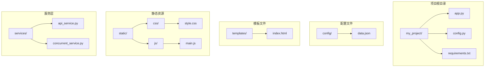

**图表来源**
- [README.md:24-44](file://README.md#L24-L44)
- [requirements.txt:1-6](file://requirements.txt#L1-L6)

**章节来源**
- [README.md:24-44](file://README.md#L24-L44)
- [requirements.txt:1-6](file://requirements.txt#L1-L6)

## 核心组件

### 全局样式重置

项目采用标准化的CSS重置策略，确保跨浏览器的一致性表现。

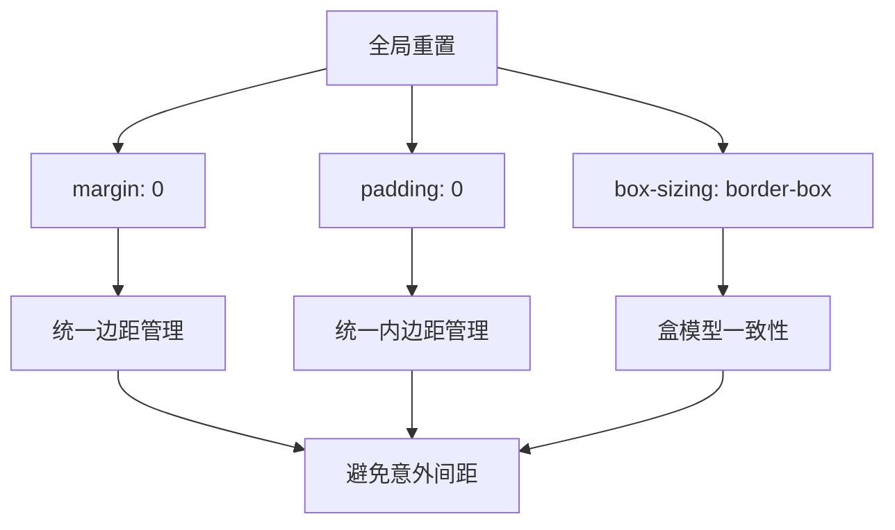

**图表来源**
- [style.css:1-5](file://static/css/style.css#L1-L5)

### 容器布局系统

容器系统是整个界面的基础框架，提供了响应式的内容区域布局。

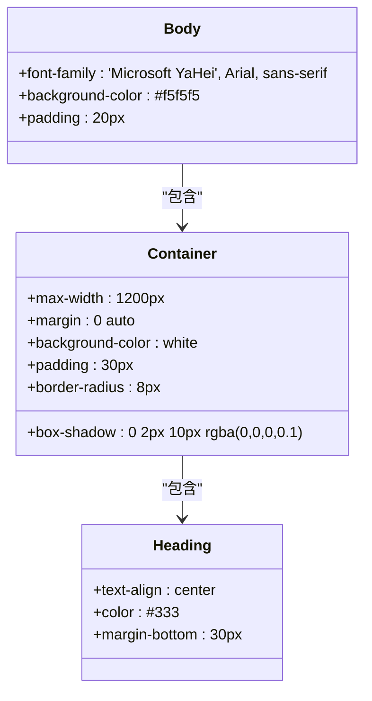

**图表来源**
- [style.css:7-26](file://static/css/style.css#L7-L26)

**章节来源**
- [style.css:1-26](file://static/css/style.css#L1-L26)

## 架构概览

整个前端架构采用分层设计，从基础样式到复杂组件层层递进。

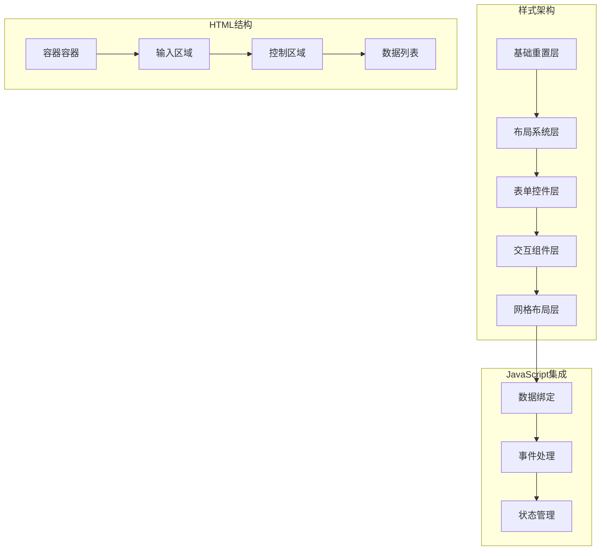

**图表来源**
- [style.css:13-272](file://static/css/style.css#L13-L272)
- [index.html:10-35](file://templates/index.html#L10-L35)

## 详细组件分析

### 输入控件系统

输入控件系统采用了统一的设计语言，确保用户界面的一致性和可用性。

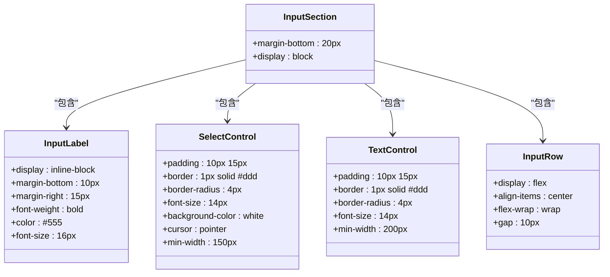

**图表来源**
- [style.css:28-92](file://static/css/style.css#L28-L92)

#### 交互状态管理

输入控件实现了完整的交互状态反馈机制，包括焦点状态和悬停效果。

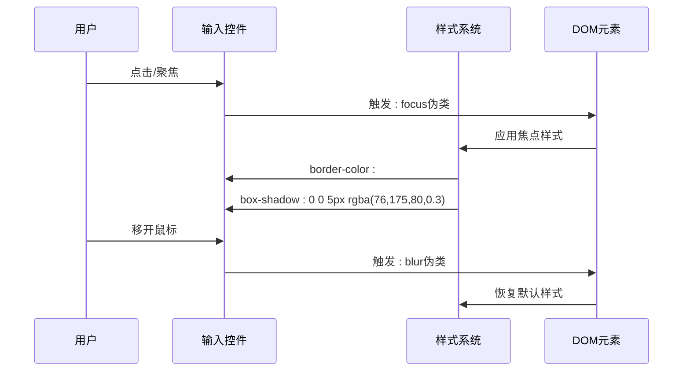

**图表来源**
- [style.css:51-69](file://static/css/style.css#L51-L69)

**章节来源**
- [style.css:28-92](file://static/css/style.css#L28-L92)

### 按钮系统

按钮系统采用了Material Design风格的设计理念，提供了丰富的视觉反馈。

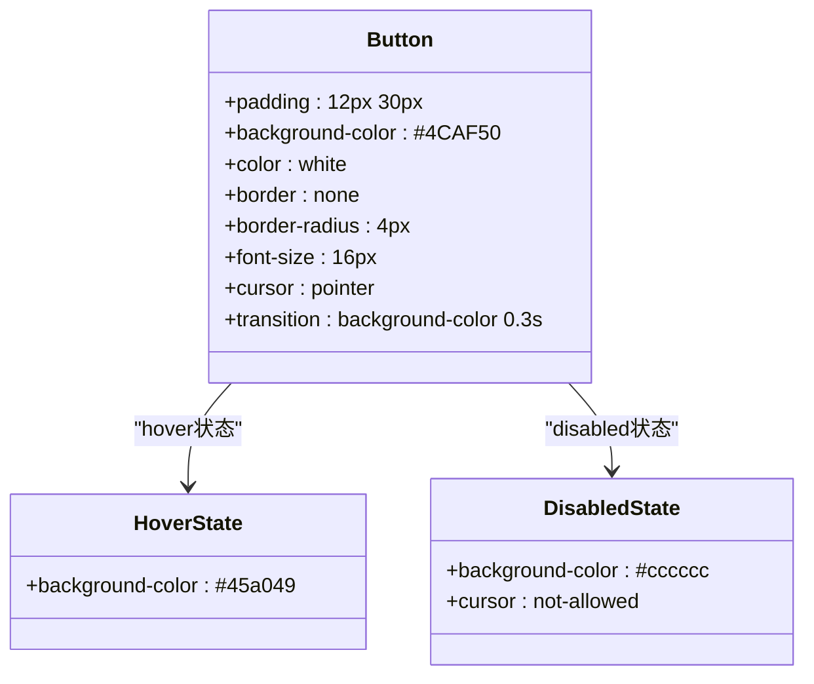

**图表来源**
- [style.css:101-119](file://static/css/style.css#L101-L119)

#### 加载动画系统

项目实现了完整的加载状态指示器，提供良好的用户体验。

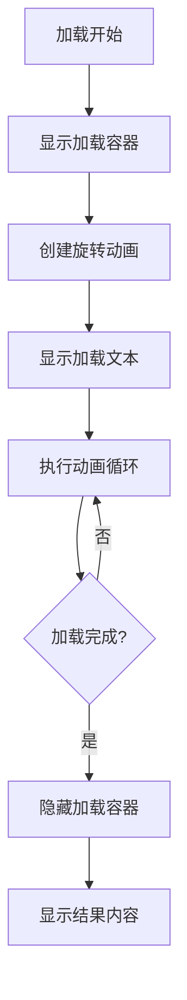

**图表来源**
- [style.css:121-139](file://static/css/style.css#L121-L139)

**章节来源**
- [style.css:101-139](file://static/css/style.css#L101-L139)

### 数据网格布局系统

这是项目的核心布局组件，采用了CSS Grid技术实现复杂的三列布局。

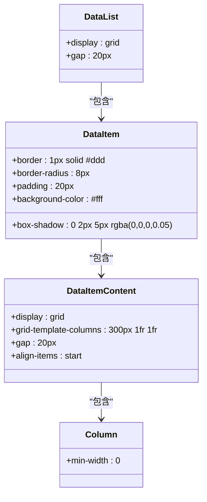

**图表来源**
- [style.css:141-171](file://static/css/style.css#L141-L171)

#### 状态管理系统

数据项实现了完整的状态管理机制，通过不同的颜色和样式反映处理状态。

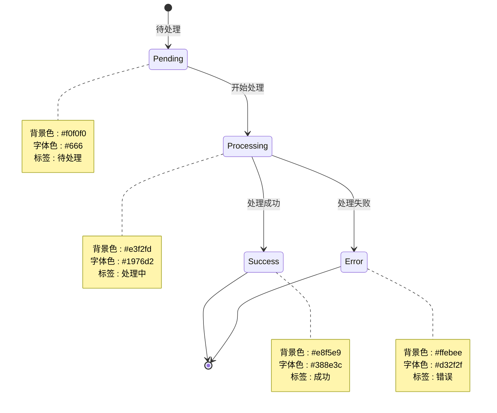

**图表来源**
- [style.css:195-213](file://static/css/style.css#L195-L213)

**章节来源**
- [style.css:141-213](file://static/css/style.css#L141-L213)

### 图片展示系统

图片展示系统采用了Flexbox布局，支持响应式图片网格。

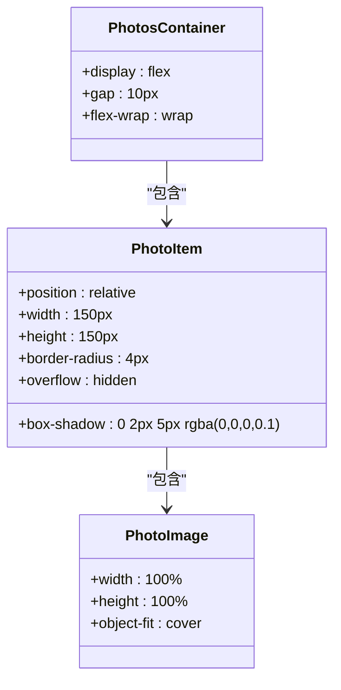

**图表来源**
- [style.css:215-234](file://static/css/style.css#L215-L234)

**章节来源**
- [style.css:215-234](file://static/css/style.css#L215-L234)

### 文本内容系统

文本内容系统实现了清晰的信息层次结构，支持多种文本类型。

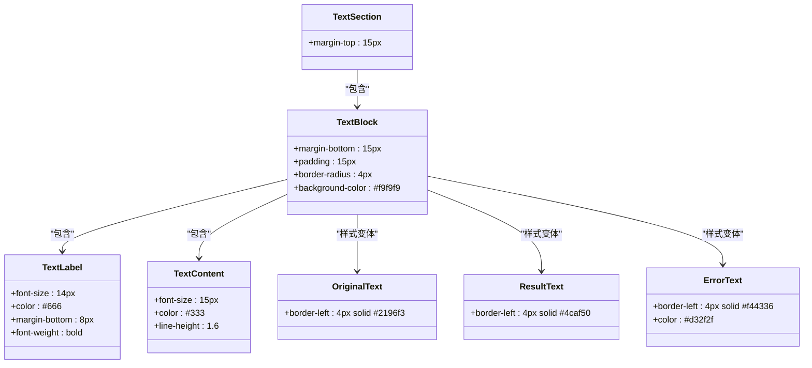

**图表来源**
- [style.css:236-271](file://static/css/style.css#L236-L271)

**章节来源**
- [style.css:236-271](file://static/css/style.css#L236-L271)

## 依赖关系分析

### 样式依赖关系

项目中的样式文件形成了清晰的依赖层次结构，从基础样式到具体组件层层递进。

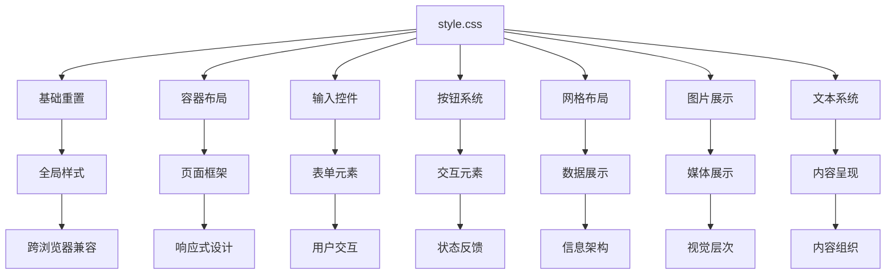

**图表来源**
- [style.css:1-272](file://static/css/style.css#L1-L272)

### HTML与CSS集成

HTML模板与CSS样式通过语义化的类名紧密集成，实现了清晰的结构分离。

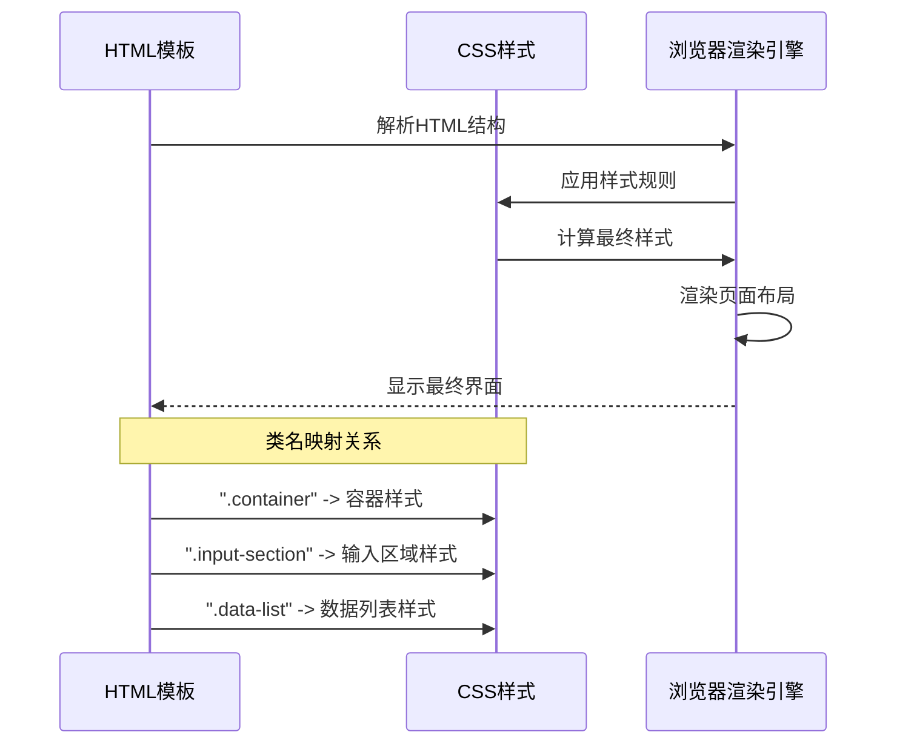

**图表来源**
- [index.html:10-35](file://templates/index.html#L10-L35)
- [style.css:13-144](file://static/css/style.css#L13-L144)

**章节来源**
- [index.html:10-35](file://templates/index.html#L10-L35)
- [style.css:13-144](file://static/css/style.css#L13-L144)

## 性能考虑

### 样式优化策略

项目采用了多项性能优化措施，确保在各种设备上的流畅表现。

1. **选择器优化**: 使用高效的CSS选择器，避免深层嵌套
2. **动画性能**: 使用transform和opacity属性进行动画，利用GPU加速
3. **响应式图片**: 采用object-fit属性确保图片质量
4. **盒模型优化**: 统一使用border-box盒模型，简化布局计算

### 性能监控指标

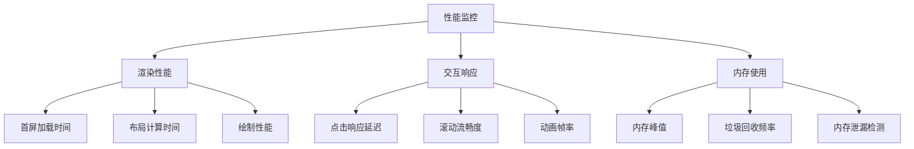

## 故障排除指南

### 常见样式问题

1. **布局错位**: 检查容器宽度和间距设置
2. **文字溢出**: 确认min-width和flex属性配置
3. **颜色不一致**: 验证CSS变量和颜色系统
4. **响应式失效**: 检查媒体查询和视口设置

### 调试工具推荐

- Chrome DevTools Elements面板
- CSS Grid/Flexbox可视化工具
- 响应式设计测试工具
- 跨浏览器兼容性测试

**章节来源**
- [README.md:314-351](file://README.md#L314-L351)

## 结论

这个CSS响应式样式设计项目展示了现代Web开发的最佳实践。通过模块化的架构设计、清晰的组件分离和完善的响应式策略，系统能够在各种设备上提供优秀的用户体验。

项目的主要优势包括：
- **模块化设计**: 清晰的样式组织和组件分离
- **响应式布局**: 灵活的Grid和Flexbox布局系统
- **交互体验**: 完善的状态管理和视觉反馈
- **性能优化**: 高效的选择器和动画实现
- **可维护性**: 语义化的类名和结构化的代码组织

这些设计原则和实现技巧可以作为其他Web项目的参考模板，帮助开发者构建高质量的响应式界面。

## 附录

### 颜色系统设计规范

项目采用了一套完整的颜色系统，支持多种状态和主题变化。

| 颜色类别 | 颜色值 | 用途 | 状态 |
|---------|--------|------|------|
| 主色调 | #4CAF50 | 主要按钮、成功状态 | 主要操作 |
| 辅助色 | #2196F3 | 原始文本边框 | 信息展示 |
| 成功色 | #4CAF50 | 成功状态 | 正面反馈 |
| 错误色 | #f44336 | 错误状态 | 警告反馈 |
| 处理色 | #1976D2 | 处理中状态 | 进行中 |
| 背景色 | #f5f5f5 | 页面背景 | 基础背景 |

### 字体排版规范

- **中文字体**: Microsoft YaHei, Arial, sans-serif
- **英文字体**: Arial, Helvetica, sans-serif
- **字号层级**: 12px-18px渐进式设计
- **行高比例**: 1.4-1.6倍行高
- **字重变化**: 400-700常规到粗体

### 响应式断点设计

项目采用移动优先的设计策略，支持以下断点：
- **移动端**: ≤768px
- **平板端**: 769px-1024px  
- **桌面端**: ≥1025px

通过这些规范和最佳实践，项目实现了高质量的响应式设计，为用户提供了优秀的跨设备体验。