# HTML模板结构设计

<cite>
**本文档引用的文件**
- [index.html](file://templates/index.html)
- [app.py](file://app.py)
- [style.css](file://static/css/style.css)
- [main.js](file://static/js/main.js)
- [data.json](file://config/data.json)
- [api_service.py](file://services/api_service.py)
- [concurrent_service.py](file://services/concurrent_service.py)
- [config.py](file://config.py)
- [README.md](file://README.md)
</cite>

## 目录
1. [引言](#引言)
2. [项目结构](#项目结构)
3. [核心组件](#核心组件)
4. [架构概览](#架构概览)
5. [详细组件分析](#详细组件分析)
6. [依赖分析](#依赖分析)
7. [性能考虑](#性能考虑)
8. [故障排除指南](#故障排除指南)
9. [结论](#结论)

## 引言

本文档深入分析了基于Flask框架的HTML模板结构设计，重点研究了`index.html`模板的整体布局架构、容器结构、输入区域、控制按钮和数据展示区域的设计理念。该系统是一个AI文案评测对比工具，支持批量处理图片文案、并发请求外部API、实时进度跟踪和Excel导出功能。

系统采用前后端分离的架构设计，前端使用HTML5、CSS3和JavaScript，后端基于Flask框架，通过RESTful API进行数据交互。模板设计充分考虑了响应式布局、用户体验和可维护性。

## 项目结构

该项目遵循Flask的标准项目结构，采用模块化设计，便于维护和扩展：

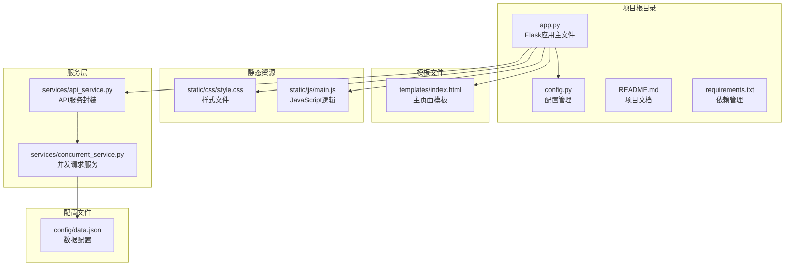

**图表来源**
- [app.py:1-139](file://app.py#L1-L139)
- [index.html:1-40](file://templates/index.html#L1-L40)
- [style.css:1-272](file://static/css/style.css#L1-L272)
- [main.js:1-266](file://static/js/main.js#L1-L266)

**章节来源**
- [README.md:24-44](file://README.md#L24-L44)
- [app.py:12-139](file://app.py#L12-L139)

## 核心组件

### HTML模板架构设计

`index.html`模板采用了现代化的响应式设计，整体架构清晰分为以下几个主要区域：

#### 1. 文档头部配置
- **字符编码**: UTF-8编码确保多语言支持
- **视口配置**: `viewport`元标签实现移动端适配
- **静态资源引用**: 使用Flask的`url_for`函数动态生成静态资源URL

#### 2. 主容器结构
- **外层容器**: `.container`类提供最大宽度限制和阴影效果
- **标题区域**: 居中显示应用标题
- **内容区域**: 采用网格布局，支持响应式调整

#### 3. 输入区域设计
- **文风选择**: 下拉选择框支持预设文风和自定义输入
- **提示词输入**: 文本域支持用户自定义提示词
- **动态显示**: 自定义文风时显示隐藏的输入框

#### 4. 控制按钮区域
- **开始处理**: 触发并发请求处理
- **导出Excel**: 将结果导出为Excel文件
- **状态管理**: 按钮禁用状态与处理流程同步

#### 5. 数据展示区域
- **加载指示器**: 旋转动画显示处理状态
- **结果列表**: 网格布局展示处理结果
- **图片预览**: 支持本地图片在线预览

**章节来源**
- [index.html:1-40](file://templates/index.html#L1-L40)
- [style.css:13-272](file://static/css/style.css#L13-L272)

## 架构概览

系统采用分层架构设计，前后端职责明确分离：

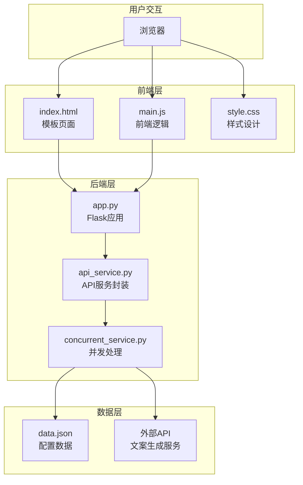

**图表来源**
- [app.py:15-139](file://app.py#L15-L139)
- [api_service.py:4-14](file://services/api_service.py#L4-L14)
- [concurrent_service.py:8-162](file://services/concurrent_service.py#L8-L162)

## 详细组件分析

### 模板引擎与Flask集成

#### Flask模板引擎使用方式

系统使用Flask的Jinja2模板引擎，通过`render_template`函数渲染HTML模板：

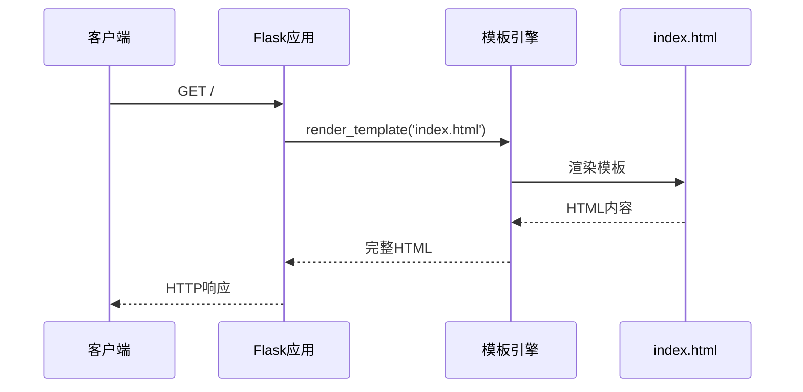

**图表来源**
- [app.py:15-17](file://app.py#L15-L17)
- [index.html:15-17](file://templates/index.html#L15-L17)

#### url_for函数的静态资源引用机制

Flask的`url_for`函数提供了安全的静态资源引用机制：

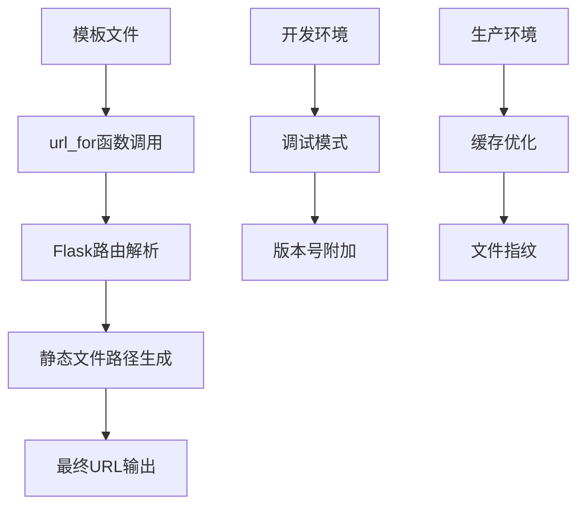

**图表来源**
- [index.html:7-37](file://templates/index.html#L7-L37)
- [app.py:12-139](file://app.py#L12-L139)

#### 模板变量传递机制

系统通过路由函数向模板传递数据：

| 变量名称 | 类型 | 描述 | 来源 |
|---------|------|------|------|
| `styles` | 数组 | 文风选项列表 | 配置文件 |
| `default_style` | 字符串 | 默认文风 | 配置文件 |
| `system_prompt` | 字符串 | 系统提示词 | 配置文件 |
| `data` | 对象数组 | 数据项列表 | 配置文件 |

**章节来源**
- [app.py:29-42](file://app.py#L29-L42)
- [data.json:1-32](file://config/data.json#L1-L32)

### HTML5语义化标签与移动端适配

#### 语义化标签使用

模板中合理使用了HTML5语义化标签：

- `<header>`: 页面头部信息（通过容器元素实现）
- `<main>`: 主要内容区域（通过`.container`实现）
- `<section>`: 内容分区（通过`.input-section`、`.control-section`等实现）
- `<article>`: 独立内容单元（通过`.data-item`实现）

#### viewport元标签的作用

`viewport`元标签是移动端适配的关键：

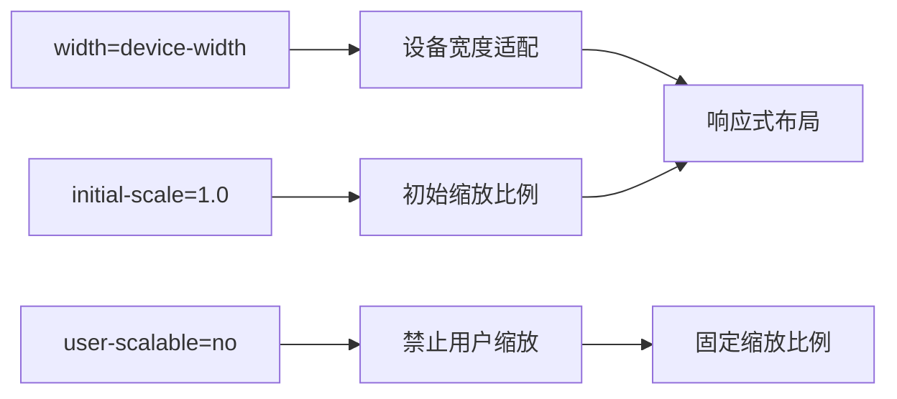

**图表来源**
- [index.html:5](file://templates/index.html#L5)

### 容器结构设计

#### 主容器设计原则

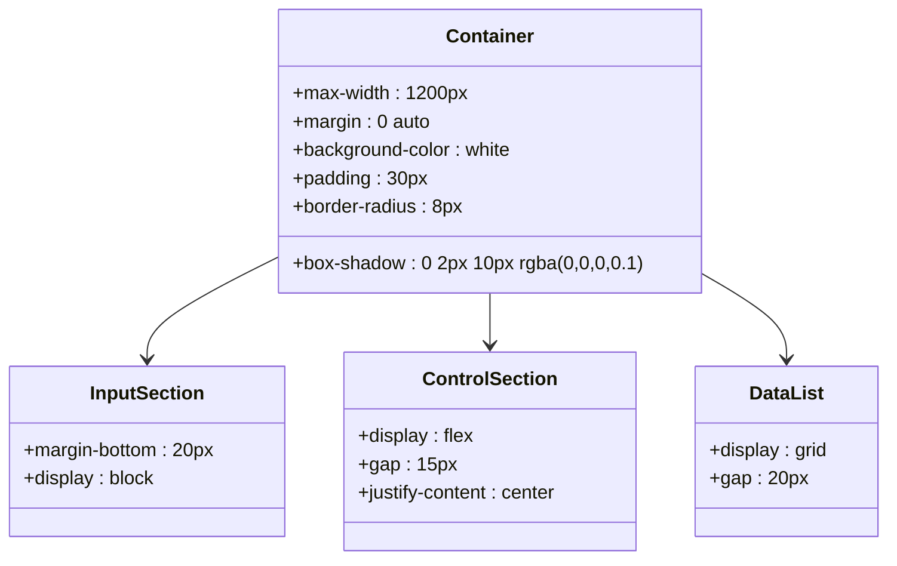

**图表来源**
- [style.css:13-20](file://static/css/style.css#L13-L20)
- [style.css:28-30](file://static/css/style.css#L28-L30)
- [style.css:94-99](file://static/css/style.css#L94-L99)
- [style.css:141-144](file://static/css/style.css#L141-L144)

#### 响应式布局实现

系统采用CSS Grid和Flexbox实现响应式布局：

- **Grid布局**: `.data-list`使用CSS Grid实现灵活的数据展示
- **Flexbox布局**: `.control-section`使用Flexbox实现按钮居中
- **媒体查询**: 支持不同屏幕尺寸的自适应

**章节来源**
- [style.css:141-171](file://static/css/style.css#L141-L171)
- [style.css:94-99](file://static/css/style.css#L94-L99)

### 输入区域设计

#### 文风选择组件

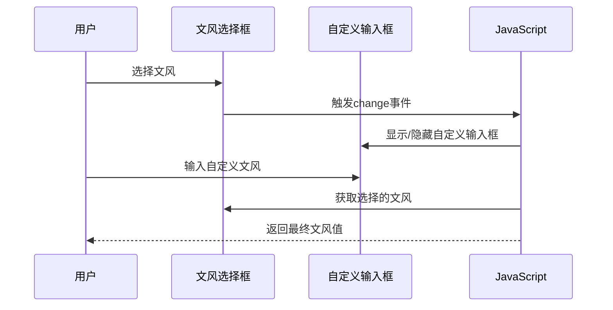

**图表来源**
- [main.js:5-27](file://static/js/main.js#L5-L27)
- [index.html:13-17](file://templates/index.html#L13-L17)

#### 提示词输入设计

- **文本域**: 支持多行输入，自动调整高度
- **占位符**: 提供使用示例和指导
- **验证**: 前端基础验证，后端严格验证

**章节来源**
- [index.html:19-22](file://templates/index.html#L19-L22)
- [style.css:78-92](file://static/css/style.css#L78-L92)

### 控制按钮系统

#### 按钮状态管理

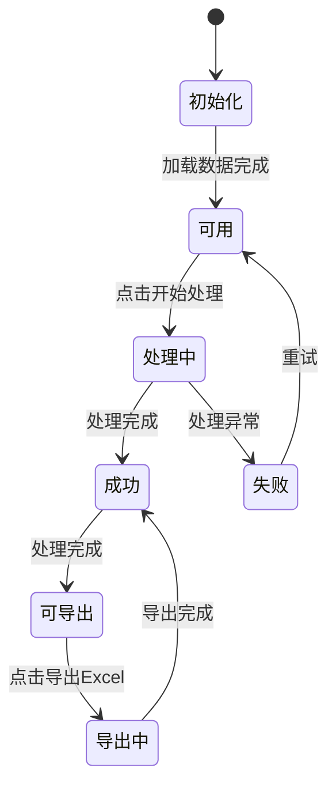

**图表来源**
- [main.js:87-136](file://static/js/main.js#L87-L136)
- [index.html:24-27](file://templates/index.html#L24-L27)

#### 按钮交互设计

- **开始处理**: 触发并发请求，禁用自身直到处理完成
- **导出Excel**: 将处理结果导出为Excel文件
- **状态反馈**: 通过文字和颜色变化提供视觉反馈

**章节来源**
- [main.js:220-260](file://static/js/main.js#L220-L260)
- [style.css:101-119](file://static/css/style.css#L101-L119)

### 数据展示区域

#### 结果渲染机制

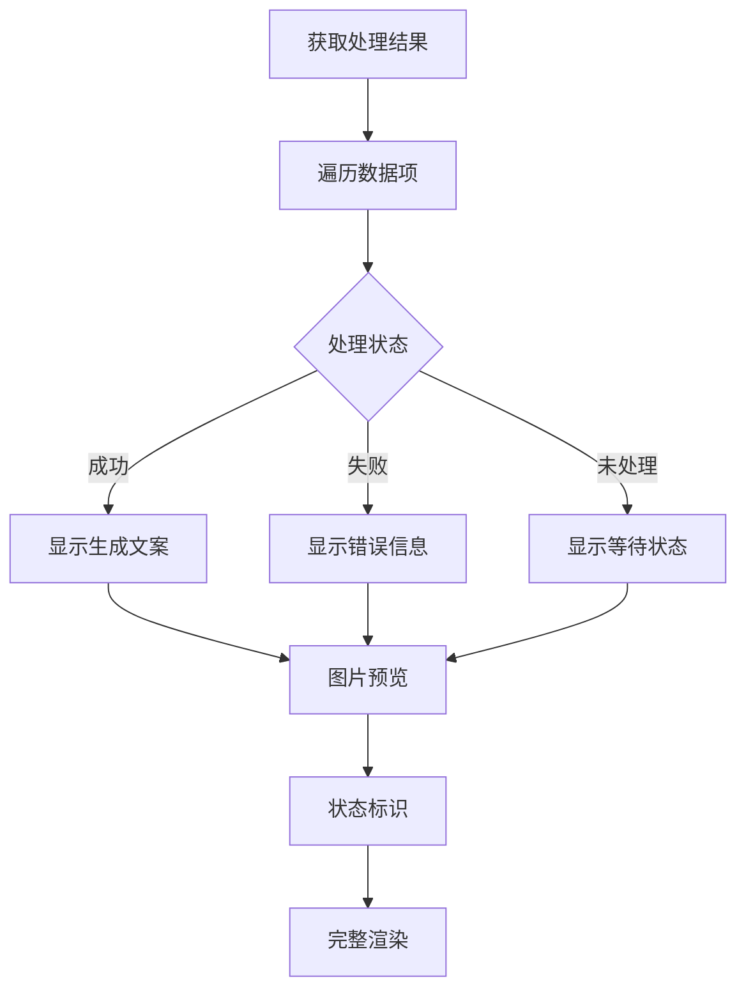

**图表来源**
- [main.js:138-218](file://static/js/main.js#L138-L218)

#### 图片展示设计

- **网格布局**: `.photos-container`实现图片网格显示
- **响应式**: 支持不同屏幕尺寸的图片排列
- **错误处理**: 图片加载失败时显示占位符

**章节来源**
- [style.css:215-234](file://static/css/style.css#L215-L234)
- [main.js:154-166](file://static/js/main.js#L154-L166)

## 依赖分析

### 组件耦合关系

系统采用松耦合设计，各组件职责明确：

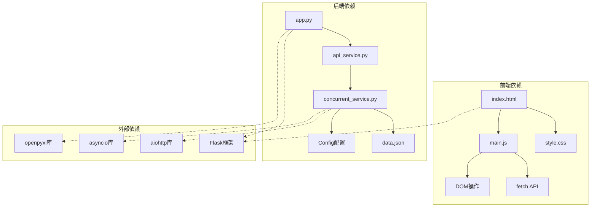

**图表来源**
- [app.py:1-11](file://app.py#L1-L11)
- [api_service.py:1-2](file://services/api_service.py#L1-L2)
- [concurrent_service.py:1-6](file://services/concurrent_service.py#L1-L6)

### 数据流分析

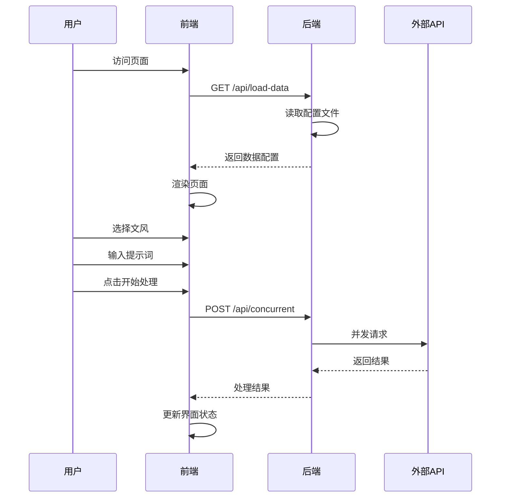

**图表来源**
- [app.py:29-61](file://app.py#L29-L61)
- [main.js:29-136](file://static/js/main.js#L29-L136)

**章节来源**
- [app.py:1-139](file://app.py#L1-L139)
- [concurrent_service.py:118-158](file://services/concurrent_service.py#L118-L158)

## 性能考虑

### 前端性能优化

#### 资源加载优化
- **静态资源缓存**: 使用Flask的静态资源管理机制
- **按需加载**: JavaScript在页面加载后执行
- **图片懒加载**: 仅在需要时加载图片资源

#### DOM操作优化
- **批量更新**: 使用DocumentFragment减少DOM重绘
- **事件委托**: 减少事件监听器数量
- **虚拟滚动**: 大数据集时考虑实现虚拟滚动

### 后端性能优化

#### 并发处理优化
- **信号量控制**: 通过`MAX_CONCURRENT_REQUESTS`限制并发数
- **超时控制**: `API_TIMEOUT`防止长时间阻塞
- **进度跟踪**: 实时监控处理进度

#### 内存管理
- **异步处理**: 使用asyncio避免阻塞
- **资源清理**: 及时释放网络连接和文件句柄

**章节来源**
- [config.py:7-9](file://config.py#L7-L9)
- [concurrent_service.py:10-12](file://services/concurrent_service.py#L10-L12)

## 故障排除指南

### 常见问题及解决方案

#### 图片显示问题
**问题**: 浏览器无法显示本地图片
**原因**: 浏览器安全限制阻止本地文件访问
**解决方案**: 系统通过`/api/photo/<path>`路由实现图片代理

#### Excel导出问题
**问题**: Excel文件中图片无法显示
**原因**: 缺少必要的依赖库或图片格式不支持
**解决方案**: 
- 安装Pillow库：`pip install Pillow`
- 确保图片格式支持（PNG、JPEG、BMP、GIF、TIFF）
- 使用Excel或WPS打开文件

#### 并发请求超时
**问题**: 处理大量数据时出现超时
**解决方案**:
- 增加`API_TIMEOUT`环境变量值
- 减少`MAX_CONCURRENT_REQUESTS`并发数
- 检查外部API服务状态

**章节来源**
- [README.md:314-348](file://README.md#L314-L348)

### 调试技巧

#### 前端调试
- 使用浏览器开发者工具检查网络请求
- 监控JavaScript控制台错误
- 检查CSS媒体查询效果

#### 后端调试
- 查看服务器日志输出
- 监控并发请求进度
- 检查配置文件格式

## 结论

该HTML模板结构设计体现了现代Web开发的最佳实践，具有以下特点：

### 设计优势
1. **响应式布局**: 完美适配各种设备屏幕
2. **模块化设计**: 前后端职责清晰分离
3. **可扩展性**: 易于添加新功能和组件
4. **用户体验**: 提供丰富的交互反馈

### 技术亮点
1. **Flask模板引擎**: 灵活的模板渲染机制
2. **异步并发处理**: 高效的数据处理能力
3. **Excel导出功能**: 完整的数据可视化方案
4. **图片代理机制**: 解决浏览器安全限制

### 改进建议
1. **增加错误处理**: 更完善的错误提示机制
2. **性能监控**: 实时性能指标监控
3. **国际化支持**: 多语言界面支持
4. **测试覆盖**: 完善的单元测试和集成测试

该系统为HTML模板结构设计提供了优秀的参考案例，展示了如何在实际项目中平衡功能性、可维护性和用户体验。