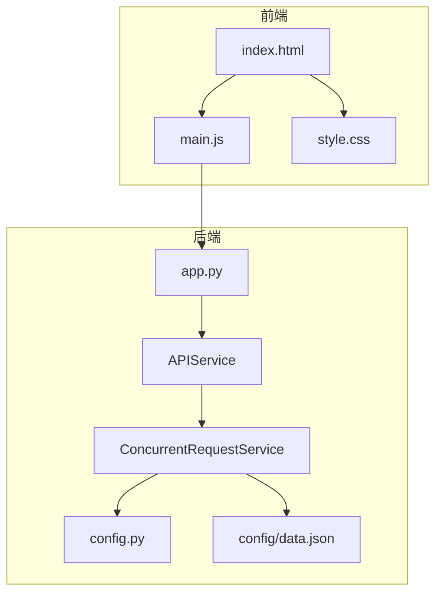
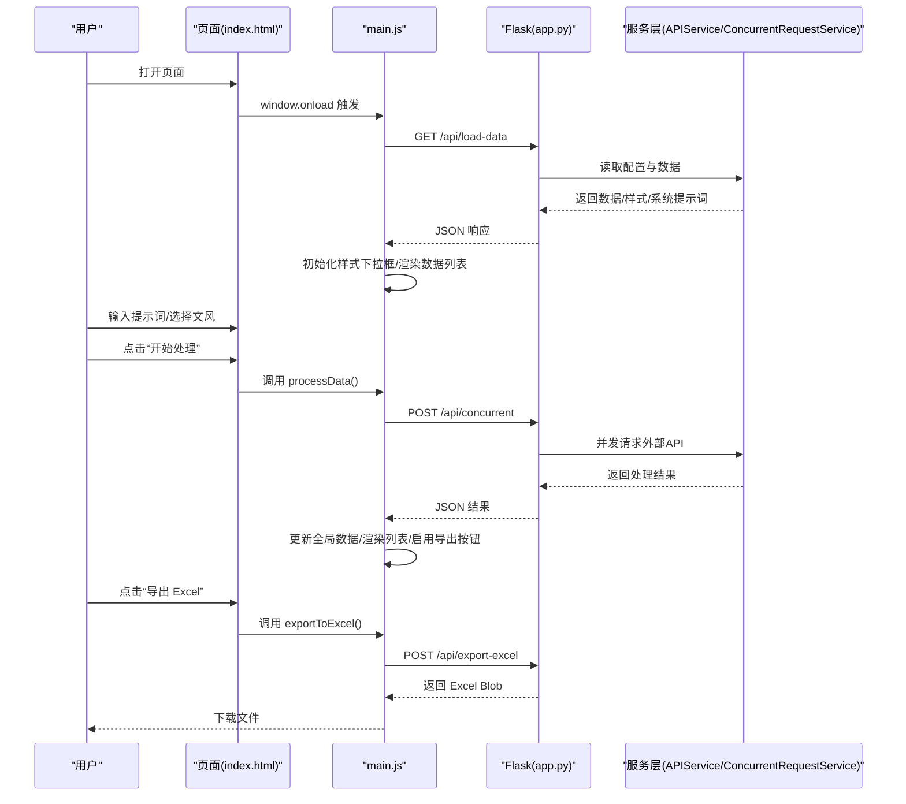
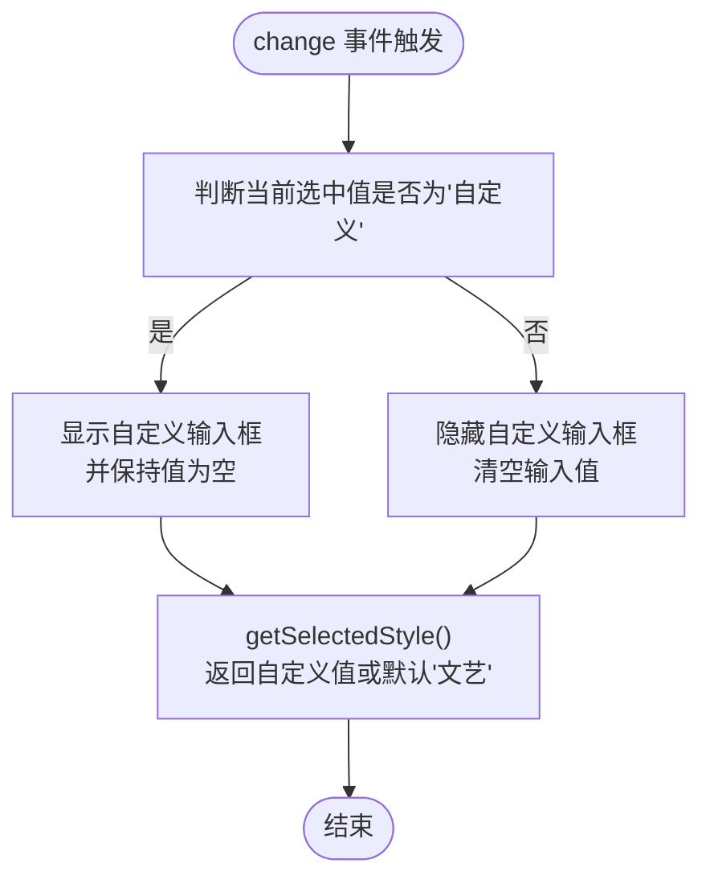
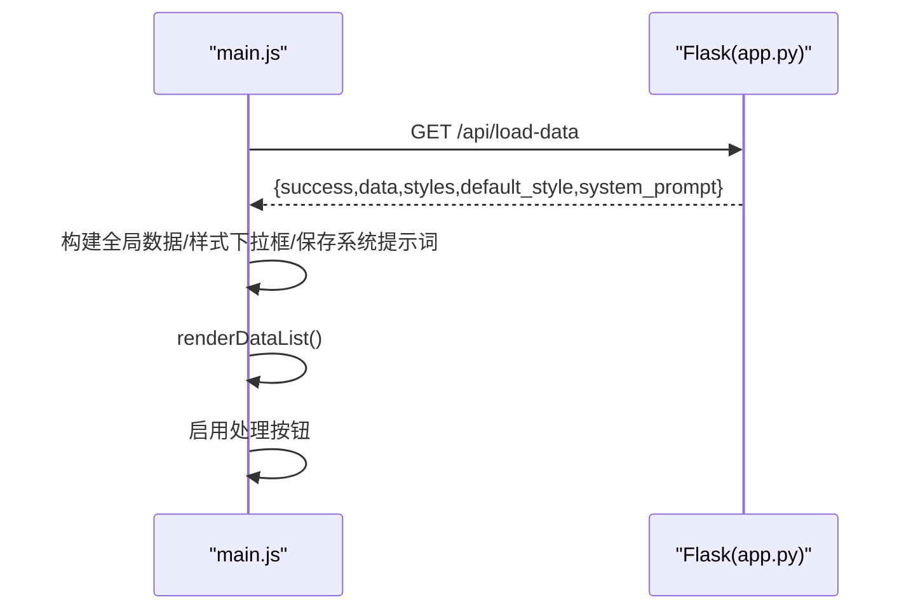
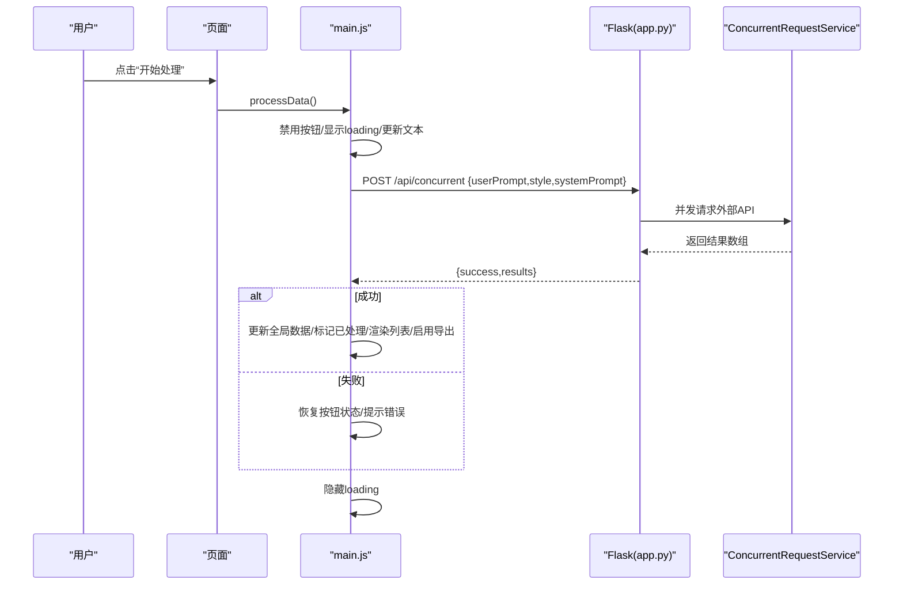
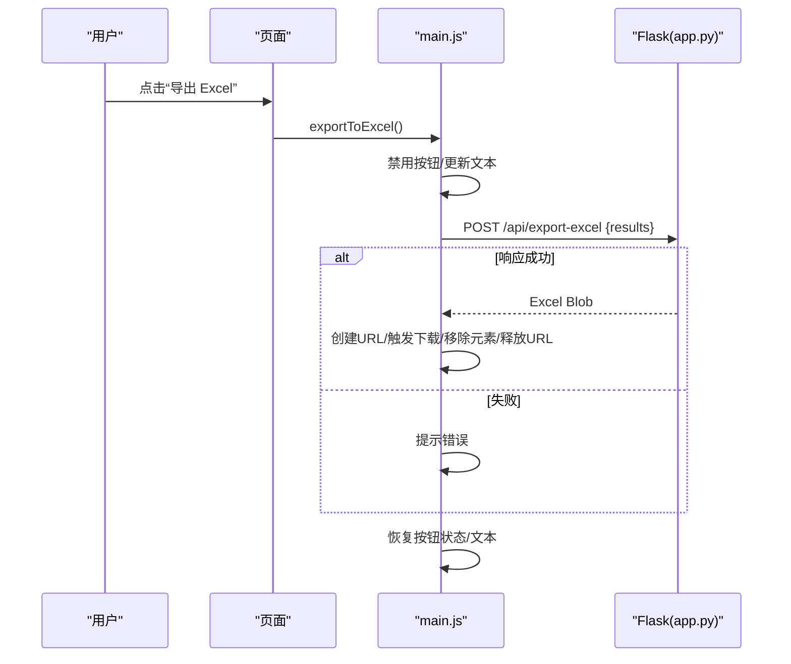
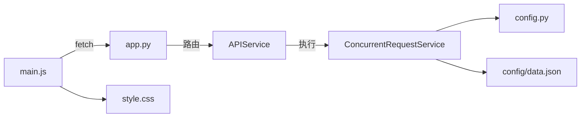

# JavaScript交互逻辑

<cite>
**本文引用的文件**
- [main.js](file://static/js/main.js)
- [index.html](file://templates/index.html)
- [app.py](file://app.py)
- [concurrent_service.py](file://services/concurrent_service.py)
- [api_service.py](file://services/api_service.py)
- [config.py](file://config.py)
- [data.json](file://config/data.json)
- [style.css](file://static/css/style.css)
</cite>

## 目录
1. [简介](#简介)
2. [项目结构](#项目结构)
3. [核心组件](#核心组件)
4. [架构总览](#架构总览)
5. [详细组件分析](#详细组件分析)
6. [依赖关系分析](#依赖关系分析)
7. [性能考量](#性能考量)
8. [故障排查指南](#故障排查指南)
9. [结论](#结论)
10. [附录](#附录)

## 简介
本技术文档聚焦于前端交互逻辑，围绕静态资源目录下的 main.js 展开，系统性解析其 AJAX 请求处理、DOM 操作与事件监听机制；重点阐释 processData() 与 exportToExcel() 的实现细节，覆盖用户输入验证、按钮状态管理、错误处理与异步 Promise 使用模式；并提供用户交互流程说明、数据绑定与动态内容更新方法，帮助开发者快速理解与扩展该交互层。

## 项目结构
前端交互逻辑位于 static/js/main.js，页面模板位于 templates/index.html，配套样式位于 static/css/style.css。后端通过 Flask 提供 REST 接口，前端通过 fetch 发起异步请求并与后端服务协作完成数据加载、并发处理与 Excel 导出。

图表来源
- [index.html](file://templates/index.html)
- [main.js](file://static/js/main.js)
- [app.py](file://app.py)
- [api_service.py](file://services/api_service.py)
- [concurrent_service.py](file://services/concurrent_service.py)
- [config.py](file://config.py)
- [data.json](file://config/data.json)
- [style.css](file://static/css/style.css)

章节来源
- [index.html](file://templates/index.html)
- [main.js](file://static/js/main.js)
- [style.css](file://static/css/style.css)

## 核心组件
- 全局状态管理：维护全局数据、处理状态与系统提示词，用于渲染与导出。
- 文风选择与自定义：动态切换下拉框与自定义输入框的显示/隐藏。
- 数据加载：从后端接口获取初始数据、样式与系统提示词，构建全局数据结构。
- 并发处理：向后端发起并发请求，接收结果并更新全局数据与界面状态。
- 渲染：根据全局数据与处理状态动态生成列表项，展示原图、原始文案与生成文案。
- 导出 Excel：将处理后的结果提交至后端，下载生成的 Excel 文件。

章节来源
- [main.js](file://static/js/main.js)
- [index.html](file://templates/index.html)

## 架构总览
前端通过 main.js 与后端进行三次关键交互：
- 加载数据：GET /api/load-data
- 并发处理：POST /api/concurrent
- 导出 Excel：POST /api/export-excel

图表来源
- [main.js](file://static/js/main.js)
- [index.html](file://templates/index.html)
- [app.py](file://app.py)
- [api_service.py](file://services/api_service.py)
- [concurrent_service.py](file://services/concurrent_service.py)

## 详细组件分析

### 文风选择与自定义输入
- 功能要点
  - 监听文风下拉框 change 事件，当选择“自定义”时显示自定义输入框，否则隐藏并清空输入框。
  - 提供 getSelectedStyle() 获取当前选中文风，若为“自定义”则返回自定义输入值，否则返回下拉框值。
- DOM 操作
  - 通过元素 ID 获取 select 与 input，动态设置 display 样式与 value。
- 错误处理
  - 当未输入自定义文风时回退为默认“文艺”。

图表来源
- [main.js](file://static/js/main.js)

章节来源
- [main.js](file://static/js/main.js)

### 数据加载与初始化
- 功能要点
  - loadData() 通过 GET /api/load-data 获取数据、样式与系统提示词。
  - 将返回的数据映射为内部结构，填充全局数组与系统提示词。
  - 动态生成样式下拉框选项，设置默认值。
  - 渲染数据列表并启用“开始处理”按钮。
- DOM 操作
  - 显示/隐藏 loading 区域；清空数据列表；重建下拉框选项。
- 错误处理
  - 对网络异常与后端错误进行捕获与提示；最终统一隐藏 loading。

图表来源
- [main.js](file://static/js/main.js)
- [app.py](file://app.py)

章节来源
- [main.js](file://static/js/main.js)
- [app.py](file://app.py)
- [data.json](file://config/data.json)

### 并发处理与结果渲染
- 关键函数：processData()
  - 输入校验：防止重复处理（isProcessed），避免重复点击。
  - 状态管理：显示 loading、禁用按钮、更新按钮文本。
  - 异步请求：POST /api/concurrent，携带用户提示词、文风与系统提示词。
  - 结果处理：成功则更新全局数据、标记已处理、渲染列表、启用导出按钮；失败则恢复按钮状态并提示。
  - 错误处理：捕获异常并恢复按钮状态与文本。
- 渲染：renderDataList() 根据 isProcessed 与每条数据的 success 字段决定状态样式与内容展示，支持图片占位与错误信息块。
- Promise 使用模式：await fetch() 与 await response.json() 组合，配合 try/catch/finally 控制 UI 状态。

图表来源
- [main.js](file://static/js/main.js)
- [app.py](file://app.py)
- [concurrent_service.py](file://services/concurrent_service.py)

章节来源
- [main.js](file://static/js/main.js)
- [app.py](file://app.py)
- [concurrent_service.py](file://services/concurrent_service.py)

### Excel 导出
- 关键函数：exportToExcel()
  - 输入校验：若全局数据为空则提示并终止。
  - 状态管理：禁用导出按钮、更新按钮文本。
  - 异步请求：POST /api/export-excel，提交 results。
  - 文件下载：将响应转换为 Blob，创建临时 URL 并触发下载，最后释放对象 URL。
  - 错误处理：捕获异常并恢复按钮状态与文本。

图表来源
- [main.js](file://static/js/main.js)
- [app.py](file://app.py)

章节来源
- [main.js](file://static/js/main.js)
- [app.py](file://app.py)

### DOM 操作与事件监听机制
- 事件绑定
  - 页面加载完成后初始化文风选择与数据加载。
  - “开始处理”与“导出 Excel”按钮通过 onclick 调用对应函数。
- DOM 更新策略
  - 通过 innerHTML 一次性拼接复杂结构，减少多次 DOM 操作。
  - 使用类名切换控制状态样式（待处理/处理中/成功/失败）。
  - 图片加载失败时使用内联 SVG 占位，提升用户体验。
- 响应式布局
  - 样式文件提供网格布局与媒体查询，适配不同屏幕尺寸。

章节来源
- [main.js](file://static/js/main.js)
- [index.html](file://templates/index.html)
- [style.css](file://static/css/style.css)

### 数据绑定与动态内容更新
- 数据绑定
  - 全局数组 globalData 存储每条数据的标识、处理状态与结果对象。
  - renderDataList() 根据全局数据与 isProcessed 状态动态生成列表项。
- 动态内容更新
  - 状态栏：根据 success 值切换状态样式与文本。
  - 文案区域：成功时显示生成文案，失败时显示错误信息。
  - 图片区域：遍历 photos 列表生成缩略图，支持 onerror 占位。

章节来源
- [main.js](file://static/js/main.js)

## 依赖关系分析
- 前端依赖
  - main.js 依赖 DOM 元素 ID 与样式类名，依赖 fetch API 进行异步请求。
  - 样式文件提供布局与状态样式，保证渲染一致性。
- 后端依赖
  - app.py 提供三个核心接口：加载数据、并发处理、导出 Excel。
  - 服务层通过 APIService 与 ConcurrentRequestService 实现并发控制与进度打印。
  - 配置模块读取环境变量，控制 API 基础地址、超时与并发数。
  - 配置文件 data.json 提供初始数据与样式选项。

图表来源
- [main.js](file://static/js/main.js)
- [app.py](file://app.py)
- [api_service.py](file://services/api_service.py)
- [concurrent_service.py](file://services/concurrent_service.py)
- [config.py](file://config.py)
- [data.json](file://config/data.json)
- [style.css](file://static/css/style.css)

章节来源
- [main.js](file://static/js/main.js)
- [app.py](file://app.py)
- [api_service.py](file://services/api_service.py)
- [concurrent_service.py](file://services/concurrent_service.py)
- [config.py](file://config.py)
- [data.json](file://config/data.json)
- [style.css](file://static/css/style.css)

## 性能考量
- 并发控制
  - 后端通过信号量控制最大并发数，避免资源争用与超时。
- 异步处理
  - 前端使用 async/await 串行化请求与渲染，避免 UI 阻塞。
- 图片加载
  - 使用 onerror 内联 SVG 占位，减少失败重试与闪烁。
- 样式优化
  - CSS Grid 布局减少复杂计算，提升渲染性能。

[本节为通用建议，无需具体文件引用]

## 故障排查指南
- 图片无法显示
  - 检查 data.json 中图片路径是否存在且可访问。
  - 确认 Flask 服务正常运行，图片代理接口可用。
- 导出 Excel 无图片
  - 确认已安装 Pillow，图片格式受支持。
  - 使用 Excel 或 WPS 打开，部分在线编辑器不支持嵌入图片。
- 并发请求超时
  - 调整环境变量 API_TIMEOUT 与 MAX_CONCURRENT_REQUESTS。
  - 检查外部 API 服务状态与网络连通性。
- 处理失败重试
  - 刷新页面重新加载数据，再次点击“开始处理”。

章节来源
- [app.py](file://app.py)
- [concurrent_service.py](file://services/concurrent_service.py)
- [config.py](file://config.py)
- [data.json](file://config/data.json)

## 结论
main.js 以简洁的函数职责划分与清晰的状态机设计，实现了从数据加载、并发处理到结果导出的完整交互闭环。通过 fetch 的 Promise 模式与 try/catch/finally 的错误处理，保证了良好的用户体验与健壮性。结合后端的服务层并发控制与进度打印，系统在可扩展性与性能之间取得了平衡。

[本节为总结性内容，无需具体文件引用]

## 附录

### API 接口概览
- 加载数据
  - 方法：GET
  - 路径：/api/load-data
  - 返回：包含 data、styles、default_style、system_prompt 的 JSON
- 并发处理
  - 方法：POST
  - 路径：/api/concurrent
  - 请求体：userPrompt、style、systemPrompt
  - 返回：包含 success 与 results 的 JSON
- 导出 Excel
  - 方法：POST
  - 路径：/api/export-excel
  - 请求体：results
  - 返回：Excel 文件流（二进制）

章节来源
- [app.py](file://app.py)

### 关键函数与职责对照
- initStyleSelect()：初始化文风选择与自定义输入框显示逻辑
- getSelectedStyle()：获取当前选中文风（含自定义回退）
- loadData()：加载初始数据、样式与系统提示词，渲染列表并启用处理按钮
- processData()：并发请求处理，更新全局数据与界面状态
- renderDataList()：根据全局数据与处理状态动态渲染列表项
- exportToExcel()：提交结果并下载 Excel 文件

章节来源
- [main.js](file://static/js/main.js)