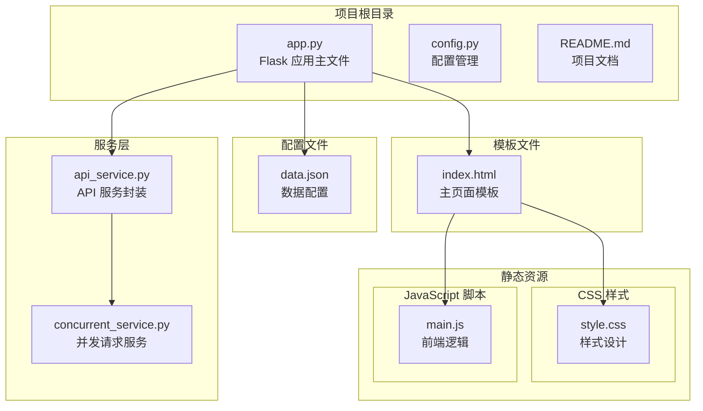
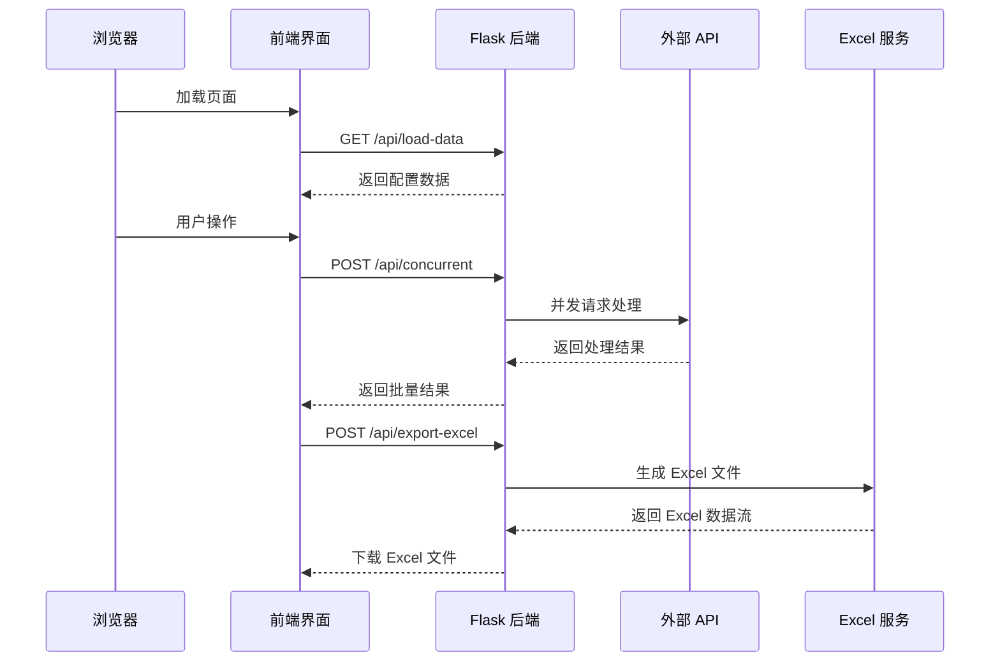
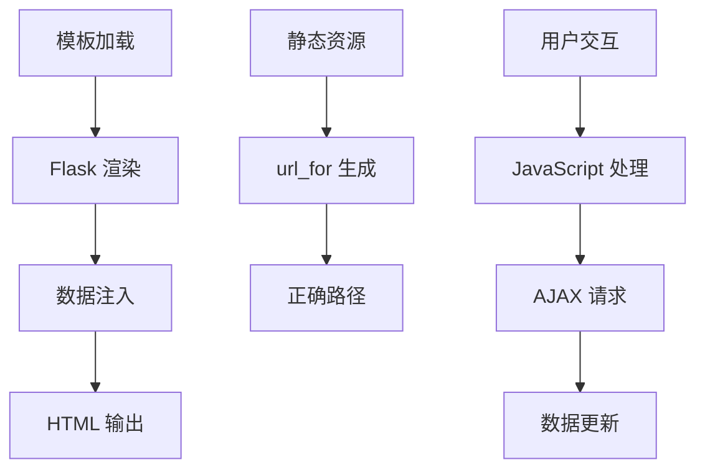
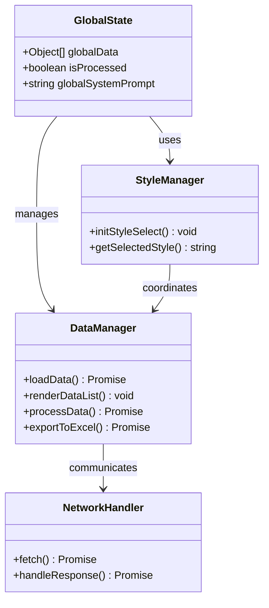
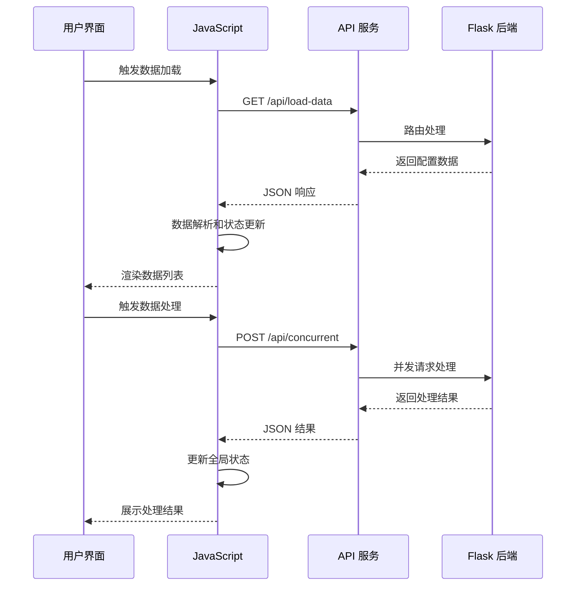
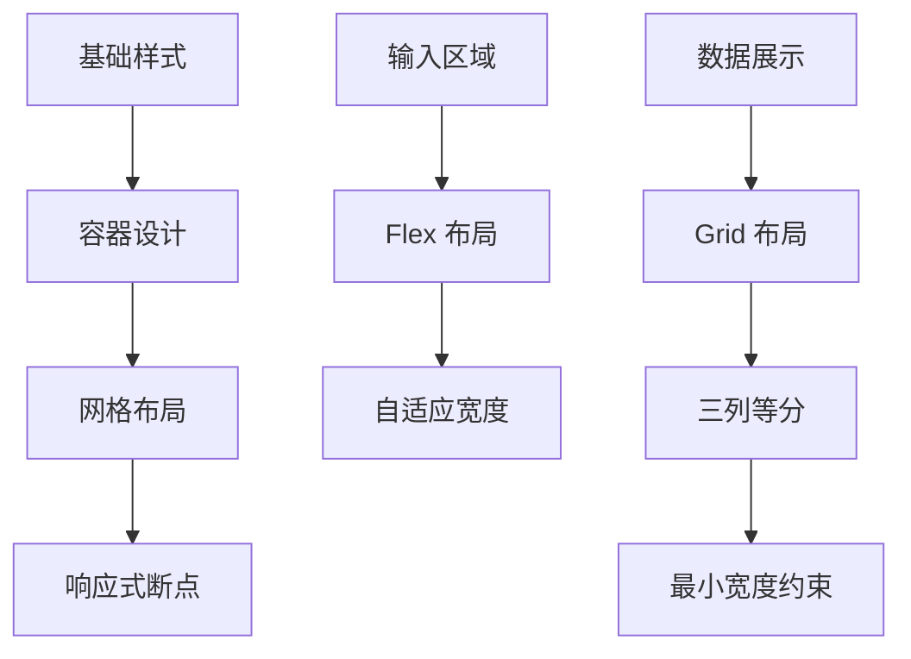
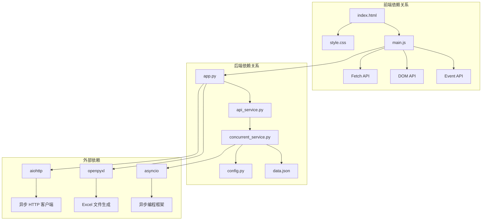

# 前端用户界面

<cite>
**本文档引用的文件**
- [index.html](file://templates/index.html)
- [main.js](file://static/js/main.js)
- [style.css](file://static/css/style.css)
- [app.py](file://app.py)
- [api_service.py](file://services/api_service.py)
- [concurrent_service.py](file://services/concurrent_service.py)
- [data.json](file://config/data.json)
- [config.py](file://config.py)
- [README.md](file://README.md)
</cite>

## 目录
1. [简介](#简介)
2. [项目结构](#项目结构)
3. [核心组件](#核心组件)
4. [架构概览](#架构概览)
5. [详细组件分析](#详细组件分析)
6. [依赖关系分析](#依赖关系分析)
7. [性能考虑](#性能考虑)
8. [故障排除指南](#故障排除指南)
9. [结论](#结论)

## 简介

这是一个基于 Flask 的 AI 文案评测对比系统，提供了完整的前端用户界面解决方案。该系统允许用户批量处理图片文案，支持多种文风选择，通过并发请求生成文案，并可将结果导出为 Excel 文件。前端界面采用现代化的设计理念，实现了响应式布局和直观的用户交互体验。

## 项目结构

该项目采用典型的 Flask Web 应用结构，前端静态资源与后端逻辑分离，便于维护和扩展。



**图表来源**
- [app.py:1-139](file://app.py#L1-L139)
- [index.html:1-40](file://templates/index.html#L1-L40)
- [style.css:1-272](file://static/css/style.css#L1-L272)
- [main.js:1-266](file://static/js/main.js#L1-L266)

**章节来源**
- [app.py:1-139](file://app.py#L1-L139)
- [README.md:24-44](file://README.md#L24-L44)

## 核心组件

### Flask 模板引擎集成

系统使用 Flask 的 Jinja2 模板引擎来实现动态内容渲染。模板文件通过 `url_for` 函数动态生成静态资源链接，确保部署时的路径正确性。

### AJAX 请求处理

前端 JavaScript 通过 fetch API 实现异步数据请求，支持错误处理和加载状态管理。所有 API 调用都遵循 RESTful 设计规范。

### 响应式样式设计

采用 CSS Grid 和 Flexbox 实现响应式布局，支持不同屏幕尺寸的设备访问。样式系统具有良好的可维护性和扩展性。

**章节来源**
- [index.html:7-8](file://templates/index.html#L7-L8)
- [main.js:29-85](file://static/js/main.js#L29-L85)
- [style.css:141-171](file://static/css/style.css#L141-L171)

## 架构概览

系统采用前后端分离的架构设计，前端负责用户交互和数据展示，后端提供 API 服务和业务逻辑处理。



**图表来源**
- [app.py:29-61](file://app.py#L29-L61)
- [main.js:38-135](file://static/js/main.js#L38-L135)
- [main.js:231-259](file://static/js/main.js#L231-L259)

## 详细组件分析

### index.html 模板结构设计

模板文件采用了语义化的 HTML5 结构，通过 Flask 的模板继承机制实现动态内容渲染。

#### 模板数据绑定机制



**图表来源**
- [index.html:1-40](file://templates/index.html#L1-L40)
- [app.py:15-17](file://app.py#L15-L17)

#### 关键元素分析

- **容器结构**: 使用 `.container` 类实现页面居中布局和阴影效果
- **输入区域**: 包含文风选择下拉框和自定义提示词文本域
- **控制区域**: 提供开始处理和导出 Excel 两个主要操作按钮
- **数据展示区**: 通过 `.data-list` 实现网格布局的数据展示

**章节来源**
- [index.html:10-35](file://templates/index.html#L10-L35)

### main.js JavaScript 逻辑实现

前端 JavaScript 实现了完整的用户交互逻辑，包括数据加载、处理流程控制和结果展示。

#### 核心函数架构



**图表来源**
- [main.js:1-266](file://static/js/main.js#L1-L266)

#### AJAX 请求处理流程



**图表来源**
- [main.js:29-85](file://static/js/main.js#L29-L85)
- [main.js:87-136](file://static/js/main.js#L87-L136)

#### DOM 操作和事件监听

前端实现了完整的事件驱动架构，包括：

- **样式选择事件**: 监听下拉框变化，动态显示/隐藏自定义输入框
- **按钮状态管理**: 根据处理状态禁用/启用按钮
- **加载状态指示**: 显示/隐藏加载动画
- **错误处理**: 统一的错误提示和恢复机制

**章节来源**
- [main.js:5-27](file://static/js/main.js#L5-L27)
- [main.js:262-266](file://static/js/main.js#L262-L266)

### style.css 样式设计原则

样式系统采用现代化的设计理念，注重用户体验和视觉效果。

#### 响应式布局实现



**图表来源**
- [style.css:13-20](file://static/css/style.css#L13-L20)
- [style.css:141-171](file://static/css/style.css#L141-L171)

#### 三列网格布局实现

样式系统通过 CSS Grid 实现了灵活的三列布局：

- **左侧列**: 固定宽度 300px，用于图片展示
- **中间列**: 1fr，占剩余空间，用于原始文案
- **右侧列**: 1fr，占剩余空间，用于处理结果

```css
.data-item-content {
    display: grid;
    grid-template-columns: 300px 1fr 1fr;
    gap: 20px;
    align-items: start;
}
```

#### 状态指示系统

系统实现了完整的状态指示体系：

- **待处理**: 灰色背景，#f0f0f0
- **处理中**: 蓝色背景，#e3f2fd  
- **成功**: 绿色背景，#e8f5e9
- **失败**: 红色背景，#ffebee

**章节来源**
- [style.css:141-171](file://static/css/style.css#L141-L171)
- [style.css:195-213](file://static/css/style.css#L195-L213)

## 依赖关系分析

前端组件之间的依赖关系清晰明确，遵循单一职责原则。



**图表来源**
- [main.js:1-266](file://static/js/main.js#L1-L266)
- [app.py:10-13](file://app.py#L10-L13)
- [api_service.py:1-14](file://services/api_service.py#L1-L14)
- [concurrent_service.py:1-162](file://services/concurrent_service.py#L1-L162)

**章节来源**
- [app.py:10-13](file://app.py#L10-L13)
- [api_service.py:1-14](file://services/api_service.py#L1-L14)
- [concurrent_service.py:1-162](file://services/concurrent_service.py#L1-L162)

## 性能考虑

### 前端性能优化策略

1. **懒加载机制**: 图片采用延迟加载，提升初始渲染速度
2. **内存管理**: 及时清理事件监听器和 DOM 引用
3. **缓存策略**: 利用浏览器缓存静态资源
4. **异步处理**: 使用 Promise 和 async/await 避免阻塞主线程

### 后端性能优化策略

1. **并发控制**: 通过信号量限制最大并发请求数
2. **超时管理**: 合理设置请求超时时间
3. **进度跟踪**: 实时显示处理进度，提升用户体验
4. **资源池化**: 复用 HTTP 连接，减少连接开销

## 故障排除指南

### 常见问题及解决方案

#### 图片无法显示问题

**问题描述**: 浏览器无法显示本地图片文件

**解决方案**:
1. 确认图片路径在配置文件中正确设置
2. 检查图片文件是否存在且可访问
3. 验证 Flask 服务正常运行
4. 使用图片代理接口 `/api/photo/<path>`

#### Excel 导出问题

**问题描述**: 导出的 Excel 文件中图片缺失

**解决方案**:
1. 确认已安装 Pillow 库
2. 检查图片格式是否受支持
3. 验证图片文件完整性
4. 使用 Excel 或 WPS 打开文件

#### 并发请求超时

**问题描述**: 处理大量数据时出现超时错误

**解决方案**:
1. 调整 `API_TIMEOUT` 环境变量
2. 减少 `MAX_CONCURRENT_REQUESTS` 并发数
3. 检查外部 API 服务状态
4. 优化网络连接质量

**章节来源**
- [README.md:314-348](file://README.md#L314-L348)
- [config.py:7-11](file://config.py#L7-L11)

## 结论

该前端用户界面系统展现了现代 Web 应用开发的最佳实践。通过 Flask 模板引擎的动态内容渲染、AJAX 异步请求处理、响应式样式设计和完善的错误处理机制，为用户提供了流畅的交互体验。

系统的主要优势包括：

1. **模块化设计**: 前后端分离，职责清晰
2. **响应式布局**: 适配多种设备和屏幕尺寸
3. **并发处理**: 高效的数据处理能力
4. **用户体验**: 完善的状态反馈和错误处理
5. **可扩展性**: 良好的架构设计便于功能扩展

通过持续的优化和维护，该系统能够满足各种批量文案处理场景的需求，为用户提供高效、可靠的工具支持。