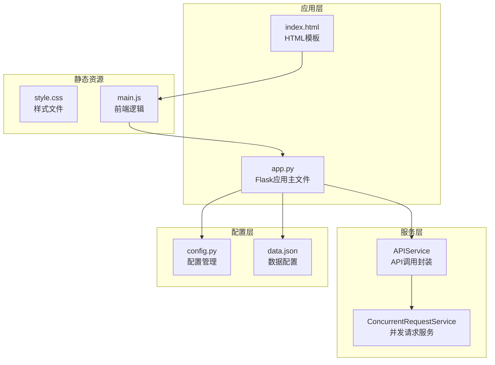
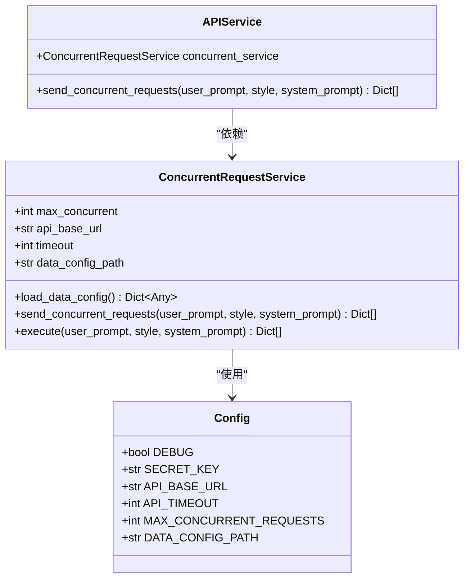
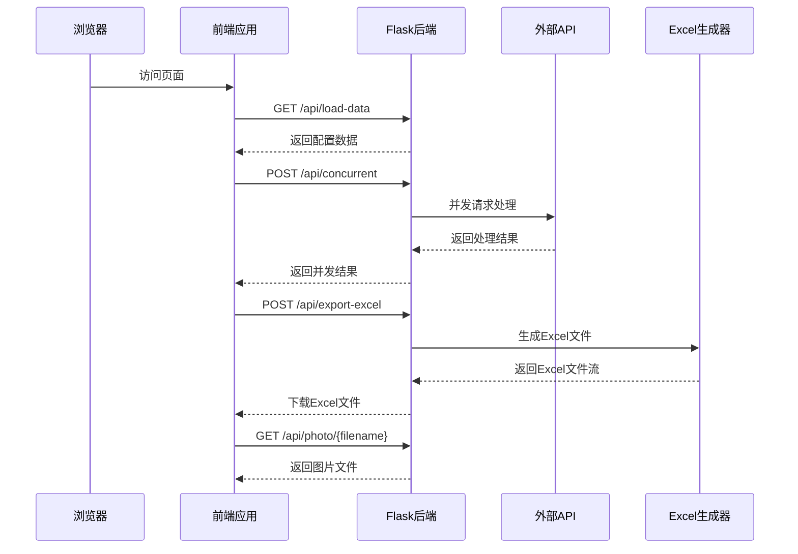
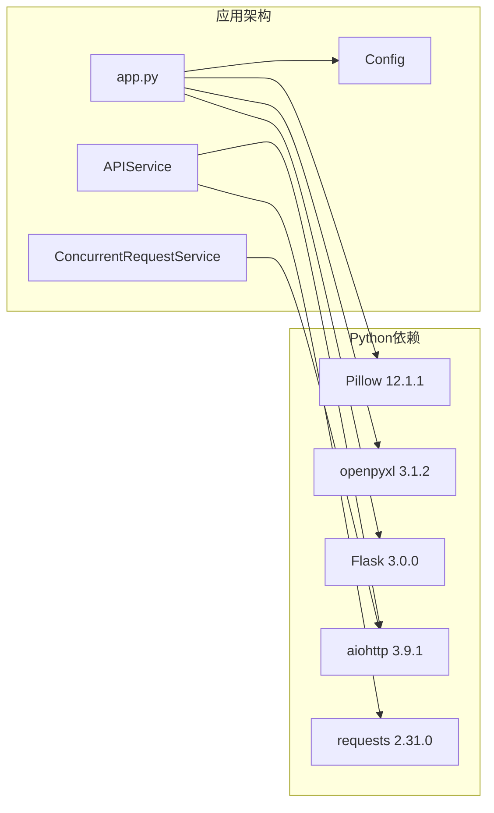

# API接口设计

<cite>
**本文档引用的文件**
- [app.py](file://app.py)
- [services/api_service.py](file://services/api_service.py)
- [services/concurrent_service.py](file://services/concurrent_service.py)
- [config.py](file://config.py)
- [config/data.json](file://config/data.json)
- [README.md](file://README.md)
- [requirements.txt](file://requirements.txt)
- [templates/index.html](file://templates/index.html)
- [static/js/main.js](file://static/js/main.js)
</cite>

## 目录
1. [简介](#简介)
2. [项目结构](#项目结构)
3. [核心组件](#核心组件)
4. [架构概览](#架构概览)
5. [详细组件分析](#详细组件分析)
6. [依赖关系分析](#依赖关系分析)
7. [性能考虑](#性能考虑)
8. [故障排除指南](#故障排除指南)
9. [结论](#结论)

## 简介

本项目是一个基于Flask的Web应用，专门用于批量处理图片文案，支持并发调用外部API生成文案，并可将结果导出为Excel文件。该系统提供了完整的API接口设计，包括数据加载、并发请求处理、Excel导出和图片代理等功能。

## 项目结构

该项目采用分层架构设计，主要包含以下模块：



**图表来源**
- [app.py:1-139](file://app.py#L1-L139)
- [services/api_service.py:1-14](file://services/api_service.py#L1-L14)
- [services/concurrent_service.py:1-162](file://services/concurrent_service.py#L1-L162)
- [config.py:1-12](file://config.py#L1-L12)

**章节来源**
- [app.py:1-139](file://app.py#L1-L139)
- [README.md:24-44](file://README.md#L24-L44)

## 核心组件

### Flask应用架构

系统基于Flask框架构建，采用MVC架构模式，将业务逻辑与表现层分离：

- **路由层**: 处理HTTP请求和响应
- **服务层**: 封装业务逻辑和数据处理
- **配置层**: 管理应用配置和环境变量

### 服务层设计



**图表来源**
- [services/api_service.py:4-14](file://services/api_service.py#L4-L14)
- [services/concurrent_service.py:8-20](file://services/concurrent_service.py#L8-L20)
- [config.py:3-12](file://config.py#L3-L12)

**章节来源**
- [services/api_service.py:1-14](file://services/api_service.py#L1-L14)
- [services/concurrent_service.py:1-162](file://services/concurrent_service.py#L1-L162)
- [config.py:1-12](file://config.py#L1-L12)

## 架构概览

系统采用前后端分离的架构设计，后端提供RESTful API接口，前端通过JavaScript进行交互：



**图表来源**
- [app.py:29-139](file://app.py#L29-L139)
- [static/js/main.js:29-260](file://static/js/main.js#L29-L260)

## 详细组件分析

### 数据加载接口 (/api/load-data)

#### 接口规范

- **URL**: `/api/load-data`
- **方法**: GET
- **用途**: 从本地JSON配置文件加载数据，用于页面初始化展示
- **响应格式**: JSON对象

#### 请求参数

| 参数名 | 类型 | 必填 | 描述 | 默认值 |
|--------|------|------|------|--------|
| 无 | 无 | 无 | 无查询参数 | 无 |

#### 响应数据结构

```json
{
  "success": true,
  "data": [
    {
      "id": 1,
      "text": "这是长城的美丽风景照片",
      "photos": [
        {
          "id": 1,
          "url": "E:/photos/长城/great_wall_1.jpg"
        }
      ]
    }
  ],
  "styles": ["文艺", "网红", "叙事", "自定义"],
  "default_style": "文艺",
  "system_prompt": "你是一个专业的文案生成助手，请根据用户提供的图片和文案生成合适的推广内容。"
}
```

#### 错误处理

- **成功**: 返回HTTP 200状态码
- **异常**: 返回HTTP 500状态码和错误信息

**章节来源**
- [app.py:29-42](file://app.py#L29-L42)
- [services/concurrent_service.py:21-28](file://services/concurrent_service.py#L21-L28)
- [config/data.json:1-32](file://config/data.json#L1-L32)

### 并发请求接口 (/api/concurrent)

#### 接口规范

- **URL**: `/api/concurrent`
- **方法**: POST
- **用途**: 并发发送多个API请求，从配置文件读取数据项
- **并发控制**: 最大并发数由`MAX_CONCURRENT_REQUESTS`配置控制

#### 请求参数

```json
{
  "userPrompt": "用户自定义提示词",
  "style": "文艺",
  "systemPrompt": "系统提示词内容"
}
```

| 参数名 | 类型 | 必填 | 描述 | 默认值 |
|--------|------|------|------|--------|
| userPrompt | string | 否 | 用户自定义提示词 | 空字符串 |
| style | string | 否 | 文风选择 | "文艺" |
| systemPrompt | string | 否 | 系统提示词 | 来自配置文件 |

#### 响应数据结构

```json
{
  "success": true,
  "total": 5,
  "results": [
    {
      "data_id": 1,
      "success": true,
      "status": 200,
      "result": {
        "text": "原始文案",
        "photos": [],
        "generated_text": "生成的文案"
      },
      "request_time": 2.5
    }
  ]
}
```

#### 进度跟踪

系统实时显示处理进度，包括：
- 总请求数
- 已完成请求数
- 剩余请求数
- 平均每个请求耗时
- 总耗时

**章节来源**
- [app.py:43-61](file://app.py#L43-L61)
- [services/concurrent_service.py:118-158](file://services/concurrent_service.py#L118-L158)

### Excel导出接口 (/api/export-excel)

#### 接口规范

- **URL**: `/api/export-excel`
- **方法**: POST
- **用途**: 生成包含图片的Excel文件
- **功能**: 图片直接嵌入到Excel单元格中（80x80像素）

#### 请求参数

```json
{
  "results": [
    {
      "data_id": 1,
      "success": true,
      "result": {
        "text": "原始文案",
        "photos": [
          {
            "id": 1,
            "url": "E:/photos/长城/great_wall_1.jpg"
          }
        ],
        "generated_text": "生成的文案"
      }
    }
  ]
}
```

#### Excel文件格式

| 列名 | 说明 |
|------|------|
| 数据项ID | 数据项的编号 |
| 状态 | 处理状态（成功/失败） |
| 图片1-图片5 | 图片直接嵌入到单元格中（80x80像素，最多5张） |
| 原始文案 | JSON配置中的原始文案 |
| 返回文案 | API返回的生成文案（失败时显示错误信息） |

#### 响应格式

- **成功**: 返回Excel文件流，浏览器自动下载
- **失败**: 返回HTTP 500状态码和错误信息

**章节来源**
- [app.py:63-136](file://app.py#L63-L136)

### 图片代理接口 (/api/photo)

#### 接口规范

- **URL**: `/api/photo/<path:filename>`
- **方法**: GET
- **用途**: 代理本地图片文件，解决浏览器本地文件访问限制
- **参数**: `filename` - 图片文件的完整路径

#### 功能特性

- 解决浏览器安全限制，允许访问本地文件
- 支持多种图片格式（PNG、JPEG、BMP、GIF、TIFF）
- 自动错误处理和404响应

#### 响应格式

- **成功**: 返回图片文件流
- **失败**: 返回HTTP 404状态码

**章节来源**
- [app.py:19-27](file://app.py#L19-L27)

## 依赖关系分析

### 外部依赖



**图表来源**
- [requirements.txt:1-6](file://requirements.txt#L1-L6)
- [app.py:1-10](file://app.py#L1-L10)

### 内部依赖关系

```mermaid
graph TD
APP[app.py] --> API[APIService]
APP --> PHOTO[/api/photo]
APP --> LOAD[GET /api/load-data]
APP --> CONCURRENT[POST /api/concurrent]
APP --> EXPORT[POST /api/export-excel]
API --> CONC[ConcurrentRequestService]
CONC --> CFG[Config]
CONC --> DATA[config/data.json]
PHOTO --> OS[os.path.exists]
EXPORT --> WB[Workbook]
EXPORT --> IMG[ExcelImage]
```

**图表来源**
- [app.py:10-13](file://app.py#L10-L13)
- [services/api_service.py:1-6](file://services/api_service.py#L1-L6)
- [services/concurrent_service.py:6-13](file://services/concurrent_service.py#L6-L13)

**章节来源**
- [requirements.txt:1-6](file://requirements.txt#L1-L6)
- [app.py:1-139](file://app.py#L1-L139)

## 性能考虑

### 并发处理优化

系统采用异步并发请求处理，通过信号量控制最大并发数：

- **最大并发数**: 可通过环境变量`MAX_CONCURRENT_REQUESTS`配置
- **超时控制**: 可通过环境变量`API_TIMEOUT`配置请求超时时间
- **进度跟踪**: 实时显示处理进度和统计信息

### 内存管理

- **流式处理**: Excel文件生成使用BytesIO进行内存管理
- **异步I/O**: 使用aiohttp进行异步网络请求
- **资源清理**: 自动清理临时文件和连接

### 缓存策略

- **配置缓存**: 数据配置文件一次性加载
- **图片缓存**: 前端浏览器自动缓存图片资源

## 故障排除指南

### 常见问题及解决方案

#### 图片无法显示

**问题**: 浏览器无法显示本地图片
**原因**: 浏览器安全限制不允许直接访问本地文件
**解决方案**: 系统已实现图片代理功能，确保：
- 图片路径在`config/data.json`中配置正确
- 图片文件确实存在于指定路径
- Flask服务正常运行

#### Excel导出问题

**问题**: 导出的Excel中看不到图片
**解决方案**: 
- 确保已安装Pillow库：`pip install Pillow`
- 检查图片格式支持：PNG、JPEG、BMP、GIF、TIFF
- 使用Excel或WPS打开文件（某些在线编辑器可能不支持）

#### 并发请求超时

**问题**: 并发请求超时
**解决方案**:
- 增加`API_TIMEOUT`环境变量（默认30秒）
- 减少`MAX_CONCURRENT_REQUESTS`环境变量（默认5）
- 检查外部API服务是否正常运行

### 环境变量配置

| 变量名 | 说明 | 默认值 |
|--------|------|--------|
| `FLASK_DEBUG` | 调试模式 | `True` |
| `SECRET_KEY` | Flask密钥 | `your-secret-key-here` |
| `API_BASE_URL` | 外部API基础URL | `http://example.com/api` |
| `API_TIMEOUT` | API请求超时时间（秒） | `30` |
| `MAX_CONCURRENT_REQUESTS` | 最大并发请求数 | `5` |
| `DATA_CONFIG_PATH` | 数据配置文件路径 | `config/data.json` |

**章节来源**
- [README.md:78-88](file://README.md#L78-L88)
- [config.py:3-12](file://config.py#L3-L12)

## 结论

本API接口设计遵循RESTful原则，提供了完整的数据处理和导出功能。系统具有以下特点：

### 设计优势

1. **清晰的接口层次**: 分层架构使代码结构清晰，易于维护
2. **强大的并发处理能力**: 异步并发请求显著提升处理效率
3. **完善的错误处理**: 全面的异常捕获和错误响应机制
4. **灵活的配置管理**: 支持环境变量配置，便于部署和扩展

### 扩展建议

1. **API版本管理**: 建议在URL中加入版本号，如`/api/v1/load-data`
2. **请求验证**: 添加更严格的请求参数验证和数据校验
3. **日志记录**: 增强日志记录功能，便于问题排查
4. **监控指标**: 添加性能监控和健康检查接口

### 向后兼容性

系统目前采用简单版本策略，建议在未来版本中：
- 在URL路径中明确版本号
- 保持现有接口不变，新增接口时不破坏现有功能
- 提供迁移指南和废弃接口的过渡期