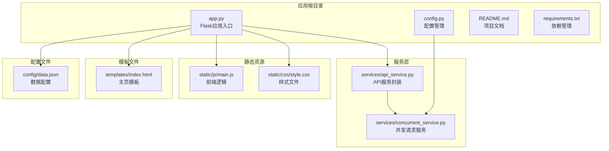
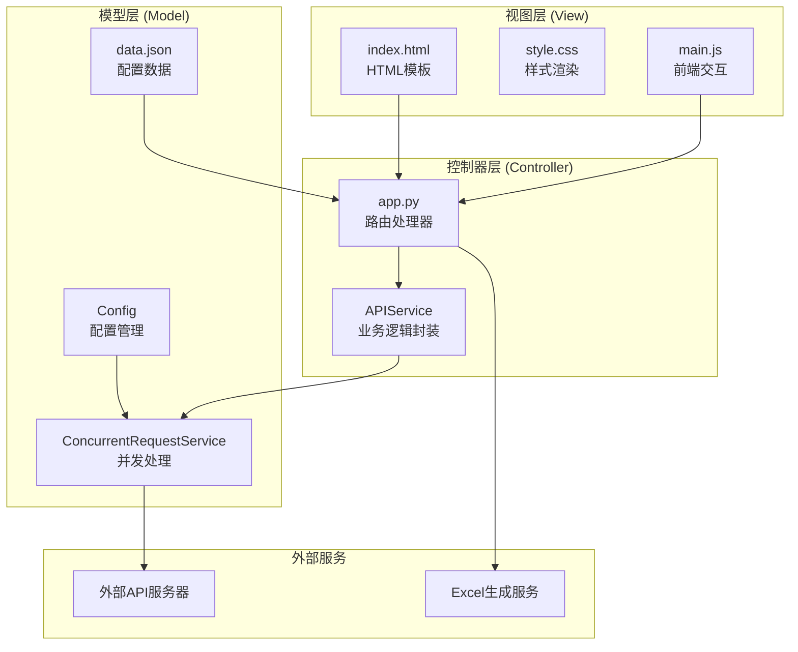
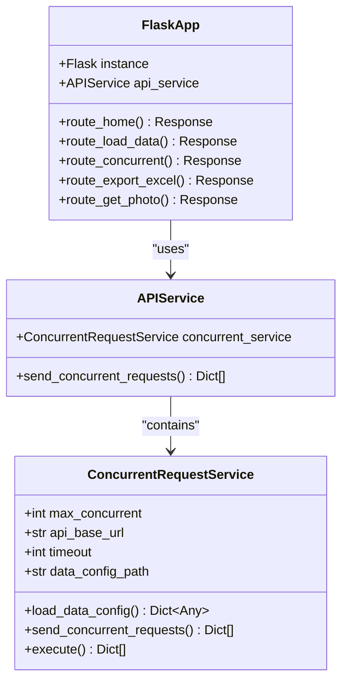
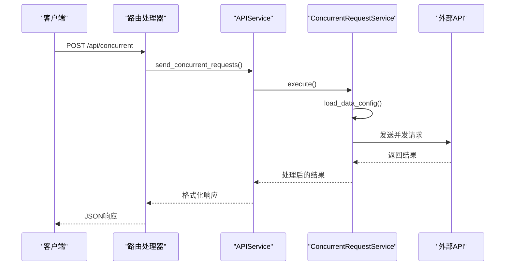
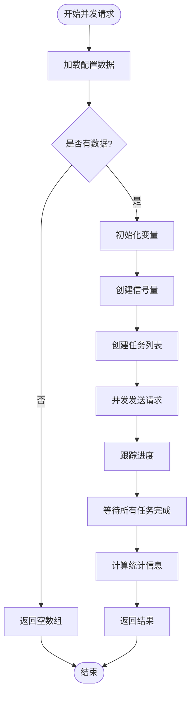
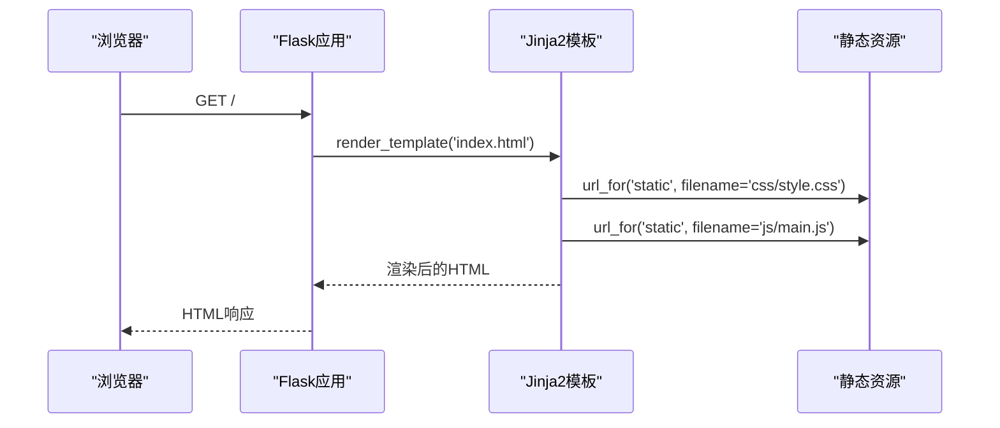
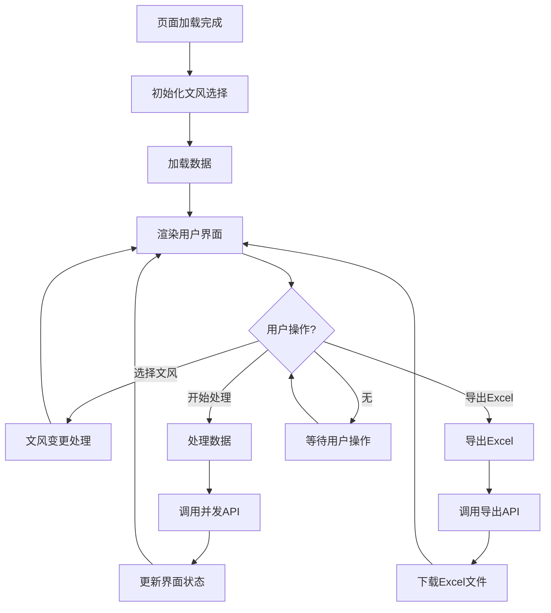
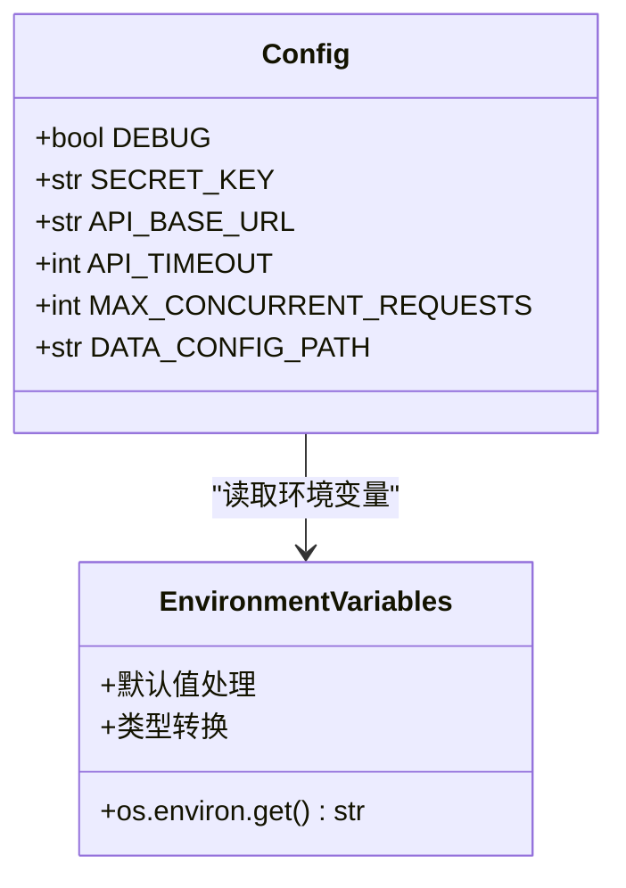
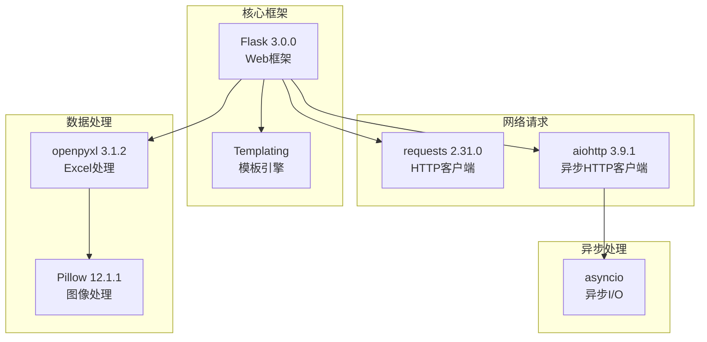
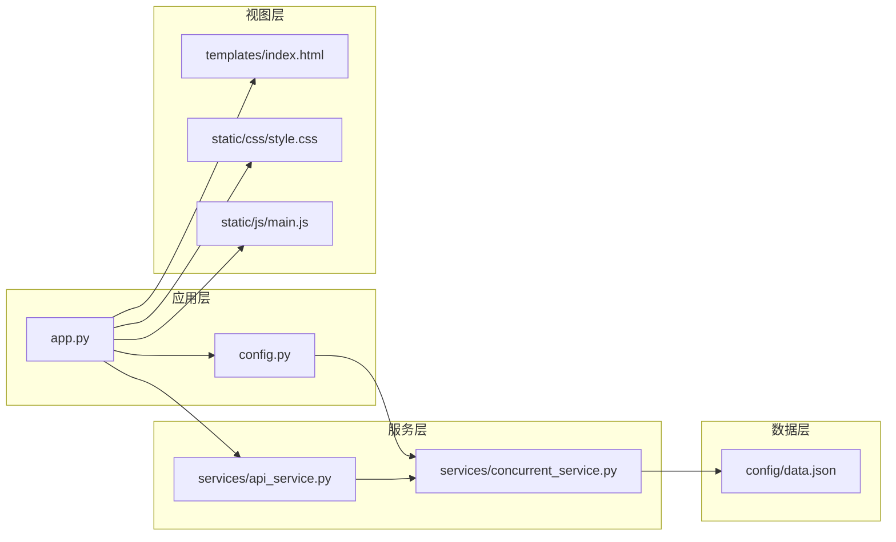

# Flask应用架构

<cite>
**本文档引用的文件**
- [app.py](file://app.py)
- [config.py](file://config.py)
- [README.md](file://README.md)
- [requirements.txt](file://requirements.txt)
- [config/data.json](file://config/data.json)
- [services/api_service.py](file://services/api_service.py)
- [services/concurrent_service.py](file://services/concurrent_service.py)
- [templates/index.html](file://templates/index.html)
- [static/css/style.css](file://static/css/style.css)
- [static/js/main.js](file://static/js/main.js)
</cite>

## 目录
1. [简介](#简介)
2. [项目结构](#项目结构)
3. [核心组件](#核心组件)
4. [架构概览](#架构概览)
5. [详细组件分析](#详细组件分析)
6. [依赖分析](#依赖分析)
7. [性能考虑](#性能考虑)
8. [故障排除指南](#故障排除指南)
9. [结论](#结论)
10. [附录](#附录)

## 简介

这是一个基于Flask框架开发的AI文案评测对比系统。该应用允许用户批量处理图片文案，支持并发调用外部API生成文案，并可将结果导出为Excel文件。系统采用MVC架构模式，通过清晰的分层设计实现了良好的可维护性和扩展性。

## 项目结构

该项目采用标准的Flask项目结构，按照功能模块进行组织：

**图表来源**
- [app.py:1-139](file://app.py#L1-L139)
- [config.py:1-12](file://config.py#L1-L12)
- [services/api_service.py:1-14](file://services/api_service.py#L1-L14)
- [services/concurrent_service.py:1-162](file://services/concurrent_service.py#L1-L162)

**章节来源**
- [app.py:1-139](file://app.py#L1-L139)
- [config.py:1-12](file://config.py#L1-L12)
- [README.md:24-44](file://README.md#L24-L44)

## 核心组件

### Flask应用实例初始化

应用使用Flask的核心功能构建Web服务，通过装饰器模式注册路由处理器：

- **应用实例创建**：使用Flask构造函数创建应用实例
- **服务层集成**：初始化APIService实例供路由处理器使用
- **配置管理**：通过Config类管理环境变量和常量

### 路由定义策略

应用采用RESTful API设计原则，为不同功能模块定义了专门的路由：

- **主页路由**：`/` - 渲染index.html模板
- **数据加载路由**：`/api/load-data` - GET请求，加载本地配置数据
- **并发请求路由**：`/api/concurrent` - POST请求，执行并发API调用
- **Excel导出路由**：`/api/export-excel` - POST请求，生成并下载Excel文件
- **图片代理路由**：`/api/photo/<path:filename>` - GET请求，解决本地文件访问限制

### 中间件配置

应用未显式配置传统意义上的中间件，但通过以下方式实现了类似功能：

- **异常处理**：统一的try-catch块处理路由异常
- **响应格式化**：统一的JSON响应格式
- **静态文件服务**：Flask内置的静态文件路由

**章节来源**
- [app.py:12-13](file://app.py#L12-L13)
- [app.py:15-17](file://app.py#L15-L17)
- [app.py:29-41](file://app.py#L29-L41)
- [app.py:43-61](file://app.py#L43-L61)
- [app.py:63-135](file://app.py#L63-L135)

## 架构概览

应用采用经典的MVC架构模式，清晰分离了关注点：

**图表来源**
- [app.py:1-139](file://app.py#L1-L139)
- [services/api_service.py:4-14](file://services/api_service.py#L4-L14)
- [services/concurrent_service.py:8-162](file://services/concurrent_service.py#L8-L162)
- [config.py:3-12](file://config.py#L3-L12)

### MVC架构实现详解

**视图层职责**：
- 渲染主页模板，提供用户界面
- 处理用户交互事件
- 展示数据和状态信息

**控制器层职责**：
- 处理HTTP请求和响应
- 调用服务层执行业务逻辑
- 管理数据流转和状态转换

**模型层职责**：
- 管理配置数据和业务规则
- 执行核心算法和数据处理
- 与外部服务进行通信

## 详细组件分析

### 应用入口组件分析

#### Flask应用实例设计

应用入口文件采用了简洁而有效的设计模式：

**图表来源**
- [app.py:12-13](file://app.py#L12-L13)
- [services/api_service.py:4-14](file://services/api_service.py#L4-L14)
- [services/concurrent_service.py:8-162](file://services/concurrent_service.py#L8-L162)

#### 路由端点设计理念

**主页路由 (`/`) 设计理念**：
- 简洁的模板渲染逻辑
- 提供完整的用户界面入口
- 支持静态资源的自动加载

**数据加载路由 (`/api/load-data`) 设计理念**：
- 统一的数据访问接口
- 标准化的响应格式
- 错误处理和降级策略

**并发请求路由 (`/api/concurrent`) 设计理念**：
- 异步并发处理提升性能
- 进度跟踪和状态反馈
- 参数验证和错误处理

**Excel导出路由 (`/api/export-excel`) 设计理念**：
- 流式文件生成避免内存溢出
- 图片嵌入和格式化处理
- 下载响应和文件命名

**章节来源**
- [app.py:15-17](file://app.py#L15-L17)
- [app.py:29-41](file://app.py#L29-L41)
- [app.py:43-61](file://app.py#L43-L61)
- [app.py:63-135](file://app.py#L63-L135)

### 服务层组件分析

#### APIService设计模式

APIService采用了适配器模式，为上层控制器提供简化的接口：

**图表来源**
- [services/api_service.py:8-13](file://services/api_service.py#L8-L13)
- [services/concurrent_service.py:118-158](file://services/concurrent_service.py#L118-L158)

#### ConcurrentRequestService并发处理机制

该服务实现了高效的异步并发处理：

**图表来源**
- [services/concurrent_service.py:118-158](file://services/concurrent_service.py#L118-L158)
- [services/concurrent_service.py:43-112](file://services/concurrent_service.py#L43-L112)

**章节来源**
- [services/api_service.py:1-14](file://services/api_service.py#L1-L14)
- [services/concurrent_service.py:1-162](file://services/concurrent_service.py#L1-L162)

### 前端组件分析

#### 模板渲染机制

应用使用Jinja2模板引擎进行服务端渲染：

**图表来源**
- [templates/index.html:7](file://templates/index.html#L7)
- [templates/index.html:37](file://templates/index.html#L37)

#### 前端JavaScript交互逻辑

前端使用现代JavaScript实现动态交互：

**图表来源**
- [static/js/main.js:262-266](file://static/js/main.js#L262-L266)
- [static/js/main.js:87-136](file://static/js/main.js#L87-L136)
- [static/js/main.js:220-260](file://static/js/main.js#L220-L260)

**章节来源**
- [templates/index.html:1-40](file://templates/index.html#L1-L40)
- [static/js/main.js:1-266](file://static/js/main.js#L1-L266)

### 配置管理系统

#### 配置类设计

Config类提供了集中式的配置管理：

**图表来源**
- [config.py:3-12](file://config.py#L3-L12)

#### 数据配置文件结构

数据配置文件采用JSON格式，支持灵活的数据定义：

| 字段名 | 类型 | 描述 | 示例值 |
|--------|------|------|--------|
| style | Array[string] | 支持的文风选项 | `["文艺","网红","叙事","自定义"]` |
| default_style | string | 默认文风 | `"文艺"` |
| system_prompt | string | 系统提示词 | `"你是一个专业的文案生成助手..."` |
| data | Array[object] | 数据项列表 | 见下方示例 |

**章节来源**
- [config.py:1-12](file://config.py#L1-L12)
- [config/data.json:1-32](file://config/data.json#L1-L32)

## 依赖分析

### 外部依赖关系

应用使用了现代化的Python Web开发技术栈：

**图表来源**
- [requirements.txt:1-6](file://requirements.txt#L1-L6)

### 内部依赖关系

应用内部模块之间的依赖关系清晰明确：

**图表来源**
- [app.py:10](file://app.py#L10)
- [services/api_service.py:2](file://services/api_service.py#L2)
- [services/concurrent_service.py:6](file://services/concurrent_service.py#L6)

**章节来源**
- [requirements.txt:1-6](file://requirements.txt#L1-L6)
- [app.py:10](file://app.py#L10)

## 性能考虑

### 并发处理优化

应用通过异步并发请求显著提升了处理效率：

- **信号量控制**：使用`asyncio.Semaphore`限制最大并发数
- **异步I/O**：避免阻塞式网络请求
- **进度跟踪**：实时显示处理进度和统计信息
- **内存管理**：流式生成Excel文件避免内存溢出

### 缓存和优化策略

- **静态资源缓存**：浏览器自动缓存CSS和JS文件
- **图片代理缓存**：减少重复的文件读取操作
- **配置文件缓存**：在单次请求中复用配置数据

### 错误处理和容错

- **异常捕获**：统一的try-catch块处理各种异常
- **降级策略**：配置文件加载失败时提供默认值
- **超时处理**：合理的超时设置避免长时间阻塞
- **资源清理**：及时释放文件句柄和网络连接

## 故障排除指南

### 常见问题诊断

**图片无法显示问题**：
- 检查浏览器安全限制导致的本地文件访问问题
- 验证图片路径在配置文件中的正确性
- 确认Flask服务正常运行

**Excel导出问题**：
- 确认已安装Pillow库支持图片处理
- 检查图片格式是否受支持
- 使用Excel或WPS等桌面软件打开文件

**并发请求超时问题**：
- 调整API_TIMEOUT环境变量增加超时时间
- 减少MAX_CONCURRENT_REQUESTS并发数
- 检查外部API服务的可用性

### 调试技巧

- **日志输出**：利用print语句输出调试信息
- **状态码检查**：验证HTTP响应状态码
- **数据验证**：检查请求和响应数据格式
- **性能监控**：观察处理时间和内存使用情况

**章节来源**
- [README.md:314-348](file://README.md#L314-L348)
- [README.md:353-373](file://README.md#L353-L373)

## 结论

该Flask应用展现了优秀的架构设计和实现质量。通过清晰的MVC分层、合理的并发处理机制和完善的错误处理策略，构建了一个功能完整、性能优良的AI文案处理系统。

### 主要优势

- **架构清晰**：MVC模式实现了良好的关注点分离
- **性能优秀**：异步并发处理显著提升了吞吐量
- **用户体验好**：实时进度反馈和友好的界面设计
- **可扩展性强**：模块化设计便于功能扩展和维护

### 改进建议

- **添加单元测试**：为关键业务逻辑添加自动化测试
- **增强日志系统**：使用结构化日志替代简单的print语句
- **添加API文档**：生成OpenAPI规范文档
- **性能监控**：集成性能指标收集和监控

## 附录

### 路由设计最佳实践

1. **RESTful设计原则**：使用HTTP方法表示操作语义
2. **版本控制**：在URL中包含API版本号
3. **错误处理**：统一的错误响应格式和状态码
4. **参数验证**：严格的输入参数验证和过滤
5. **安全考虑**：CSRF保护和输入净化

### 扩展指南

**添加新路由的步骤**：
1. 在app.py中定义新的路由装饰器
2. 实现对应的处理函数
3. 添加适当的错误处理
4. 更新前端调用逻辑
5. 编写相应的测试用例

**扩展现有功能的方法**：
1. 在service层添加新的业务逻辑
2. 更新数据模型和数据库结构
3. 修改模板和样式文件
4. 添加国际化支持
5. 实现缓存机制

**章节来源**
- [README.md:374-393](file://README.md#L374-L393)