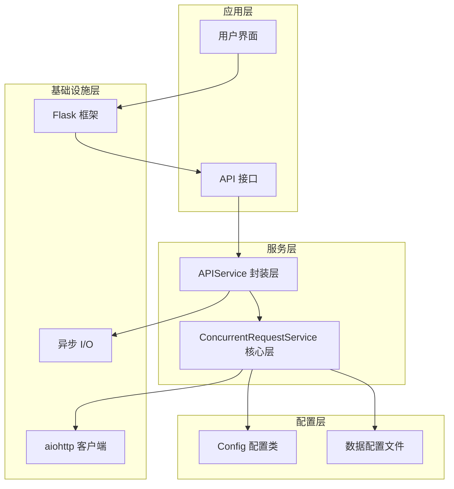
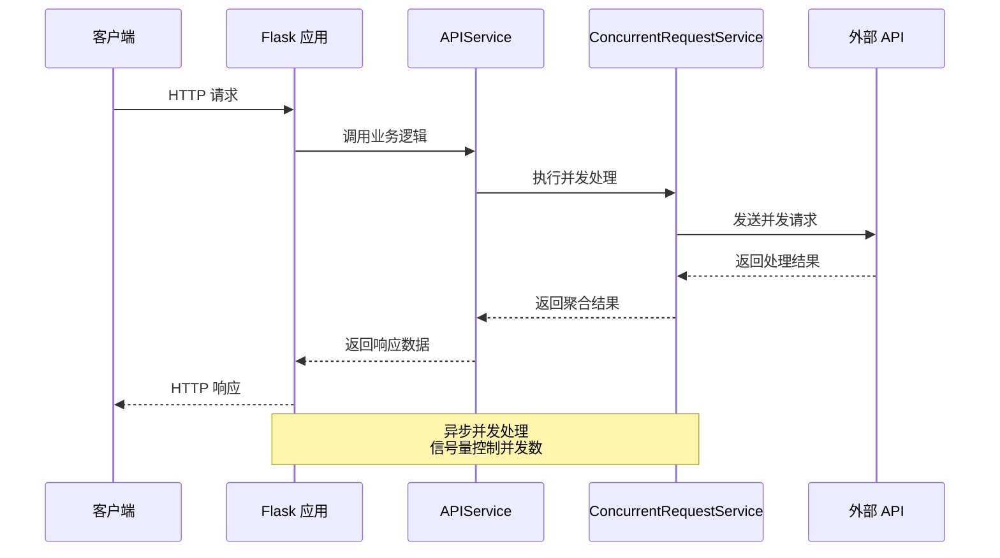
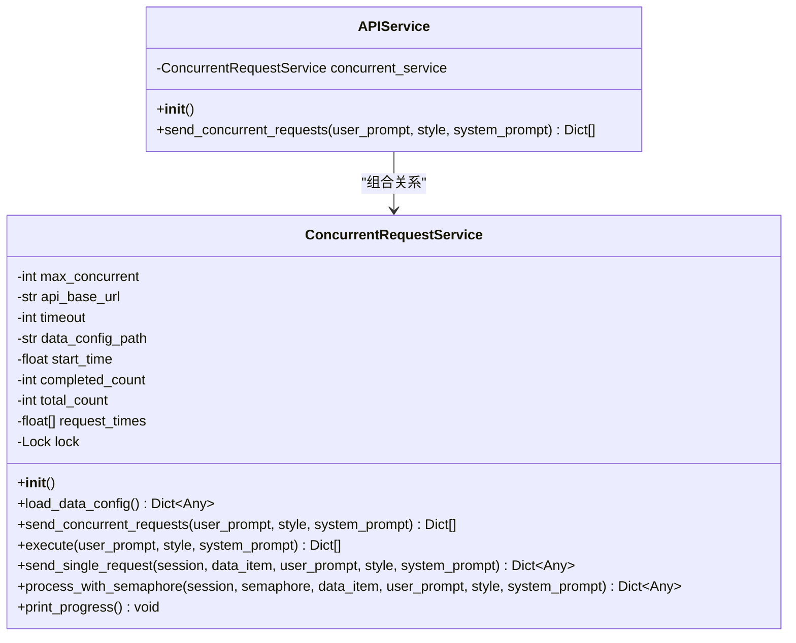
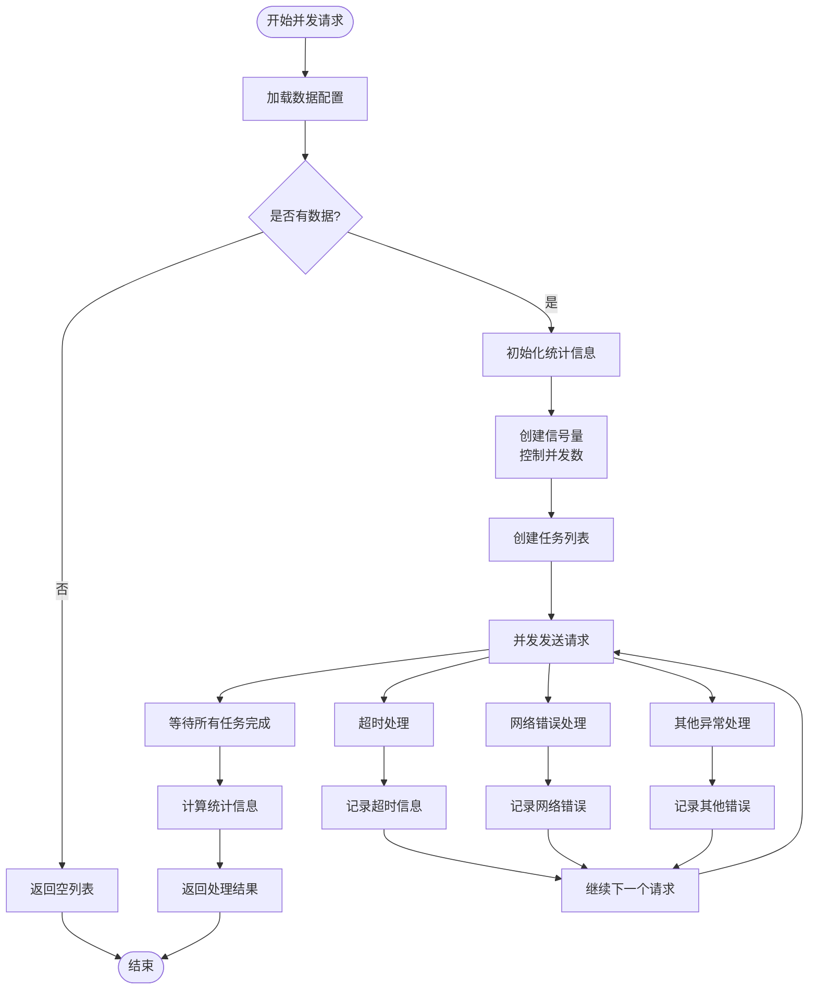
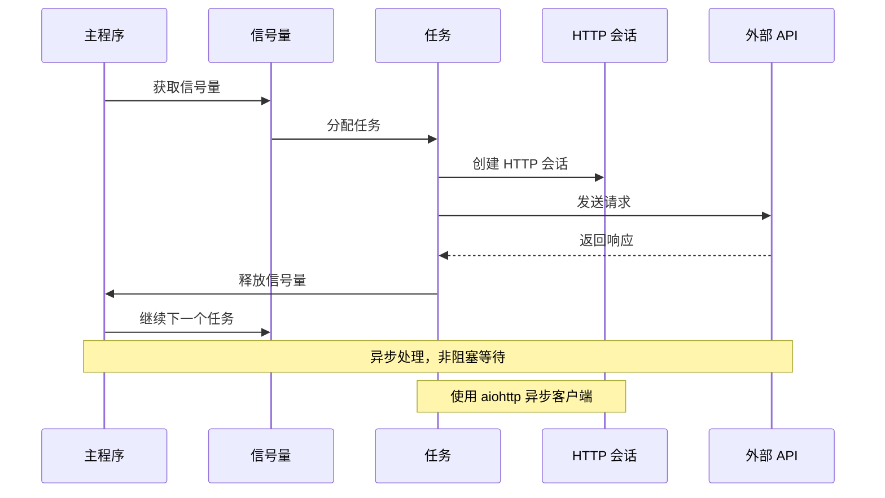
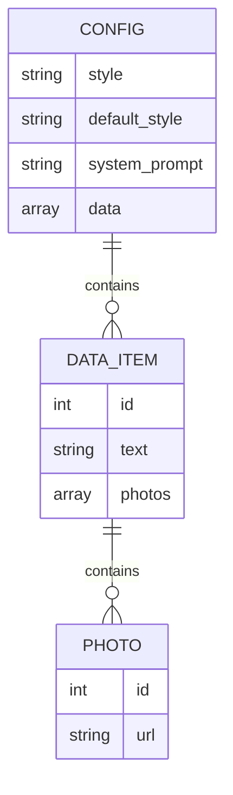
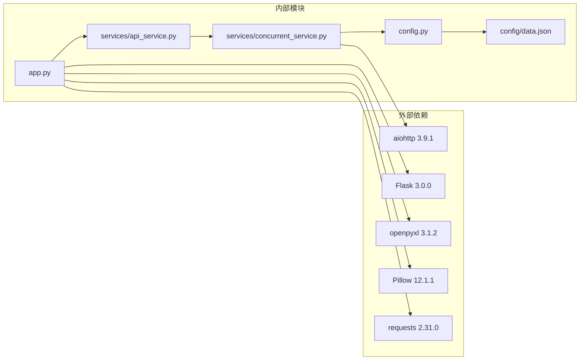

# 后端架构设计

<cite>
**本文档引用的文件**
- [app.py](file://app.py)
- [services/api_service.py](file://services/api_service.py)
- [services/concurrent_service.py](file://services/concurrent_service.py)
- [config.py](file://config.py)
- [config/data.json](file://config/data.json)
- [templates/index.html](file://templates/index.html)
- [requirements.txt](file://requirements.txt)
- [README.md](file://README.md)
</cite>

## 目录
1. [简介](#简介)
2. [项目结构](#项目结构)
3. [核心组件](#核心组件)
4. [架构概览](#架构概览)
5. [详细组件分析](#详细组件分析)
6. [依赖关系分析](#依赖关系分析)
7. [性能考虑](#性能考虑)
8. [故障排除指南](#故障排除指南)
9. [结论](#结论)

## 简介

这是一个基于 Flask 的 Web 应用项目，专门用于批量处理图片文案，支持并发调用外部 API 生成文案，并可将结果导出为 Excel 文件。该系统采用分层架构设计，通过服务层实现业务逻辑与 Web 框架的解耦，提供了完整的前后端交互解决方案。

## 项目结构

该项目采用清晰的分层架构，主要包含以下层次：

**图表来源**
- [app.py:12-139](file://app.py#L12-L139)
- [services/api_service.py:4-14](file://services/api_service.py#L4-L14)
- [services/concurrent_service.py:8-162](file://services/concurrent_service.py#L8-L162)
- [config.py:3-12](file://config.py#L3-L12)

**章节来源**
- [README.md:24-44](file://README.md#L24-L44)
- [app.py:12-139](file://app.py#L12-L139)

## 核心组件

### Flask 应用入口

应用入口模块 `app.py` 是整个系统的核心控制器，负责路由管理和业务逻辑组织。它创建了 Flask 应用实例，并初始化了 APIService 服务对象。

### 服务层架构

服务层采用双层设计模式：
- **APIService**: 作为业务逻辑的封装层，提供统一的接口给路由层调用
- **ConcurrentRequestService**: 作为核心业务逻辑层，实现具体的并发处理算法

### 配置管理

配置层通过 `config.py` 提供集中化的配置管理，支持环境变量覆盖，默认值设置和类型转换。

**章节来源**
- [app.py:10-13](file://app.py#L10-L13)
- [services/api_service.py:4-14](file://services/api_service.py#L4-L14)
- [services/concurrent_service.py:8-20](file://services/concurrent_service.py#L8-L20)
- [config.py:3-12](file://config.py#L3-L12)

## 架构概览

系统采用经典的三层架构模式，实现了业务逻辑与表现层的完全分离：

**图表来源**
- [app.py:29-61](file://app.py#L29-L61)
- [services/api_service.py:8-13](file://services/api_service.py#L8-L13)
- [services/concurrent_service.py:118-158](file://services/concurrent_service.py#L118-L158)

### 路由层设计

路由层采用 Flask 的装饰器模式，每个路由函数负责单一职责：

| 路由路径 | 方法 | 功能描述 | 返回数据 |
|---------|------|----------|----------|
| `/` | GET | 主页面渲染 | HTML 模板 |
| `/api/photo/<path:filename>` | GET | 图片代理服务 | 图片文件流 |
| `/api/load-data` | GET | 加载本地配置数据 | JSON 数据 |
| `/api/concurrent` | POST | 并发请求处理 | 处理结果 |
| `/api/export-excel` | POST | Excel 导出服务 | Excel 文件流 |

**章节来源**
- [app.py:15-139](file://app.py#L15-L139)

## 详细组件分析

### APIService 组件分析

APIService 作为服务层的封装器，实现了业务逻辑与 Web 框架的解耦：

**图表来源**
- [services/api_service.py:4-14](file://services/api_service.py#L4-L14)
- [services/concurrent_service.py:8-162](file://services/concurrent_service.py#L8-L162)

#### 设计理念

APIService 的设计遵循了单一职责原则，主要职责包括：
- 作为业务逻辑的门面模式实现
- 统一对外接口，隐藏内部实现细节
- 提供一致的错误处理机制

**章节来源**
- [services/api_service.py:4-14](file://services/api_service.py#L4-L14)

### ConcurrentRequestService 组件分析

ConcurrentRequestService 是系统的核心业务逻辑实现，采用了异步并发处理模式：

**图表来源**
- [services/concurrent_service.py:118-158](file://services/concurrent_service.py#L118-L158)
- [services/concurrent_service.py:43-112](file://services/concurrent_service.py#L43-L112)

#### 并发控制机制

系统使用信号量（Semaphore）实现精确的并发控制：

| 参数 | 默认值 | 作用 |
|------|--------|------|
| `MAX_CONCURRENT_REQUESTS` | 5 | 控制最大并发请求数 |
| `API_TIMEOUT` | 30 秒 | 设置请求超时时间 |
| `API_BASE_URL` | `http://example.com/api` | 外部 API 基础地址 |

**章节来源**
- [services/concurrent_service.py:8-20](file://services/concurrent_service.py#L8-L20)
- [config.py:7-9](file://config.py#L7-L9)

### 异步并发处理架构

系统实现了完整的异步并发处理流程，包括任务调度、错误处理和进度跟踪：

**图表来源**
- [services/concurrent_service.py:114-116](file://services/concurrent_service.py#L114-L116)
- [services/concurrent_service.py:140-146](file://services/concurrent_service.py#L140-L146)

#### 错误处理机制

系统实现了多层次的错误处理策略：

1. **超时错误处理**: 捕获 `asyncio.TimeoutError`，记录超时信息
2. **网络错误处理**: 捕获网络异常，提供友好的错误信息
3. **业务逻辑错误**: 捕获通用异常，确保系统稳定性
4. **配置文件错误**: 处理配置文件加载失败的情况

**章节来源**
- [services/concurrent_service.py:79-112](file://services/concurrent_service.py#L79-L112)

### 数据配置管理

系统通过 JSON 配置文件提供灵活的数据管理能力：

**图表来源**
- [config/data.json:1-32](file://config/data.json#L1-L32)

**章节来源**
- [config/data.json:1-32](file://config/data.json#L1-L32)

## 依赖关系分析

系统采用松耦合的设计模式，各组件之间的依赖关系清晰明确：

**图表来源**
- [requirements.txt:1-6](file://requirements.txt#L1-L6)
- [app.py:10-13](file://app.py#L10-L13)
- [services/api_service.py:2](file://services/api_service.py#L2)
- [services/concurrent_service.py:6](file://services/concurrent_service.py#L6)

### 组件耦合度分析

- **路由层与服务层**: 通过 APIService 解耦，降低耦合度
- **服务层内部**: APIService 与 ConcurrentRequestService 采用组合关系
- **配置层**: 通过 Config 类集中管理，便于维护
- **外部依赖**: 明确的版本约束，避免兼容性问题

**章节来源**
- [requirements.txt:1-6](file://requirements.txt#L1-L6)
- [app.py:10-13](file://app.py#L10-L13)

## 性能考虑

### 并发性能优化

系统通过以下机制实现高性能并发处理：

1. **信号量控制**: 限制最大并发请求数，避免资源耗尽
2. **异步 I/O**: 使用 aiohttp 实现非阻塞网络请求
3. **内存管理**: 及时释放 HTTP 会话和临时对象
4. **进度统计**: 实时监控处理进度，便于性能调优

### 内存使用优化

- **流式处理**: Excel 导出使用 BytesIO 流式写入
- **及时释放**: 异步锁和会话对象及时释放
- **错误恢复**: 异常处理不影响整体性能

### 网络性能优化

- **连接复用**: 使用 aiohttp.ClientSession 复用连接
- **超时控制**: 合理设置超时时间，避免长时间阻塞
- **错误重试**: 对于可恢复的网络错误提供重试机制

## 故障排除指南

### 常见问题及解决方案

| 问题类型 | 症状 | 可能原因 | 解决方案 |
|----------|------|----------|----------|
| 并发超时 | 请求超时错误 | `API_TIMEOUT` 设置过小 | 增加 `API_TIMEOUT` 环境变量 |
| 并发过多 | 系统响应缓慢 | `MAX_CONCURRENT_REQUESTS` 设置过大 | 减少并发数或增加服务器资源 |
| 图片显示问题 | 图片无法显示 | 浏览器本地文件访问限制 | 使用图片代理服务 |
| Excel 导出失败 | Excel 文件损坏 | 缺少 Pillow 依赖 | 安装 Pillow 库 |

### 环境变量配置

系统支持通过环境变量进行灵活配置：

| 环境变量 | 默认值 | 作用 |
|----------|--------|------|
| `FLASK_DEBUG` | `True` | Flask 调试模式开关 |
| `SECRET_KEY` | `your-secret-key-here` | Flask 密钥 |
| `API_BASE_URL` | `http://example.com/api` | 外部 API 基础地址 |
| `API_TIMEOUT` | `30` | API 请求超时时间（秒） |
| `MAX_CONCURRENT_REQUESTS` | `5` | 最大并发请求数 |
| `DATA_CONFIG_PATH` | `config/data.json` | 数据配置文件路径 |

**章节来源**
- [config.py:3-12](file://config.py#L3-L12)
- [README.md:78-88](file://README.md#L78-L88)

### 日志和调试

系统提供了完善的日志输出机制：

- **进度跟踪**: 实时显示处理进度和统计信息
- **错误日志**: 详细的错误信息输出
- **性能监控**: 请求耗时统计和平均值计算

**章节来源**
- [services/concurrent_service.py:30-42](file://services/concurrent_service.py#L30-L42)
- [services/concurrent_service.py:151-156](file://services/concurrent_service.py#L151-L156)

## 结论

该 Flask 应用项目展现了优秀的软件架构设计，通过分层架构实现了业务逻辑与表现层的完全解耦。系统的主要优势包括：

1. **清晰的架构层次**: 路由层、服务层、配置层职责分明
2. **高效的并发处理**: 基于异步 I/O 的并发请求处理机制
3. **灵活的配置管理**: 支持环境变量覆盖和默认值设置
4. **完善的错误处理**: 多层次的异常捕获和恢复机制
5. **良好的扩展性**: 模块化设计便于功能扩展和维护

该架构设计为类似的企业级应用提供了优秀的参考模板，特别是在需要处理大量并发请求和复杂业务逻辑的场景中具有很高的实用价值。