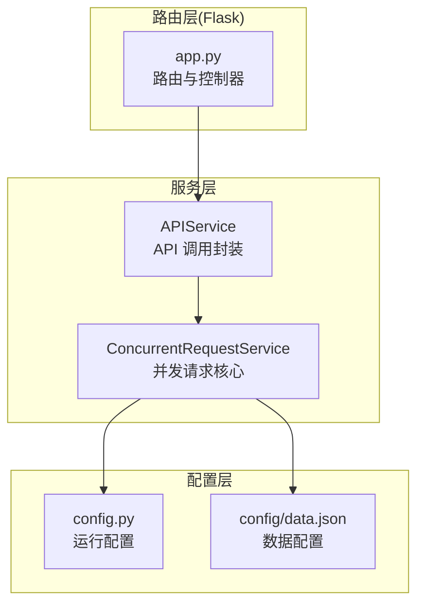
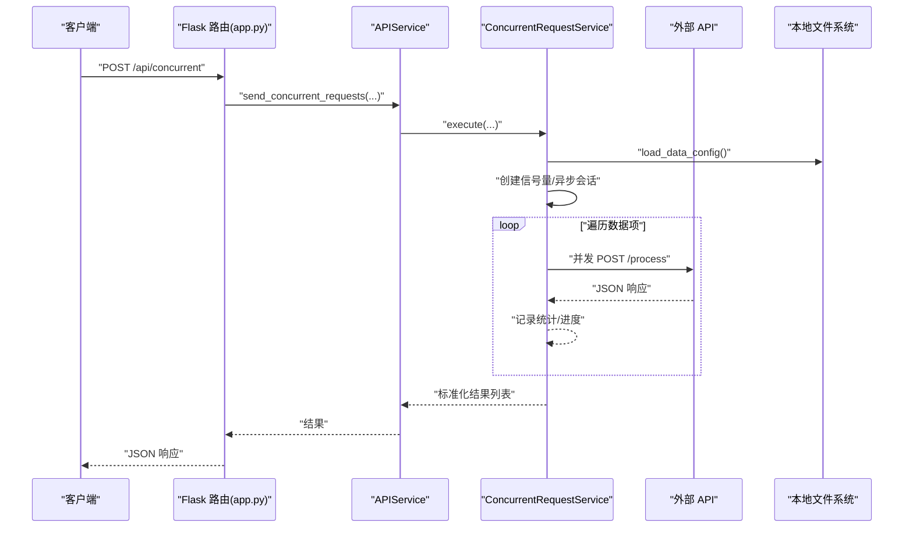
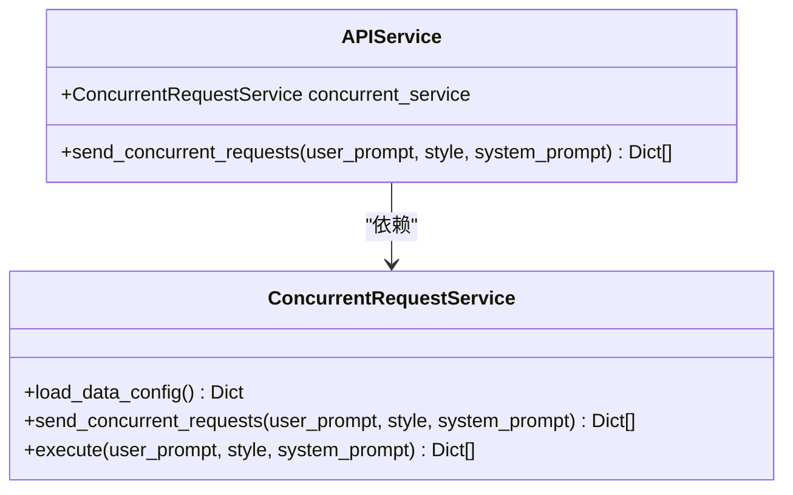
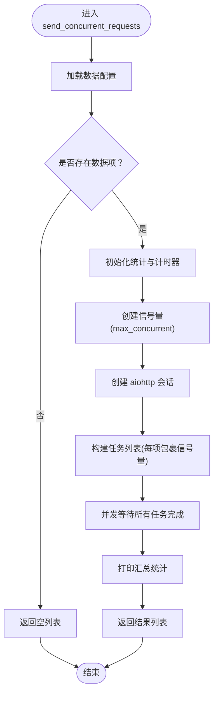
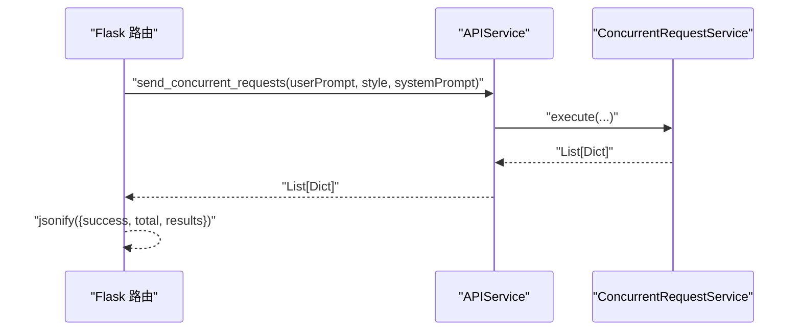
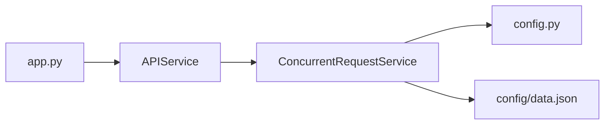

# 服务层设计

<cite>
**本文引用的文件**
- [services/api_service.py](file://services/api_service.py)
- [services/concurrent_service.py](file://services/concurrent_service.py)
- [app.py](file://app.py)
- [config.py](file://config.py)
- [config/data.json](file://config/data.json)
- [README.md](file://README.md)
- [requirements.txt](file://requirements.txt)
</cite>

## 目录
1. [引言](#引言)
2. [项目结构](#项目结构)
3. [核心组件](#核心组件)
4. [架构总览](#架构总览)
5. [详细组件分析](#详细组件分析)
6. [依赖分析](#依赖分析)
7. [性能考量](#性能考量)
8. [故障排查指南](#故障排查指南)
9. [结论](#结论)
10. [附录](#附录)

## 引言
本文件聚焦于服务层设计，围绕 APIService 与 ConcurrentRequestService 两大核心服务展开，系统阐述其设计理念、职责边界、并发处理机制与错误处理策略；同时说明服务层与 Flask 路由层的解耦方式，如何通过服务抽象提升业务逻辑的可重用性与可测试性，并给出扩展与定制的最佳实践建议。读者无需深入底层实现细节即可理解整体架构与使用方式。

## 项目结构
项目采用“路由层 + 服务层”的分层架构，服务层位于 services/ 目录，负责封装业务逻辑与外部交互；路由层位于 app.py，负责 HTTP 请求接入与响应输出；配置层位于 config.py 与 config/data.json，集中管理运行参数与数据配置。

图表来源
- [app.py:1-139](file://app.py#L1-L139)
- [services/api_service.py:1-14](file://services/api_service.py#L1-L14)
- [services/concurrent_service.py:1-162](file://services/concurrent_service.py#L1-L162)
- [config.py:1-12](file://config.py#L1-L12)
- [config/data.json:1-32](file://config/data.json#L1-L32)

章节来源
- [README.md:24-44](file://README.md#L24-L44)
- [app.py:1-139](file://app.py#L1-L139)
- [services/api_service.py:1-14](file://services/api_service.py#L1-L14)
- [services/concurrent_service.py:1-162](file://services/concurrent_service.py#L1-L162)
- [config.py:1-12](file://config.py#L1-L12)
- [config/data.json:1-32](file://config/data.json#L1-L32)

## 核心组件
- APIService：作为服务封装器，对外暴露统一的业务接口，屏蔽内部并发实现细节，简化上层调用复杂度。其职责是接收业务参数，委托 ConcurrentRequestService 执行并发请求，并返回标准化的结果集合。
- ConcurrentRequestService：并发请求的核心实现，负责加载数据配置、创建异步会话、使用信号量控制并发、逐条发送请求、收集结果与统计信息，并提供进度打印与错误处理。

章节来源
- [services/api_service.py:4-14](file://services/api_service.py#L4-L14)
- [services/concurrent_service.py:8-162](file://services/concurrent_service.py#L8-L162)

## 架构总览
服务层与路由层通过清晰的接口解耦：Flask 路由仅负责参数解析与响应封装，业务逻辑全部下沉至服务层；服务层内部再按职责拆分为“封装层”与“核心层”，形成“路由层 -> 封装层 -> 核心层 -> 配置层”的调用链路。

图表来源
- [app.py:43-61](file://app.py#L43-L61)
- [services/api_service.py:8-13](file://services/api_service.py#L8-L13)
- [services/concurrent_service.py:118-158](file://services/concurrent_service.py#L118-L158)

## 详细组件分析

### APIService 设计与职责
- 角色定位：服务封装器，向上提供简洁统一的业务入口，向下隐藏并发细节。
- 关键行为：
  - 维护 ConcurrentRequestService 实例，负责执行并发请求。
  - 对外暴露 send_concurrent_requests 方法，接收用户提示词、文风、系统提示词等参数，直接委派给并发服务执行。
- 设计优势：
  - 上层调用者无需关心并发控制、异步会话、信号量等技术细节。
  - 便于替换或扩展并发实现，不影响上层调用方。

图表来源
- [services/api_service.py:4-14](file://services/api_service.py#L4-L14)
- [services/concurrent_service.py:8-162](file://services/concurrent_service.py#L8-L162)

章节来源
- [services/api_service.py:4-14](file://services/api_service.py#L4-L14)

### ConcurrentRequestService 并发处理机制
- 配置来源：从 config.py 读取 API 基础地址、超时时间、最大并发数与数据配置文件路径。
- 数据加载：从 config/data.json 加载数据项数组与默认文风、系统提示词等配置；异常时回退为默认空配置。
- 并发控制：
  - 使用 asyncio.Semaphore 控制最大并发数，避免对下游 API 造成过载。
  - 使用 aiohttp.ClientSession 维护连接池，减少握手开销。
- 请求执行：
  - 对每个数据项构造请求体，注入 user_prompt、style、system_prompt 等动态参数。
  - 使用 aiohttp.ClientTimeout 控制单次请求超时。
- 错误处理：
  - 显式捕获 asyncio.TimeoutError，返回超时错误信息。
  - 捕获通用异常，返回错误详情。
- 进度与统计：
  - 使用 asyncio.Lock 保证并发安全地更新完成计数、请求耗时列表。
  - 定期打印进度摘要，包含总请求数、已完成、剩余、平均耗时、总耗时等。
- 结果标准化：
  - 统一返回包含 data_id、success、status/error、result(含 text/photos/generated_text)、request_time 的结构，便于上层消费与导出。

图表来源
- [services/concurrent_service.py:118-158](file://services/concurrent_service.py#L118-L158)

章节来源
- [services/concurrent_service.py:8-162](file://services/concurrent_service.py#L8-L162)
- [config.py:3-12](file://config.py#L3-L12)
- [config/data.json:1-32](file://config/data.json#L1-L32)

### 服务层与 Flask 路由层的解耦设计
- 解耦方式：
  - 路由层仅负责 HTTP 参数解析、异常兜底与响应封装，业务逻辑全部下沉至服务层。
  - APIService 作为统一入口，既可被路由层直接调用，也可在其他场景（如命令行工具、定时任务）复用。
- 可重用性与可测试性：
  - 服务层无框架绑定，易于单元测试与集成测试。
  - 通过依赖注入或实例化方式，可在不同上下文中复用同一套业务逻辑。
- 典型调用链：
  - /api/concurrent -> APIService.send_concurrent_requests -> ConcurrentRequestService.execute -> 外部 API。

图表来源
- [app.py:43-61](file://app.py#L43-L61)
- [services/api_service.py:8-13](file://services/api_service.py#L8-L13)
- [services/concurrent_service.py:160-161](file://services/concurrent_service.py#L160-L161)

章节来源
- [app.py:1-139](file://app.py#L1-L139)
- [services/api_service.py:4-14](file://services/api_service.py#L4-L14)
- [services/concurrent_service.py:160-161](file://services/concurrent_service.py#L160-L161)

## 依赖分析
- 运行时依赖：Flask、aiohttp、openpyxl、Pillow、requests（用于非异步场景或兼容性需求）。
- 内部依赖关系：
  - APIService 依赖 ConcurrentRequestService。
  - ConcurrentRequestService 依赖 config.py 与 config/data.json。
  - 路由层 app.py 依赖 APIService。

图表来源
- [app.py:10-13](file://app.py#L10-L13)
- [services/api_service.py:2-6](file://services/api_service.py#L2-L6)
- [services/concurrent_service.py:6-13](file://services/concurrent_service.py#L6-L13)
- [config.py:1-12](file://config.py#L1-L12)
- [config/data.json:1-32](file://config/data.json#L1-L32)

章节来源
- [requirements.txt:1-6](file://requirements.txt#L1-L6)
- [app.py:10-13](file://app.py#L10-L13)
- [services/api_service.py:2-6](file://services/api_service.py#L2-L6)
- [services/concurrent_service.py:6-13](file://services/concurrent_service.py#L6-L13)

## 性能考量
- 并发控制：通过信号量限制最大并发数，避免对下游 API 与本地资源造成压力；可根据网络与目标服务能力调整配置。
- 超时管理：为单次请求设置合理超时时间，防止长时间阻塞导致整体吞吐下降。
- 连接复用：使用 aiohttp.ClientSession 维护连接池，降低握手成本。
- 统计与可观测性：实时打印进度与耗时统计，便于快速定位瓶颈与异常。
- I/O 密集优化：将 I/O 密集型请求改为异步并发，显著提升吞吐。

章节来源
- [services/concurrent_service.py:10-13](file://services/concurrent_service.py#L10-L13)
- [services/concurrent_service.py:138-146](file://services/concurrent_service.py#L138-L146)
- [services/concurrent_service.py:30-41](file://services/concurrent_service.py#L30-L41)

## 故障排查指南
- 并发请求超时：
  - 提升 API_TIMEOUT，或降低 MAX_CONCURRENT_REQUESTS。
  - 检查外部 API 服务可用性与网络连通性。
- 配置文件加载失败：
  - 确认 DATA_CONFIG_PATH 指向有效 JSON 文件，且具备读权限。
  - 检查 JSON 格式与字段完整性。
- Excel 导出图片缺失：
  - 确保已安装 Pillow，图片格式受支持，图片路径存在且可访问。
- 路由异常：
  - 查看 Flask 日志与异常堆栈，确认路由参数与服务层返回结构一致。

章节来源
- [services/concurrent_service.py:21-28](file://services/concurrent_service.py#L21-L28)
- [config.py:7-11](file://config.py#L7-L11)
- [app.py:63-135](file://app.py#L63-L135)

## 结论
APIService 与 ConcurrentRequestService 形成了清晰的服务层架构：前者负责对外封装与参数转发，后者负责并发执行与结果聚合。二者配合，使路由层保持轻薄、业务逻辑可测试、并发控制与错误处理内聚在服务层，从而提升了系统的可维护性与扩展性。通过合理的配置与监控手段，可在保证稳定性的同时最大化吞吐与用户体验。

## 附录

### 最佳实践指南
- 扩展与定制建议：
  - 新增业务场景：在 APIService 中新增方法，或在 ConcurrentRequestService 中增加新策略（如重试、熔断、限流），保持对外接口稳定。
  - 配置管理：将关键参数（超时、并发、日志级别）集中于 config.py，便于环境差异化管理。
  - 错误分类：区分网络超时、业务错误与系统异常，分别处理与上报。
  - 监控与日志：在服务层增加结构化日志与指标采集，便于问题定位与性能分析。
  - 测试策略：针对并发与异常分支编写单元测试，结合模拟 HTTP 服务验证边界条件。
- 与路由层协作：
  - 路由层只做薄薄一层：参数校验、异常转译、响应格式化。
  - 服务层返回标准化结构，路由层无需感知内部实现细节。

章节来源
- [services/api_service.py:4-14](file://services/api_service.py#L4-L14)
- [services/concurrent_service.py:8-162](file://services/concurrent_service.py#L8-L162)
- [config.py:3-12](file://config.py#L3-L12)