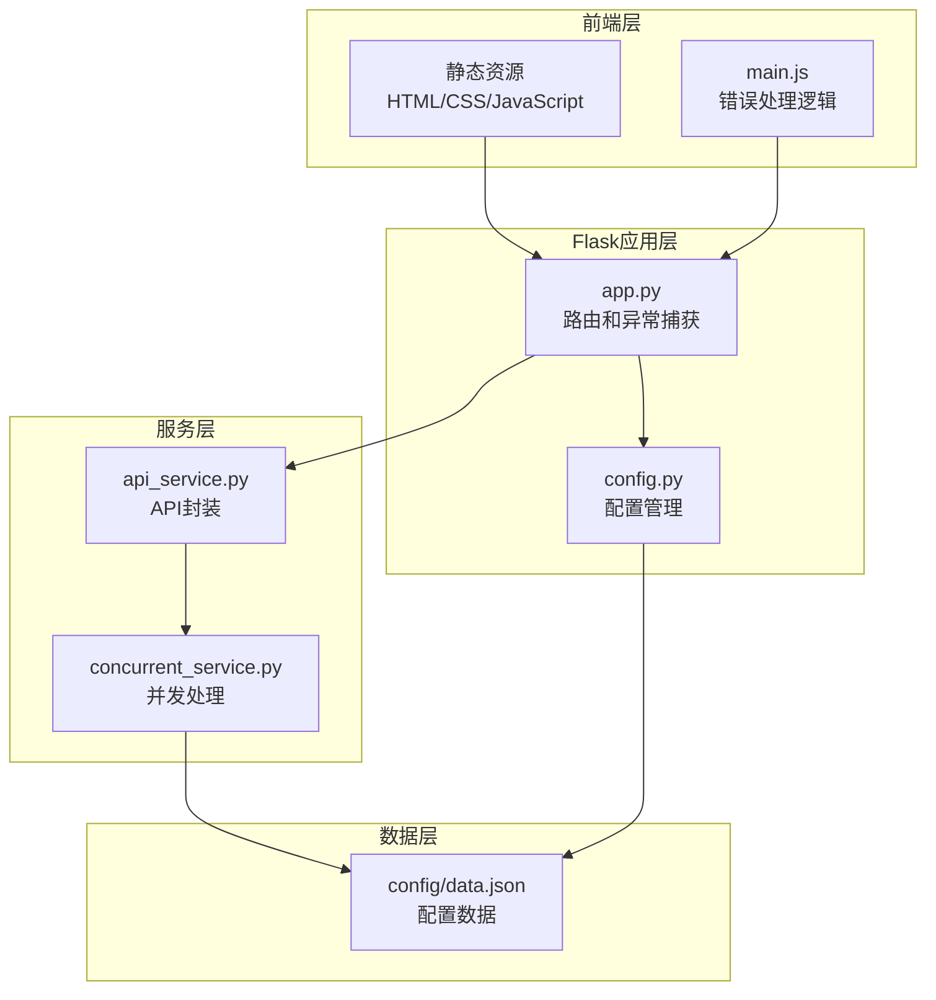
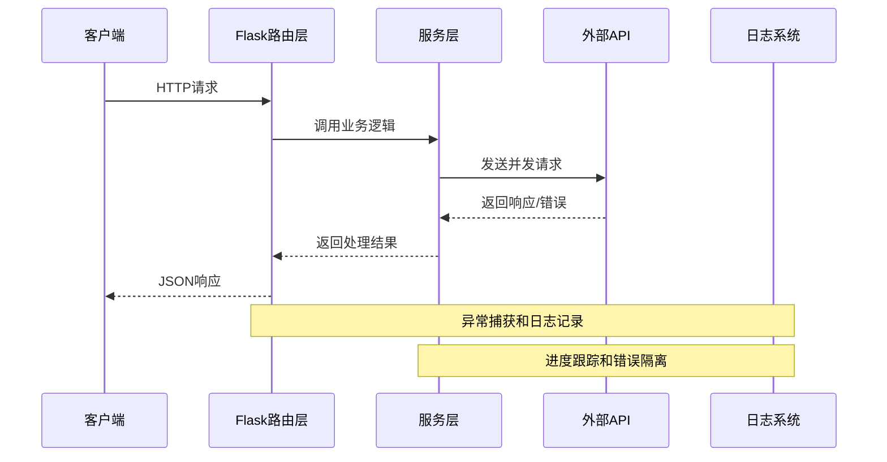
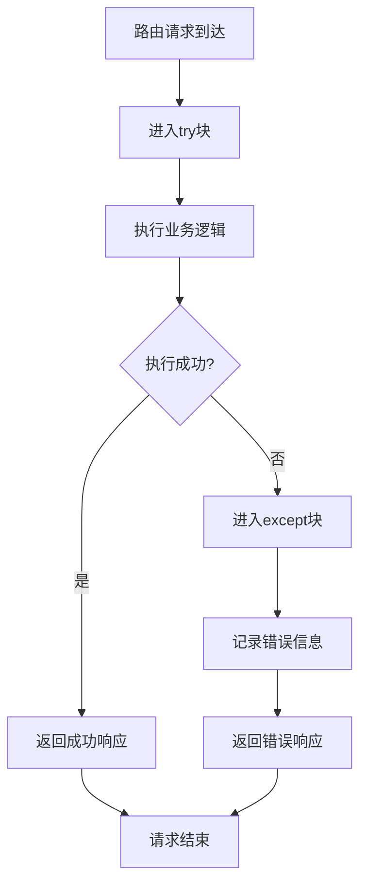
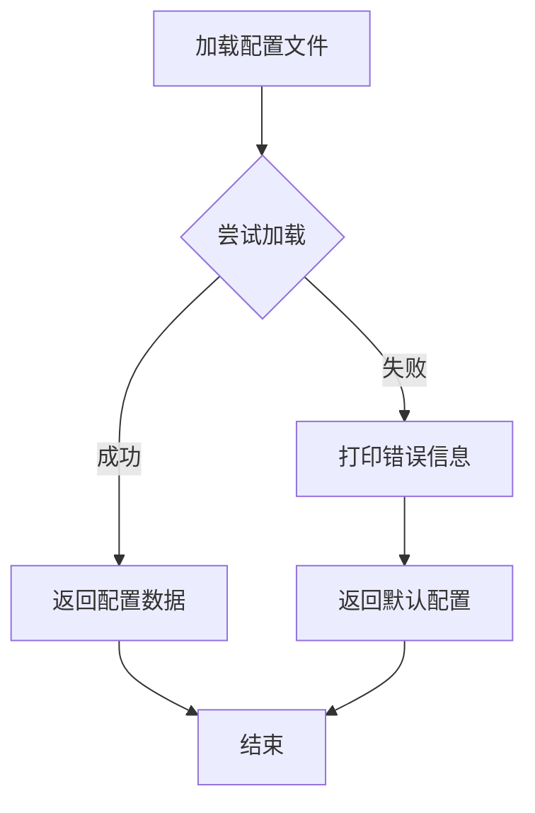
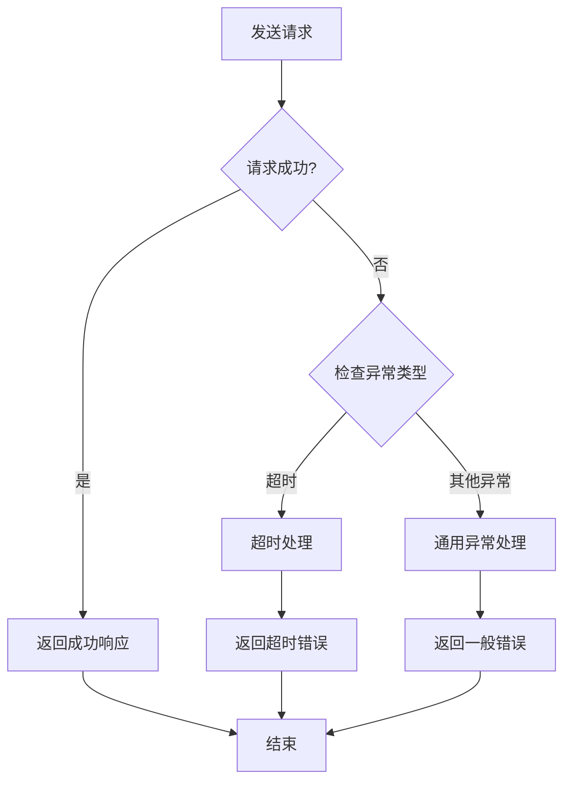
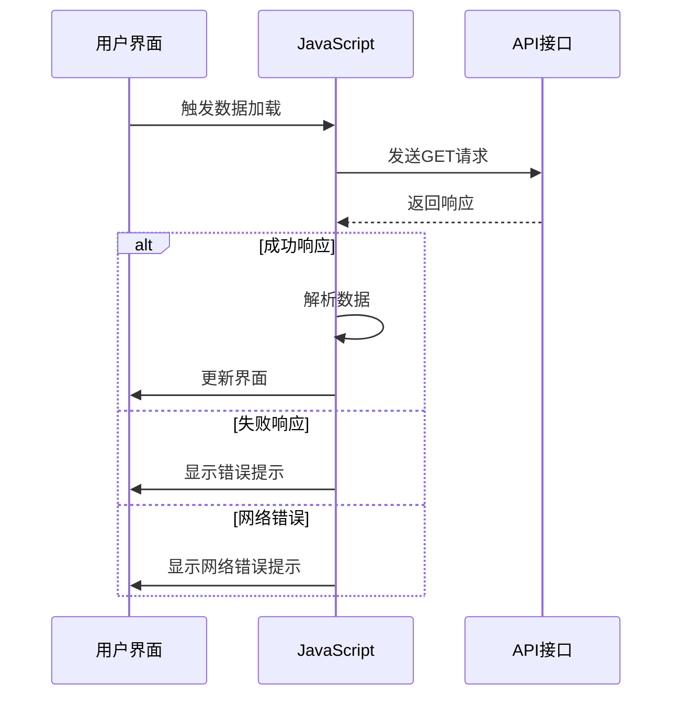
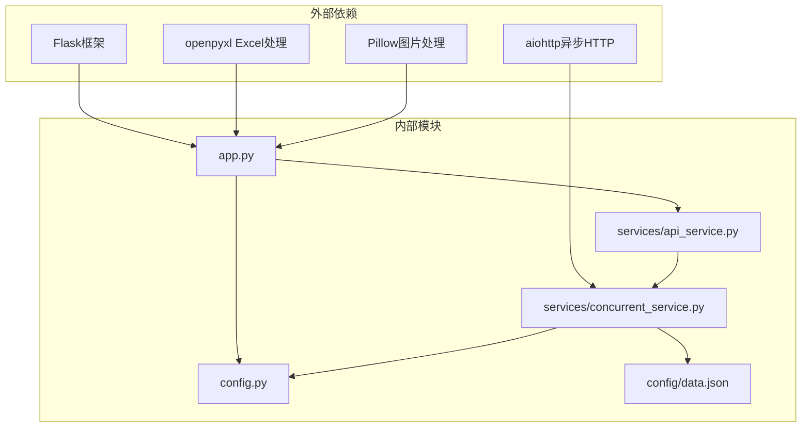

# 错误处理机制

<cite>
**本文档引用的文件**
- [app.py](file://app.py)
- [config.py](file://config.py)
- [services/api_service.py](file://services/api_service.py)
- [services/concurrent_service.py](file://services/concurrent_service.py)
- [config/data.json](file://config/data.json)
- [templates/index.html](file://templates/index.html)
- [static/js/main.js](file://static/js/main.js)
- [README.md](file://README.md)
</cite>

## 目录
1. [简介](#简介)
2. [项目结构](#项目结构)
3. [核心组件](#核心组件)
4. [架构概览](#架构概览)
5. [详细组件分析](#详细组件分析)
6. [依赖分析](#依赖分析)
7. [性能考虑](#性能考虑)
8. [故障排除指南](#故障排除指南)
9. [结论](#结论)

## 简介

本项目是一个基于Flask的AI文案评测对比系统，采用多层次的错误处理机制来确保系统的稳定性和用户体验。该系统通过Flask路由层的异常捕获、服务层的异常传播以及并发处理的错误隔离策略，构建了一个完整的错误处理体系。

系统的主要错误处理特点包括：
- 全局异常捕获和统一错误响应
- 特定业务异常处理和用户友好的错误信息
- 并发请求的错误隔离和进度跟踪
- 前后端协同的错误处理机制
- 配置驱动的错误处理策略

## 项目结构

该项目采用清晰的分层架构，错误处理机制贯穿于各个层次：

**图表来源**
- [app.py:1-139](file://app.py#L1-L139)
- [config.py:1-12](file://config.py#L1-L12)
- [services/api_service.py:1-14](file://services/api_service.py#L1-L14)
- [services/concurrent_service.py:1-162](file://services/concurrent_service.py#L1-L162)

**章节来源**
- [app.py:1-139](file://app.py#L1-L139)
- [config.py:1-12](file://config.py#L1-L12)
- [services/api_service.py:1-14](file://services/api_service.py#L1-L14)
- [services/concurrent_service.py:1-162](file://services/concurrent_service.py#L1-L162)

## 核心组件

### Flask路由层错误处理

Flask路由层实现了全局异常捕获机制，确保所有未处理的异常都能得到适当的处理：

- **统一异常捕获**：每个路由都包含try-catch块，捕获所有异常并返回标准化的JSON响应
- **HTTP状态码管理**：根据错误类型返回相应的HTTP状态码（主要是500内部服务器错误）
- **用户友好响应**：向客户端返回包含错误信息的JSON对象，便于前端处理

### 服务层异常传播

服务层提供了业务逻辑的异常处理和传播机制：

- **配置文件加载异常**：当配置文件不存在或格式错误时，返回默认配置并记录错误信息
- **并发请求异常处理**：针对不同类型的异常（超时、网络错误等）提供专门的处理逻辑
- **进度跟踪**：即使发生异常，也能继续跟踪处理进度并更新状态

### 并发处理错误隔离

并发处理模块实现了错误隔离策略，确保单个请求的失败不会影响其他请求：

- **信号量控制**：使用信号量限制最大并发数，防止系统过载
- **锁机制**：使用异步锁保护共享资源，确保线程安全
- **独立错误处理**：每个并发请求都有独立的错误处理逻辑

**章节来源**
- [app.py:19-61](file://app.py#L19-L61)
- [services/concurrent_service.py:21-28](file://services/concurrent_service.py#L21-L28)
- [services/concurrent_service.py:43-112](file://services/concurrent_service.py#L43-L112)

## 架构概览

系统采用分层架构，错误处理机制在各层都有对应的实现：

**图表来源**
- [app.py:43-61](file://app.py#L43-L61)
- [services/api_service.py:8-13](file://services/api_service.py#L8-L13)
- [services/concurrent_service.py:118-158](file://services/concurrent_service.py#L118-L158)

## 详细组件分析

### Flask路由层错误处理机制

Flask路由层实现了三层保护机制：

#### 路由级异常捕获
每个路由函数都包含完整的异常处理逻辑：

**图表来源**
- [app.py:21-27](file://app.py#L21-L27)
- [app.py:45-61](file://app.py#L45-L61)
- [app.py:65-135](file://app.py#L65-L135)

#### 图片代理错误处理
图片代理功能实现了文件存在性检查和异常捕获：

- **文件存在性验证**：检查文件路径是否存在
- **异常捕获**：捕获所有文件操作异常
- **统一错误响应**：返回404状态码

#### 并发请求错误处理
并发请求接口提供了完整的错误处理机制：

- **请求体解析**：处理空请求体的情况
- **业务逻辑异常**：捕获服务层抛出的所有异常
- **统一错误响应**：返回标准化的错误信息

**章节来源**
- [app.py:19-61](file://app.py#L19-L61)
- [app.py:63-135](file://app.py#L63-L135)

### 服务层异常处理策略

服务层提供了业务逻辑层面的异常处理：

#### 配置文件加载异常处理
配置文件加载功能实现了优雅降级：

**图表来源**
- [services/concurrent_service.py:21-28](file://services/concurrent_service.py#L21-L28)

#### 并发请求异常处理
并发请求处理实现了多种异常类型的专门处理：

**图表来源**
- [services/concurrent_service.py:79-112](file://services/concurrent_service.py#L79-L112)

#### 进度跟踪和错误隔离
进度跟踪功能确保了错误的及时反馈：

- **并发计数**：使用锁保护并发计数器
- **进度更新**：即使发生异常也要更新进度信息
- **统计收集**：收集每个请求的处理时间和状态

**章节来源**
- [services/concurrent_service.py:21-28](file://services/concurrent_service.py#L21-L28)
- [services/concurrent_service.py:79-112](file://services/concurrent_service.py#L79-L112)
- [services/concurrent_service.py:118-158](file://services/concurrent_service.py#L118-L158)

### 前端错误处理机制

前端JavaScript实现了完整的错误处理逻辑：

#### 数据加载错误处理
数据加载过程包含了多层错误处理：

**图表来源**
- [static/js/main.js:37-84](file://static/js/main.js#L37-L84)

#### 并发请求错误处理
并发请求处理实现了完整的错误处理流程：

- **请求状态管理**：禁用按钮和显示加载状态
- **响应处理**：区分成功和失败响应
- **错误信息显示**：向用户显示具体的错误信息
- **状态恢复**：无论成功与否都要恢复按钮状态

#### Excel导出错误处理
Excel导出功能实现了健壮的错误处理：

- **数据验证**：检查是否有数据可导出
- **响应状态检查**：验证HTTP响应状态
- **二进制数据处理**：正确处理Excel文件的二进制数据
- **下载失败处理**：处理下载过程中的各种异常

**章节来源**
- [static/js/main.js:87-136](file://static/js/main.js#L87-L136)
- [static/js/main.js:220-260](file://static/js/main.js#L220-L260)

### 配置驱动的错误处理

系统通过配置文件实现了灵活的错误处理策略：

#### 环境变量配置
配置文件定义了关键的错误处理参数：

- **API基础URL**：外部API的访问地址
- **超时时间**：请求超时的阈值
- **最大并发数**：并发请求的限制
- **数据配置路径**：本地数据文件的位置

#### 数据配置错误处理
数据配置文件提供了默认值和错误恢复机制：

- **默认文风**：提供默认的文案风格选项
- **系统提示词**：提供默认的系统提示信息
- **数据项结构**：定义了标准的数据项格式

**章节来源**
- [config.py:3-11](file://config.py#L3-L11)
- [config/data.json:1-32](file://config/data.json#L1-L32)

## 依赖分析

系统错误处理机制的依赖关系如下：

**图表来源**
- [requirements.txt:1-5](file://requirements.txt#L1-L5)
- [app.py:10-13](file://app.py#L10-L13)
- [services/api_service.py:2](file://services/api_service.py#L2)
- [services/concurrent_service.py:6](file://services/concurrent_service.py#L6)

**章节来源**
- [requirements.txt:1-5](file://requirements.txt#L1-L5)
- [app.py:10-13](file://app.py#L10-L13)
- [services/api_service.py:2](file://services/api_service.py#L2)
- [services/concurrent_service.py:6](file://services/concurrent_service.py#L6)

## 性能考虑

系统在错误处理方面考虑了性能影响：

### 异步错误处理
- **非阻塞I/O**：使用异步HTTP客户端避免阻塞
- **并发限制**：通过信号量控制最大并发数
- **资源复用**：复用HTTP连接减少开销

### 内存管理
- **渐进式处理**：逐个处理数据项，避免内存峰值
- **及时释放**：及时释放不再使用的资源
- **缓冲区管理**：合理管理Excel文件的内存使用

### 网络优化
- **超时控制**：设置合理的请求超时时间
- **重试机制**：为临时性错误提供重试机会
- **连接池**：复用网络连接减少建立成本

## 故障排除指南

### 常见错误场景及解决方案

#### 图片加载失败
**问题描述**：图片无法在网页上显示
**原因分析**：浏览器安全限制导致无法直接访问本地文件
**解决方案**：
- 使用系统提供的图片代理功能
- 确保图片路径配置正确
- 验证图片文件的存在性

#### Excel导出问题
**问题描述**：导出的Excel文件中图片缺失
**原因分析**：
- Pillow库未正确安装
- 图片格式不受支持
- 图片文件已损坏

**解决方案**：
- 安装Pillow库：`pip install Pillow`
- 检查图片格式支持情况
- 验证图片文件的完整性

#### 并发请求超时
**问题描述**：并发请求处理超时
**原因分析**：
- 外部API响应缓慢
- 网络连接不稳定
- 并发数设置过高

**解决方案**：
- 增加API超时时间
- 减少最大并发数
- 检查外部API服务状态

#### 配置文件错误
**问题描述**：系统无法加载配置文件
**原因分析**：
- 配置文件格式错误
- 文件路径配置不正确
- 权限不足

**解决方案**：
- 检查JSON格式的正确性
- 验证文件路径的有效性
- 确认文件读取权限

### 调试技巧

#### 后端调试
- **启用调试模式**：设置`FLASK_DEBUG=true`
- **查看日志输出**：关注控制台的进度信息
- **检查环境变量**：验证配置参数的正确性

#### 前端调试
- **浏览器开发者工具**：检查网络请求和响应
- **控制台日志**：查看JavaScript错误信息
- **断点调试**：逐步执行JavaScript代码

#### 网络调试
- **API测试工具**：使用Postman等工具测试API
- **网络监控**：监控HTTP请求和响应
- **超时分析**：分析请求超时的原因

**章节来源**
- [README.md:314-372](file://README.md#L314-L372)

## 结论

本项目构建了一个完整且实用的错误处理机制，具有以下特点：

### 设计优势
- **分层处理**：不同层次负责不同类型的错误处理
- **用户友好**：提供清晰的错误信息和恢复建议
- **性能优化**：在保证稳定性的同时考虑性能影响
- **配置灵活**：通过配置文件实现灵活的错误处理策略

### 实践价值
- **生产就绪**：具备生产环境所需的错误处理能力
- **易于维护**：清晰的代码结构和注释
- **扩展性强**：支持添加新的错误处理策略
- **用户体验好**：提供及时的错误反馈和恢复机制

### 改进建议
- **日志系统**：集成结构化日志系统进行错误追踪
- **错误分类**：实现更细粒度的错误分类和处理
- **监控告警**：添加系统监控和异常告警机制
- **国际化支持**：实现错误消息的多语言支持

该错误处理机制为类似的企业级应用提供了良好的参考范例，既保证了系统的稳定性，又提升了用户的使用体验。