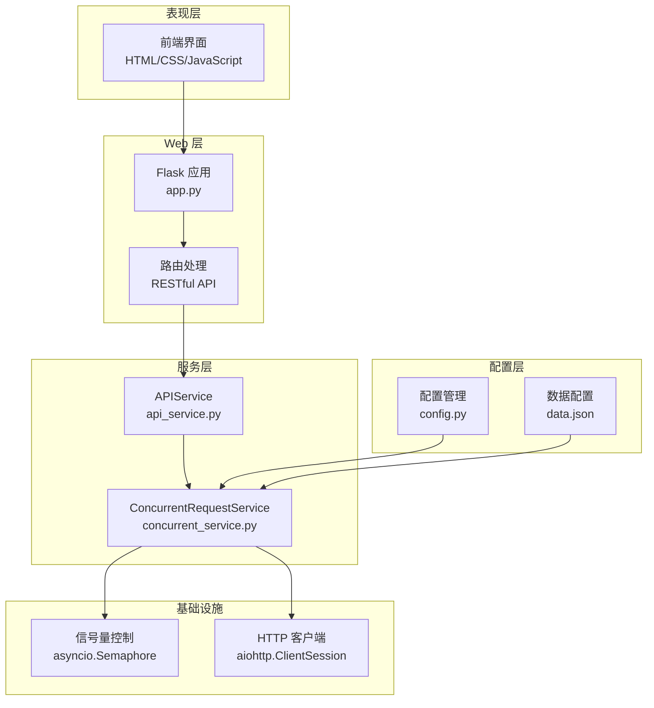
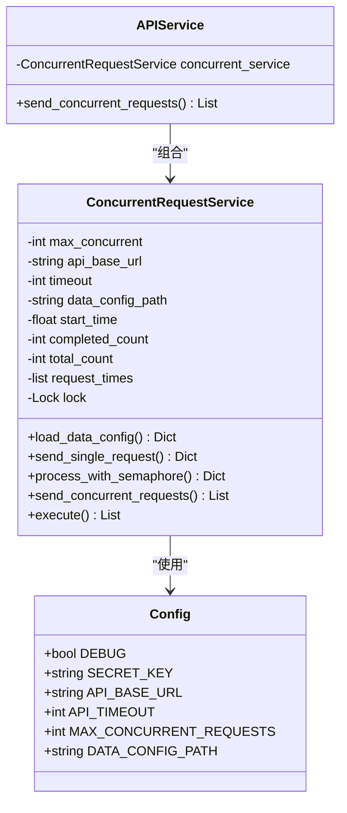
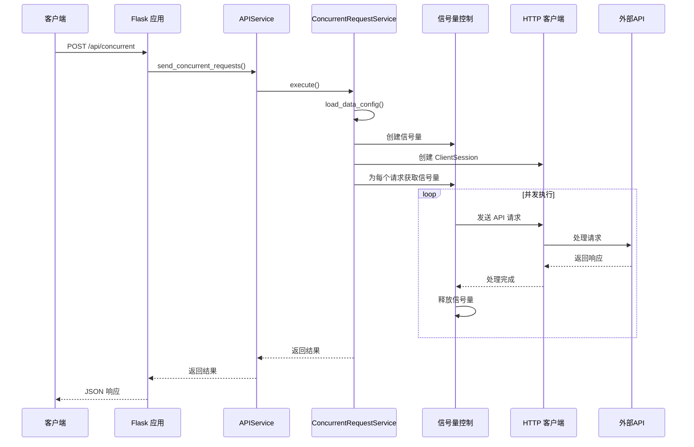
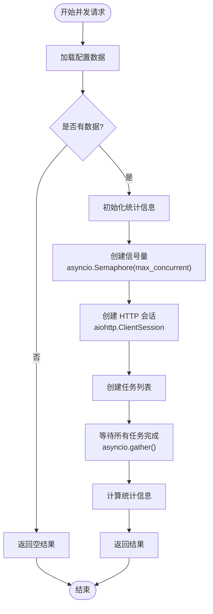
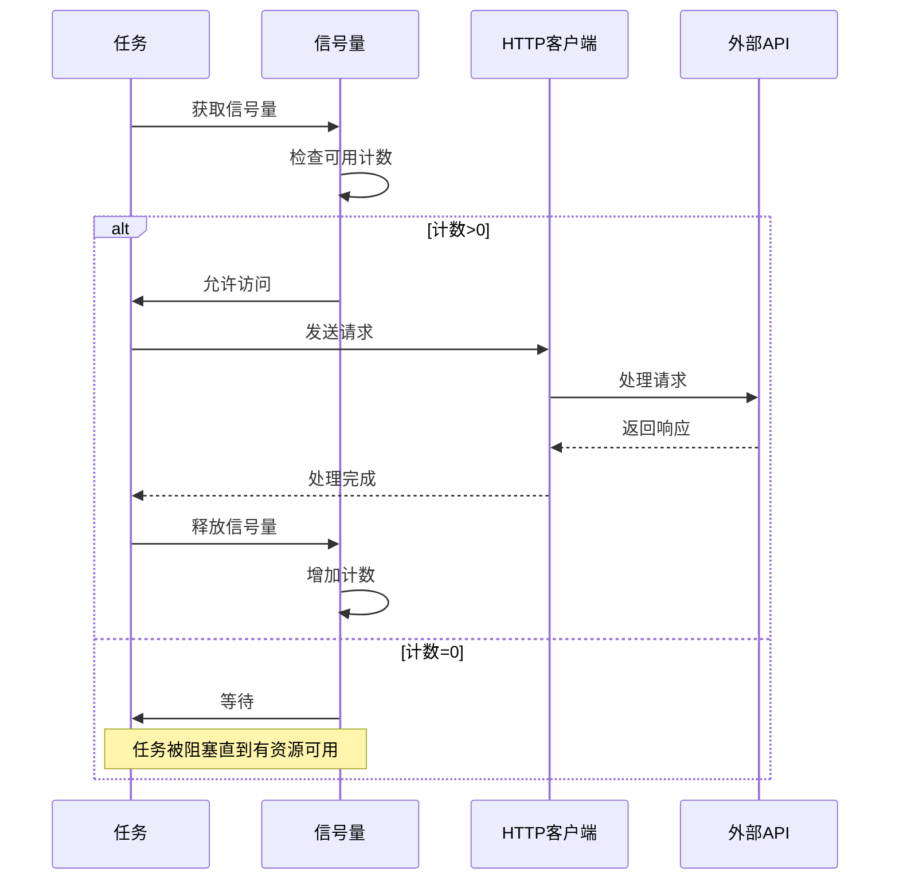
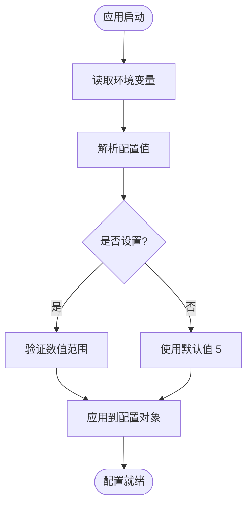
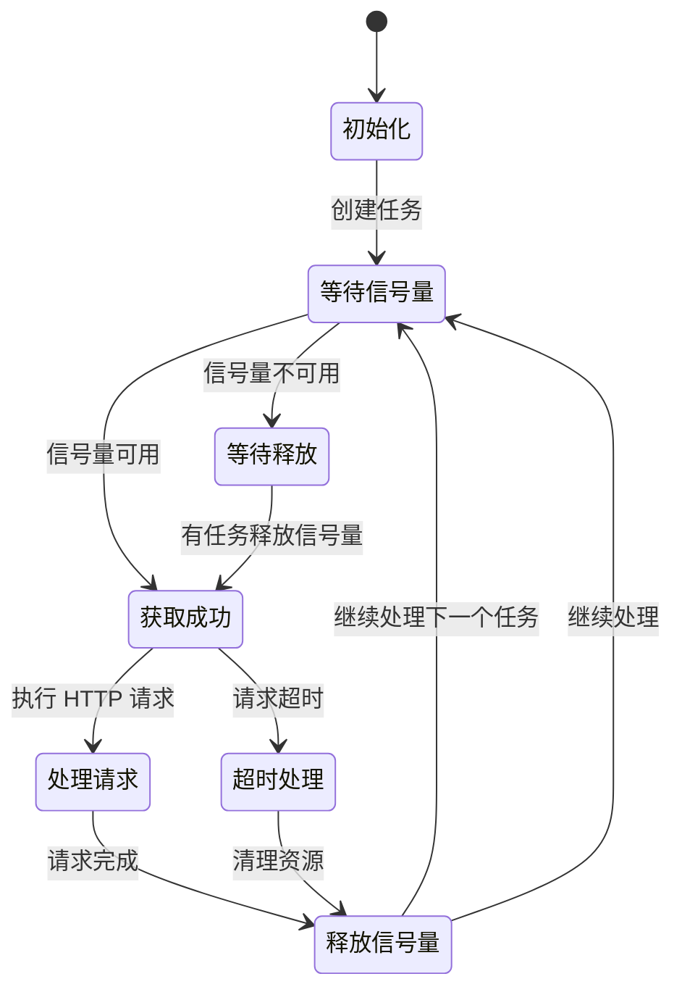
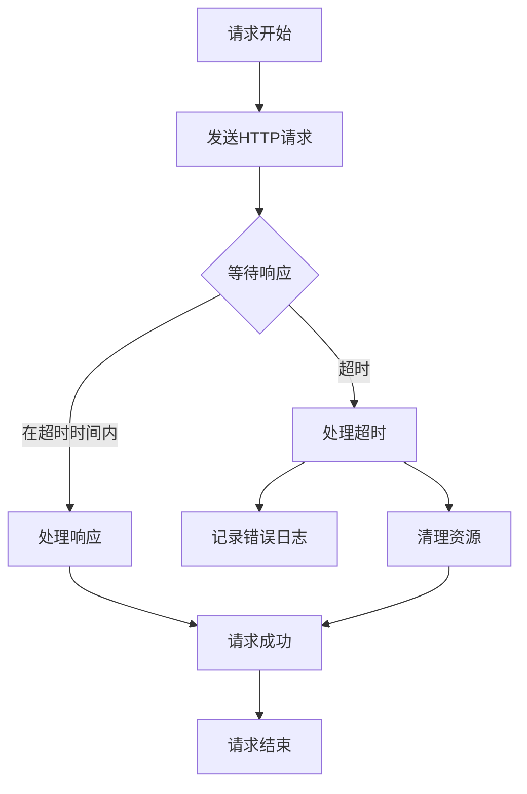

# 信号量控制机制

<cite>
**本文档引用的文件**
- [app.py](file://app.py)
- [config.py](file://config.py)
- [services/concurrent_service.py](file://services/concurrent_service.py)
- [services/api_service.py](file://services/api_service.py)
- [config/data.json](file://config/data.json)
- [README.md](file://README.md)
- [requirements.txt](file://requirements.txt)
</cite>

## 目录
1. [引言](#引言)
2. [项目结构](#项目结构)
3. [核心组件](#核心组件)
4. [架构概览](#架构概览)
5. [详细组件分析](#详细组件分析)
6. [信号量实现机制](#信号量实现机制)
7. [并发控制策略](#并发控制策略)
8. [性能优化与最佳实践](#性能优化与最佳实践)
9. [故障排除指南](#故障排除指南)
10. [结论](#结论)

## 引言

信号量（Semaphore）是操作系统和计算机科学中的一个重要同步原语，用于控制对共享资源的访问。在并发编程中，信号量通过维护一个计数器来限制同时访问特定资源的线程或进程数量。本文档将深入分析本项目中的信号量控制机制，详细解释其在并发控制中的作用和实现方式。

本项目是一个基于 Flask 的 Web 应用，专门用于批量处理图片文案并支持并发调用外部 API。项目的核心功能之一就是通过信号量机制来控制同时进行的 API 请求数量，确保系统的稳定性和性能。

## 项目结构

该项目采用典型的分层架构设计，主要包含以下层次：

**图表来源**
- [app.py:1-139](file://app.py#L1-L139)
- [services/api_service.py:1-14](file://services/api_service.py#L1-L14)
- [services/concurrent_service.py:1-162](file://services/concurrent_service.py#L1-L162)
- [config.py:1-12](file://config.py#L1-L12)

**章节来源**
- [app.py:1-139](file://app.py#L1-L139)
- [README.md:24-44](file://README.md#L24-L44)

## 核心组件

### 配置管理系统

配置系统负责管理应用程序的各种参数，特别是并发控制相关的配置。核心配置类定义如下：

**图表来源**
- [config.py:3-12](file://config.py#L3-L12)
- [services/concurrent_service.py:8-20](file://services/concurrent_service.py#L8-L20)
- [services/api_service.py:4-14](file://services/api_service.py#L4-L14)

### 并发请求服务

并发请求服务是整个系统的核心组件，负责处理所有并发相关的逻辑。它使用 asyncio 和 aiohttp 来实现高效的异步并发处理。

**章节来源**
- [config.py:1-12](file://config.py#L1-L12)
- [services/concurrent_service.py:1-162](file://services/concurrent_service.py#L1-L162)
- [services/api_service.py:1-14](file://services/api_service.py#L1-L14)

## 架构概览

项目采用分层架构设计，每层都有明确的职责分工：

**图表来源**
- [app.py:43-61](file://app.py#L43-L61)
- [services/api_service.py:8-13](file://services/api_service.py#L8-L13)
- [services/concurrent_service.py:118-158](file://services/concurrent_service.py#L118-L158)

## 详细组件分析

### 配置管理组件

配置管理组件负责从环境变量和配置文件中读取各种参数。其中最重要的参数是 `MAX_CONCURRENT_REQUESTS`，它直接决定了系统的并发能力。

#### 配置参数详解

| 参数名称 | 类型 | 默认值 | 说明 |
|---------|------|--------|------|
| FLASK_DEBUG | bool | True | 调试模式开关 |
| SECRET_KEY | string | your-secret-key-here | Flask 应用密钥 |
| API_BASE_URL | string | http://example.com/api | 外部 API 基础地址 |
| API_TIMEOUT | int | 30 | API 请求超时时间（秒） |
| MAX_CONCURRENT_REQUESTS | int | 5 | 最大并发请求数 |
| DATA_CONFIG_PATH | string | config/data.json | 数据配置文件路径 |

**章节来源**
- [config.py:1-12](file://config.py#L1-L12)
- [README.md:78-87](file://README.md#L78-L87)

### 并发请求服务实现

并发请求服务是整个系统的核心，它实现了完整的信号量控制机制：

#### 关键方法分析

1. **`send_concurrent_requests()`** - 主要的并发处理入口
2. **`process_with_semaphore()`** - 使用信号量包装单个请求
3. **`send_single_request()`** - 单个请求的具体实现
4. **`execute()`** - 同步执行接口

**章节来源**
- [services/concurrent_service.py:118-158](file://services/concurrent_service.py#L118-L158)
- [services/concurrent_service.py:114-116](file://services/concurrent_service.py#L114-L116)
- [services/concurrent_service.py:43-112](file://services/concurrent_service.py#L43-L112)

## 信号量实现机制

### 信号量概念与原理

信号量是一种用于控制多个进程或线程对共享资源访问的同步机制。它维护一个计数器，当资源可用时增加，当资源被占用时减少。当计数器达到零时，任何试图获取资源的操作都会被阻塞，直到有资源被释放。

在本项目中，信号量主要用于控制同时进行的 HTTP 请求数量，防止系统过载。

### 信号量在项目中的具体实现

#### 创建信号量

**图表来源**
- [services/concurrent_service.py:118-158](file://services/concurrent_service.py#L118-L158)
- [services/concurrent_service.py:138-146](file://services/concurrent_service.py#L138-L146)

#### 信号量获取和释放过程

**图表来源**
- [services/concurrent_service.py:114-116](file://services/concurrent_service.py#L114-L116)
- [services/concurrent_service.py:138](file://services/concurrent_service.py#L138)

### MAX_CONCURRENT_REQUESTS 配置参数

#### 配置实现机制

MAX_CONCURRENT_REQUESTS 参数通过以下步骤实现：

1. **环境变量读取**：从环境变量中读取配置值
2. **类型转换**：将字符串转换为整数类型
3. **默认值处理**：如果未设置则使用默认值 5
4. **运行时应用**：在创建信号量时使用该值

#### 配置加载流程

**图表来源**
- [config.py:9](file://config.py#L9)

**章节来源**
- [config.py:1-12](file://config.py#L1-L12)
- [README.md:65](file://README.md#L65)

## 并发控制策略

### 信号量 vs 锁的区别

虽然信号量和锁都属于同步原语，但它们有不同的应用场景：

| 特性 | 信号量 | 锁 |
|------|--------|----|
| **用途** | 控制资源访问数量 | 保护临界区 |
| **计数器** | 可大于1的计数器 | 二进制计数器(0/1) |
| **适用场景** | 并发限制 | 互斥访问 |
| **典型应用** | 并发请求限制 | 临界区保护 |

#### 信号量在任务调度中的作用

在本项目中，信号量确保不会超过设定的并发限制：

1. **资源分配**：每个可用的信号量代表一个可处理的请求槽位
2. **流量控制**：防止过多请求同时到达外部 API
3. **负载均衡**：均匀分布请求负载
4. **系统保护**：避免系统过载导致的性能下降

### 任务调度机制

**图表来源**
- [services/concurrent_service.py:114-116](file://services/concurrent_service.py#L114-L116)
- [services/concurrent_service.py:79-95](file://services/concurrent_service.py#L79-L95)

**章节来源**
- [services/concurrent_service.py:114-116](file://services/concurrent_service.py#L114-L116)
- [services/concurrent_service.py:79-112](file://services/concurrent_service.py#L79-L112)

## 性能优化与最佳实践

### 信号量配置最佳实践

#### 并发数设置原则

1. **系统资源评估**：根据 CPU、内存、网络带宽合理设置
2. **外部 API 限制**：考虑目标 API 的并发限制
3. **网络延迟考虑**：高延迟场景应适当降低并发数
4. **渐进式测试**：从较低并发数开始，逐步增加

#### 性能调优建议

| 优化方向 | 建议值 | 说明 |
|----------|--------|------|
| MAX_CONCURRENT_REQUESTS | 5-20 | 根据系统性能调整 |
| API_TIMEOUT | 30-120秒 | 考虑网络状况 |
| 连接池大小 | 10-50 | aiohttp 默认即可 |
| 超时重试次数 | 1-3次 | 避免无限重试 |

### 错误处理策略

#### 超时处理

**图表来源**
- [services/concurrent_service.py:79-95](file://services/concurrent_service.py#L79-L95)

#### 资源管理

1. **及时释放**：确保信号量在任何情况下都能正确释放
2. **异常处理**：捕获异常并确保资源清理
3. **超时控制**：设置合理的请求超时时间
4. **监控指标**：记录并发统计信息

**章节来源**
- [services/concurrent_service.py:79-112](file://services/concurrent_service.py#L79-L112)

## 故障排除指南

### 常见问题及解决方案

#### 并发请求超时

**问题现象**：大量请求超时，系统响应缓慢

**可能原因**：
1. MAX_CONCURRENT_REQUESTS 设置过高
2. 外部 API 服务不稳定
3. 网络连接问题
4. 服务器资源不足

**解决方案**：
1. 降低 MAX_CONCURRENT_REQUESTS 值
2. 增加 API_TIMEOUT 时间
3. 检查网络连接稳定性
4. 监控服务器资源使用情况

#### 内存泄漏问题

**问题现象**：长时间运行后内存持续增长

**可能原因**：
1. 信号量未正确释放
2. HTTP 会话未关闭
3. 大量未处理的异常

**解决方案**：
1. 确保所有异常路径都有 finally 块
2. 使用上下文管理器管理 HTTP 会话
3. 定期重启服务进行内存回收

### 监控和调试

#### 关键监控指标

| 指标名称 | 测量方法 | 正常范围 |
|----------|----------|----------|
| 并发请求数 | 当前活跃请求 | ≤ MAX_CONCURRENT_REQUESTS |
| 请求成功率 | 成功/总数 | > 95% |
| 平均响应时间 | 统计计算 | < API_TIMEOUT |
| 超时率 | 超时/总数 | < 5% |

**章节来源**
- [README.md:329-339](file://README.md#L329-L339)

## 结论

信号量控制机制是本项目实现高效并发处理的核心技术。通过合理配置 MAX_CONCURRENT_REQUESTS 参数，系统能够在保证性能的同时避免过载，确保稳定的用户体验。

### 主要优势

1. **资源保护**：有效防止系统过载
2. **性能优化**：通过合理的并发控制提升整体性能
3. **稳定性保障**：通过超时和错误处理机制提高系统稳定性
4. **可配置性**：支持运行时调整并发参数

### 未来改进方向

1. **动态调整**：根据系统负载动态调整并发数
2. **智能重试**：实现指数退避的智能重试机制
3. **分布式支持**：扩展到分布式环境的信号量控制
4. **监控增强**：增加更详细的性能监控和告警机制

通过深入理解和正确使用信号量控制机制，开发者可以构建更加稳定、高效的并发系统，为用户提供优质的体验。