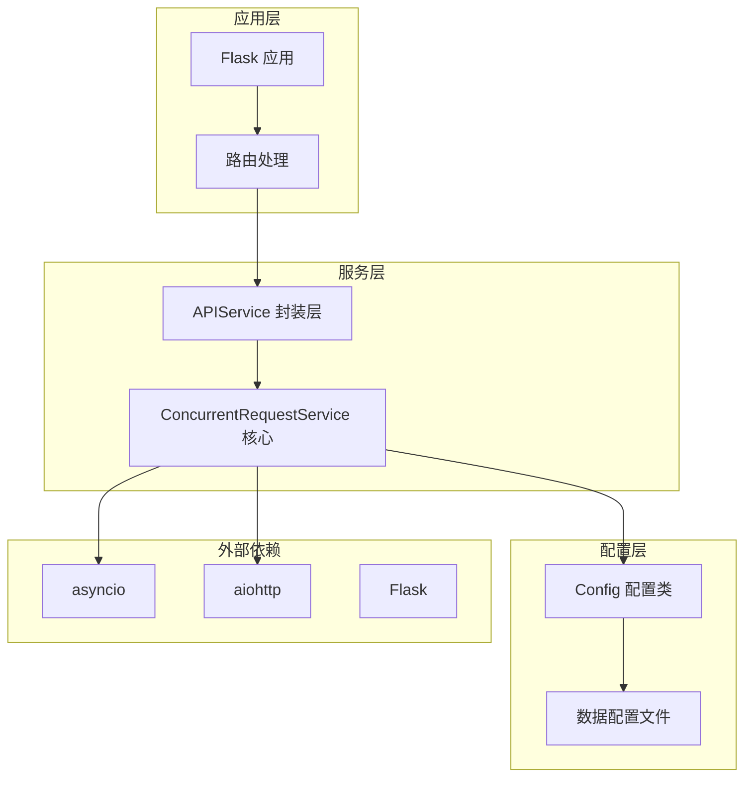
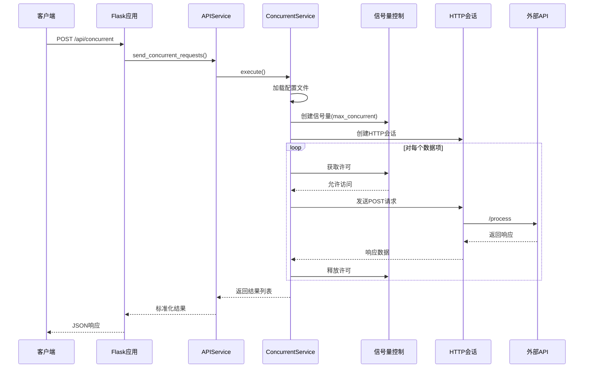
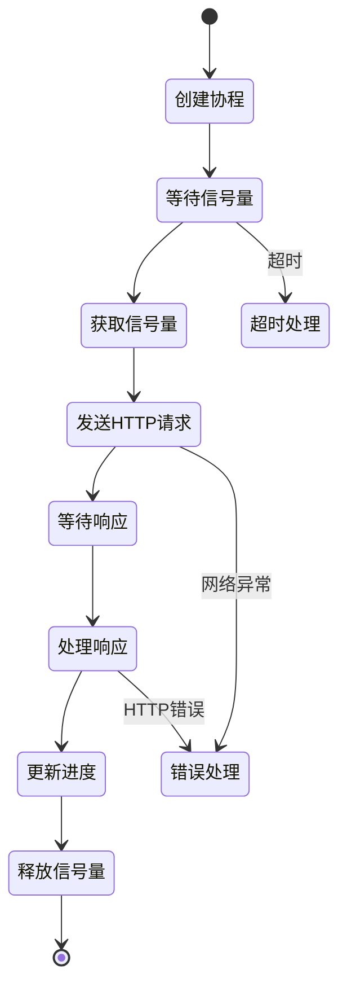
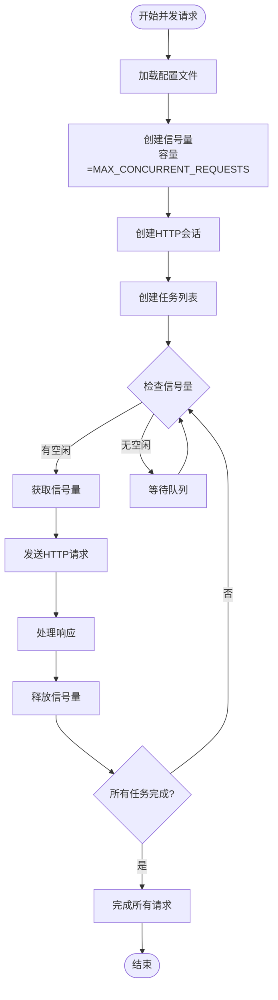
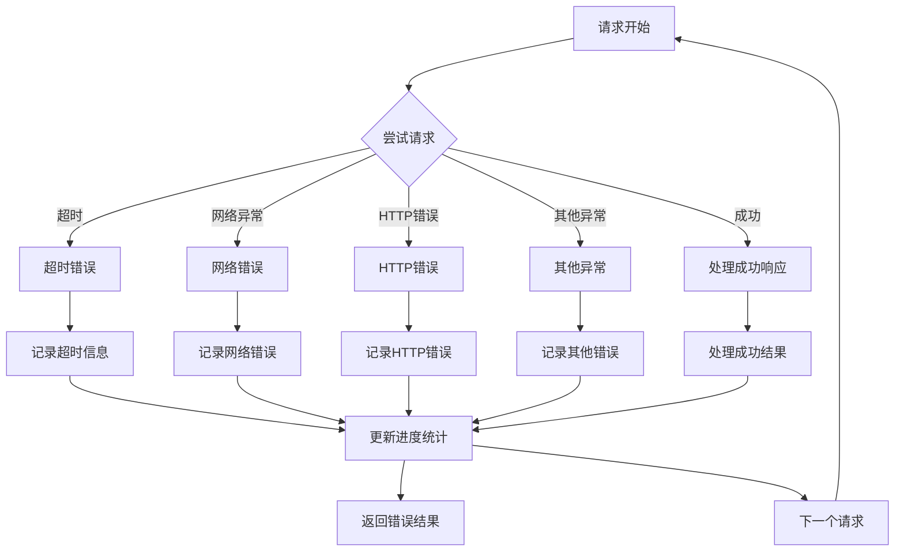
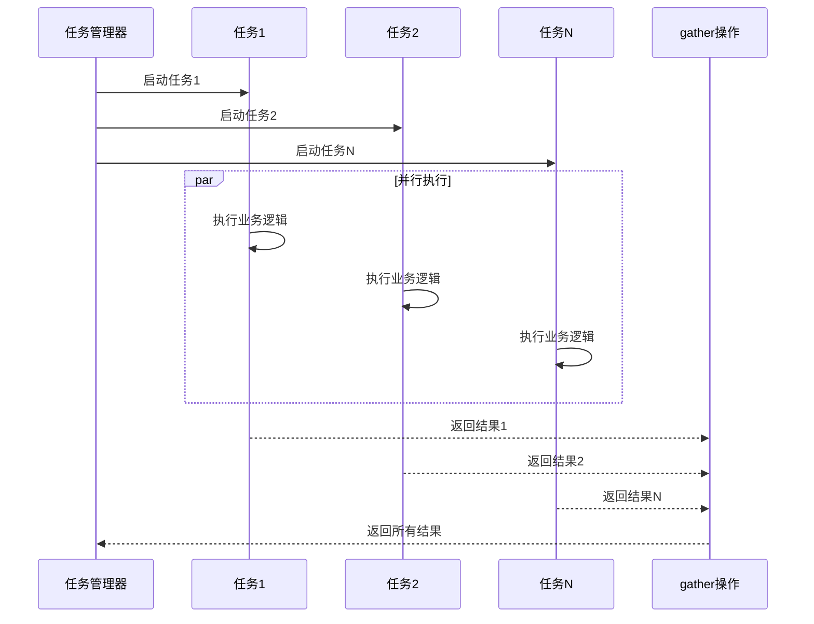
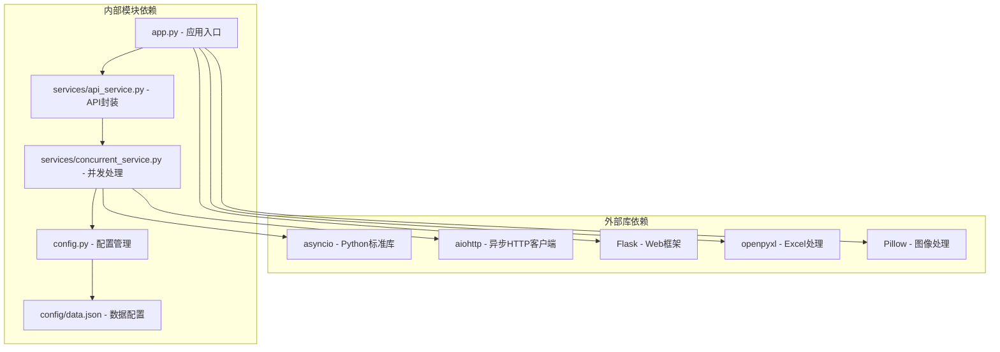

# 并发处理技术

<cite>
**本文档引用的文件**
- [app.py](file://app.py)
- [services/concurrent_service.py](file://services/concurrent_service.py)
- [services/api_service.py](file://services/api_service.py)
- [config.py](file://config.py)
- [config/data.json](file://config/data.json)
- [requirements.txt](file://requirements.txt)
- [README.md](file://README.md)
</cite>

## 目录
1. [引言](#引言)
2. [项目结构](#项目结构)
3. [核心组件](#核心组件)
4. [架构概览](#架构概览)
5. [详细组件分析](#详细组件分析)
6. [依赖关系分析](#依赖关系分析)
7. [性能考虑](#性能考虑)
8. [故障排除指南](#故障排除指南)
9. [结论](#结论)
10. [附录](#附录)

## 引言

本项目展示了基于Python的异步并发处理技术实现，采用Flask作为Web框架，结合asyncio和aiohttp实现高效的异步HTTP请求处理。该系统专门设计用于批量处理图片文案，支持并发调用外部API生成文案，并提供实时进度监控和Excel导出功能。

该项目的核心创新在于将传统的同步阻塞I/O操作转换为异步非阻塞操作，通过信号量机制精确控制并发数量，实现资源的有效利用和系统的稳定性保障。

## 项目结构

项目采用清晰的分层架构设计，将业务逻辑、服务层和配置分离，便于维护和扩展：



**图表来源**
- [app.py:1-139](file://app.py#L1-L139)
- [services/api_service.py:1-14](file://services/api_service.py#L1-L14)
- [services/concurrent_service.py:1-162](file://services/concurrent_service.py#L1-L162)
- [config.py:1-12](file://config.py#L1-L12)

**章节来源**
- [app.py:1-139](file://app.py#L1-L139)
- [README.md:24-44](file://README.md#L24-L44)

## 核心组件

### 并发请求服务 (ConcurrentRequestService)

这是系统的核心组件，负责实现异步并发请求处理的所有逻辑。该类继承了以下关键职责：

- **信号量控制**: 使用asyncio.Semaphore精确控制最大并发请求数量
- **进度监控**: 实时计算和显示处理进度统计信息
- **错误处理**: 统一处理各种异常情况，包括超时和网络错误
- **资源管理**: 管理HTTP会话生命周期和异步锁

### API服务封装 (APIService)

提供简化的接口供Flask路由调用，实现服务层与路由层的解耦：

- **接口抽象**: 为上层提供统一的并发请求接口
- **参数传递**: 处理用户输入参数并传递给并发服务
- **结果封装**: 标准化返回格式

### 配置管理 (Config)

集中管理所有运行时配置，支持环境变量覆盖：

- **API配置**: 基础URL、超时时间和并发限制
- **数据配置**: 配置文件路径和默认值
- **环境变量**: 支持Docker等容器化部署场景

**章节来源**
- [services/concurrent_service.py:8-162](file://services/concurrent_service.py#L8-L162)
- [services/api_service.py:4-14](file://services/api_service.py#L4-L14)
- [config.py:3-12](file://config.py#L3-L12)

## 架构概览

系统采用经典的三层架构模式，结合异步处理技术实现高性能的并发请求处理：



**图表来源**
- [app.py:43-61](file://app.py#L43-L61)
- [services/api_service.py:8-13](file://services/api_service.py#L8-L13)
- [services/concurrent_service.py:118-158](file://services/concurrent_service.py#L118-L158)

## 详细组件分析

### 事件循环和协程管理

系统使用asyncio的事件循环来管理所有异步操作。事件循环的核心作用包括：

#### 事件循环机制
- **单线程模型**: 所有协程在同一个线程中执行，避免了多线程的复杂性
- **协作式调度**: 协程主动让出控制权，允许其他协程执行
- **异步I/O**: 非阻塞的网络操作，提高资源利用率

#### 协程生命周期管理


**图表来源**
- [services/concurrent_service.py:114-116](file://services/concurrent_service.py#L114-L116)
- [services/concurrent_service.py:43-112](file://services/concurrent_service.py#L43-L112)

### 信号量控制机制

信号量是实现并发控制的核心组件，确保系统不会超过预设的最大并发数：

#### 信号量工作原理
- **容量限制**: 初始化时设置最大并发数
- **获取机制**: 协程需要获取信号量才能执行
- **释放机制**: 协程完成任务后释放信号量
- **队列管理**: 当信号量不足时，等待的协程进入队列

#### 并发控制流程


**图表来源**
- [services/concurrent_service.py:138](file://services/concurrent_service.py#L138)
- [services/concurrent_service.py:140-146](file://services/concurrent_service.py#L140-L146)

**章节来源**
- [services/concurrent_service.py:10-19](file://services/concurrent_service.py#L10-L19)
- [services/concurrent_service.py:114-116](file://services/concurrent_service.py#L114-L116)

### 进度监控机制

系统实现了完善的实时进度监控，提供详细的统计信息：

#### 进度统计指标
- **总请求数**: 需要处理的数据项总数
- **已完成数**: 已经完成的请求数量
- **剩余数量**: 还需要处理的请求数量
- **平均耗时**: 每个请求的平均处理时间
- **总耗时**: 所有请求的累计处理时间

#### 进度更新策略
- **原子性更新**: 使用asyncio.Lock确保统计数据的一致性
- **实时输出**: 每个请求完成后立即更新和显示进度
- **性能计算**: 动态计算平均耗时和剩余时间

**章节来源**
- [services/concurrent_service.py:30-42](file://services/concurrent_service.py#L30-L42)
- [services/concurrent_service.py:63-66](file://services/concurrent_service.py#L63-L66)

### 错误处理和异常恢复

系统采用了多层次的错误处理策略，确保在各种异常情况下都能保持稳定运行：

#### 错误分类处理


**图表来源**
- [services/concurrent_service.py:79-112](file://services/concurrent_service.py#L79-L112)

#### 异常恢复策略
- **超时处理**: 记录超时信息并继续处理其他请求
- **网络重试**: 虽然当前实现未包含自动重试，但结构支持扩展
- **状态隔离**: 每个请求的错误状态独立处理，不影响其他请求
- **资源清理**: 确保异常情况下也能正确释放信号量

**章节来源**
- [services/concurrent_service.py:79-112](file://services/concurrent_service.py#L79-L112)

### 任务调度机制

系统使用asyncio.gather实现高效的任务调度：

#### 任务调度特点
- **并行执行**: 所有任务同时开始执行，充分利用系统资源
- **结果聚合**: 收集所有任务的结果并按顺序返回
- **异常传播**: 任何任务抛出异常都会导致整个gather操作失败
- **内存效率**: 不需要预先分配大量内存空间存储中间结果

#### 调度流程


**图表来源**
- [services/concurrent_service.py:140-146](file://services/concurrent_service.py#L140-L146)

**章节来源**
- [services/concurrent_service.py:140-146](file://services/concurrent_service.py#L140-L146)

## 依赖关系分析

系统依赖关系清晰明确，遵循单一职责原则：



**图表来源**
- [requirements.txt:1-6](file://requirements.txt#L1-L6)
- [app.py:10](file://app.py#L10)
- [services/api_service.py:2](file://services/api_service.py#L2)
- [services/concurrent_service.py:1-6](file://services/concurrent_service.py#L1-L6)

**章节来源**
- [requirements.txt:1-6](file://requirements.txt#L1-L6)
- [app.py:10](file://app.py#L10)

## 性能考虑

### 并发数调优指南

#### 理论基础
- **CPU密集型**: 建议并发数 = CPU核心数 × 2
- **I/O密集型**: 可以设置更高的并发数，通常为CPU核心数的10-100倍
- **网络I/O**: 受制于网络带宽和服务器处理能力

#### 实际调优建议
- **初始设置**: 从5-10个并发开始，逐步增加
- **监控指标**: 关注CPU使用率、内存占用和网络延迟
- **渐进式测试**: 每次增加20-50%的并发数进行测试

#### 性能优化策略
- **连接池复用**: 使用aiohttp的连接池减少TCP连接建立开销
- **超时配置**: 合理设置请求超时时间，避免长时间阻塞
- **内存管理**: 及时释放不需要的对象，避免内存泄漏

### 资源管理最佳实践

#### 内存优化
- **流式处理**: 对于大文件使用流式读取而非一次性加载
- **及时释放**: 使用with语句确保资源正确释放
- **对象复用**: 复用HTTP会话和数据库连接

#### 网络优化
- **连接复用**: 复用TCP连接减少握手开销
- **压缩传输**: 启用GZIP压缩减少网络传输量
- **批量处理**: 合理设置批量大小平衡吞吐量和延迟

## 故障排除指南

### 常见问题诊断

#### 并发数过大问题
**症状**: 系统响应缓慢，错误率增加
**原因**: 超过了服务器或网络的承载能力
**解决方案**: 
- 降低MAX_CONCURRENT_REQUESTS配置
- 检查服务器资源使用情况
- 优化外部API的响应时间

#### 超时问题
**症状**: 大量请求超时
**原因**: 网络延迟过高或外部API响应慢
**解决方案**:
- 增加API_TIMEOUT配置
- 检查网络连接质量
- 优化外部API性能

#### 内存泄漏问题
**症状**: 内存使用持续增长
**原因**: 对象没有正确释放
**解决方案**:
- 检查异步上下文管理器的使用
- 确保所有资源都有正确的清理逻辑
- 使用内存分析工具定位问题

### 调试技巧

#### 日志分析
- **请求日志**: 记录每个请求的开始和结束时间
- **性能日志**: 监控关键操作的执行时间
- **错误日志**: 详细记录异常信息和堆栈跟踪

#### 性能监控
- **并发监控**: 实时监控活跃连接数和队列长度
- **资源监控**: 监控CPU、内存和网络使用情况
- **响应监控**: 分析不同响应时间的分布情况

**章节来源**
- [README.md:329-348](file://README.md#L329-L348)

## 结论

本项目成功展示了现代Python异步编程技术的实际应用，通过asyncio和aiohttp实现了高效的并发HTTP请求处理。系统的主要优势包括：

1. **高性能**: 通过异步I/O和信号量控制，显著提高了并发处理能力
2. **稳定性**: 完善的错误处理和异常恢复机制确保系统稳定运行
3. **可观测性**: 实时进度监控和详细的统计信息便于系统调试和优化
4. **可扩展性**: 清晰的架构设计支持功能扩展和性能优化

该实现为类似的应用场景提供了优秀的参考模板，特别是在需要处理大量I/O密集型任务的场景中具有重要的实用价值。

## 附录

### 配置参数说明

| 参数名 | 类型 | 默认值 | 说明 |
|--------|------|--------|------|
| API_BASE_URL | 字符串 | http://example.com/api | 外部API的基础URL |
| API_TIMEOUT | 整数 | 30 | 请求超时时间（秒） |
| MAX_CONCURRENT_REQUESTS | 整数 | 5 | 最大并发请求数 |
| DATA_CONFIG_PATH | 字符串 | config/data.json | 数据配置文件路径 |

### 环境变量设置示例

```bash
export API_BASE_URL=http://your-api-server.com/api
export API_TIMEOUT=60
export MAX_CONCURRENT_REQUESTS=10
export FLASK_DEBUG=False
```

### 扩展建议

1. **重试机制**: 实现指数退避的自动重试逻辑
2. **熔断器**: 添加熔断器防止级联故障
3. **监控集成**: 集成Prometheus等监控系统
4. **分布式支持**: 支持多实例部署和负载均衡