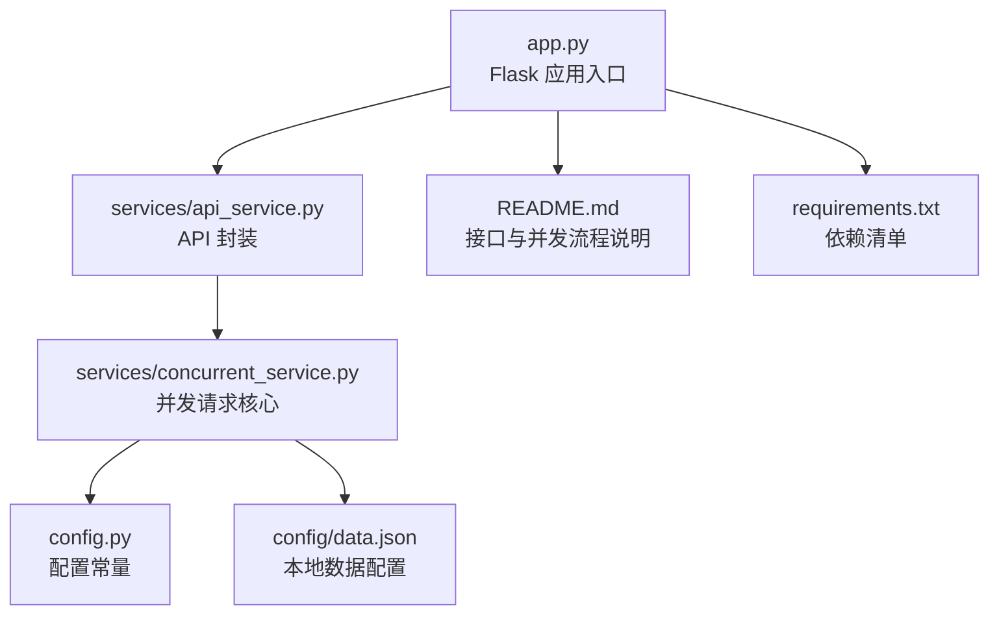
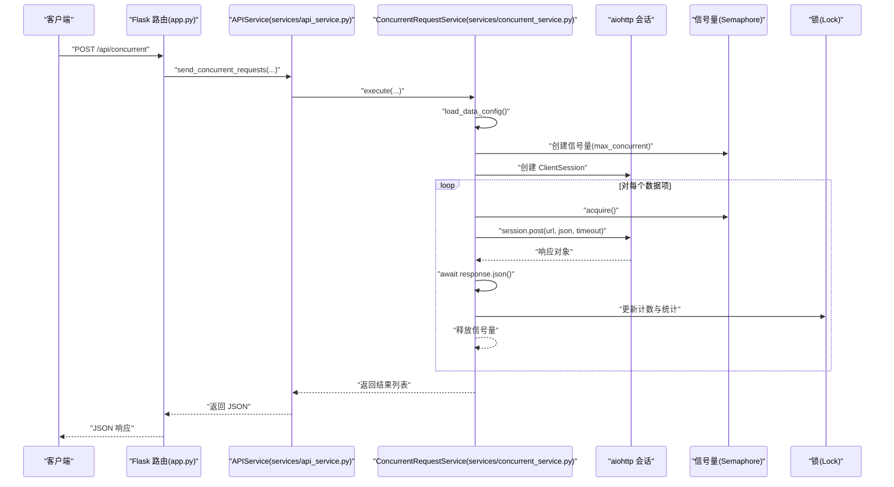
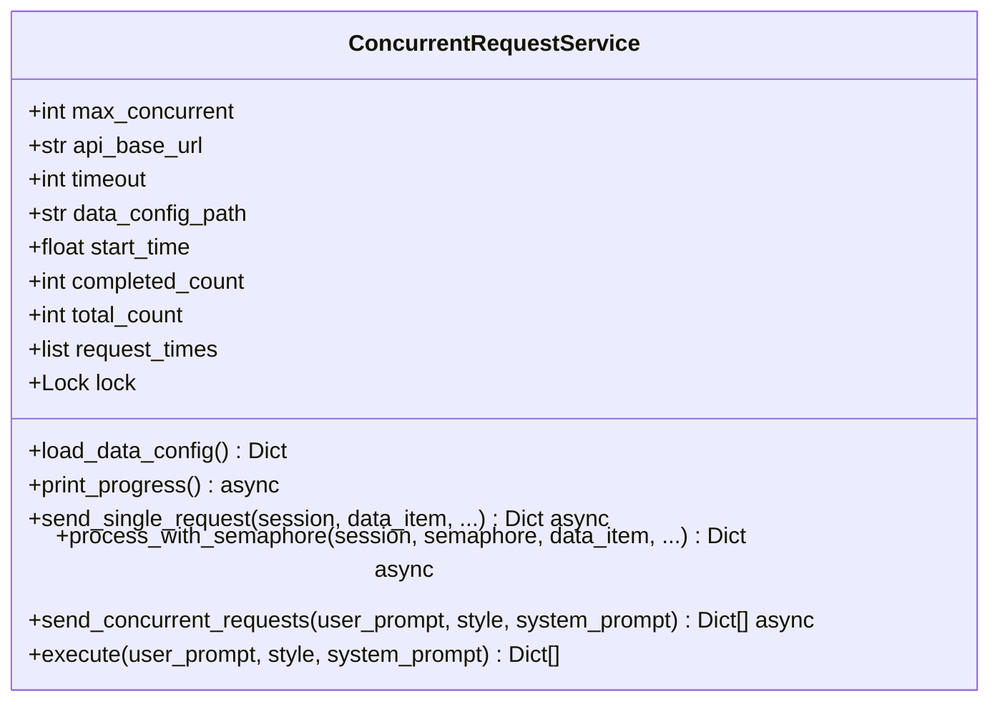
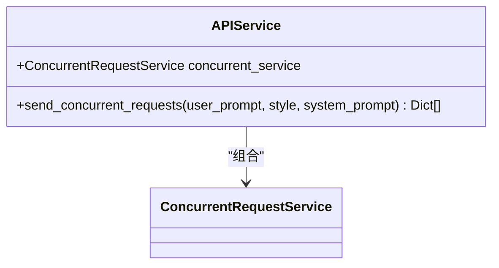
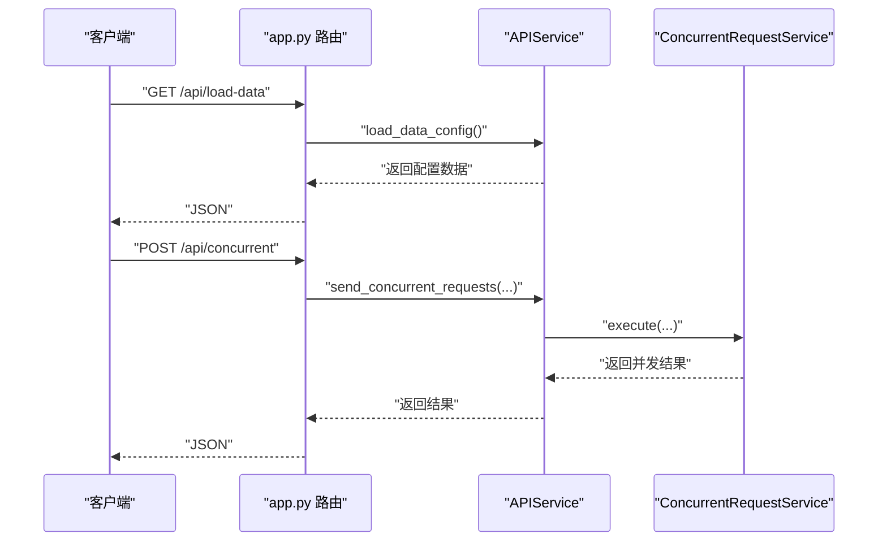
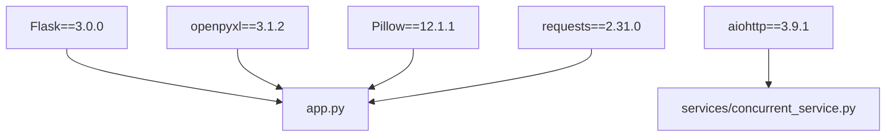

# 异步编程基础

<cite>
**本文引用的文件**
- [app.py](file://app.py)
- [services/api_service.py](file://services/api_service.py)
- [services/concurrent_service.py](file://services/concurrent_service.py)
- [config.py](file://config.py)
- [config/data.json](file://config/data.json)
- [README.md](file://README.md)
- [requirements.txt](file://requirements.txt)
</cite>

## 目录
1. [简介](#简介)
2. [项目结构](#项目结构)
3. [核心组件](#核心组件)
4. [架构总览](#架构总览)
5. [详细组件分析](#详细组件分析)
6. [依赖分析](#依赖分析)
7. [性能考量](#性能考量)
8. [故障排查指南](#故障排查指南)
9. [结论](#结论)
10. [附录](#附录)

## 简介
本入门文档围绕异步编程基础展开，结合项目中的实际实现，系统讲解 asyncio 的核心概念与使用方法，包括事件循环、协程（Coroutine）、任务（Task）与未来对象（Future）的工作原理；详解 async/await 关键字的作用机制；对比异步函数与普通函数在执行时机与内存管理上的差异；并通过项目中的并发请求服务展示如何创建与运行异步函数；最后总结异步编程的优势、适用场景、常见模式与最佳实践。

## 项目结构
该项目采用“Flask + asyncio + aiohttp”的组合，后端通过 Flask 提供 HTTP 接口，内部使用 asyncio 控制并发请求，将大量 I/O 密集型任务并行化，从而提升吞吐与响应速度。核心文件与职责如下：
- app.py：Flask 应用入口，定义路由与业务接口，调用服务层进行数据加载、并发请求与 Excel 导出。
- services/api_service.py：对外 API 的封装层，负责协调并发服务。
- services/concurrent_service.py：并发请求核心，使用 asyncio、aiohttp、信号量（Semaphore）与锁（Lock）实现并发控制与进度统计。
- config.py：读取环境变量并提供配置常量。
- config/data.json：本地数据配置文件，包含文风、系统提示词与待处理的数据项。
- README.md：项目说明、技术栈、接口文档与并发流程图等。
- requirements.txt：依赖清单，包含 Flask、aiohttp、openpyxl、Pillow 等。

图表来源
- [app.py:1-139](file://app.py#L1-L139)
- [services/api_service.py:1-14](file://services/api_service.py#L1-L14)
- [services/concurrent_service.py:1-162](file://services/concurrent_service.py#L1-L162)
- [config.py:1-12](file://config.py#L1-L12)
- [config/data.json:1-32](file://config/data.json#L1-L32)
- [README.md:1-401](file://README.md#L1-L401)
- [requirements.txt:1-6](file://requirements.txt#L1-L6)

章节来源
- [app.py:1-139](file://app.py#L1-L139)
- [README.md:24-44](file://README.md#L24-L44)

## 核心组件
本项目的核心在于并发请求服务，它展示了异步编程的关键要素：
- 事件循环：通过 asyncio.run() 启动事件循环，驱动协程执行。
- 协程（Coroutine）：以 async def 定义的异步函数，如 send_concurrent_requests、send_single_request、process_with_semaphore 等。
- 任务（Task）：通过 asyncio.create_task() 或 asyncio.gather() 将协程包装为任务，便于并发调度与结果收集。
- 未来对象（Future）：作为协程执行结果的占位符，asyncio.gather() 返回 Future 的聚合结果。
- 并发控制：使用 asyncio.Semaphore 控制最大并发数，避免资源过载。
- 锁（Lock）：在共享状态更新（如计数、日志）时保证线程安全。
- 异步 HTTP 客户端：使用 aiohttp.ClientSession 发起异步请求，配合 async with 与 await response.json() 获取响应。

章节来源
- [services/concurrent_service.py:118-162](file://services/concurrent_service.py#L118-L162)
- [services/concurrent_service.py:43-117](file://services/concurrent_service.py#L43-L117)
- [services/concurrent_service.py:138-146](file://services/concurrent_service.py#L138-L146)

## 架构总览
下图展示了从 HTTP 请求到并发处理再到结果返回的整体流程，体现了异步并发在 I/O 密集场景下的优势。

图表来源
- [app.py:43-61](file://app.py#L43-L61)
- [services/api_service.py:8-13](file://services/api_service.py#L8-L13)
- [services/concurrent_service.py:118-162](file://services/concurrent_service.py#L118-L162)
- [services/concurrent_service.py:140-146](file://services/concurrent_service.py#L140-L146)

## 详细组件分析

### 组件一：并发请求服务（ConcurrentRequestService）
该类是异步并发的核心，负责：
- 读取本地数据配置（load_data_config）
- 控制并发数（Semaphore）
- 发送单个异步请求（send_single_request）
- 包装并发执行（process_with_semaphore）
- 聚合结果（asyncio.gather）
- 执行入口（execute）

图表来源
- [services/concurrent_service.py:8-162](file://services/concurrent_service.py#L8-L162)

章节来源
- [services/concurrent_service.py:21-28](file://services/concurrent_service.py#L21-L28)
- [services/concurrent_service.py:30-42](file://services/concurrent_service.py#L30-L42)
- [services/concurrent_service.py:43-117](file://services/concurrent_service.py#L43-L117)
- [services/concurrent_service.py:114-117](file://services/concurrent_service.py#L114-L117)
- [services/concurrent_service.py:118-162](file://services/concurrent_service.py#L118-L162)
- [services/concurrent_service.py:160-162](file://services/concurrent_service.py#L160-L162)

### 组件二：API 封装服务（APIService）
该类作为对外接口的封装，将并发请求服务暴露为可调用的方法，简化上层调用。

图表来源
- [services/api_service.py:4-13](file://services/api_service.py#L4-L13)

章节来源
- [services/api_service.py:8-13](file://services/api_service.py#L8-L13)

### 组件三：Flask 路由与业务逻辑（app.py）
Flask 路由负责接收请求、解析参数、调用服务层并返回 JSON 响应；并发请求路由通过 APIService 调用并发服务，最终将结果返回给前端。

图表来源
- [app.py:29-42](file://app.py#L29-L42)
- [app.py:43-61](file://app.py#L43-L61)
- [services/api_service.py:8-13](file://services/api_service.py#L8-L13)
- [services/concurrent_service.py:160-162](file://services/concurrent_service.py#L160-L162)

章节来源
- [app.py:29-61](file://app.py#L29-L61)

### 组件四：配置与数据
- config.py：从环境变量读取 API 基础地址、超时时间、最大并发数与数据配置文件路径。
- config/data.json：包含文风选项、默认文风、系统提示词与待处理的数据项列表。

章节来源
- [config.py:3-11](file://config.py#L3-L11)
- [config/data.json:1-32](file://config/data.json#L1-L32)

## 依赖分析
项目依赖关系清晰，核心依赖包括：
- Flask：Web 框架，提供路由与 HTTP 服务。
- aiohttp：异步 HTTP 客户端，用于并发请求外部 API。
- openpyxl/Pillow：Excel 导出与图片处理。
- requests：同步 HTTP 客户端（在项目中用于非异步场景）。

图表来源
- [requirements.txt:1-6](file://requirements.txt#L1-L6)
- [app.py:1-139](file://app.py#L1-L139)
- [services/concurrent_service.py:1-7](file://services/concurrent_service.py#L1-L7)

章节来源
- [requirements.txt:1-6](file://requirements.txt#L1-L6)

## 性能考量
- I/O 密集场景：并发请求显著优于串行请求，因为等待网络 I/O 时 CPU 可以切换到其他任务。
- 并发上限：通过信号量控制最大并发数，避免过多连接导致资源争用或被目标服务器限流。
- 锁与共享状态：在更新计数与统计时使用锁，保证线程安全，但也要注意避免过度阻塞。
- 超时与异常：合理设置超时时间并捕获异常，防止长时间阻塞影响整体性能。
- 资源释放：使用 async with 管理 aiohttp 会话与文件句柄，确保资源及时释放。

章节来源
- [services/concurrent_service.py:138-146](file://services/concurrent_service.py#L138-L146)
- [services/concurrent_service.py:79-95](file://services/concurrent_service.py#L79-L95)

## 故障排查指南
- 并发请求超时：检查外部 API 是否可用、网络是否稳定、超时时间是否过短；适当增大超时或减少并发数。
- 并发数过大：降低 MAX_CONCURRENT_REQUESTS，避免被目标服务限流或自身资源耗尽。
- 图片导出失败：确认已安装 Pillow，检查图片格式与路径，使用支持图片嵌入的 Excel 客户端打开。
- 端口占用：修改 Flask 运行端口，避免冲突。
- 依赖安装失败：升级 pip 后重试安装依赖。

章节来源
- [README.md:314-373](file://README.md#L314-L373)
- [config.py:7-11](file://config.py#L7-L11)

## 结论
本项目以 Flask + asyncio + aiohttp 的组合，演示了在 I/O 密集场景下如何利用异步并发提升性能。通过信号量控制并发、锁保护共享状态、异步 HTTP 客户端处理请求与响应，形成了清晰的异步编程实践范式。掌握这些概念与模式，有助于在实际开发中高效处理高并发、低延迟的网络请求与数据处理任务。

## 附录

### 异步编程基础要点
- 事件循环：程序运行时的调度中枢，负责驱动协程的挂起与恢复。
- 协程（Coroutine）：以 async def 定义的函数，可在执行过程中暂停与恢复。
- 任务（Task）：协程的包装，便于并发调度与结果收集。
- 未来对象（Future）：表示尚未完成的计算结果，通常由任务或 gather 返回。
- async/await：async 用于声明协程，await 用于等待协程或 Future 的结果。
- 异步 vs 同步：异步适合 I/O 密集型任务，同步适合 CPU 密集型任务；异步在等待 I/O 时让出控制权，提升吞吐。

### 常见异步模式与最佳实践
- 并发控制：使用信号量限制同时进行的任务数量，避免资源过载。
- 结果聚合：使用 asyncio.gather 并发收集多个任务的结果。
- 资源管理：使用 async with 管理会话、文件等资源，确保及时释放。
- 错误处理：为每个任务设置合理的超时与异常处理策略。
- 进度与统计：在共享状态更新处使用锁，保证线程安全与一致性。

### 代码示例路径（不展示具体代码）
- 创建与运行异步函数：[services/concurrent_service.py:160-162](file://services/concurrent_service.py#L160-L162)
- 并发请求与结果聚合：[services/concurrent_service.py:118-162](file://services/concurrent_service.py#L118-L162)
- 单个异步请求与异常处理：[services/concurrent_service.py:43-117](file://services/concurrent_service.py#L43-L117)
- 信号量与并发控制：[services/concurrent_service.py:138-146](file://services/concurrent_service.py#L138-L146)
- 锁与共享状态更新：[services/concurrent_service.py:30-42](file://services/concurrent_service.py#L30-L42)