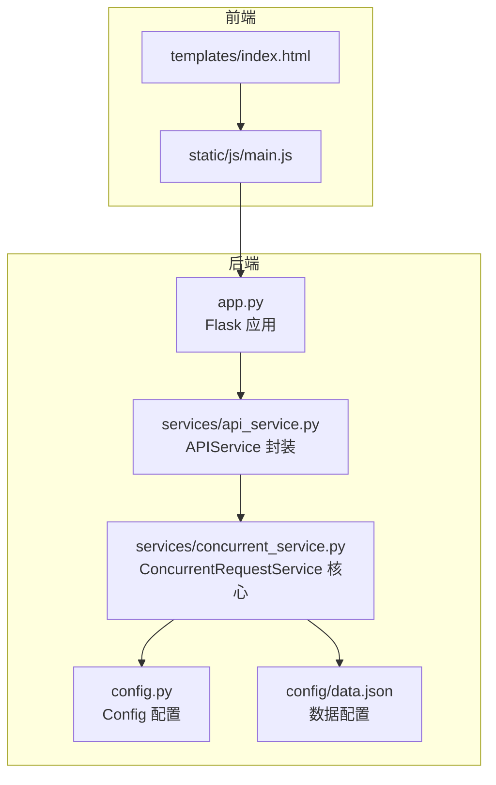
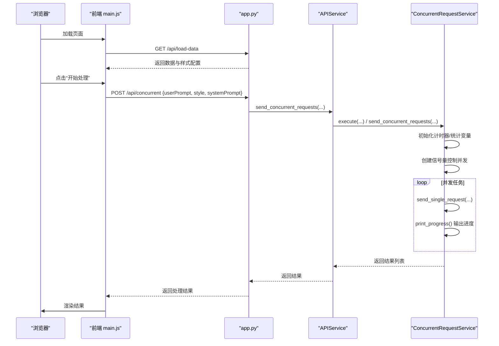
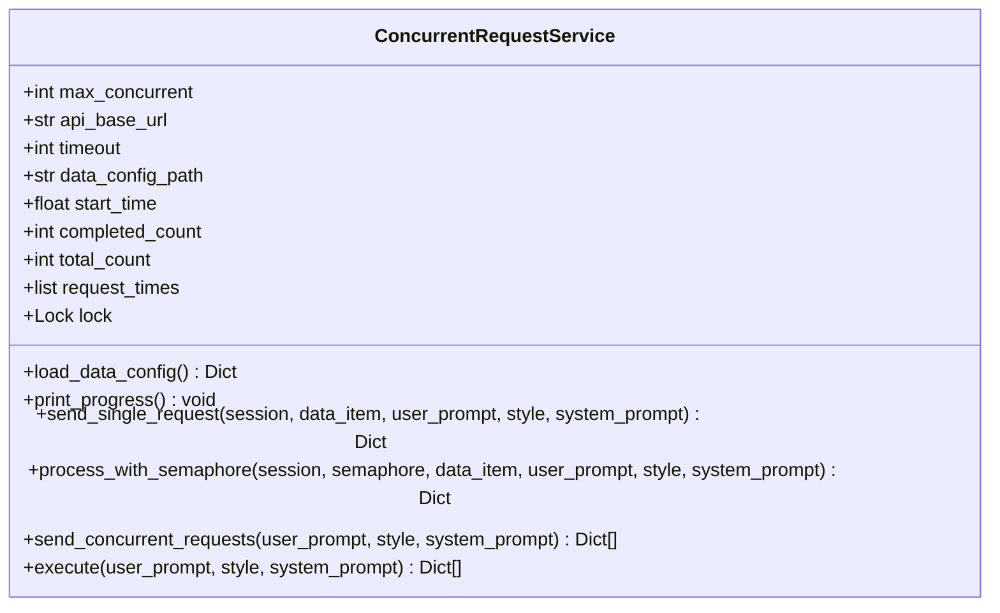
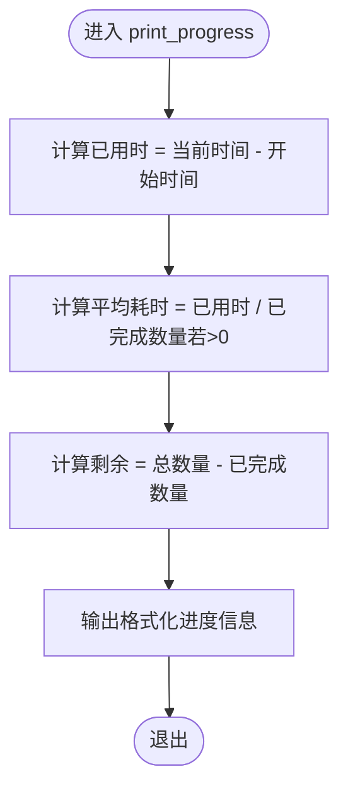
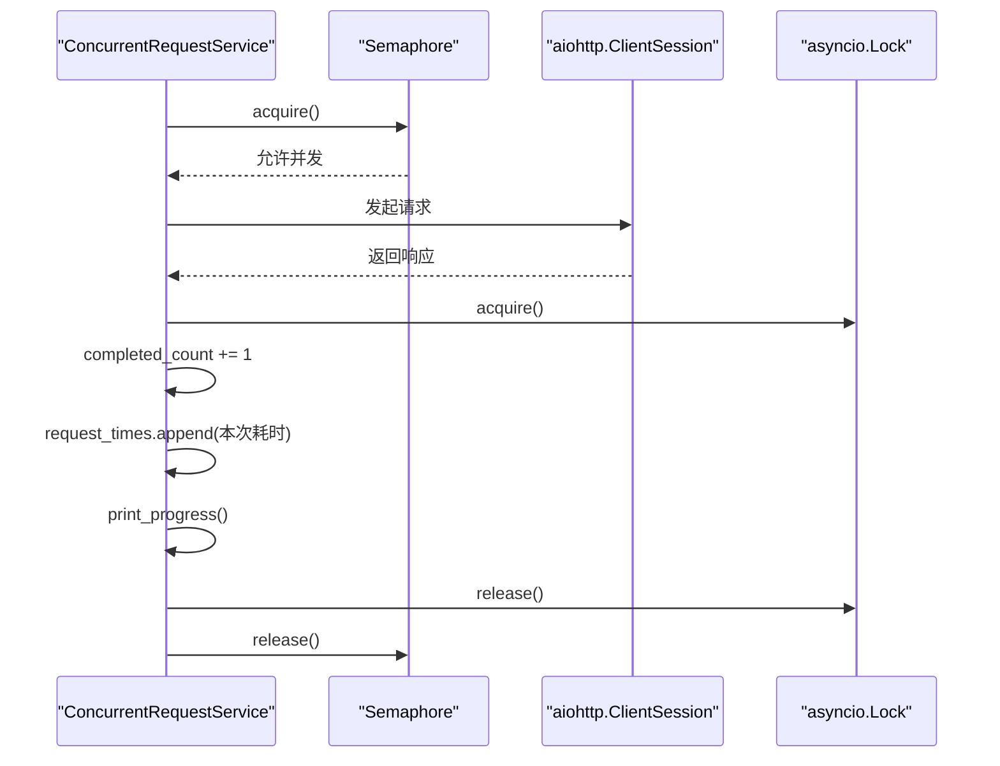
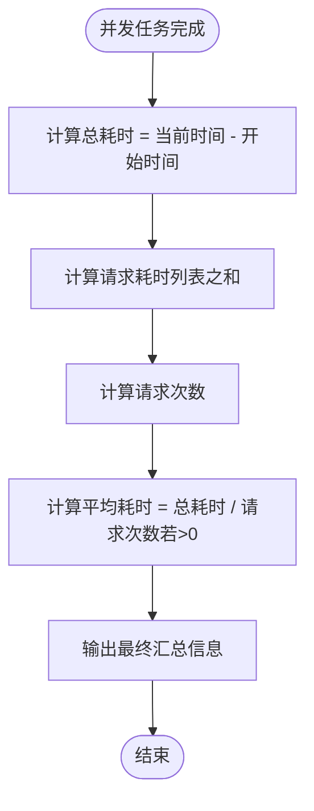
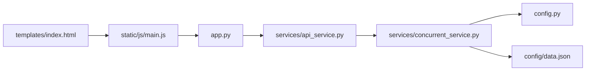

# 进度监控系统

<cite>
**本文引用的文件**
- [app.py](file://app.py)
- [services/api_service.py](file://services/api_service.py)
- [services/concurrent_service.py](file://services/concurrent_service.py)
- [config.py](file://config.py)
- [config/data.json](file://config/data.json)
- [templates/index.html](file://templates/index.html)
- [static/js/main.js](file://static/js/main.js)
- [README.md](file://README.md)
- [requirements.txt](file://requirements.txt)
</cite>

## 目录
1. [简介](#简介)
2. [项目结构](#项目结构)
3. [核心组件](#核心组件)
4. [架构总览](#架构总览)
5. [详细组件分析](#详细组件分析)
6. [依赖分析](#依赖分析)
7. [性能考虑](#性能考虑)
8. [故障排查指南](#故障排查指南)
9. [结论](#结论)
10. [附录](#附录)

## 简介
本项目是一个基于 Flask 的 Web 应用，用于批量处理图片文案，支持并发调用外部 API 生成文案，并可将结果导出为 Excel 文件。系统的核心能力之一是“实时进度监控”，通过并发控制与统计信息输出，帮助用户了解批量任务的执行状态与性能表现。本文档围绕进度监控系统进行深入技术解析，重点覆盖：
- 实时进度监控的实现机制：计时器管理、完成状态跟踪、统计信息计算
- print_progress() 方法的实现逻辑：总请求数、已完成数量、剩余数量、平均请求耗时、总耗时
- 线程安全与并发访问控制：锁机制与并发协调
- 进度信息的格式化输出与用户体验优化
- 大型批量处理的应用价值与性能影响分析

## 项目结构
项目采用分层架构设计，前端负责交互与展示，后端提供 API 与业务逻辑，服务层封装并发请求与进度监控，配置层集中管理环境变量与数据源。

图表来源
- [app.py:15-61](file://app.py#L15-L61)
- [services/api_service.py:4-13](file://services/api_service.py#L4-L13)
- [services/concurrent_service.py:8-19](file://services/concurrent_service.py#L8-L19)
- [config.py:3-11](file://config.py#L3-L11)
- [config/data.json:1-32](file://config/data.json#L1-L32)

章节来源
- [README.md:24-44](file://README.md#L24-L44)
- [app.py:15-61](file://app.py#L15-L61)
- [services/api_service.py:4-13](file://services/api_service.py#L4-L13)
- [services/concurrent_service.py:8-19](file://services/concurrent_service.py#L8-L19)
- [config.py:3-11](file://config.py#L3-L11)
- [config/data.json:1-32](file://config/data.json#L1-L32)

## 核心组件
- Flask 应用与路由：提供页面渲染、数据加载、并发请求、Excel 导出与图片代理接口。
- APIService：对外暴露统一的并发请求入口，封装并发服务实例。
- ConcurrentRequestService：并发请求核心，负责并发控制、进度统计、异常处理与最终汇总。
- Config：集中管理 API 基础地址、超时、最大并发数、数据配置路径等环境变量。
- 前端页面与脚本：负责加载数据、选择文风、触发并发请求、渲染结果与导出 Excel。

章节来源
- [app.py:15-61](file://app.py#L15-L61)
- [services/api_service.py:4-13](file://services/api_service.py#L4-L13)
- [services/concurrent_service.py:8-19](file://services/concurrent_service.py#L8-L19)
- [config.py:3-11](file://config.py#L3-L11)
- [templates/index.html:1-40](file://templates/index.html#L1-L40)
- [static/js/main.js:29-136](file://static/js/main.js#L29-L136)

## 架构总览
系统采用“前端-后端-服务层-配置层”的分层设计，后端通过 APIService 调用 ConcurrentRequestService，后者使用 asyncio 与 aiohttp 实现并发请求，并通过信号量控制并发度，使用锁保证统计信息的线程安全。

图表来源
- [app.py:29-61](file://app.py#L29-L61)
- [services/api_service.py:8-13](file://services/api_service.py#L8-L13)
- [services/concurrent_service.py:118-158](file://services/concurrent_service.py#L118-L158)

## 详细组件分析

### ConcurrentRequestService 组件分析
该组件是进度监控系统的核心，负责：
- 并发控制：使用 asyncio.Semaphore 控制最大并发数
- 计时与统计：记录开始时间、累计完成数、请求耗时列表
- 进度输出：print_progress() 实时打印关键指标
- 异常处理：对超时与异常进行统一处理并更新进度
- 最终汇总：在所有任务完成后计算总耗时与平均耗时

图表来源
- [services/concurrent_service.py:8-19](file://services/concurrent_service.py#L8-L19)
- [services/concurrent_service.py:30-42](file://services/concurrent_service.py#L30-L42)
- [services/concurrent_service.py:43-117](file://services/concurrent_service.py#L43-L117)
- [services/concurrent_service.py:118-158](file://services/concurrent_service.py#L118-L158)
- [services/concurrent_service.py:160-162](file://services/concurrent_service.py#L160-L162)

#### print_progress() 方法实现逻辑
print_progress() 是进度监控的关键方法，其计算与输出逻辑如下：
- 计算已用时：当前时间减去开始时间
- 计算平均请求耗时：已用时除以已完成数量（若已完成数量大于 0）
- 计算剩余数量：总数量减去已完成数量
- 输出格式化进度信息：总请求数、已完成、剩余、平均每个请求耗时、总耗时

图表来源
- [services/concurrent_service.py:30-42](file://services/concurrent_service.py#L30-L42)

章节来源
- [services/concurrent_service.py:30-42](file://services/concurrent_service.py#L30-L42)
- [README.md:123-131](file://README.md#L123-L131)

#### 并发控制与统计更新
- 并发控制：使用 asyncio.Semaphore 限制同时发起的请求数量
- 统计更新：在每次请求完成后，使用 asyncio.Lock 保护共享状态（已完成数、请求耗时列表），随后调用 print_progress() 输出进度
- 请求耗时：在单次请求开始与结束分别记录时间，计算本次请求耗时并加入列表

图表来源
- [services/concurrent_service.py:114-117](file://services/concurrent_service.py#L114-L117)
- [services/concurrent_service.py:43-117](file://services/concurrent_service.py#L43-L117)
- [services/concurrent_service.py:18](file://services/concurrent_service.py#L18)

章节来源
- [services/concurrent_service.py:114-117](file://services/concurrent_service.py#L114-L117)
- [services/concurrent_service.py:43-117](file://services/concurrent_service.py#L43-L117)

#### 最终汇总与统计
在所有任务完成后，系统会计算总耗时与平均请求耗时，并输出最终汇总信息。总耗时等于当前时间减去开始时间；平均请求耗时等于请求耗时列表之和除以列表长度（若非空）。

图表来源
- [services/concurrent_service.py:148-158](file://services/concurrent_service.py#L148-L158)

章节来源
- [services/concurrent_service.py:148-158](file://services/concurrent_service.py#L148-L158)

### 线程安全与并发访问控制
- 锁机制：使用 asyncio.Lock 保护共享状态（已完成数、请求耗时列表），避免并发写入导致的数据竞争
- 并发协调：使用 asyncio.Semaphore 控制最大并发数，防止资源过载
- 异常安全：对超时与异常进行捕获，确保即使部分请求失败也能正确更新进度并继续执行

章节来源
- [services/concurrent_service.py:18](file://services/concurrent_service.py#L18)
- [services/concurrent_service.py:63-66](file://services/concurrent_service.py#L63-L66)
- [services/concurrent_service.py:82-102](file://services/concurrent_service.py#L82-L102)

### 进度信息格式化输出与用户体验优化
- 终端输出：print_progress() 输出清晰的进度条与关键指标，便于开发者与运维人员观察
- 前端展示：前端通过渲染数据列表展示每条数据的处理状态（成功/失败）、原始文案与返回文案，提升用户可见性
- 导出功能：支持将结果导出为 Excel，图片直接嵌入单元格，便于线下审阅与存档

章节来源
- [services/concurrent_service.py:30-42](file://services/concurrent_service.py#L30-L42)
- [static/js/main.js:138-218](file://static/js/main.js#L138-L218)
- [app.py:63-135](file://app.py#L63-L135)

### 大型批量处理的应用价值与性能影响
- 应用价值：在大规模数据处理场景中，实时进度监控能显著提升可观测性与可维护性，帮助用户评估任务规模与资源消耗，及时发现异常并采取措施
- 性能影响：合理设置最大并发数与超时时间，可在吞吐量与稳定性之间取得平衡；统计信息的输出频率需要权衡可观测性与 I/O 成本

章节来源
- [README.md:106-131](file://README.md#L106-L131)
- [config.py:7-11](file://config.py#L7-L11)

## 依赖分析
系统依赖关系清晰，后端通过服务层封装并发逻辑，前端通过 AJAX 调用后端接口，配置层集中管理环境变量与数据源。

图表来源
- [app.py:10-13](file://app.py#L10-L13)
- [services/api_service.py:2-6](file://services/api_service.py#L2-L6)
- [services/concurrent_service.py:6-13](file://services/concurrent_service.py#L6-L13)
- [config.py:1-12](file://config.py#L1-L12)
- [config/data.json:1-32](file://config/data.json#L1-L32)
- [static/js/main.js:29-136](file://static/js/main.js#L29-L136)
- [templates/index.html:1-40](file://templates/index.html#L1-L40)

章节来源
- [requirements.txt:1-6](file://requirements.txt#L1-L6)
- [app.py:10-13](file://app.py#L10-L13)
- [services/api_service.py:2-6](file://services/api_service.py#L2-L6)
- [services/concurrent_service.py:6-13](file://services/concurrent_service.py#L6-L13)
- [config.py:1-12](file://config.py#L1-L12)
- [config/data.json:1-32](file://config/data.json#L1-L32)
- [static/js/main.js:29-136](file://static/js/main.js#L29-L136)
- [templates/index.html:1-40](file://templates/index.html#L1-L40)

## 性能考虑
- 并发度控制：通过环境变量配置最大并发数，避免对下游服务造成过大压力
- 超时设置：合理设置请求超时时间，防止长时间阻塞影响整体吞吐
- 统计成本：频繁输出进度信息会带来 I/O 成本，建议在大批量任务中适当降低输出频率或改为周期性汇总
- 资源释放：确保 aiohttp 会话与信号量在任务结束后正确释放，避免资源泄漏

## 故障排查指南
- 并发请求超时：检查外部 API 服务状态与网络连通性，适当增加超时时间或减少并发数
- 图片无法显示：确认图片路径正确且文件存在，使用图片代理接口进行访问
- Excel 导出失败：检查 Pillow 是否安装，图片格式是否受支持，使用 Excel 或 WPS 打开文件
- 端口占用：修改 Flask 监听端口，避免冲突

章节来源
- [README.md:329-348](file://README.md#L329-L348)
- [README.md:353-373](file://README.md#L353-L373)

## 结论
本进度监控系统通过合理的并发控制、统计信息采集与线程安全机制，实现了对大规模批量任务的实时可观测性。print_progress() 方法提供了直观的进度指标，结合前端渲染与 Excel 导出，有效提升了用户体验与交付质量。在实际部署中，建议根据业务规模与资源状况动态调整并发度与超时策略，以获得最佳的吞吐与稳定性平衡。

## 附录
- 环境变量与默认值参考：API 基础地址、超时时间、最大并发数、数据配置路径
- API 接口说明：加载数据、并发请求、导出 Excel、图片代理
- 前端交互流程：页面加载、文风选择、触发处理、结果渲染、导出 Excel

章节来源
- [README.md:78-88](file://README.md#L78-L88)
- [README.md:89-186](file://README.md#L89-L186)
- [README.md:187-213](file://README.md#L187-L213)