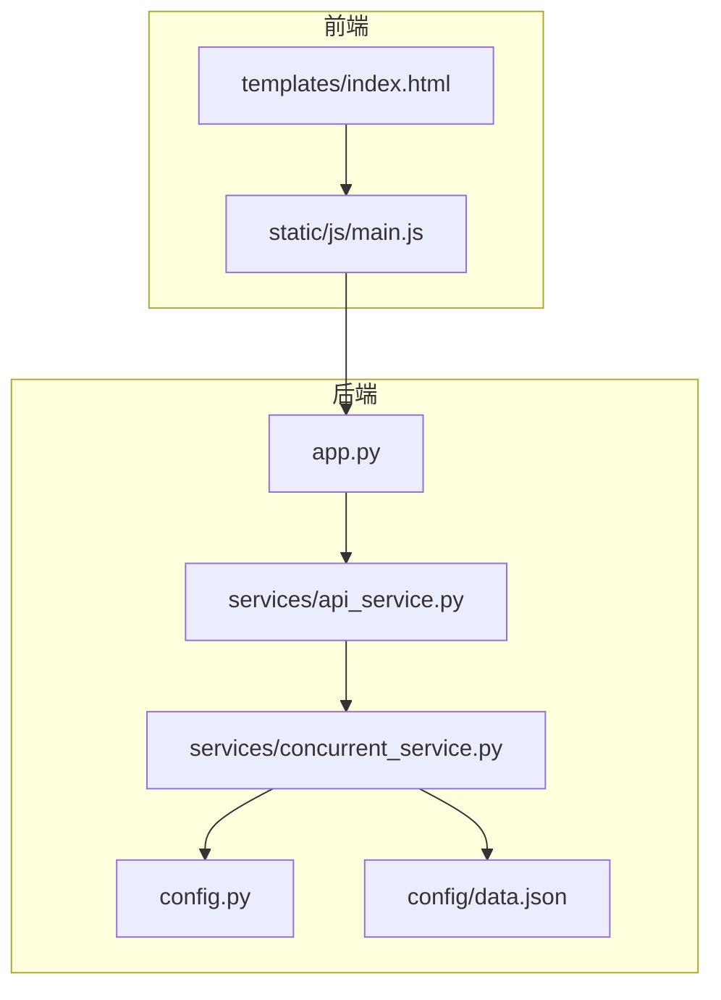
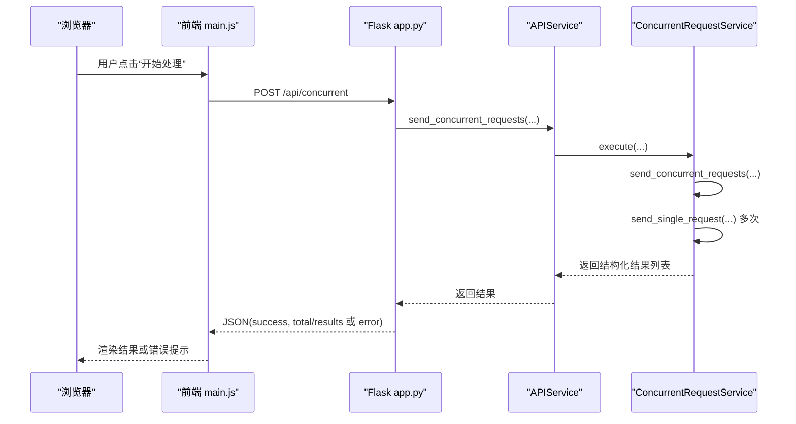
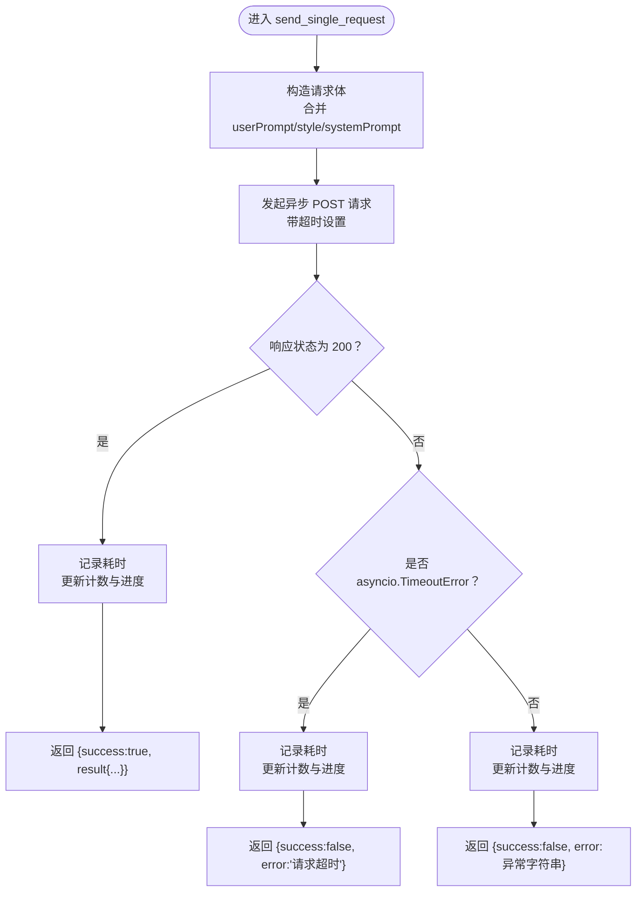
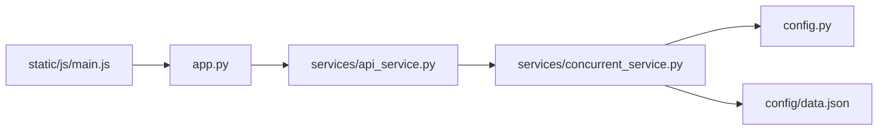
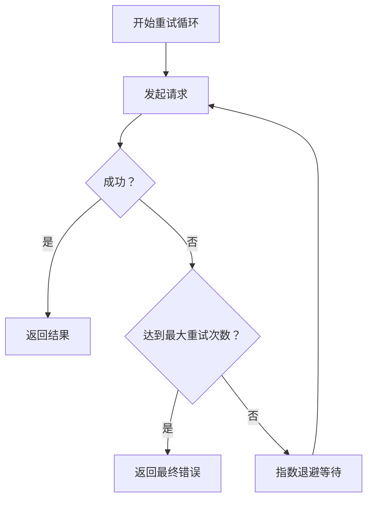

# 错误处理与恢复

<cite>
**本文引用的文件列表**
- [app.py](file://app.py)
- [services/api_service.py](file://services/api_service.py)
- [services/concurrent_service.py](file://services/concurrent_service.py)
- [config.py](file://config.py)
- [config/data.json](file://config/data.json)
- [static/js/main.js](file://static/js/main.js)
- [templates/index.html](file://templates/index.html)
</cite>

## 目录
1. [简介](#简介)
2. [项目结构](#项目结构)
3. [核心组件](#核心组件)
4. [架构总览](#架构总览)
5. [详细组件分析](#详细组件分析)
6. [依赖关系分析](#依赖关系分析)
7. [性能考量](#性能考量)
8. [故障排查指南](#故障排查指南)
9. [结论](#结论)
10. [附录](#附录)

## 简介
本文件聚焦于异步请求中的错误处理与恢复机制，覆盖以下主题：
- 异步请求中的异常分类：超时错误、网络错误、业务逻辑错误
- send_single_request() 方法的异常捕获与区分策略
- 结构化错误返回格式（success 标志、错误消息、原始数据保留）
- 重试机制设计思路与实现建议（含指数退避）
- 错误恢复最佳实践：资源清理、状态回滚、用户反馈
- 常见错误场景的诊断与解决

## 项目结构
后端采用 Flask 提供 REST 接口，服务层通过 asyncio + aiohttp 实现并发请求；前端使用原生 JavaScript 进行交互与展示。

图表来源
- [app.py:1-139](file://app.py#L1-L139)
- [services/api_service.py:1-14](file://services/api_service.py#L1-L14)
- [services/concurrent_service.py:1-162](file://services/concurrent_service.py#L1-L162)
- [config.py:1-12](file://config.py#L1-L12)
- [config/data.json:1-32](file://config/data.json#L1-L32)

章节来源
- [app.py:1-139](file://app.py#L1-L139)
- [services/api_service.py:1-14](file://services/api_service.py#L1-L14)
- [services/concurrent_service.py:1-162](file://services/concurrent_service.py#L1-L162)
- [config.py:1-12](file://config.py#L1-L12)
- [config/data.json:1-32](file://config/data.json#L1-L32)

## 核心组件
- Flask 应用与路由：负责接收请求、调用服务层、返回统一结构化响应
- APIService：服务层入口，转发到并发请求服务
- ConcurrentRequestService：核心异步请求执行器，包含 send_single_request() 的异常处理与结构化返回
- 配置模块：读取环境变量，控制 API 地址、超时、并发度、数据配置路径
- 前端脚本：发起异步请求、解析响应、渲染界面、处理用户反馈

章节来源
- [app.py:19-61](file://app.py#L19-L61)
- [services/api_service.py:4-14](file://services/api_service.py#L4-L14)
- [services/concurrent_service.py:43-112](file://services/concurrent_service.py#L43-L112)
- [config.py:3-12](file://config.py#L3-L12)
- [static/js/main.js:29-136](file://static/js/main.js#L29-L136)

## 架构总览
后端接口在 Flask 中暴露，内部通过 APIService 调用 ConcurrentRequestService 执行并发请求。请求体包含用户提示词、文风、系统提示词等参数；返回体统一包含 success 标志、错误信息（若失败）以及原始数据保留字段。

图表来源
- [app.py:43-61](file://app.py#L43-L61)
- [services/api_service.py:8-13](file://services/api_service.py#L8-L13)
- [services/concurrent_service.py:118-158](file://services/concurrent_service.py#L118-L158)
- [static/js/main.js:87-136](file://static/js/main.js#L87-L136)

## 详细组件分析

### send_single_request() 异常捕获与分类处理
该方法对单个请求进行异步发送，并在不同异常类型下返回一致的结构化结果，便于上层聚合与前端展示。

- 成功路径：当响应状态码为 200 时，success 标志为真，返回原始文本、图片列表与生成文案
- 超时错误：捕获 asyncio.TimeoutError，success 为假，error 字段为“请求超时”，同时保留原始文本与图片列表
- 其他异常：捕获通用异常，success 为假，error 字段为异常字符串，同样保留原始数据

图表来源
- [services/concurrent_service.py:43-112](file://services/concurrent_service.py#L43-L112)

章节来源
- [services/concurrent_service.py:43-112](file://services/concurrent_service.py#L43-L112)

### 结构化返回格式规范
- 统一字段
  - success：布尔值，表示本次请求是否成功
  - error：字符串，仅在失败时存在，描述错误原因
  - data_id：整数或标识符，对应输入数据项 ID
  - result：对象，包含原始文本、图片列表与生成文案
  - request_time：数值，本次请求耗时（秒）
  - status：HTTP 状态码（仅在成功时存在）

- 失败时保留的原始数据
  - result.text：原始文案
  - result.photos：图片数组（每张图片含 id、url）

- 成功时新增字段
  - result.generated_text：生成文案
  - status：HTTP 状态码
  - request_time：请求耗时

章节来源
- [services/concurrent_service.py:68-78](file://services/concurrent_service.py#L68-L78)
- [services/concurrent_service.py:86-95](file://services/concurrent_service.py#L86-L95)
- [services/concurrent_service.py:103-112](file://services/concurrent_service.py#L103-L112)

### 路由层错误处理与统一返回
- /api/concurrent：POST，接收 userPrompt、style、systemPrompt，返回 {success, total, results} 或 {success:false, error}
- /api/load-data：GET，返回 {success, data, styles, default_style, system_prompt}
- /api/export-excel：POST，返回 Excel 文件或 {success:false, error}

章节来源
- [app.py:29-61](file://app.py#L29-L61)
- [app.py:63-135](file://app.py#L63-L135)

### 前端错误处理与用户反馈
- 加载数据：若后端返回 success=false，弹窗提示错误；成功则渲染数据列表
- 处理数据：同上，成功后启用导出按钮
- 图片加载：图片 onerror 回退为占位图，避免页面崩溃
- 导出 Excel：响应非 ok 时提示导出失败

章节来源
- [static/js/main.js:29-85](file://static/js/main.js#L29-L85)
- [static/js/main.js:87-136](file://static/js/main.js#L87-L136)
- [static/js/main.js:220-260](file://static/js/main.js#L220-L260)

### 并发控制与进度统计
- 使用 asyncio.Semaphore 控制最大并发数
- 使用 asyncio.Lock 保护共享状态（计数、耗时列表）
- 每完成一个请求打印进度（总请求数、已完成、剩余、平均耗时、总耗时）

章节来源
- [services/concurrent_service.py:138-158](file://services/concurrent_service.py#L138-L158)
- [services/concurrent_service.py:30-41](file://services/concurrent_service.py#L30-L41)
- [services/concurrent_service.py:19](file://services/concurrent_service.py#L19)

### 配置与环境变量
- API_BASE_URL：后端服务地址
- API_TIMEOUT：请求超时时间（秒）
- MAX_CONCURRENT_REQUESTS：最大并发数
- DATA_CONFIG_PATH：本地数据配置文件路径

章节来源
- [config.py:3-12](file://config.py#L3-L12)
- [config/data.json:1-32](file://config/data.json#L1-L32)

## 依赖关系分析
- app.py 依赖 services.api_service.APIService
- APIService 依赖 services.concurrent_service.ConcurrentRequestService
- ConcurrentRequestService 依赖 config.Config 与本地数据文件
- 前端依赖后端接口返回的数据结构

图表来源
- [app.py:10-13](file://app.py#L10-L13)
- [services/api_service.py:2](file://services/api_service.py#L2)
- [services/concurrent_service.py:6](file://services/concurrent_service.py#L6)
- [config.py:1-12](file://config.py#L1-L12)
- [config/data.json:1-32](file://config/data.json#L1-L32)
- [static/js/main.js:1-266](file://static/js/main.js#L1-L266)

章节来源
- [app.py:10-13](file://app.py#L10-L13)
- [services/api_service.py:2](file://services/api_service.py#L2)
- [services/concurrent_service.py:6](file://services/concurrent_service.py#L6)
- [config.py:1-12](file://config.py#L1-L12)
- [config/data.json:1-32](file://config/data.json#L1-L32)
- [static/js/main.js:1-266](file://static/js/main.js#L1-L266)

## 性能考量
- 并发度控制：通过信号量限制最大并发，避免资源争用与服务端过载
- 超时设置：为单次请求设置超时，防止长时间阻塞
- 进度统计：在锁保护下更新计数与耗时，保证统计准确性
- 建议优化
  - 对频繁失败的请求进行退避重试（见下一节）
  - 将耗时较长的 IO 操作（如图片写入 Excel）异步化或分批处理

[本节为通用性能讨论，不直接分析具体文件]

## 故障排查指南

### 常见错误场景与诊断
- 配置文件加载失败
  - 现象：/api/load-data 返回空数据或默认值
  - 诊断：检查 DATA_CONFIG_PATH 是否正确，文件编码是否为 UTF-8
  - 解决：修正路径或修复文件编码
  - 章节来源
    - [services/concurrent_service.py:21-28](file://services/concurrent_service.py#L21-L28)
    - [config.py:11](file://config.py#L11)

- 请求超时
  - 现象：单条结果 error 为“请求超时”，request_time 显著偏大
  - 诊断：检查 API_BASE_URL、API_TIMEOUT、网络连通性
  - 解决：提高超时阈值、优化目标服务性能、检查代理/防火墙
  - 章节来源
    - [services/concurrent_service.py:79-95](file://services/concurrent_service.py#L79-L95)
    - [config.py:7-8](file://config.py#L7-L8)

- 业务逻辑错误（非 200 响应）
  - 现象：success 为假，error 为异常字符串，result 保留原始数据
  - 诊断：查看后端日志与上游服务返回体
  - 解决：修复上游服务逻辑或调整请求参数
  - 章节来源
    - [services/concurrent_service.py:96-112](file://services/concurrent_service.py#L96-L112)

- 前端图片加载失败
  - 现象：图片占位图显示
  - 诊断：检查 /api/photo 路由与文件路径
  - 解决：确保文件存在且路径正确
  - 章节来源
    - [app.py:19-27](file://app.py#L19-L27)
    - [static/js/main.js:158-166](file://static/js/main.js#L158-L166)

### 重试机制设计与实现建议
当前代码未实现自动重试。建议在 send_single_request() 内部增加指数退避重试：
- 重试条件：针对网络瞬时错误（如连接超时、DNS 解析失败）与 5xx 类错误
- 退避策略：基础等待时间 × 2^N，加入随机抖动避免雪崩
- 重试上限：最大尝试次数（如 3 次），超过后返回最终错误
- 注意事项：避免对幂等性不强的操作重复提交；对超时类错误谨慎重试

[本图为概念流程图，不直接映射具体源码文件]

### 错误恢复最佳实践
- 资源清理
  - aiohttp 会自动管理连接池与会话生命周期；在异常路径仍需确保计数与进度统计的原子更新（当前已使用锁）
- 状态回滚
  - 当部分请求失败时，保持已成功的数据不变，仅标记失败项；导出 Excel 时将失败项标注为错误
- 用户反馈
  - 前端对 success=false 的情况弹窗提示；对图片加载失败提供占位图
  - 后端统一返回 {success, error}，便于前端一致处理

章节来源
- [services/concurrent_service.py:19](file://services/concurrent_service.py#L19)
- [services/concurrent_service.py:82-101](file://services/concurrent_service.py#L82-L101)
- [static/js/main.js:77-84](file://static/js/main.js#L77-L84)
- [static/js/main.js:124-132](file://static/js/main.js#L124-L132)

## 结论
本项目在异步请求中实现了清晰的异常分类与结构化返回，结合并发控制与进度统计，能够稳定地处理大量请求。为进一步提升健壮性，建议引入指数退避重试、增强错误分类与可观测性，并完善失败项的可视化与导出标注。

[本节为总结性内容，不直接分析具体文件]

## 附录

### API 定义与返回格式
- GET /api/load-data
  - 成功返回：{success:true, data:[], styles:[], default_style:"", system_prompt:""}
  - 失败返回：{success:false, error:"..."}
- POST /api/concurrent
  - 请求体：{userPrompt:"", style:"", systemPrompt:""}
  - 成功返回：{success:true, total:int, results:[{data_id, success, result{...}, request_time, status?}]}
  - 失败返回：{success:false, error:"..."}
- POST /api/export-excel
  - 请求体：{results:[{data_id, success, result{...}, request_time, error?}]}
  - 成功返回：Excel 文件流
  - 失败返回：{success:false, error:"..."}
- GET /api/photo/{path}
  - 成功返回：文件流或 404

章节来源
- [app.py:29-61](file://app.py#L29-L61)
- [app.py:63-135](file://app.py#L63-L135)
- [app.py:19-27](file://app.py#L19-L27)