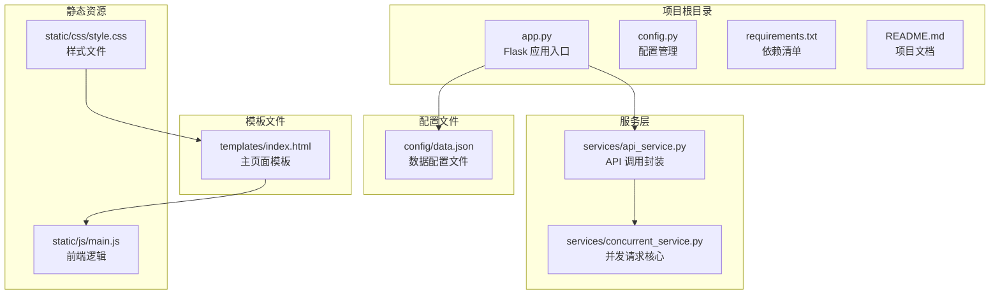
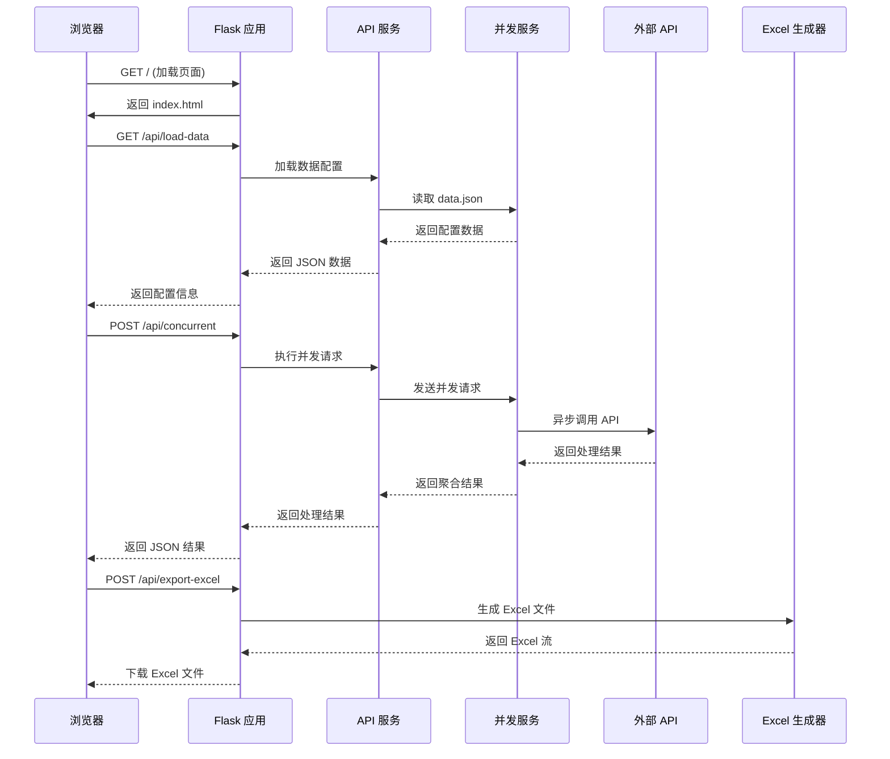
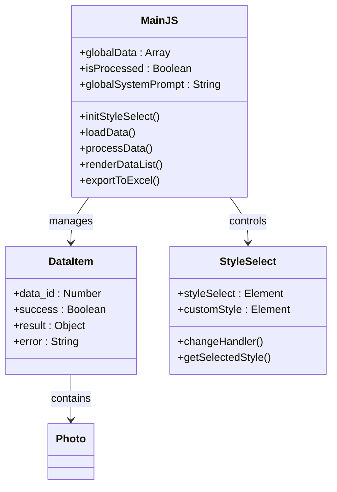
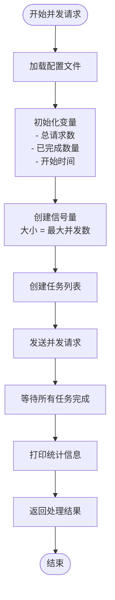
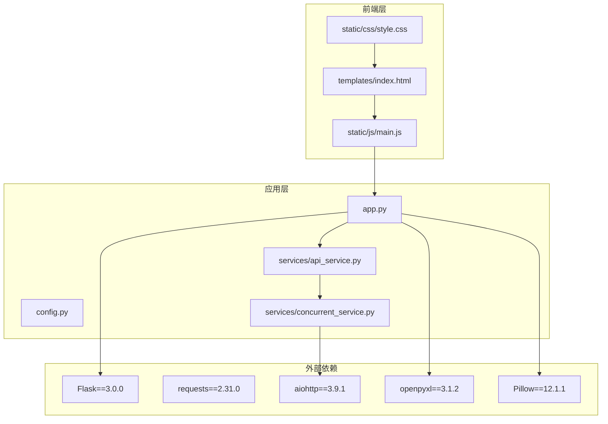

# 快速开始

<cite>
**本文引用的文件**
- [README.md](file://README.md)
- [requirements.txt](file://requirements.txt)
- [config/data.json](file://config/data.json)
- [app.py](file://app.py)
- [config.py](file://config.py)
- [services/api_service.py](file://services/api_service.py)
- [services/concurrent_service.py](file://services/concurrent_service.py)
- [templates/index.html](file://templates/index.html)
- [static/js/main.js](file://static/js/main.js)
- [static/css/style.css](file://static/css/style.css)
</cite>

## 目录
1. [简介](#简介)
2. [项目结构](#项目结构)
3. [核心组件](#核心组件)
4. [架构概览](#架构概览)
5. [详细组件分析](#详细组件分析)
6. [依赖分析](#依赖分析)
7. [性能考虑](#性能考虑)
8. [故障排除指南](#故障排除指南)
9. [结论](#结论)
10. [附录](#附录)

## 简介
本项目是一个基于 Flask 的 AI 文案评测对比系统，支持批量处理图片文案、并发调用外部 API、实时进度跟踪以及 Excel 导出功能。系统采用前后端分离架构，前端使用 HTML5 + CSS3 + JavaScript，后端使用 Flask 3.0.0，通过异步并发请求提升处理效率。

## 项目结构
项目采用标准的 Flask 项目结构，包含以下主要目录和文件：



**图表来源**
- [app.py:1-139](file://app.py#L1-L139)
- [config.py:1-12](file://config.py#L1-L12)
- [services/api_service.py:1-14](file://services/api_service.py#L1-L14)
- [services/concurrent_service.py:1-162](file://services/concurrent_service.py#L1-L162)

**章节来源**
- [README.md:24-44](file://README.md#L24-L44)
- [app.py:12-139](file://app.py#L12-L139)

## 核心组件
系统的核心组件包括 Flask 应用、配置管理、API 服务封装和并发请求服务。

### Flask 应用架构
Flask 应用作为整个系统的核心，负责路由管理、请求处理和响应返回。应用包含以下主要路由：

- **首页路由** (`/`)：渲染主页面模板
- **数据加载接口** (`/api/load-data`)：从配置文件加载数据
- **并发请求接口** (`/api/concurrent`)：执行并发 API 调用
- **Excel 导出接口** (`/api/export-excel`)：生成并下载 Excel 文件
- **图片代理接口** (`/api/photo/<path:filename>`)：解决本地文件访问限制

### 配置管理系统
配置系统采用集中式管理方式，通过 `Config` 类统一管理所有环境变量：

- **调试模式**：FLASK_DEBUG（默认 True）
- **密钥设置**：SECRET_KEY（默认 your-secret-key-here）
- **API 基础地址**：API_BASE_URL（默认 http://example.com/api）
- **请求超时**：API_TIMEOUT（默认 30 秒）
- **最大并发数**：MAX_CONCURRENT_REQUESTS（默认 5）
- **数据配置路径**：DATA_CONFIG_PATH（默认 config/data.json）

### 服务层架构
服务层采用分层设计，提供清晰的职责分离：

- **APIService**：对外提供统一的 API 调用接口
- **ConcurrentRequestService**：实现并发请求的核心逻辑
- **数据加载**：从 JSON 配置文件读取数据项
- **进度跟踪**：实时显示处理进度和统计信息

**章节来源**
- [app.py:15-139](file://app.py#L15-L139)
- [config.py:3-12](file://config.py#L3-L12)
- [services/api_service.py:4-14](file://services/api_service.py#L4-L14)
- [services/concurrent_service.py:8-162](file://services/concurrent_service.py#L8-L162)

## 架构概览
系统采用前后端分离架构，前端负责用户交互和数据展示，后端提供 RESTful API 服务。



**图表来源**
- [app.py:29-139](file://app.py#L29-L139)
- [services/api_service.py:8-14](file://services/api_service.py#L8-L14)
- [services/concurrent_service.py:118-162](file://services/concurrent_service.py#L118-L162)

## 详细组件分析

### 数据配置文件分析
数据配置文件采用 JSON 格式，包含全局配置和数据项列表。

#### 配置文件结构
```json
{
  "style": ["文艺", "网红", "叙事", "自定义"],
  "default_style": "文艺",
  "system_prompt": "系统提示词内容",
  "data": [
    {
      "id": 1,
      "text": "默认文案内容",
      "photos": [
        {
          "id": 1,
          "url": "/path/to/photo1.jpg"
        }
      ]
    }
  ]
}
```

#### 关键字段说明
- **style**：可用的文风选项数组
- **default_style**：默认选中的文风
- **system_prompt**：系统提示词内容
- **data**：数据项数组，每个包含：
  - **id**：数据项唯一标识
  - **text**：原始文案内容
  - **photos**：图片数组，每张图片包含：
    - **id**：图片唯一标识
    - **url**：图片文件路径

### 前端组件分析
前端采用响应式设计，包含数据加载、文风选择、并发处理和 Excel 导出功能。

#### 前端架构


**图表来源**
- [static/js/main.js:1-266](file://static/js/main.js#L1-L266)

#### 核心功能流程
1. **页面初始化**：加载样式选项和系统提示词
2. **数据加载**：从后端获取配置数据
3. **文风选择**：支持预设文风和自定义文风
4. **并发处理**：发送请求到后端执行并发 API 调用
5. **结果展示**：实时渲染处理结果
6. **Excel 导出**：生成包含图片的 Excel 文件

**章节来源**
- [templates/index.html:1-40](file://templates/index.html#L1-L40)
- [static/js/main.js:5-266](file://static/js/main.js#L5-L266)

### 并发请求服务分析
并发请求服务是系统的核心组件，负责处理异步并发请求和进度跟踪。

#### 并发控制机制


**图表来源**
- [services/concurrent_service.py:118-162](file://services/concurrent_service.py#L118-L162)

#### 错误处理策略
并发服务实现了完善的错误处理机制：

1. **超时处理**：捕获 `asyncio.TimeoutError` 异常
2. **网络异常**：捕获通用异常并记录错误信息
3. **进度更新**：即使发生错误也更新进度统计
4. **结果包装**：统一返回结构化的结果对象

**章节来源**
- [services/concurrent_service.py:43-116](file://services/concurrent_service.py#L43-L116)

## 依赖分析
系统依赖关系清晰，采用模块化设计，各组件职责明确。



**图表来源**
- [requirements.txt:1-6](file://requirements.txt#L1-L6)
- [app.py:1-139](file://app.py#L1-L139)

**章节来源**
- [requirements.txt:1-6](file://requirements.txt#L1-L6)
- [app.py:10-13](file://app.py#L10-L13)

## 性能考虑
系统在设计时充分考虑了性能优化，采用异步并发处理提升吞吐量。

### 并发优化策略
1. **信号量控制**：通过 `asyncio.Semaphore` 限制最大并发数
2. **异步 I/O**：使用 `aiohttp` 进行非阻塞网络请求
3. **内存管理**：及时释放临时资源和清理缓存
4. **进度统计**：实时计算平均耗时和剩余时间

### Excel 导出优化
1. **图片尺寸控制**：固定 80x80 像素避免文件过大
2. **批量操作**：一次性写入所有数据减少 I/O 次数
3. **内存流**：使用 `BytesIO` 避免磁盘 I/O

## 故障排除指南

### 环境准备问题
**问题**：Python 版本不兼容
- 确保使用 Python 3.7+
- 检查 `requirements.txt` 中的版本要求

**问题**：依赖安装失败
- 尝试升级 pip：`pip install --upgrade pip`
- 使用国内镜像源：`pip install -r requirements.txt -i https://pypi.tuna.tsinghua.edu.cn/simple/`

### 配置文件问题
**问题**：图片无法显示
- 检查 `config/data.json` 中的图片路径是否正确
- 确认图片文件确实存在
- 验证文件权限设置

**问题**：Excel 导出图片缺失
- 确认已安装 Pillow 库
- 检查图片格式是否受支持（PNG、JPEG、BMP、GIF、TIFF）
- 使用 Excel 或 WPS 打开文件

### 并发请求问题
**问题**：请求超时
- 增加 `API_TIMEOUT` 环境变量值
- 减少 `MAX_CONCURRENT_REQUESTS` 并发数
- 检查外部 API 服务状态

**问题**：端口占用
- 修改 `app.py` 中的端口号：`app.run(port=5001)`
- 查找并终止占用端口的进程

### 常见解决方案
1. **重启服务**：修改配置后重启 Flask 应用
2. **清理缓存**：删除浏览器缓存重新加载页面
3. **检查日志**：查看终端输出的错误信息
4. **验证网络**：确保能够访问外部 API 服务

**章节来源**
- [README.md:314-373](file://README.md#L314-L373)

## 结论
本项目提供了一个完整的 AI 文案评测对比系统，具有以下特点：

1. **易用性**：提供清晰的配置文件格式和简单的启动流程
2. **扩展性**：模块化设计便于功能扩展和维护
3. **性能**：异步并发处理提升批量处理效率
4. **用户体验**：实时进度跟踪和 Excel 导出功能

通过遵循本快速开始指南，用户可以在最短时间内部署和运行系统，体验 AI 文案生成和对比功能。

## 附录

### 完整安装步骤
1. **克隆项目**：`git clone <repository-url>`
2. **创建虚拟环境**：`python -m venv venv`
3. **激活环境**：`source venv/bin/activate` (Linux/Mac) 或 `venv\Scripts\activate` (Windows)
4. **安装依赖**：`pip install -r requirements.txt`
5. **配置数据文件**：编辑 `config/data.json`
6. **启动应用**：`python app.py`
7. **访问系统**：打开浏览器访问 `http://localhost:5000`

### 环境变量配置示例
```bash
export FLASK_DEBUG=True
export SECRET_KEY=your-super-secret-key
export API_BASE_URL=http://your-api-server.com/api
export API_TIMEOUT=60
export MAX_CONCURRENT_REQUESTS=10
export DATA_CONFIG_PATH=config/data.json
```

### 配置文件模板
```json
{
  "style": ["文艺", "网红", "叙事", "自定义"],
  "default_style": "文艺",
  "system_prompt": "你是一个专业的文案生成助手，请根据用户提供的图片和文案生成合适的推广内容。",
  "data": [
    {
      "id": 1,
      "text": "请输入原始文案内容",
      "photos": [
        {
          "id": 1,
          "url": "/path/to/your/image.jpg"
        }
      ]
    }
  ]
}
```

### API 接口说明
- **加载数据**：`GET /api/load-data`
- **并发处理**：`POST /api/concurrent`
- **导出 Excel**：`POST /api/export-excel`
- **图片代理**：`GET /api/photo/<path:filename>`