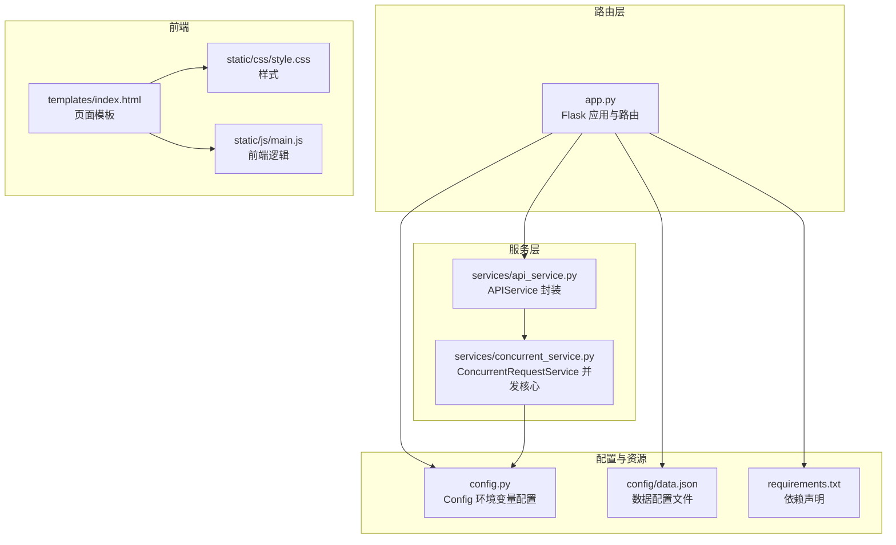
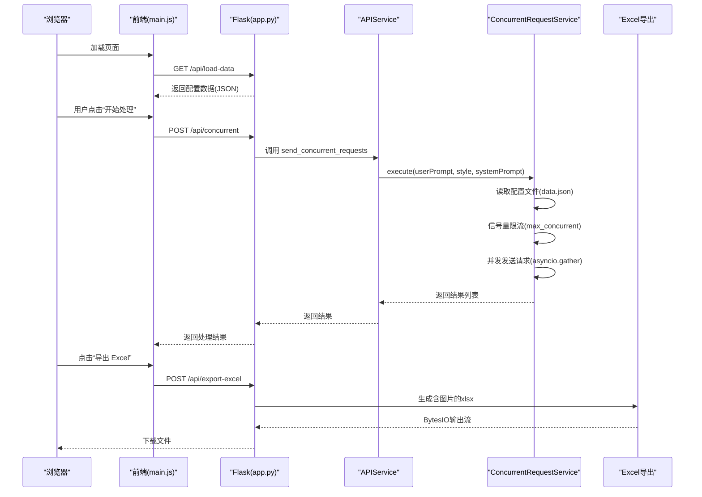
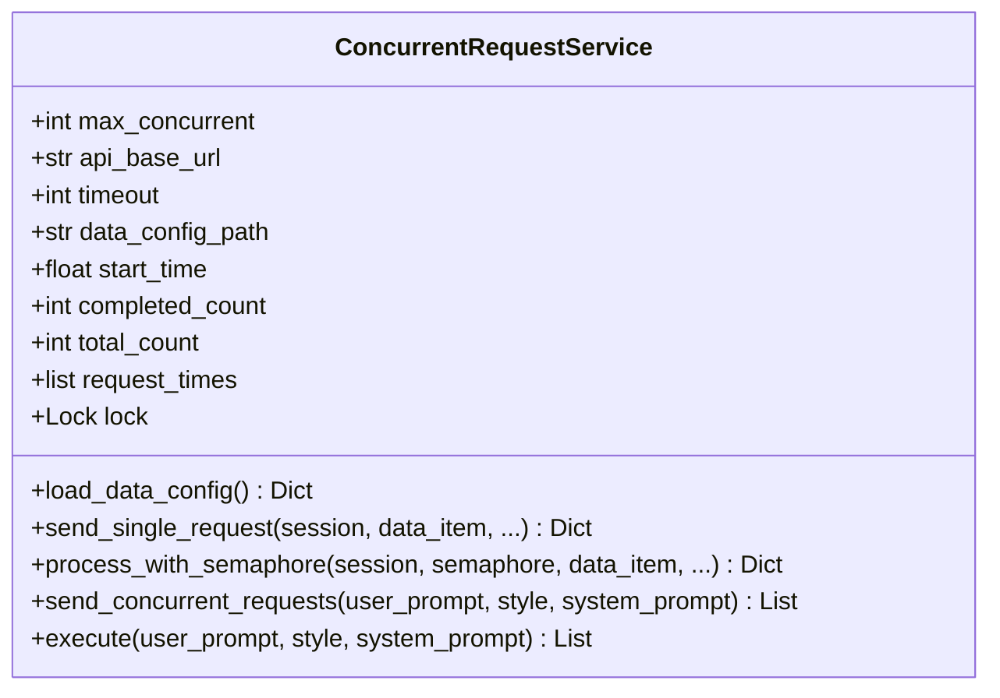
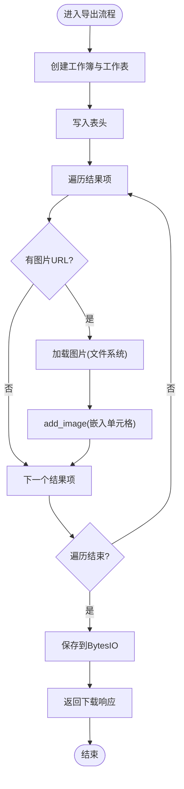
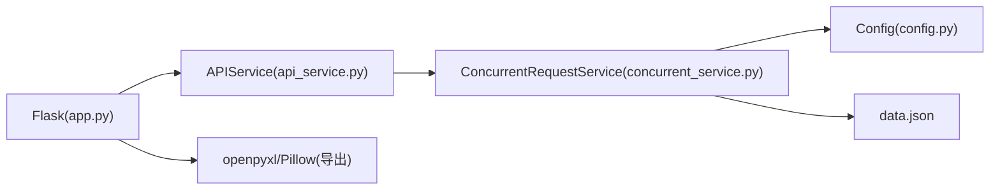

# 内存管理优化

<cite>
**本文引用的文件**
- [app.py](file://app.py)
- [config.py](file://config.py)
- [services/api_service.py](file://services/api_service.py)
- [services/concurrent_service.py](file://services/concurrent_service.py)
- [config/data.json](file://config/data.json)
- [requirements.txt](file://requirements.txt)
- [README.md](file://README.md)
- [templates/index.html](file://templates/index.html)
- [static/css/style.css](file://static/css/style.css)
- [static/js/main.js](file://static/js/main.js)
</cite>

## 目录
1. [简介](#简介)
2. [项目结构](#项目结构)
3. [核心组件](#核心组件)
4. [架构总览](#架构总览)
5. [详细组件分析](#详细组件分析)
6. [依赖分析](#依赖分析)
7. [性能考量](#性能考量)
8. [故障排查指南](#故障排查指南)
9. [结论](#结论)
10. [附录](#附录)

## 简介
本文件面向“内存管理优化”的专业需求，结合本项目的实际实现，系统性地分析与总结图片缓存策略、临时文件与句柄管理、异步任务内存占用控制、大数据集处理的分批与流式策略、配置数据的内存存储与序列化性能，以及内存监控与分析方法。目标是帮助开发者在不牺牲功能的前提下，显著降低内存峰值、减少泄漏风险、提升整体吞吐与稳定性。

## 项目结构
该项目采用典型的三层架构：路由层（Flask）、服务层（并发与API封装）、静态资源与模板层。与内存管理密切相关的模块集中在服务层（并发请求与配置加载），以及路由层的图片导出与代理逻辑。

图表来源
- [app.py:1-139](file://app.py#L1-L139)
- [services/api_service.py:1-14](file://services/api_service.py#L1-L14)
- [services/concurrent_service.py:1-162](file://services/concurrent_service.py#L1-L162)
- [config.py:1-12](file://config.py#L1-L12)
- [config/data.json:1-32](file://config/data.json#L1-L32)
- [requirements.txt:1-6](file://requirements.txt#L1-L6)
- [templates/index.html:1-40](file://templates/index.html#L1-L40)
- [static/js/main.js:1-266](file://static/js/main.js#L1-L266)

章节来源
- [app.py:1-139](file://app.py#L1-L139)
- [README.md:24-44](file://README.md#L24-L44)

## 核心组件
- 配置与并发控制
  - Config 提供环境变量驱动的配置项，包括最大并发数、超时、数据配置路径等，直接影响并发请求的内存占用与吞吐。
  - ConcurrentRequestService 负责并发请求的调度、限流、进度统计与结果聚合，是内存压力的主要来源之一。
- 图片导出与代理
  - app.py 的导出接口将图片嵌入 Excel，涉及临时内存缓冲与文件句柄；图片代理接口提供本地图片访问能力，避免浏览器本地文件访问限制。
- 前端交互
  - 前端通过 fetch 获取数据、触发并发请求与导出，最终通过 Blob 下载 Excel，影响浏览器侧内存使用。

章节来源
- [config.py:3-12](file://config.py#L3-L12)
- [services/concurrent_service.py:8-162](file://services/concurrent_service.py#L8-L162)
- [app.py:63-135](file://app.py#L63-L135)
- [static/js/main.js:29-136](file://static/js/main.js#L29-L136)

## 架构总览
下面的序列图展示了从页面加载到并发请求再到导出 Excel 的关键流程，重点标注了内存热点与优化点。

图表来源
- [app.py:29-61](file://app.py#L29-L61)
- [app.py:63-135](file://app.py#L63-L135)
- [services/api_service.py:8-13](file://services/api_service.py#L8-L13)
- [services/concurrent_service.py:118-158](file://services/concurrent_service.py#L118-L158)
- [config/data.json:1-32](file://config/data.json#L1-L32)

## 详细组件分析

### 组件一：并发请求服务（ConcurrentRequestService）
该组件是内存压力的核心来源，涉及：
- 配置文件读取：一次性加载 JSON，占用堆内存；建议在进程启动时缓存并在变更时刷新。
- 信号量限流：通过 asyncio.Semaphore 控制并发，避免过多协程同时持有大对象导致内存峰值过高。
- 协程对象生命周期：单次请求结束后，协程对象应尽快被垃圾回收；注意避免闭包持有大对象引用。
- 锁与共享状态：使用 asyncio.Lock 保护共享计数与时间数组，避免竞态，但锁粒度要小，避免阻塞过久。
- 异常处理：超时与异常分支都会产生中间对象，需确保异常路径也能及时释放。

图表来源
- [services/concurrent_service.py:8-162](file://services/concurrent_service.py#L8-L162)

章节来源
- [services/concurrent_service.py:21-28](file://services/concurrent_service.py#L21-L28)
- [services/concurrent_service.py:114-158](file://services/concurrent_service.py#L114-L158)
- [services/concurrent_service.py:160-162](file://services/concurrent_service.py#L160-L162)

### 组件二：APIService 封装
- 作用：对外暴露统一的并发调用入口，便于扩展与测试。
- 内存影响：仅作为轻量封装，不引入额外内存负担。

章节来源
- [services/api_service.py:4-13](file://services/api_service.py#L4-L13)

### 组件三：Flask 路由与图片导出
- /api/load-data：读取 data.json 并返回，JSON 解析与字典对象驻留于内存。
- /api/concurrent：并发请求，内存峰值与并发数成正比。
- /api/export-excel：将图片嵌入 Excel，使用 BytesIO 作为临时缓冲，注意 seek 与读取后及时释放。
- /api/photo/<path>：图片代理，避免浏览器本地文件访问限制，减少前端跨域问题。

图表来源
- [app.py:63-135](file://app.py#L63-L135)

章节来源
- [app.py:29-41](file://app.py#L29-L41)
- [app.py:43-61](file://app.py#L43-L61)
- [app.py:63-135](file://app.py#L63-L135)
- [app.py:19-27](file://app.py#L19-L27)

### 组件四：配置与数据文件
- config.py：从环境变量读取配置，避免硬编码，便于在不同环境中调整并发与超时。
- data.json：包含样式、默认样式、系统提示词与数据项列表。建议：
  - 对大型数据集进行分页或分批加载；
  - 使用只读模式与最小必要字段；
  - 在进程内缓存并监听文件变更以热更新。

章节来源
- [config.py:3-12](file://config.py#L3-L12)
- [config/data.json:1-32](file://config/data.json#L1-L32)

### 组件五：前端交互与内存
- main.js：负责页面初始化、并发请求、结果渲染与 Excel 导出。
- 导出流程：通过 Blob 下载，浏览器侧内存峰值与 Excel 大小相关；建议在导出前清理不必要的 DOM 与中间数据。

章节来源
- [static/js/main.js:29-136](file://static/js/main.js#L29-L136)
- [static/js/main.js:220-260](file://static/js/main.js#L220-L260)

## 依赖分析
- Python 依赖：Flask、aiohttp、openpyxl、Pillow、requests。其中 Pillow 与 openpyxl 是图片与 Excel 处理的关键，直接影响内存占用。
- 前端依赖：HTML/CSS/JS，无第三方 JS 库，前端内存压力相对较小。

图表来源
- [requirements.txt:1-6](file://requirements.txt#L1-L6)
- [app.py:10-13](file://app.py#L10-L13)
- [services/api_service.py:2-6](file://services/api_service.py#L2-L6)
- [services/concurrent_service.py:6-13](file://services/concurrent_service.py#L6-L13)
- [config.py:1-12](file://config.py#L1-L12)
- [config/data.json:1-32](file://config/data.json#L1-L32)

章节来源
- [requirements.txt:1-6](file://requirements.txt#L1-L6)

## 性能考量

### 图片缓存策略与对象生命周期
- 缓存策略
  - 配置文件：建议在进程启动时一次性读取并缓存，避免重复 IO 与解析；当配置文件变更时再刷新。
  - 图片对象：在导出 Excel 时，图片对象会在内存中驻留直至工作簿保存并 BytesIO 输出。建议：
    - 控制每张图片尺寸与质量，降低像素总量；
    - 使用流式写入（若框架允许）减少峰值；
    - 保存后及时释放工作簿引用，避免循环引用。
- 生命周期管理
  - 协程与任务：确保每个任务在完成后立即让出控制权，避免闭包捕获大对象；
  - 文件句柄：使用 with 上下文或显式 close，避免句柄泄露；
  - 全局引用：避免将大对象长期绑定到类实例或模块级变量。

### 临时文件与句柄管理
- 导出 Excel 使用 BytesIO 作为临时缓冲，注意：
  - 保存后及时 seek 到开头；
  - 读取后释放引用，避免长时间持有大对象；
  - 在高并发场景下，建议限制同时导出的任务数量，避免内存峰值叠加。
- 图片代理：确保代理接口对文件存在性与可读性进行校验，避免无效句柄与异常路径造成的资源占用。

章节来源
- [app.py:121-123](file://app.py#L121-L123)
- [app.py:104-116](file://app.py#L104-L116)

### 异步任务内存占用控制
- 信号量限流：通过 asyncio.Semaphore 控制并发数，避免同时创建过多协程与大对象。
- 锁与共享状态：使用 asyncio.Lock 保护共享计数与时间数组，但锁粒度要小，避免阻塞过久。
- 异常路径：超时与异常分支会产生中间对象，需确保异常路径也能及时释放。
- 协程对象释放：确保 await asyncio.gather 后不再持有对已结束任务的引用，避免闭包捕获。

章节来源
- [services/concurrent_service.py:138-146](file://services/concurrent_service.py#L138-L146)
- [services/concurrent_service.py:79-112](file://services/concurrent_service.py#L79-L112)

### 大数据集处理的内存优化
- 分批处理
  - 将 data.json 的 data 数组按批次拆分，逐批并发请求，降低单次内存峰值。
  - 每批完成后释放无关中间数据，避免累积。
- 流式处理
  - 在导出 Excel 时，尽量使用流式写入（若框架允许）或分块写入，减少一次性加载到内存的数据量。
- 按需加载
  - 仅加载必要的字段，避免将整个 data.json 全量驻留内存。

章节来源
- [config/data.json:5-31](file://config/data.json#L5-L31)
- [services/concurrent_service.py:118-158](file://services/concurrent_service.py#L118-L158)

### 配置数据的内存存储与序列化性能
- JSON 解析：一次性解析 data.json，建议在进程启动时缓存；对频繁读取的配置使用只读缓存。
- 序列化与反序列化：避免在热路径中重复序列化/反序列化；必要时使用更高效的序列化库（如 msgpack）。
- 环境变量：通过环境变量动态调整并发与超时，避免频繁重启。

章节来源
- [config.py:3-12](file://config.py#L3-L12)
- [services/concurrent_service.py:21-28](file://services/concurrent_service.py#L21-L28)

### 内存监控与性能分析方法
- Python 内置工具
  - tracemalloc：追踪内存分配来源，定位大对象与泄漏点。
  - gc.get_stats()/get_referrers()：分析对象引用链，发现循环引用。
  - memory_profiler：按函数/行级采样，识别内存热点。
- 第三方工具
  - pympler：对象层面的内存分析，适合复杂对象图分析。
  - guppy/heapy：跟踪大对象与泄漏趋势。
- Web 层面
  - Chrome DevTools Memory 面板：观察导出 Excel 时的内存峰值与增长曲线。
  - Network 面板：确认请求与响应大小，避免不必要的数据传输。

[本节为通用指导，不直接分析具体文件，故无章节来源]

## 故障排查指南
- 并发请求超时
  - 检查 API 超时与并发数配置，适当增大超时或减小并发数。
  - 查看日志输出的进度统计，确认是否有大量超时任务。
- 导出 Excel 图片缺失
  - 确认 Pillow 已安装且图片格式受支持；
  - 检查图片路径是否存在与可读；
  - 确认 Excel 客户端支持嵌入图片（如 WPS/Office）。
- 内存持续增长
  - 检查是否存在未释放的大对象引用（如全局缓存、闭包捕获）；
  - 确认 BytesIO 使用后及时释放；
  - 使用内存分析工具定位泄漏源。

章节来源
- [README.md:329-348](file://README.md#L329-L348)
- [README.md:322-327](file://README.md#L322-L327)

## 结论
本项目在并发请求与图片导出方面具备良好的基础，但仍可通过以下优化进一步降低内存峰值与泄漏风险：
- 使用信号量严格控制并发数，避免同时持有过多大对象；
- 在进程启动时缓存配置文件，减少重复 IO；
- 导出 Excel 时控制图片尺寸与数量，必要时采用分批导出；
- 在异常路径与任务完成后及时释放引用，避免闭包捕获；
- 结合 tracemalloc/gc/pympler 等工具进行持续监控与优化。

[本节为总结，不直接分析具体文件，故无章节来源]

## 附录

### 不同数据规模下的内存使用建议
- 小规模（<100 条）
  - 直接并发处理，无需分批；合理设置并发数（如 5）。
- 中等规模（100-1000 条）
  - 分批并发（每批 20-50），导出时也分批写入。
- 大规模（>1000 条）
  - 使用流式处理与分页加载，导出采用分块写入与压缩策略。

[本节为通用建议，不直接分析具体文件，故无章节来源]