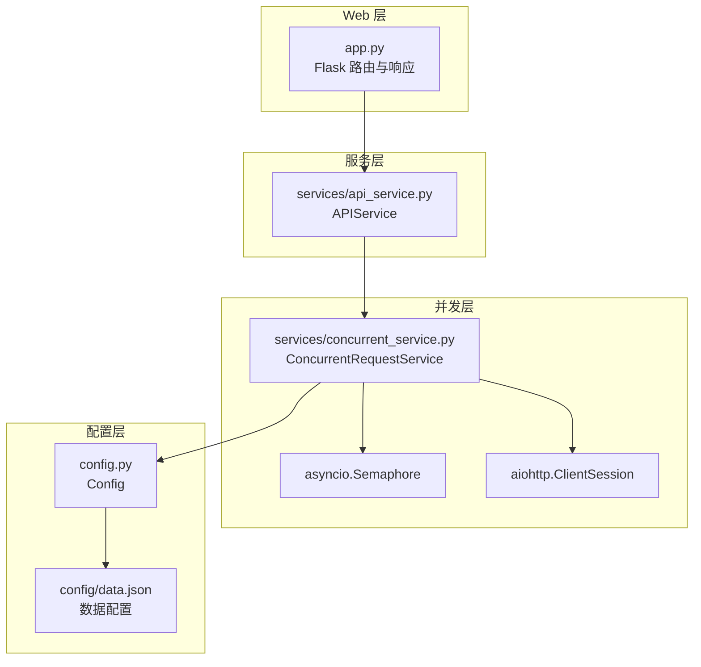
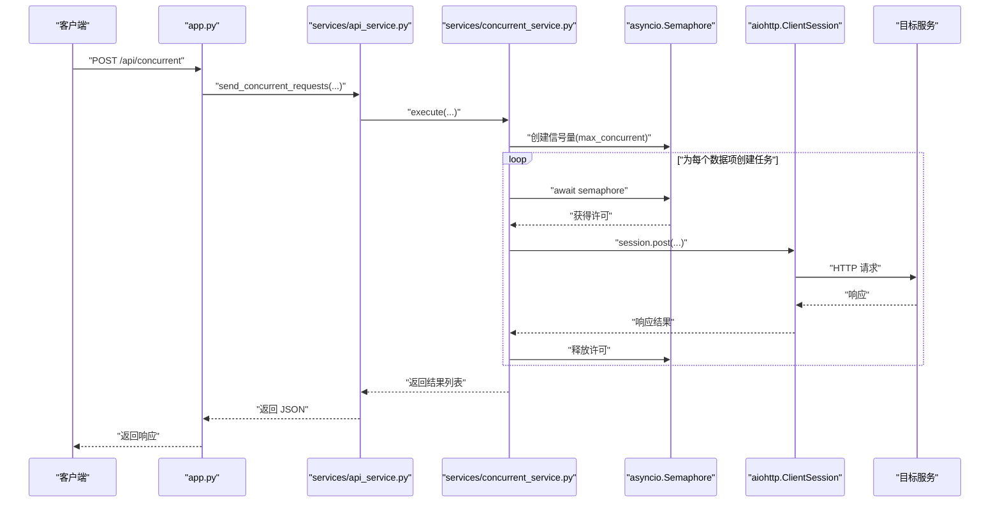

# 并发优化策略

<cite>
**本文引用的文件**
- [app.py](file://app.py)
- [services/api_service.py](file://services/api_service.py)
- [services/concurrent_service.py](file://services/concurrent_service.py)
- [config.py](file://config.py)
- [config/data.json](file://config/data.json)
- [requirements.txt](file://requirements.txt)
</cite>

## 目录
1. [简介](#简介)
2. [项目结构](#项目结构)
3. [核心组件](#核心组件)
4. [架构概览](#架构概览)
5. [详细组件分析](#详细组件分析)
6. [依赖分析](#依赖分析)
7. [性能考量](#性能考量)
8. [故障排查指南](#故障排查指南)
9. [结论](#结论)
10. [附录](#附录)

## 简介
本文件围绕项目中的并发优化策略展开，重点分析基于 asyncio.Semaphore 的信号量控制机制、MAX_CONCURRENT_REQUESTS 参数的调优策略与性能影响、并发任务调度与队列管理、超时配置与异常处理对并发性能的影响，并结合现有实现给出并发安全性与线程同步的最佳实践建议。同时提供不同并发级别的性能测试思路与基准测试方法，以及实际案例与调优建议。

## 项目结构
该项目采用分层架构：
- Web 层：Flask 应用负责路由与响应，提供前端交互入口与导出功能。
- 服务层：APIService 作为对外接口封装，内部委托 ConcurrentRequestService 执行并发请求。
- 并发层：ConcurrentRequestService 使用 asyncio.Semaphore 控制最大并发数，通过 aiohttp 异步发起 HTTP 请求。
- 配置层：Config 提供环境变量驱动的配置（如 API 地址、超时、最大并发、数据配置路径）。
- 数据层：config/data.json 存放待处理的数据集合与样式配置。

图表来源
- [app.py:1-139](file://app.py#L1-L139)
- [services/api_service.py:1-14](file://services/api_service.py#L1-L14)
- [services/concurrent_service.py:1-162](file://services/concurrent_service.py#L1-L162)
- [config.py:1-12](file://config.py#L1-L12)
- [config/data.json:1-32](file://config/data.json#L1-L32)

章节来源
- [app.py:1-139](file://app.py#L1-L139)
- [services/api_service.py:1-14](file://services/api_service.py#L1-L14)
- [services/concurrent_service.py:1-162](file://services/concurrent_service.py#L1-L162)
- [config.py:1-12](file://config.py#L1-L12)
- [config/data.json:1-32](file://config/data.json#L1-L32)

## 核心组件
- Flask 应用：提供首页、图片资源访问、并发请求接口、Excel 导出等端点。
- APIService：对外暴露统一的并发请求入口，内部委派 ConcurrentRequestService。
- ConcurrentRequestService：核心并发执行器，使用 asyncio.Semaphore 控制并发度，异步发送 HTTP 请求，统计进度与耗时。
- Config：集中式配置管理，支持从环境变量读取 API 基础地址、超时时间、最大并发数、数据配置路径。
- 数据配置：config/data.json 提供待处理数据集合与样式信息。

章节来源
- [app.py:1-139](file://app.py#L1-L139)
- [services/api_service.py:1-14](file://services/api_service.py#L1-L14)
- [services/concurrent_service.py:1-162](file://services/concurrent_service.py#L1-L162)
- [config.py:1-12](file://config.py#L1-L12)
- [config/data.json:1-32](file://config/data.json#L1-L32)

## 架构概览
下图展示从 Web 层到并发层的关键调用链路与并发控制机制。

图表来源
- [app.py:43-61](file://app.py#L43-L61)
- [services/api_service.py:8-13](file://services/api_service.py#L8-L13)
- [services/concurrent_service.py:118-158](file://services/concurrent_service.py#L118-L158)
- [services/concurrent_service.py:138-146](file://services/concurrent_service.py#L138-L146)
- [services/concurrent_service.py:114-116](file://services/concurrent_service.py#L114-L116)

## 详细组件分析

### 信号量控制机制与 MAX_CONCURRENT_REQUESTS 调优
- 实现原理
  - 在并发执行入口中创建 asyncio.Semaphore，其容量即为最大并发数。
  - 每个任务在执行前 await 获取许可，执行完成后自动释放。
  - 通过 asyncio.gather 并发调度所有任务，确保在信号量上限内最大化吞吐。
- 参数调优策略
  - 低延迟、高带宽网络：可适度提高 MAX_CONCURRENT_REQUESTS，以充分利用带宽与服务器并发能力。
  - 高延迟或受限服务器：降低 MAX_CONCURRENT_REQUESTS，减少连接竞争与拥塞，提升稳定性。
  - CPU/内存瓶颈：适当降低并发，避免系统资源争用导致整体性能下降。
  - I/O 密集型：可较大地提高并发，但需结合超时与重试策略。
- 性能影响
  - 过高并发可能导致连接池耗尽、服务器限流、超时增多，反而降低吞吐。
  - 过低并发会浪费 I/O 等待时间，无法充分利用系统资源。
- 配置来源
  - MAX_CONCURRENT_REQUESTS 来源于环境变量，便于在不同部署环境中灵活调整。

章节来源
- [services/concurrent_service.py:138-146](file://services/concurrent_service.py#L138-L146)
- [services/concurrent_service.py:114-116](file://services/concurrent_service.py#L114-L116)
- [config.py:9](file://config.py#L9)

### asyncio.Semaphore 工作机制与最佳实践
- 机制说明
  - Semaphore 是一个计数信号量，初始值为 max_concurrent；每次 await 获取一个许可，释放时归还一个许可。
  - 在 aiohttp 中，通常配合 ClientSession 使用，避免连接过多导致资源耗尽。
- 最佳实践
  - 将 Semaphore 与 ClientSession 生命周期绑定，确保在任务结束后正确释放。
  - 对于长生命周期的会话，建议复用 ClientSession，减少连接建立开销。
  - 结合超时设置，防止任务无限等待。
  - 使用锁保护共享状态（如计数器、日志输出），避免竞态条件。
- 现有实现要点
  - 使用 asyncio.Lock 保护并发更新的计数器与日志输出，保证线程安全。
  - 使用 aiohttp.ClientTimeout 控制单次请求超时，避免阻塞。

章节来源
- [services/concurrent_service.py:19](file://services/concurrent_service.py#L19)
- [services/concurrent_service.py:63-66](file://services/concurrent_service.py#L63-L66)
- [services/concurrent_service.py:79-95](file://services/concurrent_service.py#L79-L95)
- [services/concurrent_service.py:96-112](file://services/concurrent_service.py#L96-L112)
- [services/concurrent_service.py:58](file://services/concurrent_service.py#L58)

### 并发任务调度与队列管理
- 调度算法
  - 使用 asyncio.gather 并发收集所有任务，无需显式队列管理即可实现“先到先得”的调度。
  - 由于信号量限制，任务在获取许可后才真正开始执行，形成自然的“优先级”顺序。
- 负载均衡策略
  - 通过固定的最大并发数，避免瞬时流量冲击目标服务，实现平滑的负载分布。
  - 若目标服务具备多实例或多节点，可在上游增加重试与降级策略，进一步提升可用性。
- 现有实现
  - 为每个数据项创建独立任务，统一 await gather 收敛结果。
  - 未实现任务优先级或动态调度，适合均匀负载场景。

章节来源
- [services/concurrent_service.py:140-146](file://services/concurrent_service.py#L140-L146)
- [services/concurrent_service.py:118-158](file://services/concurrent_service.py#L118-L158)

### 超时配置与异常处理
- 超时配置
  - 单次请求超时通过 aiohttp.ClientTimeout(total=...) 设置，避免长时间阻塞。
  - 全局超时可通过外部中间件或进程级超时控制，当前实现聚焦单请求超时。
- 异常处理
  - 捕获 asyncio.TimeoutError 与通用异常，分别记录“请求超时”和“其他错误”，并返回结构化结果。
  - 使用锁保护计数器与日志输出，确保并发安全。
- 性能影响
  - 合理的超时能提升系统稳定性，过短会导致误判失败，过长会占用资源。
  - 统一的异常处理有助于快速定位问题，避免异常传播导致的系统抖动。

章节来源
- [services/concurrent_service.py:58](file://services/concurrent_service.py#L58)
- [services/concurrent_service.py:79-95](file://services/concurrent_service.py#L79-L95)
- [services/concurrent_service.py:96-112](file://services/concurrent_service.py#L96-L112)
- [services/concurrent_service.py:63-66](file://services/concurrent_service.py#L63-L66)
- [config.py:8](file://config.py#L8)

### 并发安全性与线程同步最佳实践
- 现有实践
  - 使用 asyncio.Lock 保护共享状态（计数器、日志输出），避免并发写入冲突。
  - 使用 asyncio.Semaphore 严格控制并发数量，防止资源耗尽。
- 建议补充
  - 对于需要跨任务共享的状态，考虑使用 asyncio.Queue 或 asyncio.Event 进行协调。
  - 在高并发场景下，建议引入指数退避与重试策略，提升鲁棒性。
  - 对于外部依赖（如数据库、缓存），使用连接池与超时配置，避免阻塞扩散。

章节来源
- [services/concurrent_service.py:19](file://services/concurrent_service.py#L19)
- [services/concurrent_service.py:138-146](file://services/concurrent_service.py#L138-L146)

### 性能测试与基准测试方法
- 测试目标
  - 评估不同 MAX_CONCURRENT_REQUESTS 下的吞吐量、平均响应时间、错误率与资源占用。
- 测试步骤
  - 固定数据集大小，逐步调整 MAX_CONCURRENT_REQUESTS（例如 1、5、10、20、50）。
  - 记录总耗时、平均每个请求耗时、成功/失败计数、超时次数。
  - 在相同硬件与网络条件下重复多次，取均值与标准差。
- 指标采集
  - 可在现有进度打印基础上扩展指标采集，或新增日志格式化输出。
  - 使用外部工具（如 locust、wrk）进行更大规模的压力测试，验证线性扩展性。
- 基准建议
  - 以“稳定吞吐”为目标，而非单纯追求峰值。
  - 关注 P95/P99 延迟，避免尾部延迟拖累整体体验。

[本节为通用方法论，不直接分析具体文件，故无章节来源]

### 实际案例与调优建议
- 案例场景
  - 多媒体文案生成：批量向目标服务提交图片与文本，生成推广文案并下载图片。
- 调优建议
  - 初期以较小并发（如 5）启动，观察成功率与延迟；逐步增大至稳定吞吐。
  - 若出现大量超时，优先检查目标服务限流策略与网络质量，再考虑降低并发。
  - 对于 I/O 密集型任务，可适当提高并发；对于 CPU 密集型，需谨慎提高并发，避免系统过载。
  - 结合业务特性，对失败任务进行重试与降级处理，提升用户体验。

[本节为通用方法论，不直接分析具体文件，故无章节来源]

## 依赖分析
- Python 依赖
  - Flask：Web 框架，提供路由与响应。
  - aiohttp：异步 HTTP 客户端，用于并发请求。
  - openpyxl：Excel 导出功能。
  - requests：未在并发路径中使用，可能为遗留依赖。
- 并发相关依赖
  - asyncio：事件循环与信号量。
  - aiohttp.ClientSession：连接池与并发控制。
- 配置依赖
  - 环境变量驱动的配置，便于容器化与多环境部署。

章节来源
- [requirements.txt:1-6](file://requirements.txt#L1-L6)
- [config.py:7-11](file://config.py#L7-L11)

## 性能考量
- 并发度权衡
  - 过高并发可能触发目标服务限流或连接池耗尽，导致失败率上升。
  - 过低并发会浪费 I/O 空闲时间，无法充分利用带宽与计算资源。
- 资源限制
  - CPU、内存、网络带宽与连接数是关键约束，需结合系统监控进行调优。
- 超时与重试
  - 合理的超时与重试策略能显著提升稳定性，但需避免雪崩效应。
- 日志与可观测性
  - 建议在生产环境开启结构化日志与指标上报，便于定位性能瓶颈。

[本节为通用指导，不直接分析具体文件，故无章节来源]

## 故障排查指南
- 常见问题
  - 超时频繁：检查 API_TIMEOUT 设置与网络状况，必要时降低 MAX_CONCURRENT_REQUESTS。
  - 失败率高：查看异常分支返回的错误类型，区分超时与业务错误。
  - 进度不更新：确认锁保护逻辑是否覆盖了计数器与日志输出。
- 排查步骤
  - 逐步缩小并发范围，观察成功率与延迟变化。
  - 检查目标服务健康状态与限流策略。
  - 分析日志输出，定位异常发生的时间点与数据项。
- 修复建议
  - 引入指数退避与重试，避免瞬时压力。
  - 增加熔断与降级策略，保障核心功能可用。

章节来源
- [services/concurrent_service.py:79-95](file://services/concurrent_service.py#L79-L95)
- [services/concurrent_service.py:96-112](file://services/concurrent_service.py#L96-L112)
- [services/concurrent_service.py:63-66](file://services/concurrent_service.py#L63-L66)

## 结论
本项目通过 asyncio.Semaphore 与 aiohttp 实现了可控的并发请求，配合 Config 的环境变量配置，能够在不同部署环境下灵活调整并发度。建议在生产环境中结合性能测试与监控，持续优化 MAX_CONCURRENT_REQUESTS，并完善超时、重试与可观测性机制，以获得更稳定的吞吐与更低的尾延迟。

[本节为总结性内容，不直接分析具体文件，故无章节来源]

## 附录
- 配置项说明
  - API_BASE_URL：目标服务基础地址。
  - API_TIMEOUT：单次请求超时（秒）。
  - MAX_CONCURRENT_REQUESTS：最大并发数。
  - DATA_CONFIG_PATH：数据配置文件路径。
- 数据配置示例
  - 包含样式列表、默认样式、系统提示词与数据条目（含 id、text、photos）。

章节来源
- [config.py:7-11](file://config.py#L7-L11)
- [config/data.json:1-32](file://config/data.json#L1-L32)