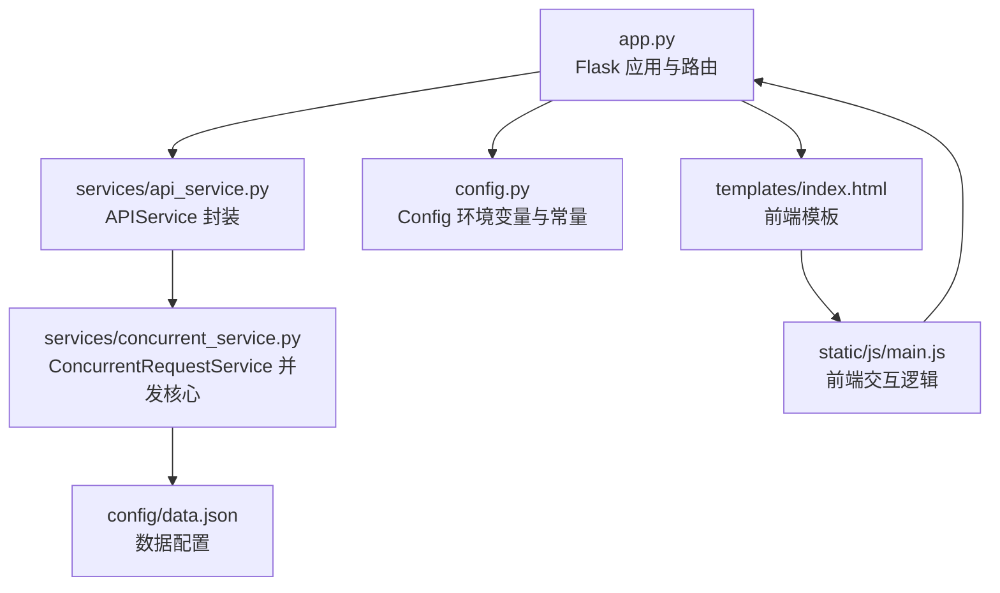
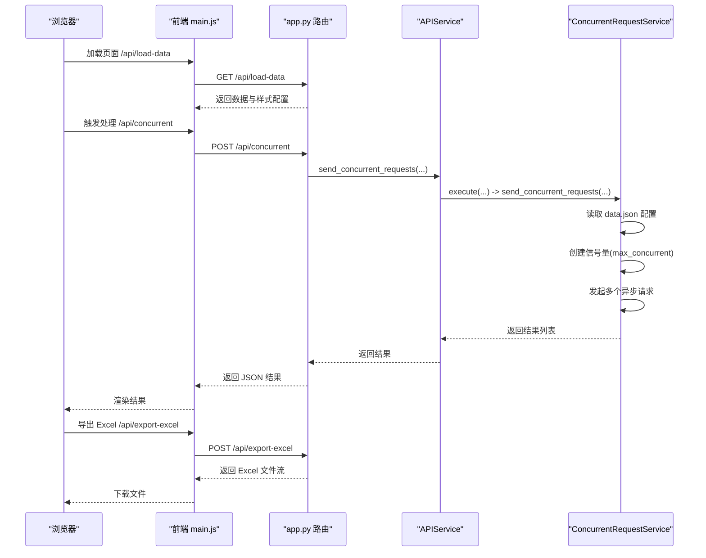
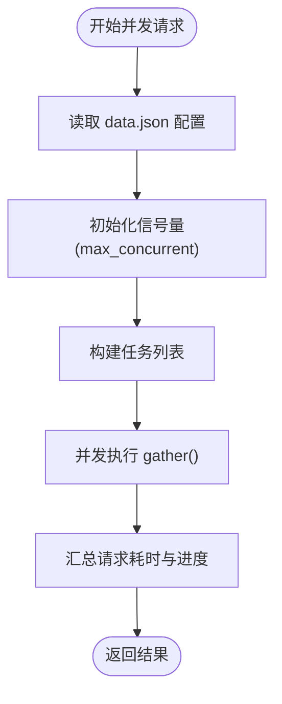
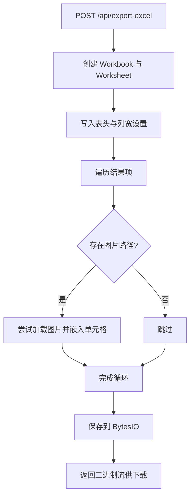
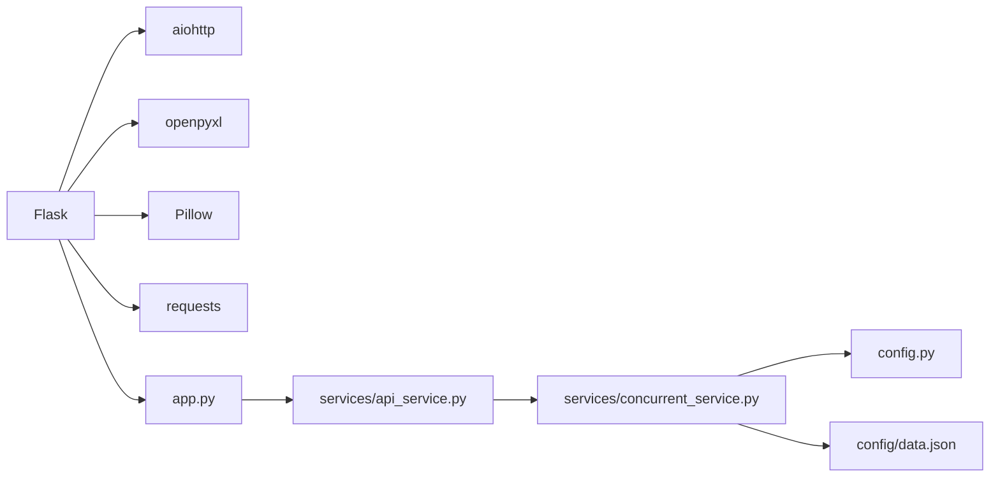

# 性能优化

<cite>
**本文引用的文件**
- [app.py](file://app.py)
- [config.py](file://config.py)
- [services/api_service.py](file://services/api_service.py)
- [services/concurrent_service.py](file://services/concurrent_service.py)
- [config/data.json](file://config/data.json)
- [requirements.txt](file://requirements.txt)
- [README.md](file://README.md)
- [templates/index.html](file://templates/index.html)
- [static/js/main.js](file://static/js/main.js)
- [static/css/style.css](file://static/css/style.css)
</cite>

## 目录
1. [简介](#简介)
2. [项目结构](#项目结构)
3. [核心组件](#核心组件)
4. [架构总览](#架构总览)
5. [详细组件分析](#详细组件分析)
6. [依赖分析](#依赖分析)
7. [性能考虑](#性能考虑)
8. [故障排查指南](#故障排查指南)
9. [结论](#结论)
10. [附录](#附录)

## 简介
本项目是一个基于 Flask 的 Web 应用，支持批量处理图片文案，通过异步并发请求外部 API 生成文案，并可将结果导出为 Excel 文件。本文档聚焦于性能优化，围绕并发优化策略、内存管理、网络优化、缓存设计、性能监控与瓶颈识别等方面，结合代码实现给出可操作的建议与最佳实践。

## 项目结构
- 后端入口与路由：app.py
- 配置中心：config.py
- 服务层：
  - APIService：对外 API 的封装
  - ConcurrentRequestService：并发请求与进度统计的核心实现
- 配置数据：config/data.json
- 前端：
  - 模板：templates/index.html
  - 脚本：static/js/main.js
  - 样式：static/css/style.css
- 依赖：requirements.txt

图表来源
- [app.py:1-139](file://app.py#L1-L139)
- [services/api_service.py:1-14](file://services/api_service.py#L1-L14)
- [services/concurrent_service.py:1-162](file://services/concurrent_service.py#L1-L162)
- [config.py:1-12](file://config.py#L1-L12)
- [config/data.json:1-32](file://config/data.json#L1-L32)
- [templates/index.html:1-40](file://templates/index.html#L1-L40)
- [static/js/main.js:1-266](file://static/js/main.js#L1-L266)

章节来源
- [app.py:1-139](file://app.py#L1-L139)
- [config.py:1-12](file://config.py#L1-L12)
- [services/api_service.py:1-14](file://services/api_service.py#L1-L14)
- [services/concurrent_service.py:1-162](file://services/concurrent_service.py#L1-L162)
- [config/data.json:1-32](file://config/data.json#L1-L32)
- [templates/index.html:1-40](file://templates/index.html#L1-L40)
- [static/js/main.js:1-266](file://static/js/main.js#L1-L266)
- [static/css/style.css:1-272](file://static/css/style.css#L1-L272)
- [requirements.txt:1-6](file://requirements.txt#L1-L6)

## 核心组件
- Flask 应用与路由：负责页面渲染、图片代理、并发请求接口、Excel 导出接口等。
- 配置中心：集中管理 API 基础地址、超时、最大并发数、数据配置路径等。
- APIService：对并发服务进行封装，便于路由层调用。
- ConcurrentRequestService：核心并发执行器，使用信号量控制并发，记录请求耗时与进度，统一处理异常与超时。
- 前端：负责数据加载、文风选择、并发请求触发、结果渲染与 Excel 导出。

章节来源
- [app.py:1-139](file://app.py#L1-L139)
- [config.py:1-12](file://config.py#L1-L12)
- [services/api_service.py:1-14](file://services/api_service.py#L1-L14)
- [services/concurrent_service.py:1-162](file://services/concurrent_service.py#L1-L162)
- [static/js/main.js:1-266](file://static/js/main.js#L1-L266)

## 架构总览
后端采用“路由层-服务层-配置层”的分层设计；前端通过 AJAX 与后端交互，触发并发请求与导出流程。

图表来源
- [app.py:29-135](file://app.py#L29-L135)
- [services/api_service.py:8-13](file://services/api_service.py#L8-L13)
- [services/concurrent_service.py:118-158](file://services/concurrent_service.py#L118-L158)
- [static/js/main.js:29-136](file://static/js/main.js#L29-L136)
- [static/js/main.js:220-260](file://static/js/main.js#L220-L260)

## 详细组件分析

### 并发优化与最大并发数调优
- 并发控制：使用 asyncio.Semaphore 控制最大并发数，默认值来自环境变量 MAX_CONCURRENT_REQUESTS。
- 超时控制：aiohttp.ClientTimeout(total=timeout) 控制单次请求超时。
- 进度统计：记录每个请求耗时与平均耗时，便于评估吞吐与延迟。
- 异常处理：捕获超时与通用异常，保证任务顺利完成并统计进度。

图表来源
- [services/concurrent_service.py:118-158](file://services/concurrent_service.py#L118-L158)
- [config.py:8-9](file://config.py#L8-L9)

章节来源
- [services/concurrent_service.py:1-162](file://services/concurrent_service.py#L1-L162)
- [config.py:1-12](file://config.py#L1-L12)

### 内存管理与图片缓存策略
- Excel 导出中的图片处理：使用 openpyxl.Image 直接嵌入图片，注意图片尺寸与单元格大小匹配，避免过大导致内存峰值升高。
- 临时文件与内存流：导出时使用 BytesIO 作为内存缓冲，减少磁盘 IO；保存后 seek(0) 以便下载。
- 图片代理：/api/photo/<path> 提供本地图片代理，避免浏览器跨域与本地文件访问限制，同时减少前端直接访问本地路径的风险。

图表来源
- [app.py:63-135](file://app.py#L63-L135)

章节来源
- [app.py:63-135](file://app.py#L63-L135)

### 网络优化：连接池、超时与重试
- 连接池：aiohttp.ClientSession 默认复用 TCP 连接，减少握手开销；建议在高并发场景下复用同一会话实例。
- 超时配置：通过 Config.API_TIMEOUT 统一设置请求超时；可根据外部 API 响应时间动态调整。
- 重试机制：当前未实现自动重试；可在 send_single_request 中增加指数退避重试，或在上游服务层统一包装。

章节来源
- [services/concurrent_service.py:54-112](file://services/concurrent_service.py#L54-L112)
- [config.py:8-9](file://config.py#L8-L9)

### 缓存机制设计与实现
- 配置缓存：ConcurrentRequestService 在初始化时读取 data.json，建议在高频场景下加入文件变更检测与缓存失效策略，避免频繁磁盘读取。
- 结果缓存：当前未实现结果缓存；可在 APIService 层引入内存缓存（如 LRU）或 Redis 缓存，键值可包含 userPrompt、style、systemPrompt 与数据 ID 组合，命中则直接返回，未命中再发起请求。
- 前端缓存：前端可缓存已加载的数据与样式选项，减少重复请求。

章节来源
- [services/concurrent_service.py:21-28](file://services/concurrent_service.py#L21-L28)
- [services/api_service.py:1-14](file://services/api_service.py#L1-L14)
- [static/js/main.js:29-85](file://static/js/main.js#L29-L85)

### 性能监控与指标采集
- 后端指标：
  - 请求耗时：记录每个请求的耗时与平均耗时，便于观察吞吐变化。
  - 并发度：通过信号量大小与任务数量评估并发利用率。
  - 错误率：统计超时与异常比例，定位外部 API 不稳定时段。
- 前端指标：
  - 加载耗时：从页面加载到数据渲染完成的时间。
  - 导出耗时：Excel 生成与下载完成时间。
- 建议埋点：
  - 在 /api/concurrent 与 /api/export-excel 接口增加日志与计时器，输出到标准错误或日志系统。
  - 使用 Prometheus/Grafana 或简单文件日志记录关键指标，便于趋势分析。

章节来源
- [services/concurrent_service.py:30-41](file://services/concurrent_service.py#L30-L41)
- [services/concurrent_service.py:148-156](file://services/concurrent_service.py#L148-L156)
- [app.py:118-119](file://app.py#L118-L119)

### 系统瓶颈识别与解决方案
- 瓶颈类型与定位：
  - 外部 API 延迟：通过请求耗时与错误率判断；可通过降低并发或增加超时缓解。
  - 磁盘 IO：Excel 导出时大量图片写入可能导致 IO 峰值；建议分批导出或压缩图片。
  - CPU：图片嵌入与文本处理；可考虑异步化或使用更高效的图像库。
- 解决方案：
  - 动态并发：根据外部 API 响应时间与错误率动态调整 MAX_CONCURRENT_REQUESTS。
  - 分批处理：将大数据集拆分为小批次，分别导出，降低内存峰值。
  - 资源限制：在容器或进程层面设置 CPU/内存限制，配合限流与排队队列。

章节来源
- [services/concurrent_service.py:118-158](file://services/concurrent_service.py#L118-L158)
- [app.py:63-135](file://app.py#L63-L135)

### 不同规模数据处理的性能调优建议
- 小规模（<10 条）：默认并发即可；关注前端渲染与 Excel 导出速度。
- 中等规模（10-100 条）：适度提升并发（如 5-10），启用结果缓存，分批导出。
- 大规模（>100 条）：引入分页/分批处理，使用队列与后台任务，限制并发并增加重试与熔断。

章节来源
- [config.py:9](file://config.py#L9)
- [services/concurrent_service.py:118-158](file://services/concurrent_service.py#L118-L158)

### 资源限制与扩展策略
- 资源限制：通过环境变量控制并发与超时；在容器部署时设置 CPU/内存限额。
- 扩展策略：
  - 垂直扩展：提升服务器规格，增加并发上限。
  - 水平扩展：多实例部署，结合负载均衡与共享缓存（Redis）。
  - 异步化：将耗时任务放入消息队列，异步处理与结果回传。

章节来源
- [config.py:8-9](file://config.py#L8-L9)
- [README.md:335-339](file://README.md#L335-L339)

## 依赖分析
- Flask：Web 框架，提供路由与静态资源服务。
- aiohttp：异步 HTTP 客户端，支持连接池与超时控制。
- openpyxl：Excel 生成与图片嵌入。
- Pillow：图片处理能力（用于图片导出与预览）。
- requests：同步 HTTP 客户端（当前未在并发路径使用）。

图表来源
- [requirements.txt:1-6](file://requirements.txt#L1-L6)
- [app.py:10-13](file://app.py#L10-L13)
- [services/api_service.py:1-14](file://services/api_service.py#L1-L14)
- [services/concurrent_service.py:1-162](file://services/concurrent_service.py#L1-L162)
- [config.py:1-12](file://config.py#L1-L12)
- [config/data.json:1-32](file://config/data.json#L1-L32)

章节来源
- [requirements.txt:1-6](file://requirements.txt#L1-L6)
- [app.py:10-13](file://app.py#L10-L13)
- [services/api_service.py:1-14](file://services/api_service.py#L1-L14)
- [services/concurrent_service.py:1-162](file://services/concurrent_service.py#L1-L162)
- [config.py:1-12](file://config.py#L1-L12)
- [config/data.json:1-32](file://config/data.json#L1-L32)

## 性能考虑
- 并发优化
  - 调优原则：以外部 API 响应时间为基准，逐步提升并发至稳定区；若错误率上升，应降低并发或增加超时。
  - 影响因素：CPU、网络带宽、外部 API 限流、数据库连接池。
- 内存管理
  - Excel 导出：控制图片尺寸与数量，避免一次性加载过多大图；使用内存流减少磁盘写入。
  - 配置缓存：对 data.json 增加缓存与失效策略，避免频繁磁盘读取。
- 网络优化
  - 连接池：复用 ClientSession，减少连接建立成本。
  - 超时与重试：合理设置超时，必要时增加指数退避重试。
- 缓存策略
  - 结果缓存：按输入参数组合生成唯一键，命中即返回，未命中再请求。
  - 配置缓存：文件变更检测，避免重复解析。
- 监控与指标
  - 记录请求耗时、错误率、并发度与导出耗时，形成可视化看板。
- 瓶颈识别
  - 通过日志与指标定位瓶颈，优先优化最慢环节（外部 API、磁盘 IO、CPU）。
- 规模化建议
  - 小规模：默认并发与缓存。
  - 中等规模：提升并发、分批导出、结果缓存。
  - 大规模：队列化、异步化、限流与熔断。

[本节为通用性能建议，无需特定文件引用]

## 故障排查指南
- 图片无法显示
  - 检查 data.json 中图片路径是否存在；确认 Flask 服务运行；使用 /api/photo/<path> 代理访问。
- Excel 导出无图片
  - 确认已安装 Pillow；检查图片格式与完整性；使用 Excel 或 WPS 打开。
- 并发请求超时
  - 增加 API_TIMEOUT；降低 MAX_CONCURRENT_REQUESTS；检查外部 API 是否可用。
- 端口占用
  - 修改 app.py 中的端口配置。
- 依赖安装失败
  - 升级 pip 后重试安装。

章节来源
- [README.md:314-373](file://README.md#L314-L373)
- [app.py:19-27](file://app.py#L19-L27)
- [app.py:63-135](file://app.py#L63-L135)
- [services/concurrent_service.py:79-95](file://services/concurrent_service.py#L79-L95)

## 结论
本项目在并发与导出方面具备良好的基础：异步并发、连接池与超时控制、Excel 图片嵌入等。为进一步提升性能，建议引入结果缓存、配置缓存与监控埋点，结合外部 API 响应特征动态调整并发，并在大规模场景下采用分批处理与异步队列。通过持续观测指标与迭代优化，可显著提升整体吞吐与稳定性。

[本节为总结性内容，无需特定文件引用]

## 附录
- 环境变量与默认值
  - FLASK_DEBUG、SECRET_KEY、API_BASE_URL、API_TIMEOUT、MAX_CONCURRENT_REQUESTS、DATA_CONFIG_PATH
- 关键接口
  - GET /api/load-data：加载本地数据与样式配置
  - POST /api/concurrent：并发请求外部 API
  - POST /api/export-excel：导出 Excel
  - GET /api/photo/<path>：图片代理

章节来源
- [README.md:78-88](file://README.md#L78-L88)
- [README.md:89-186](file://README.md#L89-L186)
- [config.py:4-11](file://config.py#L4-L11)