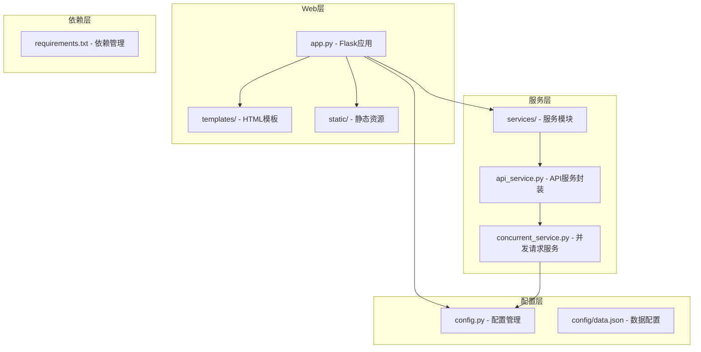
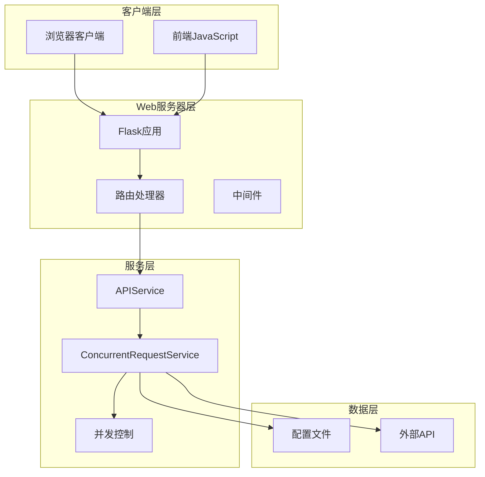
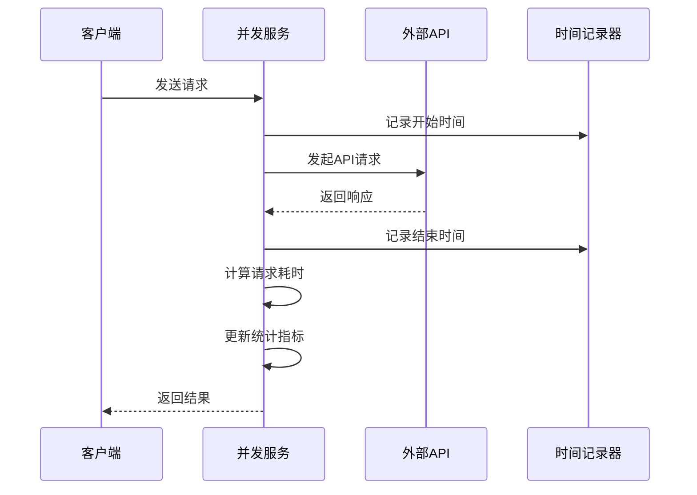
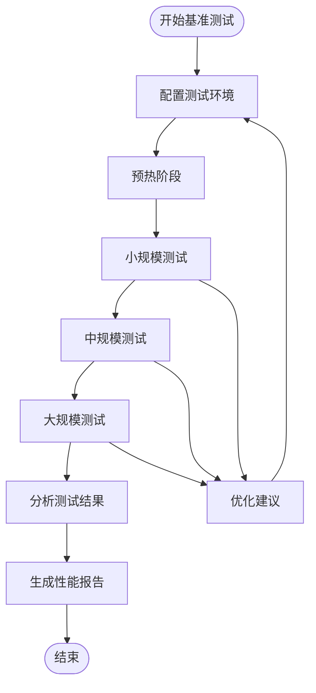
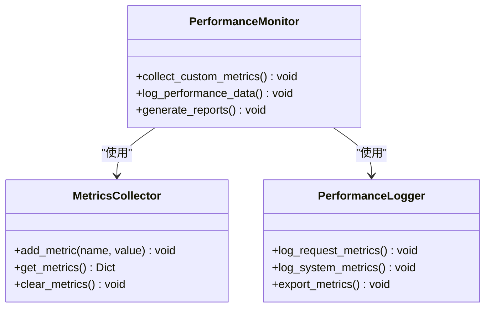

# 性能监控与分析

<cite>
**本文档引用的文件**
- [app.py](file://app.py)
- [config.py](file://config.py)
- [services/api_service.py](file://services/api_service.py)
- [services/concurrent_service.py](file://services/concurrent_service.py)
- [README.md](file://README.md)
- [config/data.json](file://config/data.json)
- [requirements.txt](file://requirements.txt)
- [templates/index.html](file://templates/index.html)
- [static/js/main.js](file://static/js/main.js)
</cite>

## 目录
1. [简介](#简介)
2. [项目结构](#项目结构)
3. [核心组件](#核心组件)
4. [架构概览](#架构概览)
5. [详细组件分析](#详细组件分析)
6. [性能监控机制](#性能监控机制)
7. [性能指标收集](#性能指标收集)
8. [性能瓶颈识别](#性能瓶颈识别)
9. [性能基准测试](#性能基准测试)
10. [性能回归检测](#性能回归检测)
11. [性能问题诊断](#性能问题诊断)
12. [最佳实践](#最佳实践)
13. [结论](#结论)

## 简介

本项目是一个基于Flask的AI文案评测对比系统，提供了完整的性能监控与分析功能。系统通过内置的性能指标收集机制，能够实时监控请求时间统计、完成率监控和错误率跟踪。本文档将深入分析系统的性能监控实现，提供扩展指导和最佳实践。

## 项目结构

该项目采用清晰的分层架构设计，主要包含以下模块：



**图表来源**
- [app.py:1-139](file://app.py#L1-L139)
- [services/api_service.py:1-14](file://services/api_service.py#L1-L14)
- [services/concurrent_service.py:1-162](file://services/concurrent_service.py#L1-L162)
- [config.py:1-12](file://config.py#L1-L12)

**章节来源**
- [app.py:1-139](file://app.py#L1-L139)
- [README.md:24-44](file://README.md#L24-L44)

## 核心组件

系统的核心组件包括：

### Flask应用层
- **路由管理**: 提供RESTful API接口
- **请求处理**: 处理HTTP请求和响应
- **异常处理**: 统一的错误处理机制

### 服务层
- **APIService**: API服务封装层
- **ConcurrentRequestService**: 并发请求核心服务

### 配置管理层
- **Config类**: 环境变量配置管理
- **数据配置**: JSON格式的数据配置文件

**章节来源**
- [app.py:10-13](file://app.py#L10-L13)
- [services/api_service.py:4-14](file://services/api_service.py#L4-L14)
- [services/concurrent_service.py:8-20](file://services/concurrent_service.py#L8-L20)
- [config.py:3-12](file://config.py#L3-L12)

## 架构概览

系统采用经典的三层架构模式，实现了清晰的关注点分离：



**图表来源**
- [app.py:15-61](file://app.py#L15-L61)
- [services/api_service.py:8-13](file://services/api_service.py#L8-L13)
- [services/concurrent_service.py:118-158](file://services/concurrent_service.py#L118-L158)

## 详细组件分析

### Flask应用组件

Flask应用作为系统的入口点，负责处理所有HTTP请求：

```mermaid
classDiagram
class FlaskApp {
+route("/") index()
+route("/api/photo/<path : filename>") get_photo()
+route("/api/load-data") load_local_data()
+route("/api/concurrent") send_concurrent_requests()
+route("/api/export-excel") export_excel()
+run() start_server()
}
class APIService {
+concurrent_service ConcurrentRequestService
+send_concurrent_requests() Dict[]
}
class ConcurrentRequestService {
+max_concurrent int
+api_base_url string
+timeout int
+data_config_path string
+start_time float
+completed_count int
+total_count int
+request_times float[]
+lock Lock
+load_data_config() Dict~Any~
+print_progress() void
+send_single_request() Dict~Any~
+send_concurrent_requests() Dict[]
+execute() Dict[]
}
FlaskApp --> APIService : "使用"
APIService --> ConcurrentRequestService : "委托"
```

**图表来源**
- [app.py:15-61](file://app.py#L15-L61)
- [services/api_service.py:4-14](file://services/api_service.py#L4-L14)
- [services/concurrent_service.py:8-162](file://services/concurrent_service.py#L8-L162)

### 并发请求服务组件

并发请求服务是系统性能监控的核心组件：

**章节来源**
- [services/concurrent_service.py:8-162](file://services/concurrent_service.py#L8-L162)

## 性能监控机制

### 内置性能指标收集

系统实现了完整的性能指标收集机制，主要包括：

#### 时间统计指标
- **请求开始时间**: 记录每个请求的开始时刻
- **请求结束时间**: 记录每个请求的完成时刻
- **请求耗时**: 计算单个请求的执行时间
- **总耗时**: 计算整个批次的总执行时间
- **平均耗时**: 计算每个请求的平均执行时间

#### 完成率监控
- **总请求数**: 批次中请求的总数
- **已完成数**: 已完成处理的请求数
- **剩余请求数**: 尚未处理的请求数
- **完成百分比**: 已完成请求占总请求数的比例

#### 错误率跟踪
- **错误类型统计**: 统计不同类型的错误数量
- **超时错误**: 网络请求超时的错误
- **其他异常**: 其他未预期的异常情况
- **错误率计算**: 错误请求占总请求数的比例

**章节来源**
- [services/concurrent_service.py:30-42](file://services/concurrent_service.py#L30-L42)
- [services/concurrent_service.py:118-158](file://services/concurrent_service.py#L118-L158)

### print_progress方法详解

`print_progress`方法提供了详细的性能数据输出格式：

#### 输出格式结构
```
==================================================
总请求数: {total_count}
已完成: {completed_count}
剩余: {remaining}
平均每个请求耗时: {avg_time:.2f}秒
总耗时: {elapsed_time:.2f}秒
==================================================
```

#### 输出字段解读
- **总请求数**: 当前批次中需要处理的请求总数
- **已完成**: 已经成功处理的请求数量
- **剩余**: 尚未处理的请求数量
- **平均每个请求耗时**: 当前已完成请求的平均执行时间
- **总耗时**: 从开始处理到当前时刻的累计时间

#### 实时监控价值
- **进度可视化**: 提供实时的处理进度反馈
- **性能趋势**: 展示请求耗时的变化趋势
- **容量规划**: 帮助评估系统的处理能力
- **问题预警**: 通过异常的耗时变化发现潜在问题

**章节来源**
- [services/concurrent_service.py:30-42](file://services/concurrent_service.py#L30-L42)

## 性能指标收集

### 请求时间统计

系统通过精确的时间戳记录实现了全面的请求时间统计：

#### 时间测量精度
- **高精度时间戳**: 使用`time.time()`获取微秒级精度的时间
- **单请求耗时**: 记录每个请求从开始到结束的完整时间
- **批次统计**: 维护整个批次的请求耗时数组

#### 统计指标计算
- **平均耗时**: 所有请求耗时的算术平均值
- **总耗时**: 批次开始到结束的累计时间
- **实时平均**: 基于已完成请求计算的动态平均值



**图表来源**
- [services/concurrent_service.py:43-112](file://services/concurrent_service.py#L43-L112)

### 完成率监控

系统实现了多层次的完成率监控机制：

#### 基础完成率指标
- **绝对完成率**: `已完成数 / 总请求数 × 100%`
- **相对完成率**: 基于批次开始时的动态完成比例
- **实时完成率**: 基于当前处理状态的即时完成比例

#### 进度可视化
- **阶段性报告**: 每完成一定数量的请求就输出一次进度
- **时间预测**: 基于平均耗时预测剩余处理时间
- **吞吐量监控**: 每秒处理的请求数量

**章节来源**
- [services/concurrent_service.py:118-158](file://services/concurrent_service.py#L118-L158)

### 错误率跟踪

系统提供了完善的错误率跟踪机制：

#### 错误分类统计
- **超时错误**: 网络请求超时导致的错误
- **异常错误**: 其他未预期的异常情况
- **状态码错误**: API返回非200的状态码

#### 错误处理策略
- **错误计数**: 统计各类错误的发生次数
- **错误恢复**: 对可恢复的错误进行重试
- **错误报告**: 提供详细的错误信息和上下文

**章节来源**
- [services/concurrent_service.py:79-112](file://services/concurrent_service.py#L79-L112)

## 性能瓶颈识别

### CPU使用率监控

#### 监控方法
- **进程级监控**: 使用系统工具监控Python进程的CPU使用率
- **线程分析**: 分析异步事件循环的CPU占用情况
- **热点识别**: 识别CPU密集型操作的热点函数

#### 常见瓶颈
- **JSON序列化**: 大数据量的JSON处理
- **图片处理**: PIL库的图片转换和压缩
- **字符串操作**: 大量的字符串拼接和格式化

### 内存占用监控

#### 内存使用分析
- **对象生命周期**: 监控大量临时对象的内存占用
- **缓存管理**: 分析请求耗时数组的内存增长
- **内存泄漏检测**: 识别潜在的内存泄漏问题

#### 优化建议
- **及时清理**: 及时释放不再使用的对象引用
- **分批处理**: 避免一次性加载过多数据
- **资源管理**: 使用with语句确保资源正确释放

### 网络I/O监控

#### 网络性能分析
- **并发连接**: 监控同时建立的网络连接数量
- **请求队列**: 分析请求的排队等待时间
- **带宽使用**: 监控网络传输的数据量

#### 网络优化策略
- **连接池管理**: 优化aiohttp会话的连接复用
- **超时配置**: 合理设置请求超时时间
- **重试机制**: 实现智能的请求重试策略

## 性能基准测试

### 测试设计原则

#### 基准测试框架
- **标准化环境**: 在相同的硬件和软件环境下进行测试
- **可控变量**: 控制影响性能的关键变量
- **重复性**: 确保测试结果的可重复性和可靠性

#### 测试场景设计
- **小规模测试**: 1-10个请求的快速验证
- **中规模测试**: 100-1000个请求的性能评估
- **大规模测试**: 1000+个请求的压力测试

### 实施方法

#### 自动化测试流程


**图表来源**
- [services/concurrent_service.py:118-158](file://services/concurrent_service.py#L118-L158)

#### 关键性能指标
- **吞吐量**: 每秒处理的请求数
- **延迟**: 请求的平均响应时间
- **并发能力**: 系统能够稳定处理的最大并发数
- **资源利用率**: CPU、内存、网络的使用效率

## 性能回归检测

### 回归检测机制

#### 自动化监控
- **阈值设定**: 为关键性能指标设定合理的阈值
- **持续监控**: 在CI/CD流程中集成性能测试
- **趋势分析**: 分析性能指标的历史趋势变化

#### 回归预警系统
- **实时告警**: 当性能指标超过阈值时立即告警
- **趋势预测**: 基于历史数据预测未来的性能趋势
- **根因分析**: 自动识别可能导致性能下降的原因

### 持续性能监控

#### 监控指标体系
- **实时指标**: 响应时间、吞吐量、错误率等
- **趋势指标**: 性能指标的长期变化趋势
- **容量指标**: 系统的处理能力和资源使用情况

#### 监控工具集成
- **APM工具**: 集成专业的应用性能监控工具
- **日志分析**: 分析系统日志中的性能相关信息
- **告警机制**: 建立多层次的性能告警机制

## 性能问题诊断

### 诊断方法论

#### 问题定位步骤
1. **症状观察**: 识别具体的性能问题表现
2. **范围缩小**: 确定问题发生的范围和影响程度
3. **根因分析**: 深入分析问题的根本原因
4. **解决方案**: 制定针对性的优化方案
5. **验证测试**: 验证优化效果并防止问题复发

#### 常见性能问题及解决方案

##### 网络延迟问题
- **问题特征**: 请求响应时间过长
- **诊断方法**: 使用网络分析工具检查RTT和丢包率
- **解决方案**: 优化网络配置、增加缓存、使用CDN

##### 内存泄漏问题
- **问题特征**: 内存使用持续增长
- **诊断方法**: 使用内存分析工具监控对象生命周期
- **解决方案**: 修复对象引用、优化数据结构、实现资源回收

##### CPU过载问题
- **问题特征**: CPU使用率达到峰值
- **诊断方法**: 分析CPU热点、检查算法复杂度
- **解决方案**: 优化算法、使用缓存、异步处理

### 诊断工具推荐

#### 系统级工具
- **top/htop**: 实时监控系统资源使用情况
- **iostat**: 监控磁盘I/O性能
- **netstat**: 分析网络连接状态

#### 应用级工具
- **cProfile**: Python程序的性能分析
- **memory_profiler**: 内存使用情况分析
- **py-spy**: Python程序的实时性能采样

## 最佳实践

### 性能优化策略

#### 代码层面优化
- **算法优化**: 选择更高效的算法和数据结构
- **缓存策略**: 实现多级缓存减少重复计算
- **异步处理**: 充分利用异步编程提高并发性能

#### 系统层面优化
- **资源配置**: 合理配置服务器资源和网络带宽
- **负载均衡**: 实现多实例部署和流量分发
- **数据库优化**: 优化查询性能和连接池配置

#### 监控体系建设
- **指标定义**: 明确关键性能指标的定义和计算方法
- **告警机制**: 建立多层次的性能告警机制
- **趋势分析**: 建立性能趋势分析和预测模型

### 扩展性能监控功能

#### 自定义指标收集


**图表来源**
- [services/concurrent_service.py:30-42](file://services/concurrent_service.py#L30-L42)

#### 性能日志记录
- **结构化日志**: 使用JSON格式记录性能相关的日志
- **时间戳记录**: 确保所有性能事件都有精确的时间戳
- **上下文信息**: 记录性能事件发生时的相关上下文信息

#### 监控数据存储
- **时序数据库**: 使用专门的时序数据库存储性能数据
- **数据聚合**: 实现数据的自动聚合和汇总
- **历史查询**: 提供历史性能数据的查询和分析功能

### 性能测试自动化

#### 测试用例设计
- **边界条件测试**: 测试极端条件下的性能表现
- **压力测试**: 测试系统在高负载下的稳定性
- **稳定性测试**: 长时间运行测试系统的稳定性

#### 测试执行策略
- **定时执行**: 定期自动执行性能测试
- **增量测试**: 仅测试发生变化的功能模块
- **回归测试**: 每次变更后自动执行回归测试

## 结论

本项目提供了完整的性能监控与分析解决方案，通过内置的性能指标收集机制，能够有效监控系统的各项关键性能指标。系统的核心优势在于：

1. **实时监控**: 通过`print_progress`方法提供实时的性能反馈
2. **全面统计**: 覆盖请求时间、完成率、错误率等多个维度
3. **易于扩展**: 提供了清晰的扩展点支持自定义性能监控
4. **实用性强**: 针对实际应用场景提供了有效的性能优化建议

通过遵循本文档提供的最佳实践和扩展指导，开发者可以进一步完善系统的性能监控能力，实现持续的性能优化和问题预防。建议在生产环境中结合专业的APM工具，建立更加完善的性能监控体系，确保系统的稳定性和高性能运行。