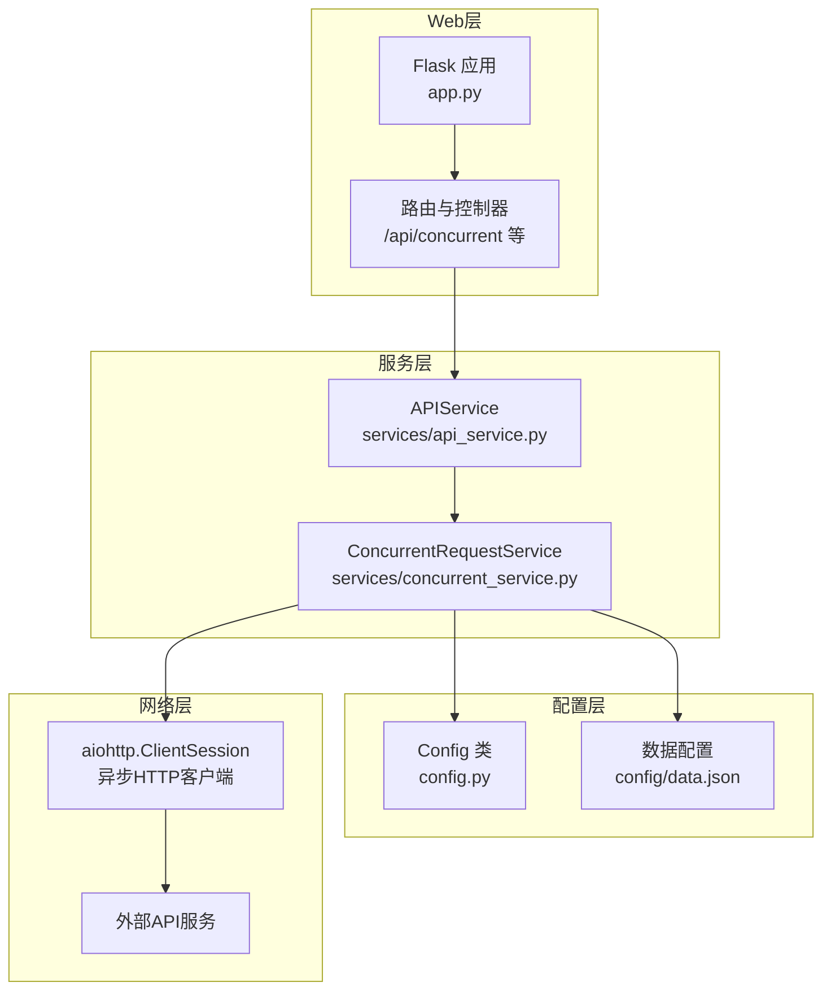
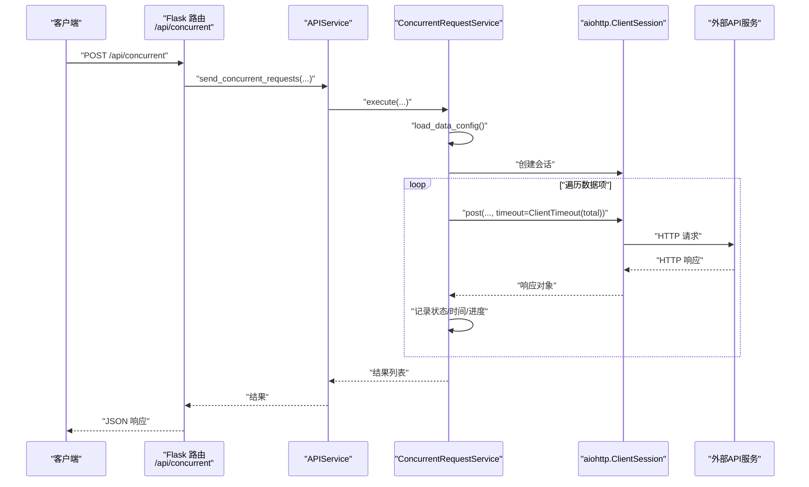
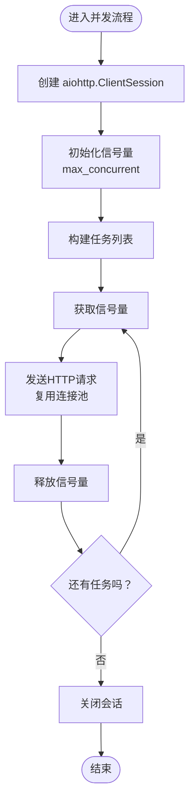
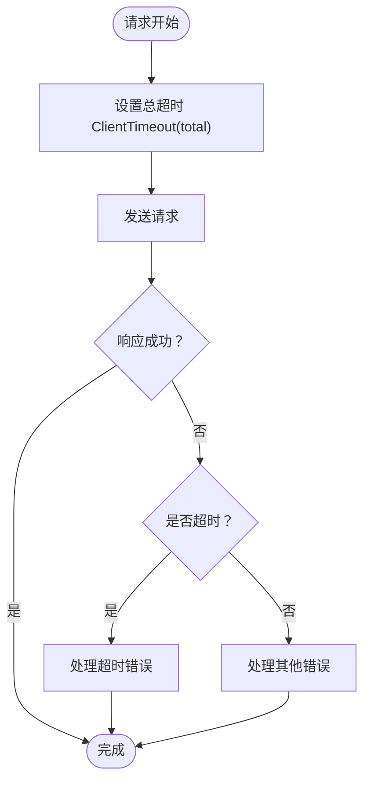
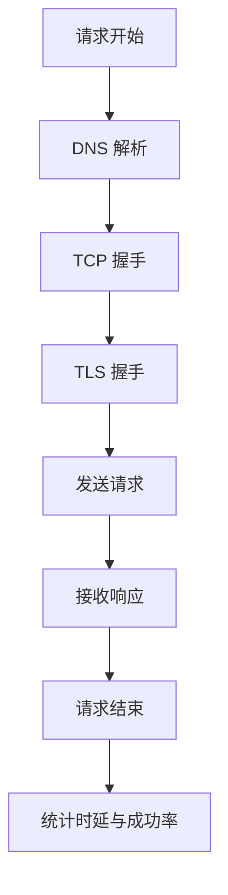
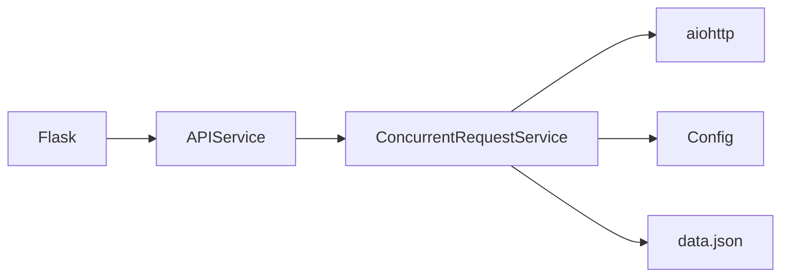

# 网络优化技术

<cite>
**本文引用的文件**
- [app.py](file://app.py)
- [config.py](file://config.py)
- [services/api_service.py](file://services/api_service.py)
- [services/concurrent_service.py](file://services/concurrent_service.py)
- [config/data.json](file://config/data.json)
- [requirements.txt](file://requirements.txt)
</cite>

## 目录
1. [引言](#引言)
2. [项目结构](#项目结构)
3. [核心组件](#核心组件)
4. [架构概览](#架构概览)
5. [详细组件分析](#详细组件分析)
6. [依赖分析](#依赖分析)
7. [性能考虑](#性能考虑)
8. [故障排查指南](#故障排查指南)
9. [结论](#结论)
10. [附录](#附录)

## 引言
本文件围绕网络优化技术展开，结合项目中对异步HTTP客户端aiohttp的使用，系统性地梳理连接池优化（连接复用与超时配置）、API超时策略（连接超时、读取超时、总超时）、网络重试机制（指数退避与错误分类）、带宽优化（请求合并与响应压缩）、DNS解析优化与网络延迟监控、以及网络故障处理与降级策略，并给出不同网络环境下的性能调优建议与最佳实践。为便于非技术读者理解，文档采用分层讲解与可视化图示相结合的方式呈现。

## 项目结构
该项目基于Flask提供Web服务，后端通过异步HTTP客户端向外部API发起批量请求。整体结构清晰，职责分离明确：
- Web入口与路由：Flask应用负责接收HTTP请求、渲染模板、导出Excel等。
- 业务服务层：APIService封装对外部接口的调用；ConcurrentRequestService负责并发控制、请求发送与结果聚合。
- 配置管理：Config类集中管理环境变量与默认参数。
- 数据配置：data.json提供待处理的数据集合与样式配置。

图表来源
- [app.py:15-61](file://app.py#L15-L61)
- [services/api_service.py:8-13](file://services/api_service.py#L8-L13)
- [services/concurrent_service.py:118-158](file://services/concurrent_service.py#L118-L158)
- [config.py:3-11](file://config.py#L3-L11)
- [config/data.json:1-32](file://config/data.json#L1-L32)

章节来源
- [app.py:1-139](file://app.py#L1-L139)
- [config.py:1-12](file://config.py#L1-L12)
- [services/api_service.py:1-14](file://services/api_service.py#L1-L14)
- [services/concurrent_service.py:1-162](file://services/concurrent_service.py#L1-L162)
- [config/data.json:1-32](file://config/data.json#L1-L32)
- [requirements.txt:1-6](file://requirements.txt#L1-L6)

## 核心组件
- Flask应用与路由：提供静态页面、数据加载、并发请求与Excel导出功能。
- APIService：对外部接口调用的门面，委托ConcurrentRequestService执行。
- ConcurrentRequestService：核心网络优化实现者，负责并发控制、会话管理、超时与异常处理。
- Config：集中式配置，支持环境变量覆盖与默认值。
- data.json：本地数据配置，包含样式列表、默认样式与待处理数据。

章节来源
- [app.py:15-61](file://app.py#L15-L61)
- [services/api_service.py:8-13](file://services/api_service.py#L8-L13)
- [services/concurrent_service.py:8-20](file://services/concurrent_service.py#L8-L20)
- [config.py:3-11](file://config.py#L3-L11)
- [config/data.json:1-32](file://config/data.json#L1-L32)

## 架构概览
下图展示从Flask路由到外部API的关键调用链路，以及并发控制与会话生命周期。

图表来源
- [app.py:43-61](file://app.py#L43-L61)
- [services/api_service.py:8-13](file://services/api_service.py#L8-L13)
- [services/concurrent_service.py:118-158](file://services/concurrent_service.py#L118-L158)
- [services/concurrent_service.py:55-78](file://services/concurrent_service.py#L55-L78)

## 详细组件分析

### 连接池优化与连接复用
- 会话生命周期：在并发请求执行期间，ConcurrentRequestService使用异步上下文管理器创建并持有aiohttp.ClientSession，确保连接复用与资源回收。
- 并发控制：通过asyncio.Semaphore限制最大并发数，避免过多连接导致拥塞或被目标服务器限流。
- 连接复用策略：aiohttp默认启用连接池与keep-alive，减少TCP握手与TLS开销；在单个会话内重复请求同一主机可显著降低延迟。

图表来源
- [services/concurrent_service.py:138-146](file://services/concurrent_service.py#L138-L146)
- [services/concurrent_service.py:114-116](file://services/concurrent_service.py#L114-L116)
- [services/concurrent_service.py:140](file://services/concurrent_service.py#L140)

章节来源
- [services/concurrent_service.py:10-13](file://services/concurrent_service.py#L10-L13)
- [services/concurrent_service.py:138-146](file://services/concurrent_service.py#L138-L146)
- [services/concurrent_service.py:140](file://services/concurrent_service.py#L140)

### API超时设置策略
- 总超时：当前实现仅设置ClientTimeout(total=...)，适用于端到端总时长控制。
- 连接与读取超时：未显式拆分connect与sock_read，若需更细粒度控制，可在ClientTimeout中分别设置连接与读取超时。
- 合理配置建议：
  - 总超时应覆盖网络往返与服务端处理时间，避免过短导致误判超时。
  - 对于长文本生成等耗时操作，适当提高总超时；对快速查询场景，可缩短总超时以提升吞吐。
  - 若目标服务不稳定，建议增加重试与退避策略，而非单纯延长超时。

图表来源
- [services/concurrent_service.py:55-78](file://services/concurrent_service.py#L55-L78)
- [services/concurrent_service.py:79-95](file://services/concurrent_service.py#L79-L95)
- [services/concurrent_service.py:96-112](file://services/concurrent_service.py#L96-L112)

章节来源
- [services/concurrent_service.py:55-78](file://services/concurrent_service.py#L55-L78)
- [services/concurrent_service.py:79-95](file://services/concurrent_service.py#L79-L95)
- [services/concurrent_service.py:96-112](file://services/concurrent_service.py#L96-L112)

### 网络重试机制（指数退避与错误分类）
- 当前实现：对超时与异常进行捕获并返回错误信息，未内置重试逻辑。
- 指数退避建议：对瞬时性错误（如网络抖动、5xx）采用指数退避重试，退避间隔按公式计算并在上限阈值内增长。
- 错误分类处理：
  - 可重试错误：连接超时、读取超时、5xx类错误、DNS解析失败等。
  - 不可重试错误：4xx类错误、参数错误、认证失败等。
- 实施要点：结合超时配置与并发限制，避免重试放大网络压力；在会话级别统一管理重试策略，保证一致性。

章节来源
- [services/concurrent_service.py:79-95](file://services/concurrent_service.py#L79-L95)
- [services/concurrent_service.py:96-112](file://services/concurrent_service.py#L96-L112)

### 带宽优化技术
- 请求合并：将多个小请求合并为批处理请求，减少HTTP头部开销与连接建立次数。可在数据预处理阶段按规则聚合，或在服务端支持批量接口时启用。
- 响应压缩：启用gzip/deflate等压缩传输，降低带宽占用。可通过会话配置或服务端协商实现。
- 传输编码：优先使用HTTP/2，利用多路复用与头部压缩进一步提升效率。

章节来源
- [requirements.txt:3](file://requirements.txt#L3)

### DNS解析优化与网络延迟监控
- DNS优化：使用持久化DNS缓存、预解析常用域名、选择低延迟DNS服务商；在aiohttp中可通过自定义Connector配置DNS缓存与解析行为。
- 延迟监控：在请求前后记录时间戳，统计平均时延与P95/P99；结合并发度与超时配置评估系统瓶颈。

图表来源
- [services/concurrent_service.py:44-61](file://services/concurrent_service.py#L44-L61)
- [services/concurrent_service.py:148-156](file://services/concurrent_service.py#L148-L156)

章节来源
- [services/concurrent_service.py:44-61](file://services/concurrent_service.py#L44-L61)
- [services/concurrent_service.py:148-156](file://services/concurrent_service.py#L148-L156)

### 网络故障处理与降级策略
- 超时与异常：捕获超时与异常，记录错误并返回结构化结果，避免中断整个批次。
- 降级策略：当外部服务不可用时，返回缓存数据、默认文案或提示信息；同时触发告警与熔断保护。
- 资源回收：确保会话在异常路径也能正确关闭，防止连接泄漏。

章节来源
- [services/concurrent_service.py:79-95](file://services/concurrent_service.py#L79-L95)
- [services/concurrent_service.py:96-112](file://services/concurrent_service.py#L96-L112)
- [services/concurrent_service.py:140](file://services/concurrent_service.py#L140)

## 依赖分析
- 外部依赖：aiohttp用于异步HTTP通信；Flask提供Web框架；openpyxl用于Excel导出；Pillow用于图像处理；requests用于同步场景（本项目未直接使用）。
- 版本兼容性：aiohttp版本与Python版本需匹配，注意异步API变更与弃用特性。

图表来源
- [requirements.txt:1-6](file://requirements.txt#L1-L6)
- [app.py:10](file://app.py#L10)
- [services/api_service.py:2](file://services/api_service.py#L2)
- [services/concurrent_service.py:6](file://services/concurrent_service.py#L6)

章节来源
- [requirements.txt:1-6](file://requirements.txt#L1-L6)
- [app.py:10](file://app.py#L10)
- [services/api_service.py:2](file://services/api_service.py#L2)
- [services/concurrent_service.py:6](file://services/concurrent_service.py#L6)

## 性能考虑
- 连接池与并发：
  - 合理设置最大并发数，避免过度竞争导致队头阻塞。
  - 使用连接池复用，减少握手成本；在高并发场景下适当增大连接池容量。
- 超时配置：
  - 总超时应覆盖网络RTT与服务端处理时间；对长任务适当放宽，对短查询严格限制。
  - 如需更细粒度控制，拆分连接超时与读取超时。
- 重试与退避：
  - 对瞬时性错误采用指数退避，避免雪崩效应；设置最大重试次数与上限时间。
- 压缩与协议：
  - 启用响应压缩与HTTP/2，减少带宽占用与提升并发效率。
- DNS与监控：
  - 缓存DNS解析结果，降低解析延迟；持续监控平均时延与错误率，动态调整并发与超时。

## 故障排查指南
- 常见问题定位：
  - 超时：检查总超时设置、网络RTT、目标服务负载；必要时拆分连接与读取超时。
  - 连接泄漏：确认会话在异常路径也能关闭；检查并发任务是否全部完成。
  - DNS失败：验证DNS可用性与缓存；尝试更换DNS服务商。
- 日志与指标：
  - 记录每个请求的开始/结束时间、状态码与错误类型；统计P95/P99时延与失败率。
  - 在并发执行时输出进度与平均耗时，便于快速定位瓶颈。

章节来源
- [services/concurrent_service.py:79-95](file://services/concurrent_service.py#L79-L95)
- [services/concurrent_service.py:96-112](file://services/concurrent_service.py#L96-L112)
- [services/concurrent_service.py:30-41](file://services/concurrent_service.py#L30-L41)
- [services/concurrent_service.py:148-156](file://services/concurrent_service.py#L148-L156)

## 结论
本项目已具备良好的异步并发基础与连接复用能力，但在超时细分、重试与退避、压缩与协议优化、DNS缓存与监控等方面仍有改进空间。通过精细化的超时配置、指数退避重试、请求合并与响应压缩、DNS优化与延迟监控，以及完善的故障处理与降级策略，可在不同网络环境下获得更稳定、高效的网络性能表现。

## 附录
- 环境变量与默认值参考：
  - API_BASE_URL：外部API基础地址
  - API_TIMEOUT：总超时（秒）
  - MAX_CONCURRENT_REQUESTS：最大并发数
  - DATA_CONFIG_PATH：数据配置文件路径
- 数据配置示例：包含样式列表、默认样式与待处理数据项。

章节来源
- [config.py:3-11](file://config.py#L3-L11)
- [config/data.json:1-32](file://config/data.json#L1-L32)