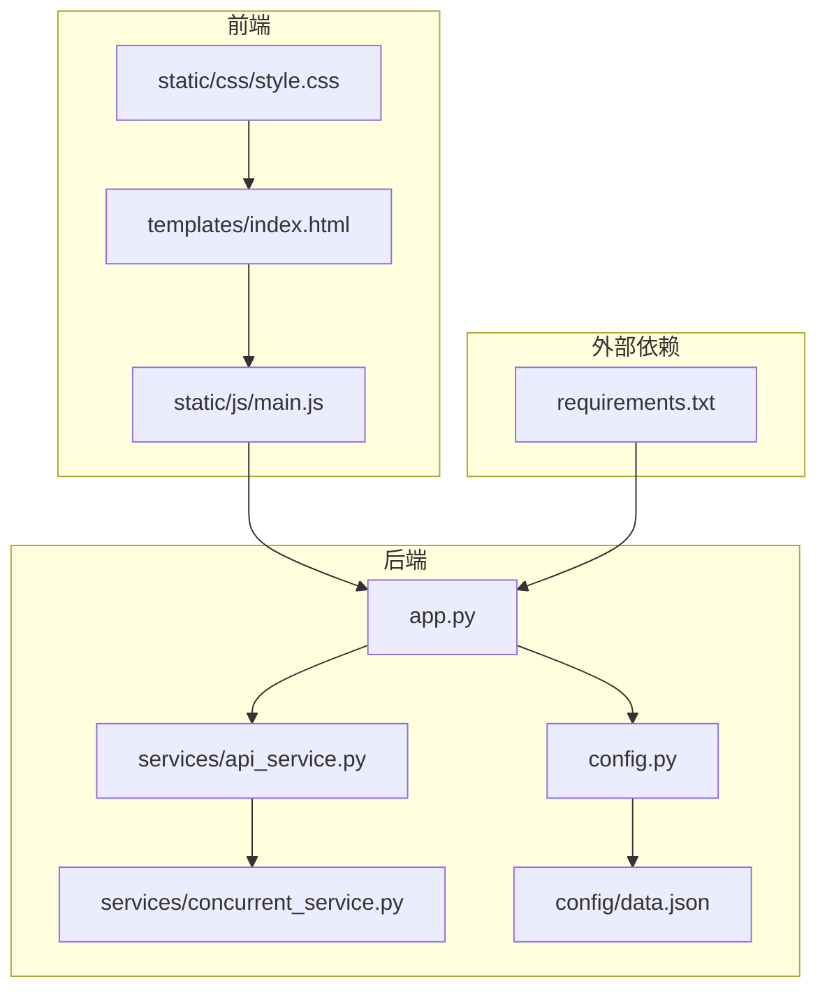
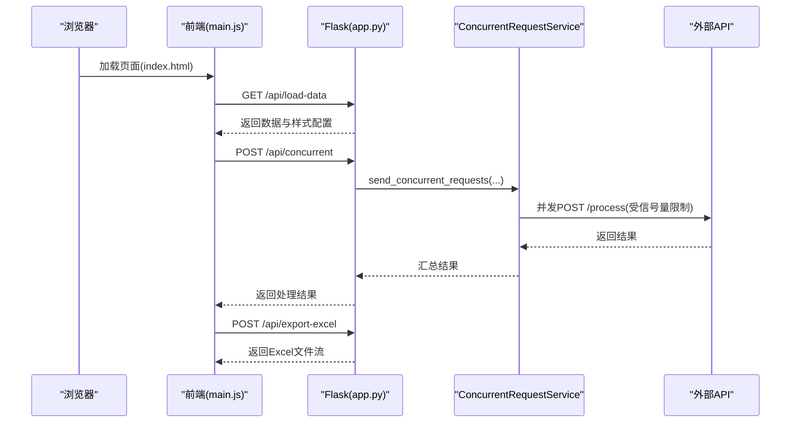
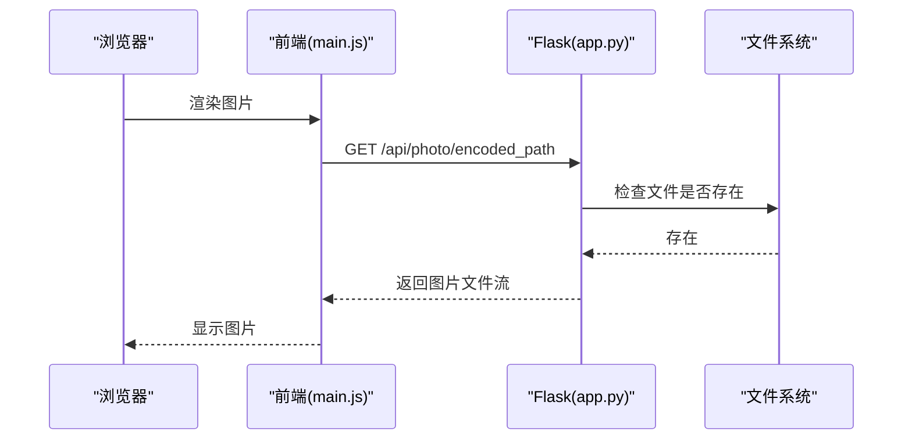
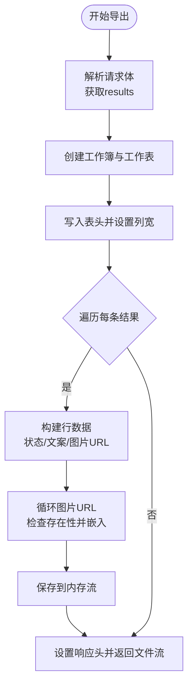
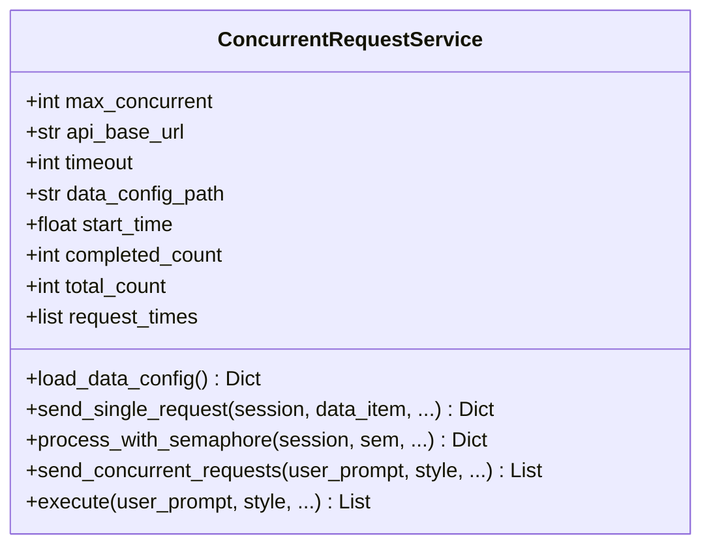
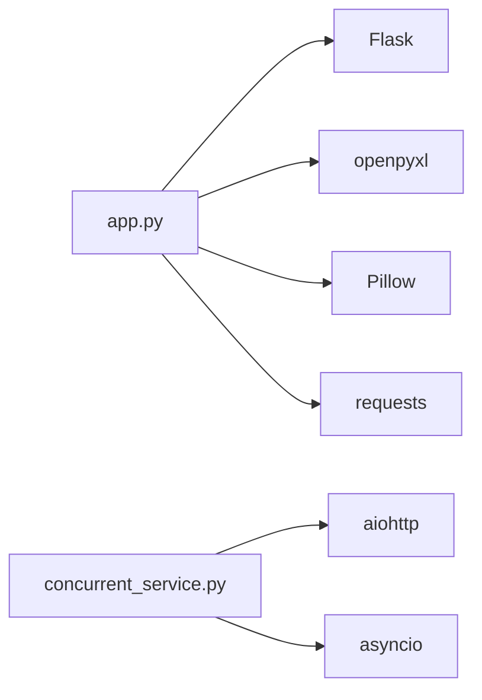

# 故障排除与维护

<cite>
**本文档引用的文件**
- [app.py](file://app.py)
- [config.py](file://config.py)
- [config/data.json](file://config/data.json)
- [services/api_service.py](file://services/api_service.py)
- [services/concurrent_service.py](file://services/concurrent_service.py)
- [templates/index.html](file://templates/index.html)
- [static/js/main.js](file://static/js/main.js)
- [static/css/style.css](file://static/css/style.css)
- [README.md](file://README.md)
- [requirements.txt](file://requirements.txt)
</cite>

## 目录
1. [简介](#简介)
2. [项目结构](#项目结构)
3. [核心组件](#核心组件)
4. [架构概览](#架构概览)
5. [详细组件分析](#详细组件分析)
6. [依赖分析](#依赖分析)
7. [性能考虑](#性能考虑)
8. [故障排除指南](#故障排除指南)
9. [结论](#结论)
10. [附录](#附录)

## 简介
本指南面向运维工程师与技术支持人员，提供针对该 Flask Web 应用的系统化故障排除与维护方案。重点覆盖图片显示问题、Excel 导出异常、并发请求超时等典型故障的诊断与修复；同时给出系统日志分析方法、调试技巧、性能监控指标、健康检查方法、部署维护建议、备份恢复策略、版本升级注意事项以及紧急故障处理流程。

## 项目结构
该项目采用典型的三层架构：前端模板与静态资源、后端 Flask 路由与服务层、配置文件与数据源。核心模块包括：
- 应用入口与路由：app.py
- 配置管理：config.py
- 数据配置：config/data.json
- 服务封装：services/api_service.py、services/concurrent_service.py
- 前端页面与交互：templates/index.html、static/js/main.js、static/css/style.css
- 依赖声明：requirements.txt

**图表来源**
- [app.py:1-139](file://app.py#L1-L139)
- [services/api_service.py:1-14](file://services/api_service.py#L1-L14)
- [services/concurrent_service.py:1-162](file://services/concurrent_service.py#L1-L162)
- [config.py:1-12](file://config.py#L1-L12)
- [config/data.json:1-32](file://config/data.json#L1-L32)
- [templates/index.html:1-40](file://templates/index.html#L1-L40)
- [static/js/main.js:1-266](file://static/js/main.js#L1-L266)
- [static/css/style.css:1-272](file://static/css/style.css#L1-L272)
- [requirements.txt:1-6](file://requirements.txt#L1-L6)

**章节来源**
- [README.md:24-44](file://README.md#L24-L44)
- [app.py:1-139](file://app.py#L1-L139)
- [config.py:1-12](file://config.py#L1-L12)
- [config/data.json:1-32](file://config/data.json#L1-L32)
- [services/api_service.py:1-14](file://services/api_service.py#L1-L14)
- [services/concurrent_service.py:1-162](file://services/concurrent_service.py#L1-L162)
- [templates/index.html:1-40](file://templates/index.html#L1-L40)
- [static/js/main.js:1-266](file://static/js/main.js#L1-L266)
- [static/css/style.css:1-272](file://static/css/style.css#L1-L272)
- [requirements.txt:1-6](file://requirements.txt#L1-L6)

## 核心组件
- Flask 应用与路由：负责页面渲染、API 接口、图片代理、Excel 导出与并发请求调度。
- 配置模块：集中管理环境变量与默认值，影响并发数、超时、数据路径等。
- 数据配置：JSON 格式的本地数据源，包含图片路径与文案。
- 服务层：
  - APIService：对外暴露并发请求接口，封装调用。
  - ConcurrentRequestService：实现异步并发请求、进度打印、超时与异常处理。
- 前端：HTML 模板 + JS 逻辑 + CSS 样式，负责数据加载、交互控制、结果渲染与 Excel 导出。

**章节来源**
- [app.py:15-139](file://app.py#L15-L139)
- [config.py:3-12](file://config.py#L3-L12)
- [config/data.json:1-32](file://config/data.json#L1-L32)
- [services/api_service.py:4-14](file://services/api_service.py#L4-L14)
- [services/concurrent_service.py:8-162](file://services/concurrent_service.py#L8-L162)
- [templates/index.html:1-40](file://templates/index.html#L1-L40)
- [static/js/main.js:1-266](file://static/js/main.js#L1-L266)
- [static/css/style.css:1-272](file://static/css/style.css#L1-L272)

## 架构概览
系统采用前后端分离的单页应用模式，后端通过 RESTful 接口提供数据加载、并发处理、Excel 导出与图片代理能力。并发请求使用 asyncio + aiohttp 控制最大并发数，实时输出进度信息。

**图表来源**
- [app.py:29-61](file://app.py#L29-L61)
- [services/concurrent_service.py:118-158](file://services/concurrent_service.py#L118-L158)
- [static/js/main.js:29-136](file://static/js/main.js#L29-L136)
- [static/js/main.js:220-260](file://static/js/main.js#L220-L260)

## 详细组件分析

### 图片代理与显示问题排查
- 问题现象：浏览器无法直接访问本地文件导致图片不显示。
- 解决方案：使用后端代理接口 `/api/photo/<path:filename>` 将本地图片路径转换为可访问的文件流。
- 关键点：
  - 确保图片路径在配置文件中正确配置。
  - 确认图片文件存在且可读。
  - 前端通过 `/api/photo/编码后的绝对路径` 访问图片。
  - 若图片加载失败，前端已内置降级占位图。

**图表来源**
- [app.py:19-27](file://app.py#L19-L27)
- [static/js/main.js:157-166](file://static/js/main.js#L157-L166)

**章节来源**
- [app.py:19-27](file://app.py#L19-L27)
- [config/data.json:8-28](file://config/data.json#L8-L28)
- [static/js/main.js:157-166](file://static/js/main.js#L157-L166)

### Excel 导出异常排查
- 功能概述：将处理结果写入 Excel，最多支持 5 张图片嵌入单元格，自动设置行列尺寸。
- 常见问题与修复：
  - 图片未显示：确认已安装 Pillow；确保图片格式受支持；使用 Excel 或 WPS 打开。
  - 导出失败：检查后端异常捕获与返回码；前端检查响应状态。
  - 文件名与下载：后端按日期生成文件名并通过 Content-Disposition 下载。
- 关键实现点：
  - 逐条处理结果，拼接行数据。
  - 对每个图片路径进行存在性检查与异常捕获。
  - 使用 openpyxl 写入图片并记录日志。

**图表来源**
- [app.py:63-135](file://app.py#L63-L135)
- [app.py:102-116](file://app.py#L102-L116)

**章节来源**
- [app.py:63-135](file://app.py#L63-L135)
- [README.md:322-327](file://README.md#L322-L327)

### 并发请求超时与性能问题
- 并发控制：通过信号量限制最大并发数，默认值来自配置。
- 超时处理：单次请求超时与整体处理超时分别处理，异常被捕获并返回。
- 进度输出：实时打印总请求数、已完成、剩余、平均耗时、总耗时。
- 调优建议：
  - 适当降低最大并发数以缓解外部 API 压力。
  - 提升超时阈值以适应网络波动。
  - 监控外部 API 响应时间与可用性。

**图表来源**
- [services/concurrent_service.py:8-162](file://services/concurrent_service.py#L8-L162)
- [config.py:7-9](file://config.py#L7-L9)

**章节来源**
- [services/concurrent_service.py:118-158](file://services/concurrent_service.py#L118-L158)
- [services/concurrent_service.py:79-112](file://services/concurrent_service.py#L79-L112)
- [config.py:7-9](file://config.py#L7-L9)
- [README.md:329-333](file://README.md#L329-L333)

### 健康检查与系统监控
- 健康检查：
  - 应用端口可达性：默认监听 0.0.0.0:5000。
  - 配置文件可读性：数据配置文件必须可读且 JSON 格式有效。
  - 外部 API 可达性：并发请求的目标地址需可访问。
- 监控指标建议：
  - 并发请求数、平均响应时间、成功率、错误率。
  - Excel 导出耗时、图片嵌入数量。
  - 端到端处理时延（从开始处理到导出完成）。

**章节来源**
- [app.py:137-139](file://app.py#L137-L139)
- [services/concurrent_service.py:21-28](file://services/concurrent_service.py#L21-L28)
- [README.md:368-372](file://README.md#L368-L372)

## 依赖分析
- Python 版本与第三方库：Flask、requests、aiohttp、openpyxl、Pillow。
- 前端依赖：纯静态资源，无额外打包工具。
- 环境变量：DEBUG、SECRET_KEY、API_BASE_URL、API_TIMEOUT、MAX_CONCURRENT_REQUESTS、DATA_CONFIG_PATH。

**图表来源**
- [requirements.txt:1-6](file://requirements.txt#L1-L6)
- [app.py:1-12](file://app.py#L1-L12)
- [services/concurrent_service.py:1-6](file://services/concurrent_service.py#L1-L6)

**章节来源**
- [requirements.txt:1-6](file://requirements.txt#L1-L6)
- [config.py:4-11](file://config.py#L4-L11)

## 性能考虑
- 并发控制：通过信号量限制最大并发，避免对目标 API 造成过载。
- 超时设置：合理设置请求超时，防止长时间阻塞。
- 资源占用：Excel 导出使用内存流，注意大批量导出时的内存峰值。
- 前端渲染：图片懒加载与占位符提升用户体验。
- 网络与存储：图片路径尽量使用本地或内网可快速访问的存储。

[本节为通用性能建议，无需特定文件引用]

## 故障排除指南

### 图片显示问题
- 症状：页面图片不显示或报错。
- 诊断步骤：
  - 检查图片路径是否存在于配置文件中。
  - 确认图片文件存在且可读。
  - 通过代理接口访问图片验证可访问性。
  - 查看浏览器控制台与后端日志。
- 修复建议：
  - 更新配置文件中的图片路径。
  - 确保文件权限正确。
  - 使用相对路径或绝对路径保持一致。

**章节来源**
- [app.py:19-27](file://app.py#L19-L27)
- [config/data.json:8-28](file://config/data.json#L8-L28)
- [static/js/main.js:157-166](file://static/js/main.js#L157-L166)

### Excel 导出异常
- 症状：导出失败或图片未显示。
- 诊断步骤：
  - 检查 Pillow 是否安装。
  - 确认图片格式受支持。
  - 使用 Excel 或 WPS 打开文件。
  - 查看后端异常捕获与标准错误输出。
- 修复建议：
  - 安装 Pillow 并重启服务。
  - 更换图片格式为 PNG/JPEG/BMP/GIF/TIFF。
  - 确保图片路径正确且文件存在。

**章节来源**
- [app.py:63-135](file://app.py#L63-L135)
- [README.md:322-327](file://README.md#L322-L327)

### 并发请求超时
- 症状：处理卡住或出现超时错误。
- 诊断步骤：
  - 检查外部 API 服务状态。
  - 查看并发数与超时配置。
  - 观察终端输出的进度信息。
- 修复建议：
  - 降低最大并发数。
  - 提高超时阈值。
  - 检查网络连通性与防火墙规则。

**章节来源**
- [services/concurrent_service.py:79-112](file://services/concurrent_service.py#L79-L112)
- [config.py:7-9](file://config.py#L7-L9)
- [README.md:329-333](file://README.md#L329-L333)

### 端口占用与启动问题
- 症状：启动时报端口被占用。
- 修复建议：
  - 修改监听端口或释放占用端口。
  - 检查进程占用并终止相关进程。

**章节来源**
- [README.md:355-359](file://README.md#L355-L359)
- [app.py:137-139](file://app.py#L137-L139)

### 依赖安装失败
- 症状：pip 安装失败。
- 修复建议：
  - 升级 pip 并重试安装。
  - 检查网络代理与镜像源。

**章节来源**
- [README.md:361-366](file://README.md#L361-L366)
- [requirements.txt:1-6](file://requirements.txt#L1-L6)

### API 请求失败
- 症状：并发请求返回错误。
- 诊断步骤：
  - 检查外部 API 服务是否正常。
  - 验证 API_BASE_URL 配置。
  - 确认网络连接正常。
- 修复建议：
  - 修正 API 地址与鉴权。
  - 增加重试机制与熔断策略。

**章节来源**
- [README.md:368-372](file://README.md#L368-L372)
- [config.py:7](file://config.py#L7)

### 日志分析与调试技巧
- 终端输出：并发请求期间的进度信息与异常堆栈。
- 标准错误输出：Excel 导出时的图片加载错误与计数统计。
- 建议：
  - 将标准输出重定向到日志文件。
  - 使用 systemd 或 Docker 日志收集。
  - 结合浏览器开发者工具 Network 面板定位前端请求问题。

**章节来源**
- [services/concurrent_service.py:30-41](file://services/concurrent_service.py#L30-L41)
- [app.py:111-119](file://app.py#L111-L119)

### 性能监控与健康检查
- 监控指标：
  - 并发请求数、平均耗时、成功率。
  - Excel 导出耗时、图片嵌入数量。
  - 外部 API 响应时间与错误率。
- 健康检查：
  - GET /api/load-data 验证数据加载。
  - GET /api/concurrent 验证并发处理。
  - GET /api/export-excel 验证导出功能。

**章节来源**
- [app.py:29-61](file://app.py#L29-L61)
- [app.py:63-135](file://app.py#L63-L135)

### 部署维护建议与定期检查清单
- 环境准备：
  - 安装 Python 与依赖包。
  - 配置环境变量与数据文件。
- 运行与监控：
  - 使用 systemd 或 Docker 管理进程。
  - 配置日志轮转与告警。
- 定期检查：
  - 依赖版本一致性检查。
  - 数据配置文件完整性校验。
  - 外部 API 可用性与性能评估。
  - Excel 导出功能回归测试。

**章节来源**
- [README.md:48-76](file://README.md#L48-L76)
- [config.py:4-11](file://config.py#L4-L11)

### 备份与恢复策略
- 备份对象：
  - 配置文件与数据文件。
  - 生成的 Excel 文件。
  - 应用日志与错误快照。
- 恢复步骤：
  - 备份数据文件与日志。
  - 服务停机窗口内恢复配置与数据。
  - 验证各接口可用性与导出功能。

**章节来源**
- [config/data.json:1-32](file://config/data.json#L1-L32)
- [app.py:63-135](file://app.py#L63-L135)

### 版本升级注意事项与兼容性
- 依赖升级：
  - 逐步升级 Flask、aiohttp、openpyxl、Pillow 等库。
  - 先在测试环境验证兼容性。
- 配置迁移：
  - 检查新增或变更的环境变量。
  - 验证数据配置文件格式。
- 兼容性问题：
  - Excel 图片嵌入行为可能因 openpyxl 版本差异而变化。
  - 并发模型与超时配置需与新版本保持一致。

**章节来源**
- [requirements.txt:1-6](file://requirements.txt#L1-L6)
- [config.py:4-11](file://config.py#L4-L11)
- [README.md:17-22](file://README.md#L17-L22)

### 紧急故障处理流程与应急预案
- 流程：
  - 快速定位问题根因（日志、监控、接口测试）。
  - 临时降级（降低并发、禁用图片嵌入、回退版本）。
  - 通知相关方并启动应急响应。
  - 修复后回归测试与灰度发布。
- 应急预案：
  - 外部 API 不可用：切换备用服务或缓存策略。
  - 服务器资源不足：扩容实例或优化并发参数。
  - 数据文件损坏：从备份恢复并验证完整性。

**章节来源**
- [services/concurrent_service.py:79-112](file://services/concurrent_service.py#L79-L112)
- [app.py:63-135](file://app.py#L63-L135)

### 社区支持与问题反馈渠道
- 项目文档与贡献指南：
  - 参考 README.md 中的开发说明与贡献方式。
  - 提交 Issue 时附带环境信息、日志与复现步骤。
- 建议：
  - 使用 GitHub Issues 进行问题跟踪。
  - 提供最小可复现案例与环境配置。

**章节来源**
- [README.md:398-401](file://README.md#L398-L401)

## 结论
本指南提供了从架构理解到具体故障处理的全链路运维方案。通过合理的配置管理、并发控制、日志分析与健康检查，可显著提升系统的稳定性与可维护性。建议在生产环境中结合自动化监控与告警体系，持续优化性能与可靠性。

[本节为总结性内容，无需特定文件引用]

## 附录

### 常用命令与配置
- 启动应用：python app.py
- 环境变量示例：参考 README.md 中的环境变量表格与示例。
- 依赖安装：pip install -r requirements.txt

**章节来源**
- [README.md:68-76](file://README.md#L68-L76)
- [README.md:78-87](file://README.md#L78-L87)
- [requirements.txt:1-6](file://requirements.txt#L1-L6)