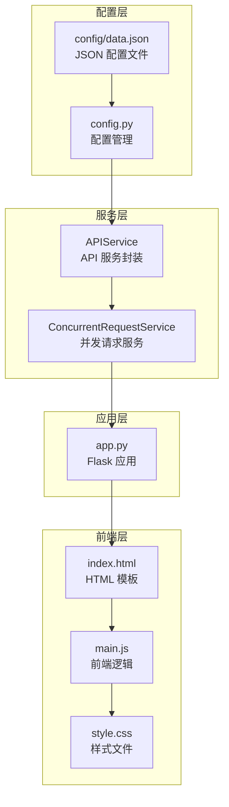
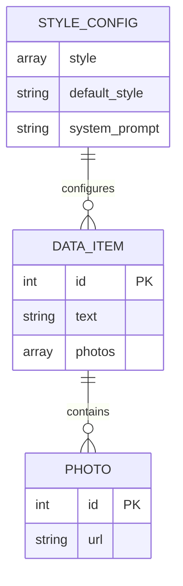
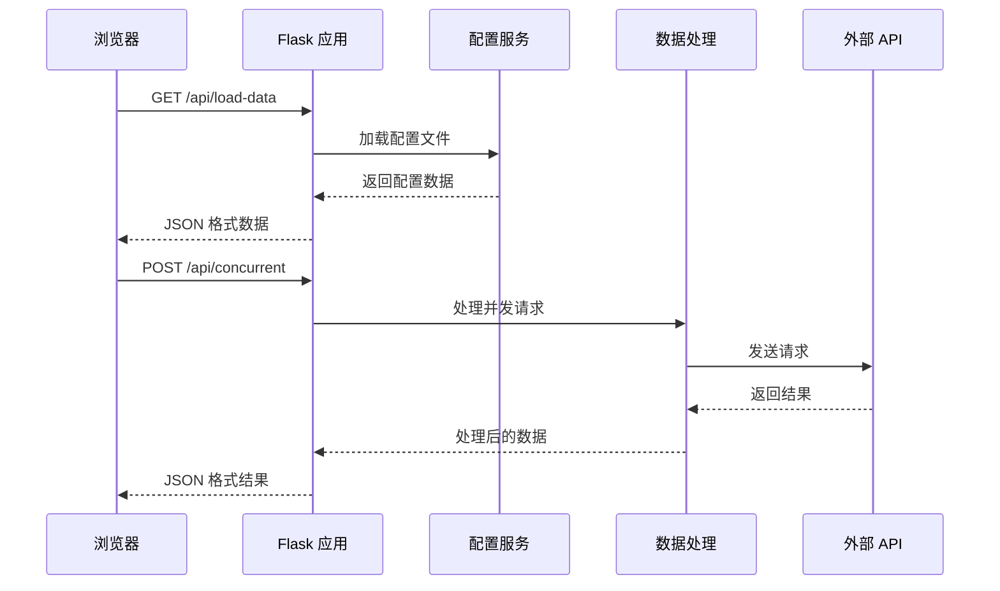
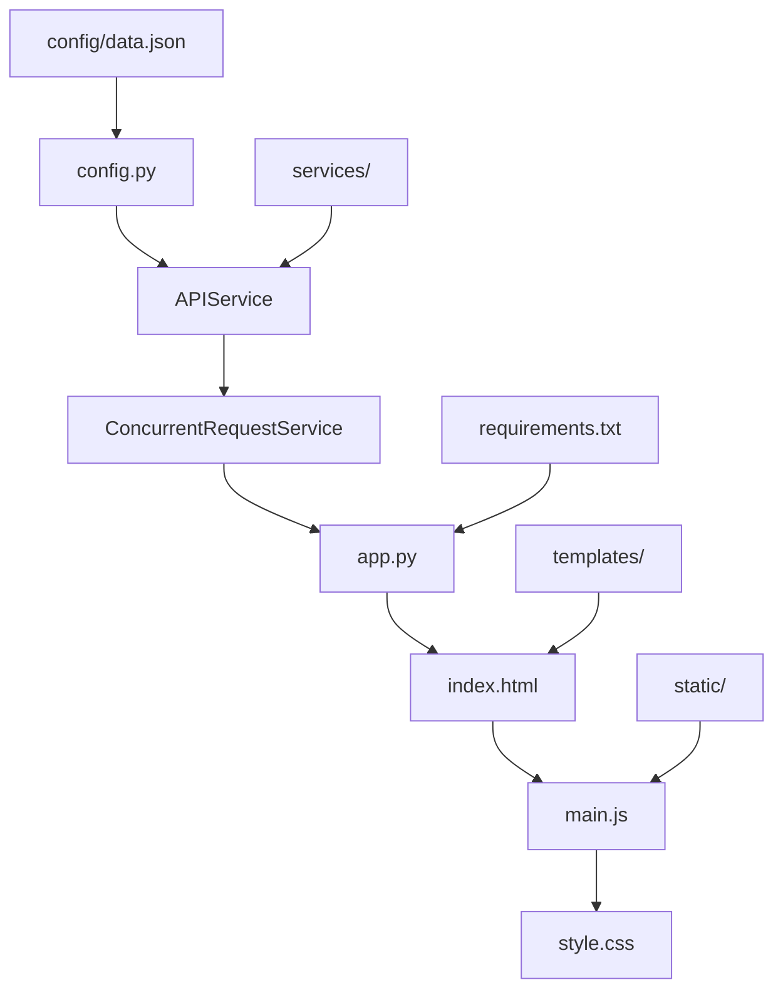

# 数据模型设计

<cite>
**本文档引用的文件**
- [config/data.json](file://config/data.json)
- [app.py](file://app.py)
- [config.py](file://config.py)
- [services/api_service.py](file://services/api_service.py)
- [services/concurrent_service.py](file://services/concurrent_service.py)
- [templates/index.html](file://templates/index.html)
- [static/js/main.js](file://static/js/main.js)
- [static/css/style.css](file://static/css/style.css)
- [README.md](file://README.md)
</cite>

## 目录
1. [简介](#简介)
2. [项目结构](#项目结构)
3. [核心组件](#核心组件)
4. [架构概览](#架构概览)
5. [详细组件分析](#详细组件分析)
6. [依赖分析](#依赖分析)
7. [性能考虑](#性能考虑)
8. [故障排除指南](#故障排除指南)
9. [结论](#结论)
10. [附录](#附录)

## 简介

本项目是一个基于 Flask 的 AI 文案评测对比系统，专门设计用于批量处理图片文案。该系统的核心数据模型围绕 JSON 配置文件构建，通过精心设计的数据结构支持多样的图片处理场景。本文档将深入分析数据模型的设计理念、结构特点、验证规则以及与前后端的映射关系。

## 项目结构

该项目采用典型的三层架构设计，数据模型位于配置层，通过服务层进行处理，最终在前端进行展示。



**图表来源**
- [config/data.json:1-32](file://config/data.json#L1-L32)
- [config.py:1-12](file://config.py#L1-L12)
- [services/api_service.py:1-14](file://services/api_service.py#L1-L14)
- [services/concurrent_service.py:1-162](file://services/concurrent_service.py#L1-L162)
- [app.py:1-139](file://app.py#L1-L139)

**章节来源**
- [README.md:24-44](file://README.md#L24-L44)
- [config/data.json:1-32](file://config/data.json#L1-L32)

## 核心组件

### 数据模型概述

系统的核心数据模型基于 JSON 配置文件，包含四个主要部分：

1. **风格配置** - 定义可用的文风选项
2. **默认风格** - 指定初始选择的文风
3. **系统提示词** - 提供系统级的指导语
4. **数据数组** - 包含具体的图片和文案数据

### 数据项模型结构

每个数据项遵循统一的结构规范，确保处理的一致性和可预测性。



**图表来源**
- [config/data.json:5-31](file://config/data.json#L5-L31)

**章节来源**
- [config/data.json:1-32](file://config/data.json#L1-L32)

## 架构概览

系统采用分层架构设计，数据模型在配置层定义，通过服务层进行处理，最终在前端展示。



**图表来源**
- [app.py:29-61](file://app.py#L29-L61)
- [services/concurrent_service.py:118-158](file://services/concurrent_service.py#L118-L158)

**章节来源**
- [app.py:15-139](file://app.py#L15-L139)
- [services/concurrent_service.py:8-162](file://services/concurrent_service.py#L8-L162)

## 详细组件分析

### 配置文件数据结构

配置文件采用 JSON 格式，提供了完整的数据模型定义：

#### 全局配置字段

| 字段名 | 类型 | 必填 | 默认值 | 描述 |
|--------|------|------|--------|------|
| style | 数组 | 是 | ["文艺","网红","叙事","自定义"] | 可用的文风选项列表 |
| default_style | 字符串 | 是 | "文艺" | 默认选择的文风 |
| system_prompt | 字符串 | 是 | 系统提示词内容 | 系统级的指导语 |

#### 数据项字段定义

每个数据项包含以下核心字段：

| 字段名 | 类型 | 必填 | 约束条件 | 描述 |
|--------|------|------|----------|------|
| id | 整数 | 是 | > 0 | 数据项唯一标识符 |
| text | 字符串 | 是 | 非空 | 原始文案内容 |
| photos | 数组 | 是 | 至少1个元素 | 图片集合 |

#### 图片模型字段

每张图片包含标准化的字段定义：

| 字段名 | 类型 | 必填 | 约束条件 | 描述 |
|--------|------|------|----------|------|
| id | 整数 | 是 | > 0 | 图片唯一标识符 |
| url | 字符串 | 是 | 有效文件路径 | 图片文件的完整路径 |

**章节来源**
- [config/data.json:1-32](file://config/data.json#L1-L32)
- [README.md:278-312](file://README.md#L278-L312)

### 数据验证规则

系统实施了多层次的数据验证机制：

#### 基础类型验证
- 所有数值字段必须为整数类型
- 字符串字段必须非空且长度大于0
- 数组字段必须包含至少一个有效元素

#### 业务逻辑约束
- 数据项 ID 必须唯一且大于0
- 图片 URL 必须指向有效的文件路径
- 文风选项必须在预定义列表中
- 系统提示词不能为空字符串

#### 错误处理机制
- 配置文件加载失败时返回默认配置
- 单个数据项验证失败不影响整体处理
- 异常情况下的优雅降级处理

**章节来源**
- [services/concurrent_service.py:21-28](file://services/concurrent_service.py#L21-L28)
- [services/concurrent_service.py:43-112](file://services/concurrent_service.py#L43-L112)

### 数据生命周期管理

系统实现了完整的数据生命周期管理：

#### 数据加载阶段
1. **配置文件读取** - 从指定路径加载 JSON 配置
2. **数据解析** - 验证 JSON 格式的正确性
3. **结构校验** - 确保必需字段的存在和类型正确
4. **默认值填充** - 为缺失的可选字段提供默认值

#### 数据处理阶段
1. **并发控制** - 使用信号量限制最大并发数
2. **请求构建** - 将配置数据转换为 API 请求格式
3. **进度跟踪** - 实时监控处理进度和性能指标
4. **结果聚合** - 收集和整理各并发任务的结果

#### 数据存储阶段
1. **内存缓存** - 在处理期间缓存必要的数据
2. **临时文件** - 导出 Excel 时创建临时文件
3. **结果持久化** - 将处理结果保存到全局状态

#### 数据清理阶段
1. **资源释放** - 关闭文件句柄和网络连接
2. **内存回收** - 清理不再使用的数据结构
3. **临时文件删除** - 清理导出过程中的临时文件

**章节来源**
- [services/concurrent_service.py:118-158](file://services/concurrent_service.py#L118-L158)
- [app.py:63-135](file://app.py#L63-L135)

### 数据模型扩展机制

系统设计支持灵活的数据模型扩展：

#### 新增文风选项
通过修改配置文件中的 style 数组即可添加新的文风选项：
```json
{
  "style": ["文艺", "网红", "叙事", "自定义", "商务", "创意"],
  "default_style": "文艺"
}
```

#### 自定义字段添加
系统采用动态数据传递机制，可以在请求中添加自定义字段：
```javascript
const requestData = {
  userPrompt: "自定义提示词",
  style: "自定义",
  systemPrompt: "系统提示词",
  customField: "自定义值" // 新增字段
}
```

#### 版本兼容性处理
- 向后兼容现有数据格式
- 优雅处理新增字段
- 提供默认值回退机制

**章节来源**
- [README.md:341-348](file://README.md#L341-L348)
- [services/concurrent_service.py:43-52](file://services/concurrent_service.py#L43-L52)

### 数据迁移和版本兼容性

#### 迁移策略
1. **渐进式升级** - 逐步引入新字段而不破坏现有功能
2. **默认值策略** - 为新字段提供合理的默认值
3. **向后兼容** - 确保旧版本配置仍能正常工作

#### 版本控制机制
- 配置文件版本号字段
- 兼容性检查函数
- 渐进式功能启用

#### 数据备份和恢复
- 自动备份配置文件
- 错误回滚机制
- 数据完整性验证

**章节来源**
- [services/concurrent_service.py:21-28](file://services/concurrent_service.py#L21-L28)
- [README.md:314-352](file://README.md#L314-L352)

## 依赖分析

系统各组件之间的依赖关系清晰明确：



**图表来源**
- [config.py:1-12](file://config.py#L1-L12)
- [services/api_service.py:1-14](file://services/api_service.py#L1-L14)
- [services/concurrent_service.py:1-162](file://services/concurrent_service.py#L1-L162)
- [app.py:1-139](file://app.py#L1-L139)

**章节来源**
- [config.py:1-12](file://config.py#L1-L12)
- [services/api_service.py:1-14](file://services/api_service.py#L1-L14)
- [services/concurrent_service.py:1-162](file://services/concurrent_service.py#L1-L162)

## 性能考虑

### 并发处理优化
- **信号量控制** - 通过 `MAX_CONCURRENT_REQUESTS` 控制并发数量
- **异步 I/O** - 使用 aiohttp 实现高效的异步网络请求
- **内存管理** - 及时清理不再使用的数据结构

### 数据传输优化
- **增量加载** - 前端按需加载数据，减少初始负载
- **缓存策略** - 配置数据在内存中缓存，避免重复读取
- **压缩传输** - JSON 数据采用标准编码格式

### 存储优化
- **临时文件管理** - Excel 导出使用内存缓冲区减少磁盘 I/O
- **图片代理** - 统一的图片访问接口，避免直接文件系统访问

## 故障排除指南

### 常见问题及解决方案

#### 配置文件加载失败
**症状**: 页面无法加载数据项
**原因**: JSON 格式错误或文件路径不正确
**解决方案**: 
1. 检查 JSON 格式的有效性
2. 验证文件路径的正确性
3. 确认文件权限设置

#### 图片显示问题
**症状**: 图片无法在网页上显示
**原因**: 浏览器安全限制或文件路径错误
**解决方案**:
1. 确保使用图片代理接口 `/api/photo/<path>`
2. 验证图片文件的实际存在性
3. 检查文件路径的绝对路径配置

#### 并发请求超时
**症状**: 处理过程中出现超时错误
**解决方案**:
1. 增加 `API_TIMEOUT` 环境变量值
2. 减少 `MAX_CONCURRENT_REQUESTS` 并发数
3. 检查外部 API 服务的可用性

**章节来源**
- [README.md:314-373](file://README.md#L314-L373)
- [services/concurrent_service.py:79-112](file://services/concurrent_service.py#L79-L112)

## 结论

本数据模型设计体现了现代 Web 应用的最佳实践，通过清晰的分层架构、严格的验证机制和灵活的扩展能力，为 AI 文案处理系统提供了坚实的数据基础。系统不仅满足了当前的功能需求，还为未来的功能扩展和技术演进预留了充足的空间。

关键优势包括：
- **结构化数据模型** - 清晰的字段定义和约束条件
- **健壮的错误处理** - 完善的异常捕获和降级机制  
- **灵活的扩展性** - 支持动态字段和配置变更
- **高效的性能表现** - 优化的并发处理和资源管理

## 附录

### API 接口规范

#### 加载本地数据接口
- **URL**: `/api/load-data`
- **方法**: GET
- **返回**: 包含数据数组、风格配置和系统提示词的 JSON 对象

#### 并发请求接口
- **URL**: `/api/concurrent`
- **方法**: POST
- **请求体**: 包含用户提示词、文风选择和系统提示词
- **返回**: 包含处理结果和进度信息的 JSON 对象

#### Excel 导出接口
- **URL**: `/api/export-excel`
- **方法**: POST
- **请求体**: 包含处理结果数组
- **返回**: Excel 文件流

**章节来源**
- [README.md:89-186](file://README.md#L89-L186)
- [app.py:29-135](file://app.py#L29-L135)