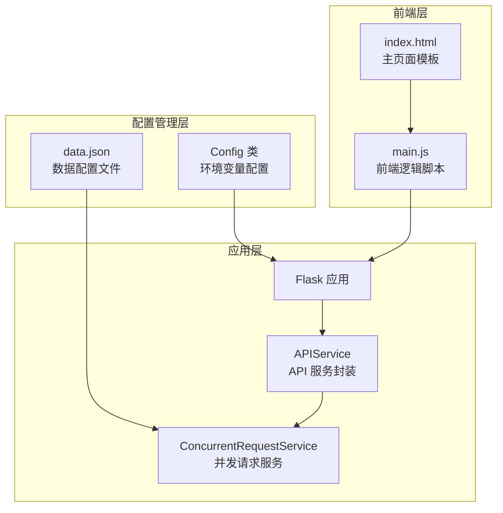
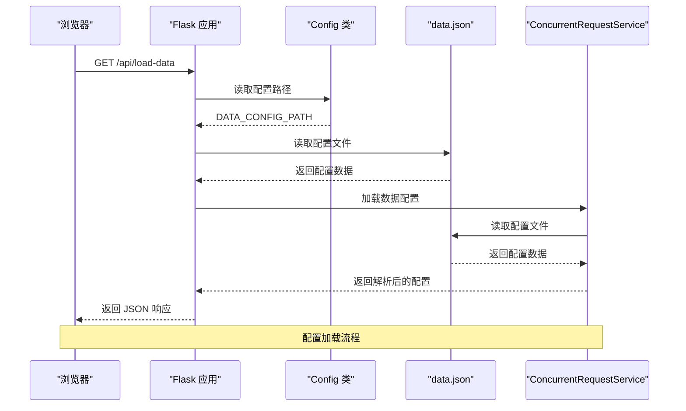
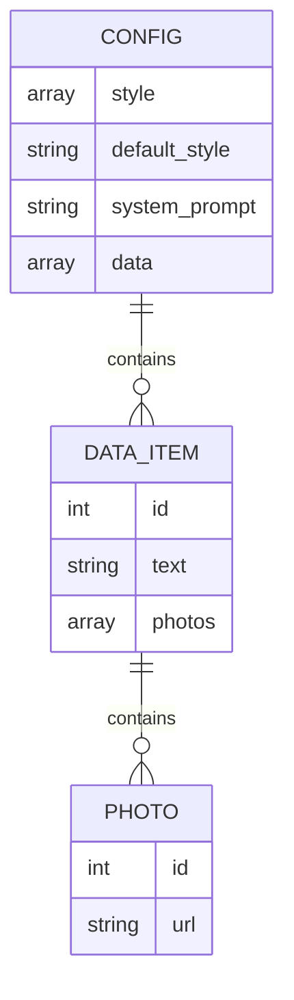
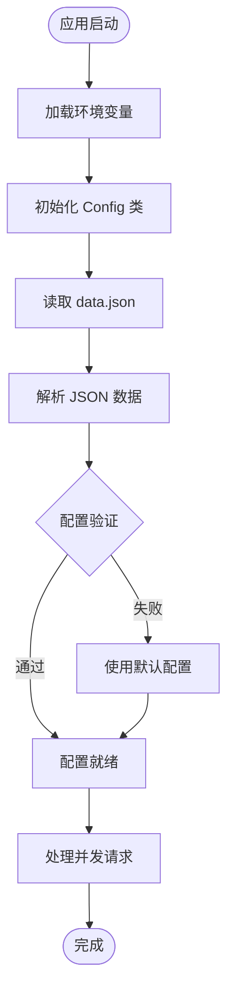
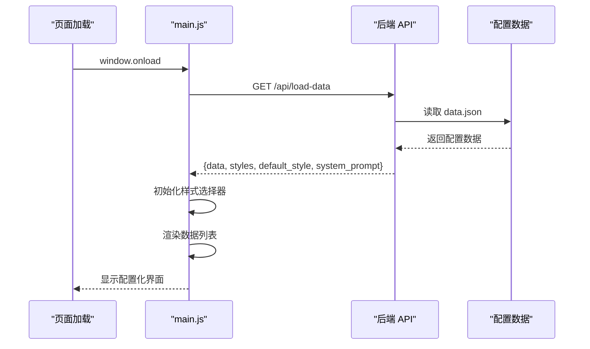
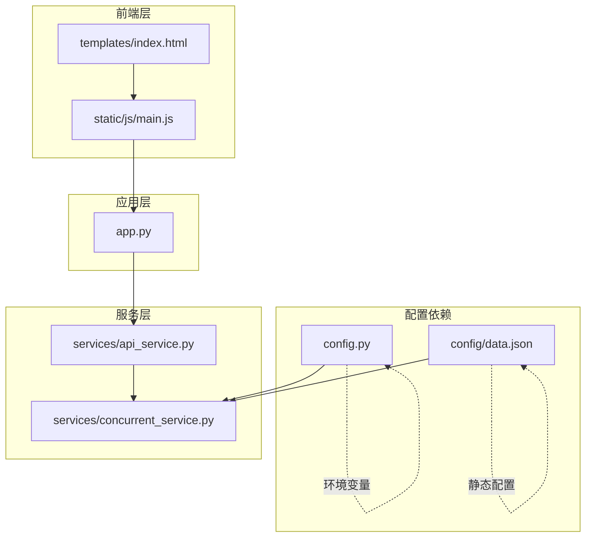

# 配置管理

<cite>
**本文引用的文件**
- [config.py](file://config.py)
- [config/data.json](file://config/data.json)
- [app.py](file://app.py)
- [services/concurrent_service.py](file://services/concurrent_service.py)
- [services/api_service.py](file://services/api_service.py)
- [README.md](file://README.md)
- [requirements.txt](file://requirements.txt)
- [templates/index.html](file://templates/index.html)
- [static/js/main.js](file://static/js/main.js)
</cite>

## 目录
1. [简介](#简介)
2. [项目结构](#项目结构)
3. [核心组件](#核心组件)
4. [架构概览](#架构概览)
5. [详细组件分析](#详细组件分析)
6. [依赖分析](#依赖分析)
7. [性能考虑](#性能考虑)
8. [故障排查指南](#故障排查指南)
9. [结论](#结论)
10. [附录](#附录)

## 简介
本项目是一个基于 Flask 的 Web 应用，用于批量处理图片文案，支持并发调用外部 API 生成文案，并可将结果导出为 Excel 文件。配置管理系统是整个应用的核心基础，负责集中管理环境变量配置和本地数据配置，确保应用在不同部署环境下的一致性和可扩展性。

## 项目结构
项目采用分层架构设计，配置管理分布在多个层面：
- **环境配置层**: 通过环境变量管理运行时配置
- **数据配置层**: 通过 JSON 文件管理静态数据和样式配置
- **应用配置层**: 通过 Config 类统一管理配置访问



**图表来源**
- [config.py:1-12](file://config.py#L1-L12)
- [config/data.json:1-32](file://config/data.json#L1-L32)
- [app.py:1-139](file://app.py#L1-L139)
- [services/concurrent_service.py:1-162](file://services/concurrent_service.py#L1-L162)

**章节来源**
- [config.py:1-12](file://config.py#L1-L12)
- [config/data.json:1-32](file://config/data.json#L1-L32)
- [README.md:24-44](file://README.md#L24-L44)

## 核心组件
配置管理系统由三个核心组件构成：

### Config 类（环境变量配置）
Config 类是配置管理的核心，负责从环境变量读取配置并提供统一的访问接口。该类实现了懒加载和类型转换机制，确保配置的灵活性和安全性。

### data.json（数据配置文件）
data.json 是应用的静态配置文件，包含样式定义、默认样式、系统提示词和数据项集合。该文件采用 JSON 格式，便于版本控制和团队协作。

### 配置访问机制
应用通过统一的配置访问机制，在运行时动态加载和使用配置，实现了配置与代码的解耦。

**章节来源**
- [config.py:3-12](file://config.py#L3-L12)
- [config/data.json:1-32](file://config/data.json#L1-L32)
- [services/concurrent_service.py:21-28](file://services/concurrent_service.py#L21-L28)

## 架构概览
配置管理系统采用分层架构，实现了配置的集中管理和灵活扩展：



**图表来源**
- [app.py:29-41](file://app.py#L29-L41)
- [services/concurrent_service.py:21-28](file://services/concurrent_service.py#L21-L28)
- [config.py:11](file://config.py#L11)

## 详细组件分析

### Config 类设计分析
Config 类采用了环境变量驱动的配置管理模式，具有以下特点：

#### 配置项设计原则
- **类型安全**: 对数值型配置进行显式类型转换
- **默认值**: 为每个配置项提供合理的默认值
- **环境隔离**: 支持不同环境下的配置差异化

#### 关键配置项详解

##### FLASK_DEBUG 配置
- **作用**: 控制 Flask 应用的调试模式
- **设置方法**: 通过环境变量设置
- **默认值**: True
- **影响范围**: 影响开发模式下的错误显示和热重载

##### SECRET_KEY 配置
- **作用**: Flask 应用的安全密钥
- **设置方法**: 通过环境变量设置
- **默认值**: your-secret-key-here
- **安全建议**: 生产环境中必须设置强密码

##### API_BASE_URL 配置
- **作用**: 外部 API 服务的基础 URL
- **设置方法**: 通过环境变量设置
- **默认值**: http://example.com/api
- **使用场景**: 指定外部文案生成服务地址

##### API_TIMEOUT 配置
- **作用**: API 请求超时时间（秒）
- **设置方法**: 通过环境变量设置
- **默认值**: 30
- **性能影响**: 影响并发请求的响应速度

##### MAX_CONCURRENT_REQUESTS 配置
- **作用**: 最大并发请求数
- **设置方法**: 通过环境变量设置
- **默认值**: 5
- **性能调优**: 控制系统负载和资源使用

##### DATA_CONFIG_PATH 配置
- **作用**: 数据配置文件的路径
- **设置方法**: 通过环境变量设置
- **默认值**: config/data.json
- **部署灵活性**: 支持不同路径的配置文件

**章节来源**
- [config.py:3-12](file://config.py#L3-L12)
- [README.md:78-88](file://README.md#L78-L88)

### data.json 数据结构分析
data.json 采用层次化的 JSON 结构，包含以下核心字段：

#### 样式配置结构


**图表来源**
- [config/data.json:1-32](file://config/data.json#L1-L32)

#### 字段详细说明

##### style 数组
- **类型**: 字符串数组
- **作用**: 定义可用的文风选项
- **默认值**: ["文艺", "网红", "叙事", "自定义"]
- **使用方式**: 前端下拉框的选项来源

##### default_style 字段
- **类型**: 字符串
- **作用**: 设置默认选中的文风
- **默认值**: "文艺"
- **用户体验**: 提供合理的初始选择

##### system_prompt 字段
- **类型**: 字符串
- **作用**: 系统级提示词，指导 AI 行为
- **默认值**: "你是一个专业的文案生成助手，请根据用户提供的图片和文案生成合适的推广内容。"
- **应用场景**: 影响 AI 生成内容的质量和风格

##### data 数组
- **类型**: 对象数组
- **作用**: 存储具体的处理数据项
- **结构**: 包含 id、text、photos 字段
- **扩展性**: 支持任意数量的数据项

#### 数据项结构详解

##### data.id 字段
- **类型**: 整数
- **作用**: 数据项的唯一标识符
- **用途**: 区分不同的处理对象

##### data.text 字段
- **类型**: 字符串
- **作用**: 原始文案内容
- **用途**: 作为 AI 生成文案的参考

##### data.photos 数组
- **类型**: 对象数组
- **作用**: 图片资源集合
- **结构**: 每个图片包含 id 和 url 字段
- **限制**: 最多支持 5 张图片（前端限制）

**章节来源**
- [config/data.json:1-32](file://config/data.json#L1-L32)
- [README.md:271-312](file://README.md#L271-L312)

### 配置加载和使用流程

#### 后端配置加载流程


**图表来源**
- [services/concurrent_service.py:21-28](file://services/concurrent_service.py#L21-L28)
- [services/concurrent_service.py:118-158](file://services/concurrent_service.py#L118-L158)

#### 前端配置加载流程


**图表来源**
- [static/js/main.js:29-85](file://static/js/main.js#L29-L85)
- [app.py:29-41](file://app.py#L29-L41)

**章节来源**
- [services/concurrent_service.py:21-28](file://services/concurrent_service.py#L21-L28)
- [static/js/main.js:29-85](file://static/js/main.js#L29-L85)

## 依赖分析
配置管理系统与其他模块存在以下依赖关系：



**图表来源**
- [config.py:1-12](file://config.py#L1-L12)
- [services/concurrent_service.py:6](file://services/concurrent_service.py#L6)
- [services/api_service.py:1-14](file://services/api_service.py#L1-L14)
- [app.py:1-139](file://app.py#L1-L139)

### 配置验证机制
系统实现了多层次的配置验证机制：

#### 环境变量验证
- **类型检查**: 对数值型配置进行类型转换
- **默认值回退**: 当环境变量缺失时使用默认值
- **布尔值处理**: 将字符串 "True"/"False" 转换为布尔值

#### JSON 配置验证
- **文件存在性检查**: 确保配置文件存在且可读
- **JSON 解析验证**: 验证 JSON 格式的正确性
- **字段完整性检查**: 确保必需字段的存在

#### 错误处理策略
- **异常捕获**: 使用 try-catch 处理配置加载异常
- **降级处理**: 当配置加载失败时使用默认配置
- **日志记录**: 记录配置加载过程中的错误信息

**章节来源**
- [services/concurrent_service.py:21-28](file://services/concurrent_service.py#L21-L28)
- [config.py:4-11](file://config.py#L4-L11)

## 性能考虑
配置管理对系统性能的影响主要体现在以下几个方面：

### 配置加载性能
- **延迟加载**: 配置在首次使用时才加载，避免启动时的额外开销
- **缓存机制**: 配置数据在进程内缓存，减少重复读取
- **异步处理**: 支持异步配置加载，不影响主线程性能

### 并发控制
- **信号量机制**: 通过信号量控制最大并发请求数
- **超时设置**: 合理的超时配置避免资源长时间占用
- **进度监控**: 实时监控处理进度，及时发现性能问题

### 内存使用
- **配置大小**: 配置文件通常较小，内存占用可忽略
- **数据结构**: 使用高效的 JSON 数据结构存储配置
- **垃圾回收**: Python 自动管理内存，无需手动干预

## 故障排查指南

### 常见配置问题及解决方案

#### 环境变量配置问题
- **问题**: 环境变量未生效
- **原因**: 环境变量名称错误或值格式不正确
- **解决方案**: 检查环境变量名称和值的格式，确保与 Config 类中的配置项匹配

#### 配置文件加载失败
- **问题**: data.json 文件无法加载
- **原因**: 文件路径错误、权限不足或文件损坏
- **解决方案**: 检查文件路径是否正确，确认文件权限，验证 JSON 格式

#### 并发请求超时
- **问题**: 并发请求超时或失败
- **原因**: API 服务器响应慢或网络连接问题
- **解决方案**: 调整 API_TIMEOUT 和 MAX_CONCURRENT_REQUESTS 配置

#### 配置验证错误
- **问题**: 配置验证失败
- **原因**: 配置值超出预期范围或格式不正确
- **解决方案**: 检查配置值的有效性，参考默认值进行修正

### 调试技巧
- **日志输出**: 利用系统日志查看配置加载过程
- **断点调试**: 在关键配置点设置断点进行调试
- **单元测试**: 为配置加载逻辑编写单元测试

**章节来源**
- [README.md:314-373](file://README.md#L314-L373)
- [services/concurrent_service.py:26-28](file://services/concurrent_service.py#L26-L28)

## 结论
配置管理系统通过环境变量和 JSON 文件的双重配置机制，实现了高度灵活和可扩展的配置管理。Config 类提供了统一的配置访问接口，data.json 文件承载了应用的静态配置数据。这种设计使得应用能够在不同的部署环境中灵活运行，同时保持配置的一致性和可维护性。

系统的关键优势包括：
- **环境隔离**: 通过环境变量实现不同环境的配置分离
- **配置验证**: 多层次的配置验证确保配置的正确性
- **错误处理**: 完善的错误处理机制保证系统的稳定性
- **扩展性**: 支持自定义配置项和数据结构的扩展

## 附录

### 配置最佳实践

#### 环境变量配置最佳实践
- **命名规范**: 使用全大写字母和下划线的命名约定
- **类型明确**: 明确配置项的数据类型，避免隐式转换
- **默认值合理**: 为每个配置项提供合理的默认值
- **安全考虑**: 敏感配置（如密钥）不要硬编码在代码中

#### JSON 配置最佳实践
- **结构清晰**: 保持 JSON 结构的层次清晰
- **注释说明**: 为重要的配置项添加注释说明
- **版本控制**: 将配置文件纳入版本控制系统
- **备份策略**: 定期备份配置文件

#### 配置管理最佳实践
- **配置分层**: 将配置分为环境配置和应用配置
- **配置验证**: 实现配置的自动验证机制
- **错误处理**: 建立完善的错误处理和降级机制
- **文档维护**: 保持配置文档的及时更新

### 常见配置场景示例

#### 开发环境配置
```bash
export FLASK_DEBUG=True
export SECRET_KEY=dev-secret-key
export API_BASE_URL=http://localhost:8000/api
export API_TIMEOUT=60
export MAX_CONCURRENT_REQUESTS=3
```

#### 生产环境配置
```bash
export FLASK_DEBUG=False
export SECRET_KEY=your-production-secret-key
export API_BASE_URL=https://api.production.com/v1
export API_TIMEOUT=30
export MAX_CONCURRENT_REQUESTS=10
```

#### 自定义样式配置
```json
{
  "style": ["文艺", "网红", "叙事", "自定义", "商务", "创意"],
  "default_style": "商务",
  "system_prompt": "你是一个专业的商务文案生成助手，擅长撰写商业推广内容。"
}
```

**章节来源**
- [README.md:58-67](file://README.md#L58-L67)
- [README.md:341-348](file://README.md#L341-L348)