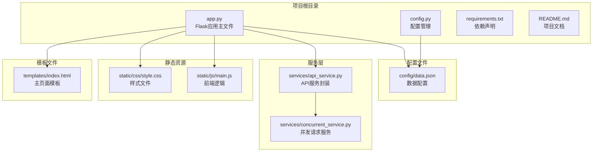
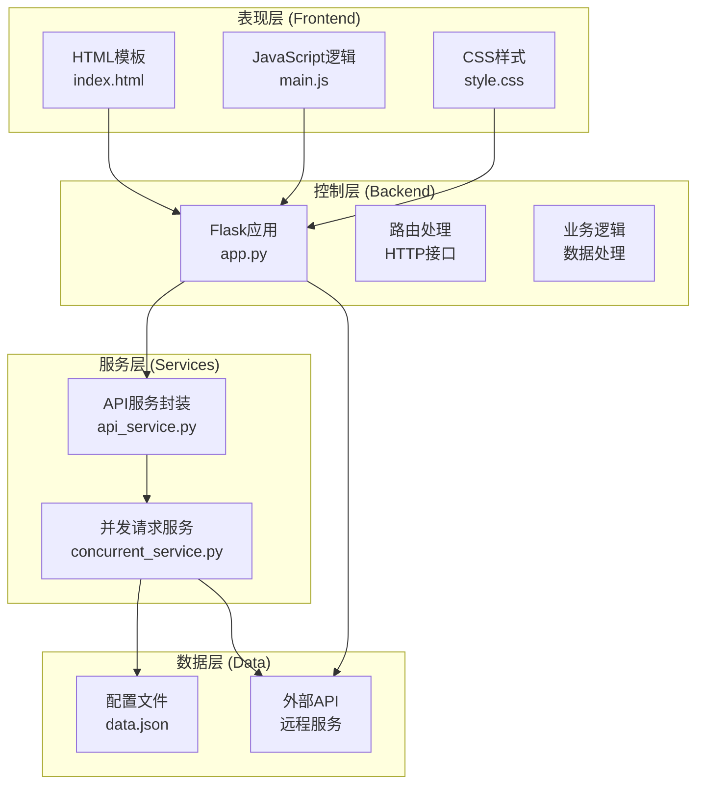
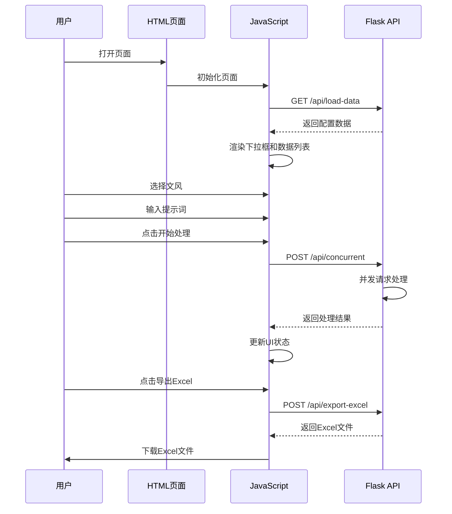
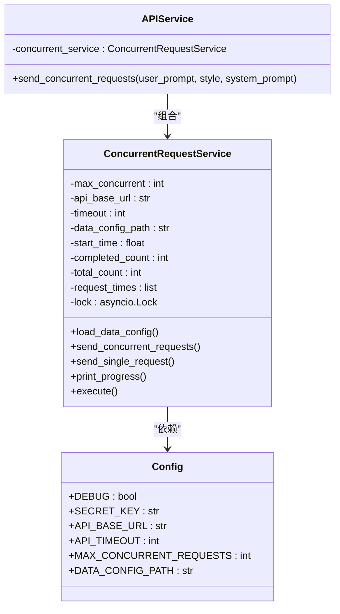
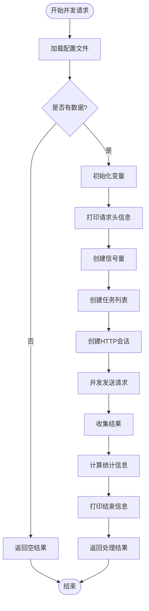
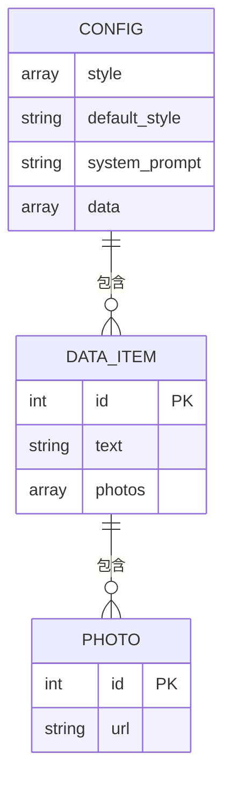
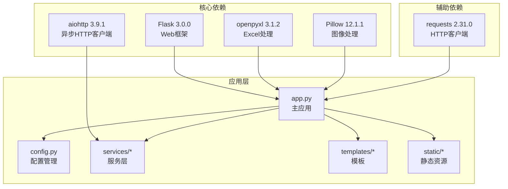

# 项目概述

<cite>
**本文档引用的文件**
- [app.py](file://app.py)
- [config.py](file://config.py)
- [README.md](file://README.md)
- [requirements.txt](file://requirements.txt)
- [config/data.json](file://config/data.json)
- [services/api_service.py](file://services/api_service.py)
- [services/concurrent_service.py](file://services/concurrent_service.py)
- [templates/index.html](file://templates/index.html)
- [static/js/main.js](file://static/js/main.js)
- [static/css/style.css](file://static/css/style.css)
</cite>

## 目录
1. [简介](#简介)
2. [项目结构](#项目结构)
3. [核心组件](#核心组件)
4. [架构概览](#架构概览)
5. [详细组件分析](#详细组件分析)
6. [依赖分析](#依赖分析)
7. [性能考虑](#性能考虑)
8. [故障排除指南](#故障排除指南)
9. [结论](#结论)
10. [附录](#附录)

## 简介

AI文案评测对比系统是一个基于Flask Web框架构建的现代化Web应用，专门用于批量AI文案生成和评测对比。该系统通过前后端分离的设计理念，结合异步并发处理技术，实现了高效的AI文案生成工作流。

### 核心目标

系统的主要目标是为用户提供一个直观、高效的AI文案生成平台，支持：
- **批量处理**：同时处理多个数据项，每个数据项可包含多张图片
- **并发请求**：使用异步并发技术提高处理效率
- **文风选择**：支持多种文风选择（文艺、网红、叙事、自定义）
- **Excel导出**：将结果导出为包含图片的Excel文件

### 主要功能特性

系统具备以下核心功能：
- **智能并发控制**：通过信号量机制控制最大并发请求数
- **实时进度跟踪**：显示处理进度、统计信息和性能指标
- **灵活的文风配置**：支持预设文风和自定义文风
- **完整的错误处理**：提供详细的错误信息和重试机制
- **响应式前端界面**：美观的用户界面和良好的用户体验

### 技术价值

该系统的技术价值体现在：
- **异步并发处理**：使用asyncio和aiohttp实现高效的并发请求处理
- **模块化设计**：清晰的服务层分离，便于维护和扩展
- **配置驱动**：通过JSON配置文件实现灵活的数据和样式管理
- **前后端分离**：采用现代Web开发模式，提升开发效率

## 项目结构

项目采用标准的Flask项目结构，遵循前后端分离的设计原则：



**图表来源**
- [app.py:1-139](file://app.py#L1-L139)
- [config.py:1-12](file://config.py#L1-L12)
- [services/api_service.py:1-14](file://services/api_service.py#L1-L14)
- [services/concurrent_service.py:1-162](file://services/concurrent_service.py#L1-L162)

**章节来源**
- [README.md:24-44](file://README.md#L24-L44)
- [app.py:1-139](file://app.py#L1-L139)

## 核心组件

### Flask应用核心

Flask应用作为整个系统的核心控制器，负责路由管理和业务逻辑协调：

```mermaid
classDiagram
class FlaskApp {
+route("/")
+route("/api/load-data")
+route("/api/concurrent")
+route("/api/export-excel")
+route("/api/photo/<path : filename>")
+render_template()
+send_file()
+abort()
}
class APIService {
+concurrent_service : ConcurrentRequestService
+send_concurrent_requests()
}
class ConcurrentRequestService {
+max_concurrent : int
+api_base_url : str
+timeout : int
+load_data_config()
+send_concurrent_requests()
+send_single_request()
+print_progress()
}
FlaskApp --> APIService : "依赖"
APIService --> ConcurrentRequestService : "组合"
```

**图表来源**
- [app.py:12-139](file://app.py#L12-L139)
- [services/api_service.py:4-14](file://services/api_service.py#L4-L14)
- [services/concurrent_service.py:8-162](file://services/concurrent_service.py#L8-L162)

### 配置管理系统

系统采用集中式配置管理，支持环境变量和JSON文件配置：

| 配置项 | 类型 | 默认值 | 描述 |
|--------|------|--------|------|
| FLASK_DEBUG | 布尔值 | True | 调试模式开关 |
| SECRET_KEY | 字符串 | your-secret-key-here | Flask密钥 |
| API_BASE_URL | 字符串 | http://example.com/api | 外部API基础URL |
| API_TIMEOUT | 整数 | 30 | API请求超时时间（秒） |
| MAX_CONCURRENT_REQUESTS | 整数 | 5 | 最大并发请求数 |
| DATA_CONFIG_PATH | 字符串 | config/data.json | 数据配置文件路径 |

**章节来源**
- [config.py:3-12](file://config.py#L3-L12)
- [README.md:78-88](file://README.md#L78-L88)

## 架构概览

系统采用经典的三层架构设计，实现了清晰的职责分离：



**图表来源**
- [app.py:15-139](file://app.py#L15-L139)
- [services/api_service.py:4-14](file://services/api_service.py#L4-L14)
- [services/concurrent_service.py:21-162](file://services/concurrent_service.py#L21-L162)

### 关键设计决策

1. **前后端分离**：采用RESTful API设计，前端通过AJAX请求与后端交互
2. **异步并发处理**：使用asyncio和aiohttp实现高效的并发请求
3. **信号量控制**：通过Semaphore限制最大并发数，避免资源过载
4. **配置驱动**：所有可变参数通过配置文件管理，便于部署和维护
5. **错误处理**：完善的异常捕获和错误反馈机制

## 详细组件分析

### 前端组件分析

前端采用响应式设计，提供了直观的用户界面：



**图表来源**
- [templates/index.html:1-40](file://templates/index.html#L1-L40)
- [static/js/main.js:29-136](file://static/js/main.js#L29-L136)
- [app.py:29-61](file://app.py#L29-L61)

#### 前端核心功能

1. **数据加载**：通过`loadData()`函数从后端获取配置数据
2. **文风选择**：支持预设文风和自定义文风的动态切换
3. **并发处理**：调用`processData()`函数执行批量AI生成
4. **结果渲染**：动态更新UI显示处理状态和结果
5. **Excel导出**：将处理结果导出为包含图片的Excel文件

**章节来源**
- [static/js/main.js:5-27](file://static/js/main.js#L5-L27)
- [static/js/main.js:87-136](file://static/js/main.js#L87-L136)
- [static/js/main.js:220-260](file://static/js/main.js#L220-L260)

### 后端服务组件分析

后端服务层实现了核心的业务逻辑处理：



**图表来源**
- [services/api_service.py:4-14](file://services/api_service.py#L4-L14)
- [services/concurrent_service.py:8-20](file://services/concurrent_service.py#L8-L20)
- [config.py:3-12](file://config.py#L3-L12)

#### 并发请求处理流程



**图表来源**
- [services/concurrent_service.py:118-158](file://services/concurrent_service.py#L118-L158)

**章节来源**
- [services/concurrent_service.py:118-162](file://services/concurrent_service.py#L118-L162)
- [services/api_service.py:8-14](file://services/api_service.py#L8-L14)

### 数据配置系统

系统通过JSON配置文件实现灵活的数据管理：



**图表来源**
- [config/data.json:1-32](file://config/data.json#L1-L32)

#### 配置文件结构

| 字段 | 类型 | 必需 | 描述 |
|------|------|------|------|
| style | 数组 | 是 | 可用的文风选项 |
| default_style | 字符串 | 是 | 默认文风 |
| system_prompt | 字符串 | 是 | 系统提示词 |
| data | 数组 | 是 | 数据项列表 |

**章节来源**
- [config/data.json:1-32](file://config/data.json#L1-L32)
- [README.md:271-312](file://README.md#L271-L312)

## 依赖分析

系统采用模块化的依赖管理策略，确保各组件间的松耦合：



**图表来源**
- [requirements.txt:1-6](file://requirements.txt#L1-L6)
- [app.py:1-11](file://app.py#L1-L11)

### 外部依赖关系

系统对外部依赖的使用体现了明确的职责分工：

1. **Flask**: 提供Web框架和路由管理
2. **aiohttp**: 实现异步HTTP请求处理
3. **openpyxl**: 处理Excel文件的创建和编辑
4. **Pillow**: 支持图像格式转换和处理
5. **requests**: 提供同步HTTP请求能力

**章节来源**
- [requirements.txt:1-6](file://requirements.txt#L1-L6)
- [README.md:15-22](file://README.md#L15-L22)

## 性能考虑

系统在设计时充分考虑了性能优化，采用了多项技术措施：

### 并发性能优化

1. **信号量控制**：通过`MAX_CONCURRENT_REQUESTS`配置限制并发数量
2. **异步I/O**：使用asyncio避免阻塞操作
3. **连接复用**：HTTP会话复用减少连接开销
4. **超时控制**：合理的超时设置防止资源泄露

### 内存管理

1. **流式处理**：Excel文件使用BytesIO进行内存管理
2. **及时释放**：异步锁确保资源正确释放
3. **错误恢复**：异常处理避免内存泄漏

### 前端性能优化

1. **响应式布局**：CSS Grid实现高效的页面布局
2. **懒加载**：图片使用onerror回退机制
3. **状态缓存**：JavaScript缓存处理结果

## 故障排除指南

### 常见问题及解决方案

#### 图片无法显示问题

**问题现象**：浏览器无法显示本地图片

**原因分析**：
- 浏览器安全限制阻止本地文件访问
- 图片路径配置错误
- Flask服务未正确启动

**解决方案**：
1. 使用系统内置的图片代理功能
2. 确认`config/data.json`中的图片路径正确
3. 检查Flask服务日志确认服务状态

#### Excel导出问题

**问题现象**：导出的Excel文件中缺少图片

**原因分析**：
- Pillow库未正确安装
- 图片格式不受支持
- 图片文件损坏

**解决方案**：
1. 安装Pillow库：`pip install Pillow`
2. 确认图片格式支持（PNG、JPEG、BMP、GIF、TIFF）
3. 检查图片文件完整性

#### 并发请求超时

**问题现象**：处理过程中出现超时错误

**解决方案**：
1. 增加`API_TIMEOUT`环境变量值
2. 减少`MAX_CONCURRENT_REQUESTS`并发数
3. 检查外部API服务状态

**章节来源**
- [README.md:314-349](file://README.md#L314-L349)

### 调试技巧

1. **启用调试模式**：设置`FLASK_DEBUG=True`获取详细错误信息
2. **查看终端输出**：系统会实时打印处理进度和统计信息
3. **检查网络连接**：确认外部API服务可达性
4. **验证配置文件**：确保JSON格式正确且路径有效

## 结论

AI文案评测对比系统是一个设计精良、功能完备的Web应用，成功地将现代Web技术与AI生成能力相结合。系统的主要优势包括：

### 技术亮点

1. **异步并发架构**：通过asyncio和aiohttp实现了高效的并发处理
2. **模块化设计**：清晰的服务层分离便于维护和扩展
3. **配置驱动**：灵活的配置管理支持多种部署场景
4. **前后端分离**：现代化的开发模式提升开发效率

### 应用价值

该系统为AI文案生成领域提供了实用的解决方案，特别适用于：
- **电商产品文案生成**：批量生成商品推广文案
- **社交媒体内容创作**：快速产出多风格内容
- **营销活动策划**：对比不同文风的效果
- **内容质量评估**：自动化评测文案质量

### 发展前景

系统具有良好的扩展性，未来可以进一步增强：
- **AI模型集成**：支持更多类型的AI模型
- **结果分析**：增加文本相似度和质量评估
- **多语言支持**：扩展国际化功能
- **云端部署**：支持容器化和微服务架构

## 附录

### API接口规范

系统提供完整的RESTful API接口：

| 接口 | 方法 | 路径 | 功能描述 |
|------|------|------|----------|
| 加载数据 | GET | `/api/load-data` | 从配置文件加载数据 |
| 并发请求 | POST | `/api/concurrent` | 批量AI生成请求 |
| 导出Excel | POST | `/api/export-excel` | 导出处理结果 |
| 图片代理 | GET | `/api/photo/<path:filename>` | 本地图片代理 |

### 环境配置

建议的生产环境配置：
- **Python版本**：3.8+
- **内存要求**：至少2GB RAM
- **存储空间**：根据数据量需求
- **网络带宽**：稳定的互联网连接

### 维护建议

1. **定期备份**：定期备份配置文件和处理结果
2. **监控告警**：设置系统健康检查和错误监控
3. **性能优化**：根据使用情况调整并发参数
4. **安全加固**：配置适当的访问控制和数据保护